# Architecture Technique — QuartierConnect

> **Version** 0.1.3 · **Date** 7 avril 2026 · **Étape** 4 (95 %)

---

## Table des matières

1. [Vue d'ensemble](#1-vue-densemble)
2. [Conteneurs Docker](#2-conteneurs-docker)
3. [Diagramme des modules NestJS](#3-diagramme-des-modules-nestjs)
4. [Flux d'authentification complets](#4-flux-dauthentification-complets)
5. [SSO cross-surface](#5-sso-cross-surface)
6. [Refresh token et rotation](#6-refresh-token-et-rotation)
7. [Architecture des bases de données](#7-architecture-des-bases-de-données)
8. [Sync bidirectionnelle Java ↔ API](#8-sync-bidirectionnelle-java--api)
9. [Sync Neo4j temps réel](#9-sync-neo4j-temps-réel)
10. [WebSocket — Messagerie temps réel](#10-websocket--messagerie-temps-réel)
11. [Système de votes](#11-système-de-votes)
12. [DSL — Pipeline de compilation](#12-dsl--pipeline-de-compilation)
13. [Offline mode Java desktop](#13-offline-mode-java-desktop)
14. [Sécurité en couches](#14-sécurité-en-couches)
15. [Cycle de vie d'une requête](#15-cycle-de-vie-dune-requête)

---

## 1. Vue d'ensemble

QuartierConnect est une plateforme **multi-composants** composée de 4 applications actives et 3 bases de données, toutes orchestrées via Docker Compose.

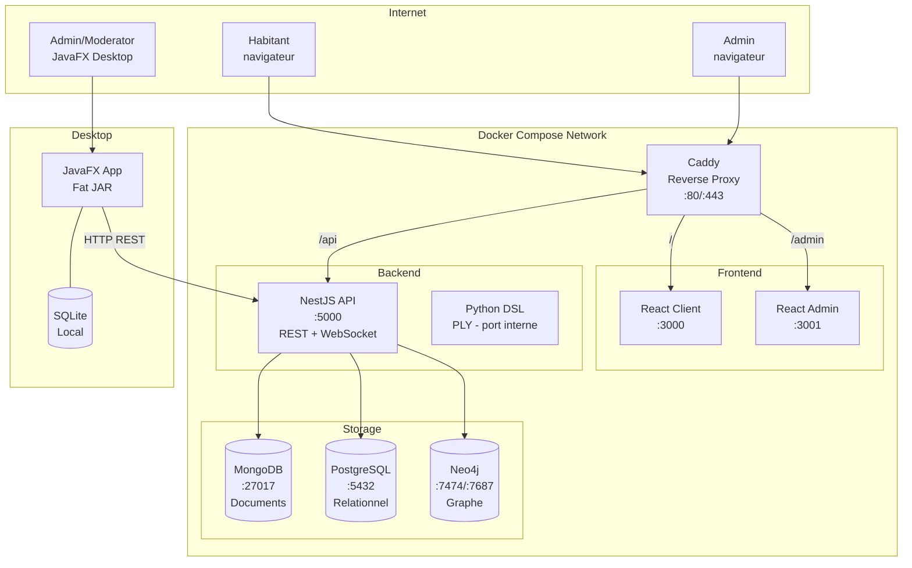

---

## 2. Conteneurs Docker

| # | Conteneur | Image | Port(s) | Rôle |
|---|-----------|-------|---------|------|
| 1 | `caddy` | `caddy:2-alpine` | 80, 443 | Reverse proxy HTTPS + Let's Encrypt automatique |
| 2 | `client` | Node 20 + Vite | 3000 | SPA React — interface habitant |
| 3 | `admin` | Node 20 + Vite | 3001 | SPA React — back-office admin |
| 4 | `api` | Node 20 | 5000 | NestJS REST + WebSocket + DSL bridge |
| 5 | `mongodb` | `mongo:7` | 27017 | Documents flexibles, GeoJSON, GridFS |
| 6 | `postgres` | `postgres:16` | 5432 | Données ACID — users, incidents, points |
| 7 | `neo4j` | `neo4j:5` | 7474, 7687 | Graphe social — recommandations Cypher |

### Routage Caddy

```
/ → client:3000
/admin → admin:3001
/api → api:5000
/api/docs → api:5000/docs (Scalar)
```

---

## 3. Diagramme des modules NestJS

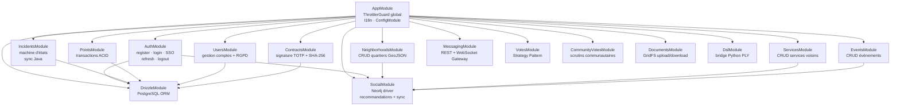

---

## 4. Flux d'authentification complets

### 4.1 Inscription

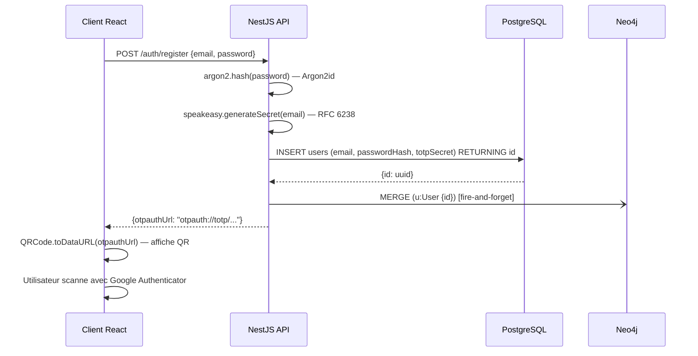

### 4.2 Connexion (3 validations séquentielles)

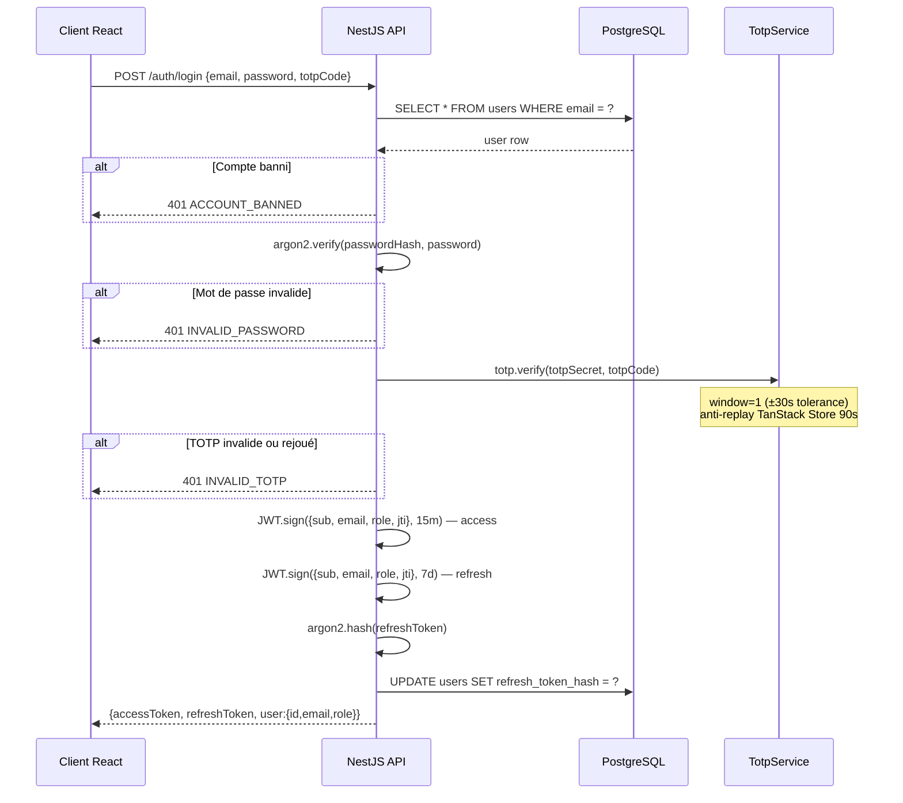

---

## 5. SSO cross-surface

Le SSO permet à un utilisateur connecté sur le **web** d'authentifier automatiquement l'**application Java desktop** sans ressaisir ses identifiants.

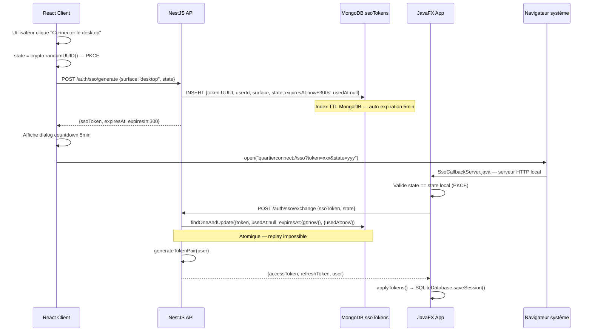

---

## 6. Refresh token et rotation

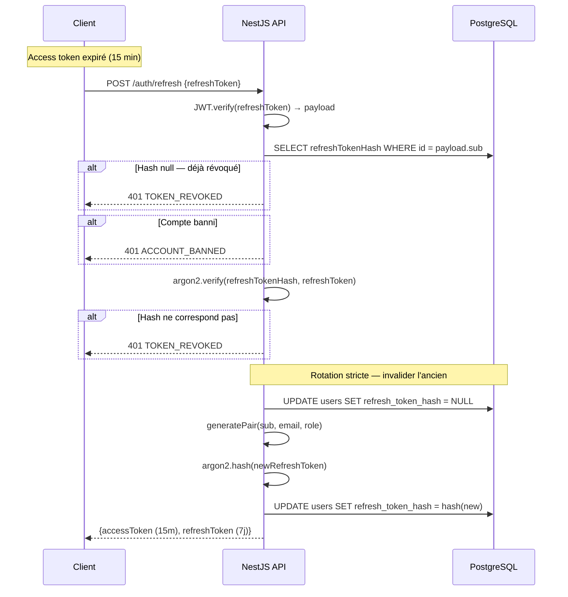

---

## 7. Architecture des bases de données

### 7.1 Répartition des données

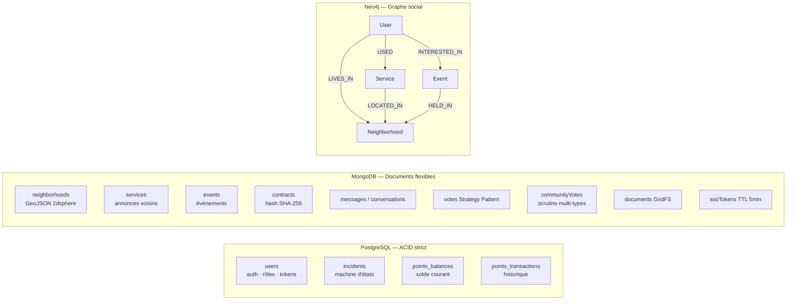

### 7.2 Justification du tri-base

| Critère | PostgreSQL | MongoDB | Neo4j |
|---------|-----------|---------|-------|
| Transactions ACID | Obligatoire (points, auth) | Non critique | Non applicable |
| Schéma flexible | Non | Oui (GeoJSON, subdocs) | Propriétés libres |
| Géolocalisation | Non | Index `2dsphere` natif | Non |
| Recommandations | Non | Non | Cypher traversals |

---

## 8. Sync bidirectionnelle Java ↔ API

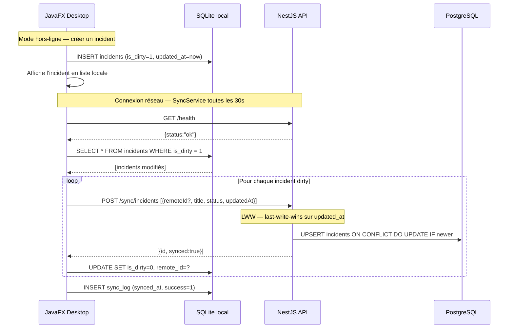

---

## 9. Sync Neo4j temps réel

À chaque opération CRUD sur les entités sociales, un appel **fire-and-forget** synchronise Neo4j. Une panne Neo4j ne bloque jamais l'API principale.

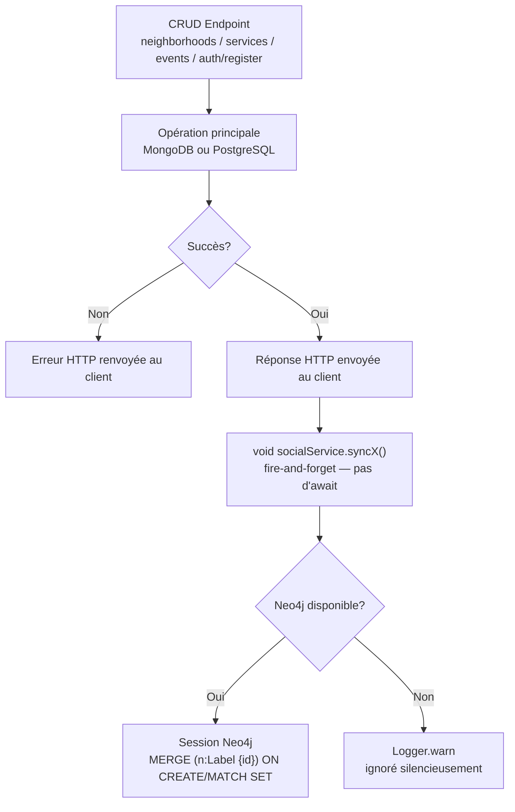

---

## 10. WebSocket — Messagerie temps réel

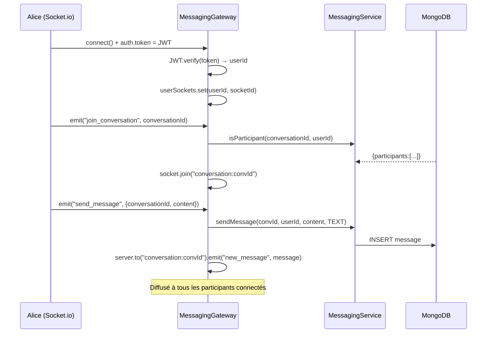

---

## 11. Système de votes

### Strategy Pattern — deux modes

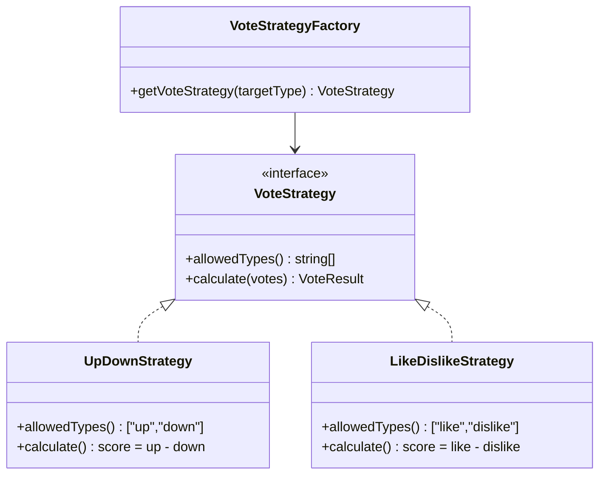

### Logique toggle

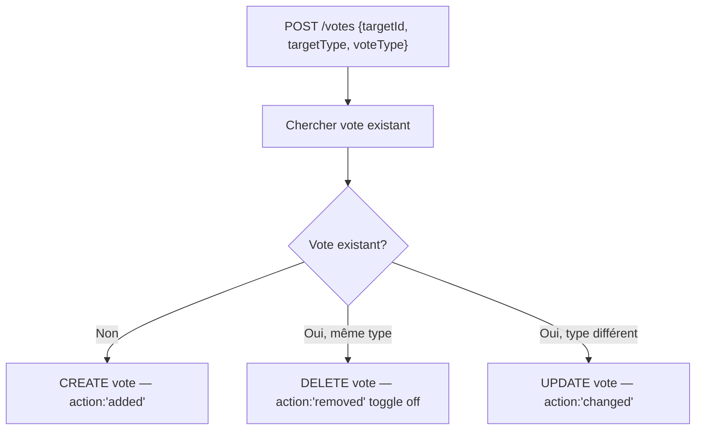

---

## 12. DSL — Pipeline de compilation

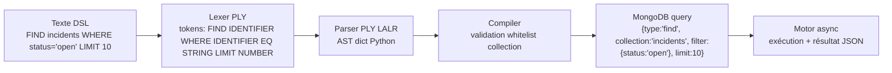

### Grammaire simplifiée

```
query : FIND IDENTIFIER
      | FIND IDENTIFIER WHERE conditions
      | FIND IDENTIFIER LIMIT NUMBER
      | FIND IDENTIFIER WHERE conditions LIMIT NUMBER
      | COUNT IDENTIFIER
      | COUNT IDENTIFIER WHERE conditions

conditions : condition
           | conditions AND condition    → merge dicts
           | conditions OR condition     → {$or: [left, right]}

condition : IDENTIFIER EQ value         → {field: value}
          | IDENTIFIER NEQ value        → {field: {$ne: value}}
          | IDENTIFIER GT value         → {field: {$gt: value}}
          | IDENTIFIER LIKE value       → {field: {$regex: value, $options: 'i'}}
```

---

## 13. Offline mode Java desktop

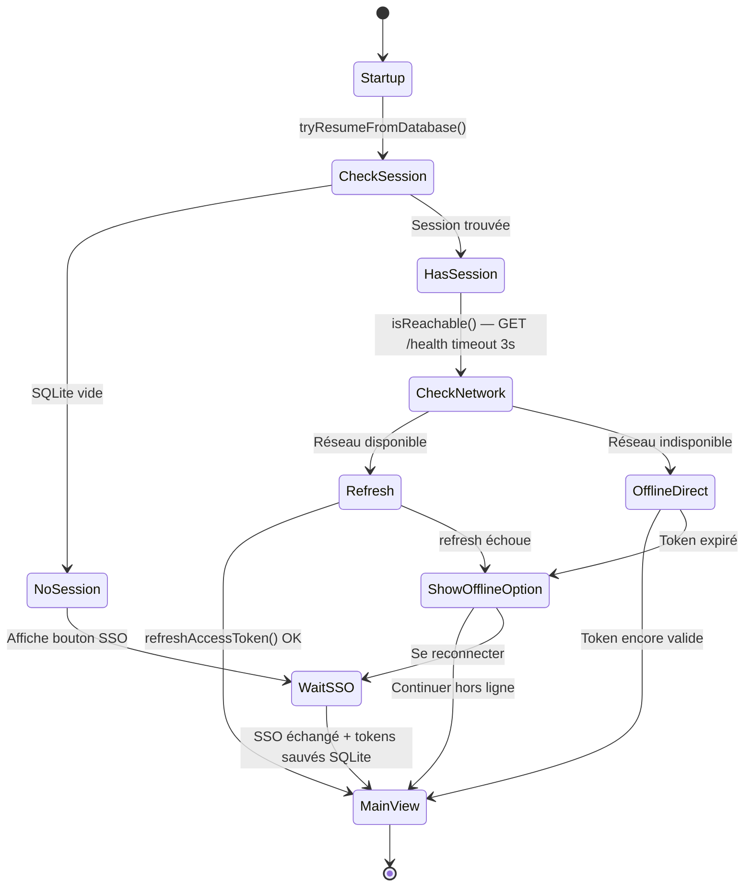

---

## 14. Sécurité en couches

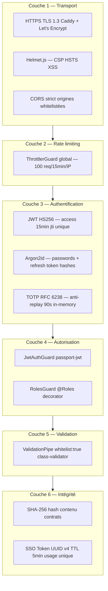

---

## 15. Cycle de vie d'une requête

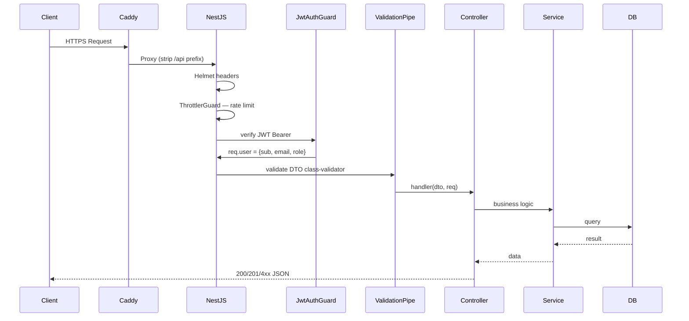
