# Technical Architecture — QuartierConnect

> **Version** 0.2.0 · **Date** 16 April 2026 · **Stage** 4 (95 %)

---

## Table of contents

1. [Overview](#1-overview)
2. [Docker containers](#2-docker-containers)
3. [NestJS modules diagram](#3-nestjs-modules-diagram)
4. [Complete authentication flows](#4-complete-authentication-flows)
5. [Cross-surface SSO](#5-cross-surface-sso)
6. [Refresh token and rotation](#6-refresh-token-and-rotation)
7. [Database architecture](#7-database-architecture)
8. [Bidirectional Java ↔ API sync](#8-bidirectional-java--api-sync)
9. [Real-time Neo4j sync](#9-real-time-neo4j-sync)
10. [WebSocket — Real-time messaging](#10-websocket--real-time-messaging)
11. [Voting system](#11-voting-system)
12. [DSL — Compilation pipeline](#12-dsl--compilation-pipeline)
13. [Java desktop offline mode](#13-java-desktop-offline-mode)
14. [Java desktop plugin system](#14-java-desktop-plugin-system)
15. [Auto-reconnect and token auto-refresh](#15-auto-reconnect-and-token-auto-refresh)
16. [Layered security](#16-layered-security)
17. [Request lifecycle](#17-request-lifecycle)

---

## 1. Overview

QuartierConnect is a **multi-component** platform made up of 4 active applications and 3 databases, all orchestrated through Docker Compose.

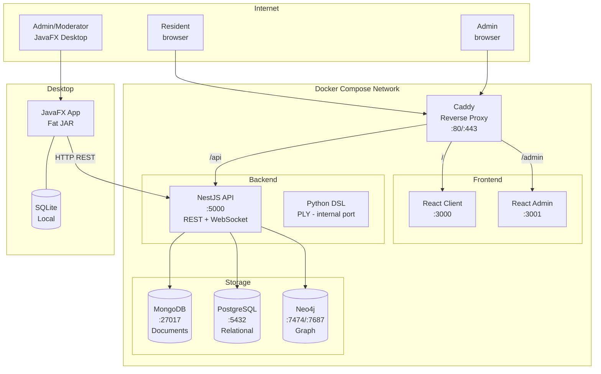

---

## 2. Docker containers

| # | Container | Image | Port(s) | Role |
|---|-----------|-------|---------|------|
| 1 | `caddy` | `caddy:2-alpine` | 80, 443 | HTTPS reverse proxy + automatic Let's Encrypt |
| 2 | `client` | Node 20 + Vite | 3000 | React SPA — resident interface |
| 3 | `admin` | Node 20 + Vite | 3001 | React SPA — admin back office |
| 4 | `api` | Node 20 | 5000 | NestJS REST + WebSocket + DSL bridge |
| 5 | `mongodb` | `mongo:7` | 27017 | Flexible documents, GeoJSON, GridFS |
| 6 | `postgres` | `postgres:16` | 5432 | ACID data — users, incidents, points |
| 7 | `neo4j` | `neo4j:5` | 7474, 7687 | Social graph — Cypher recommendations |

### Caddy routing

```
/ → client:3000
/admin → admin:3001
/api → api:5000
/api/docs → api:5000/docs (Scalar)
```

---

## 3. NestJS modules diagram

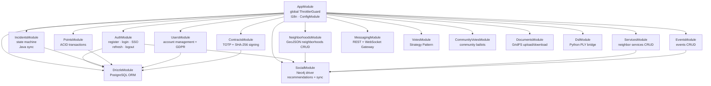

---

## 4. Complete authentication flows

### 4.1 Registration

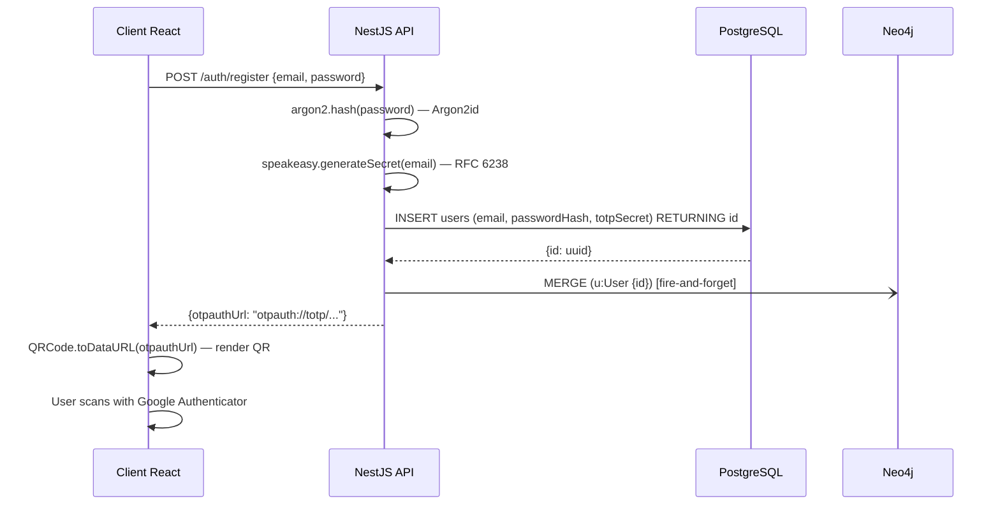

### 4.2 Login (3 sequential validations)

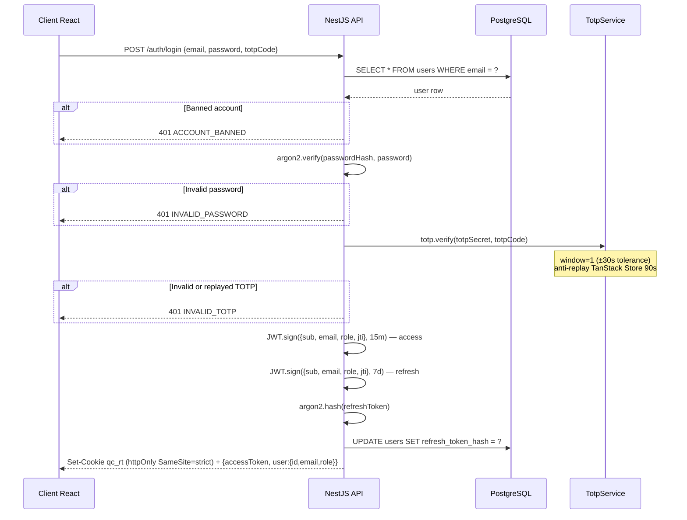

---

## 5. Cross-surface SSO

SSO lets an administrator authenticate into the **Java desktop application** through the **web admin interface**, without re-entering their credentials.

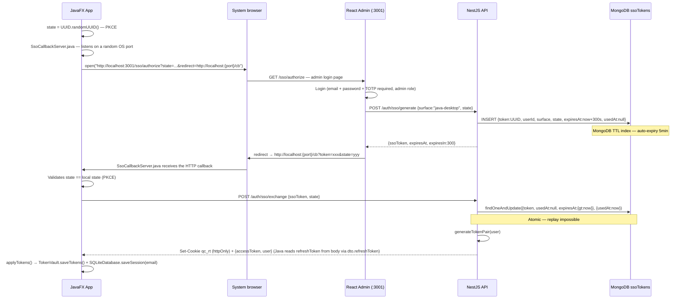

---

## 6. Refresh token and rotation


---

## 7. Database architecture

### 7.1 Data distribution


### 7.2 Rationale for the three-database design

| Criterion | PostgreSQL | MongoDB | Neo4j |
|---------|-----------|---------|-------|
| ACID transactions | Mandatory (points, auth) | Not critical | Not applicable |
| Flexible schema | No | Yes (GeoJSON, subdocs) | Free-form properties |
| Geolocation | No | Native `2dsphere` index | No |
| Recommendations | No | No | Cypher traversals |

---

## 8. Bidirectional Java ↔ API sync

### 8.1 Synchronization flow

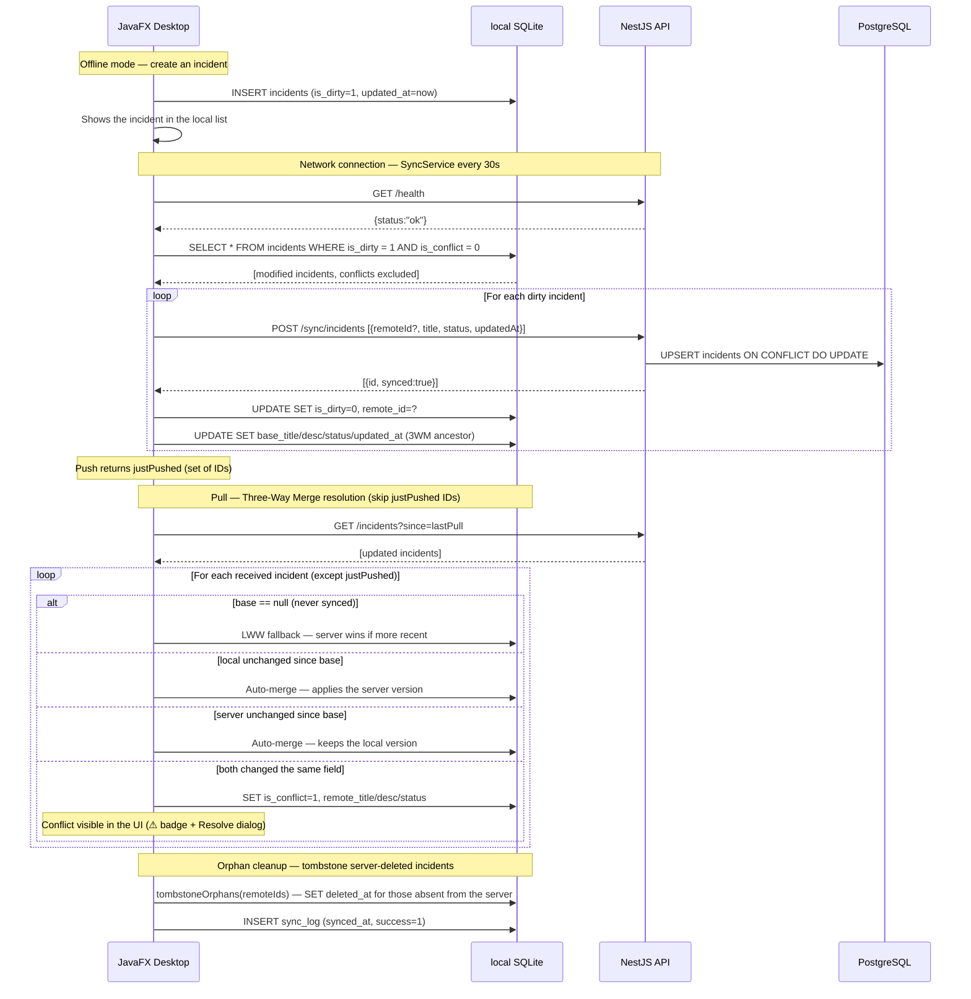

### 8.2 Three-Way Merge — conflict resolution

The Three-Way Merger compares three versions of each field (title, description, status):

| Case | Base | Local | Remote | Result |
|-----|------|-------|--------|----------|
| No base (1st sync) | null | L | R | LWW — remote wins if more recent |
| Local unchanged | B | B | R | Auto-merge — applies remote |
| Remote unchanged | B | L | B | Auto-merge — keeps local |
| Same change | B | X | X | Auto-merge — both converge |
| True conflict | B | L | R | `is_conflict=1` — manual resolution required |

### 8.3 Conflict handling in the UI

- **Banner**: an alert shown at the top of the incidents view when conflicts exist
- **Filter**: a "Conflicts" button to display only the incidents in conflict
- **Merge modal**: a double-click opens a 4-column GridPane (field / base / local / remote) with diff highlighting
- **Resolution**: the user picks each field; resolving updates the ancestor and clears the conflict flag

### 8.4 Tombstone delete

Server-side deletions are propagated locally through a `deleted_at` column (soft delete). `tombstoneOrphans()` marks incidents missing from the server response during a full pull. Marked incidents are excluded from views but kept for auditing.

---

## 9. Real-time Neo4j sync

On every CRUD operation involving social entities, a **fire-and-forget** call synchronizes Neo4j. A Neo4j outage never blocks the main API. On a recoverable error (`ServiceUnavailable`, `SessionExpired`, `TransientError`), `withRetry` retries up to 3 times with exponential backoff (100 ms → 200 ms → 400 ms). Non-recoverable errors (e.g. Cypher syntax) fail immediately without retrying.

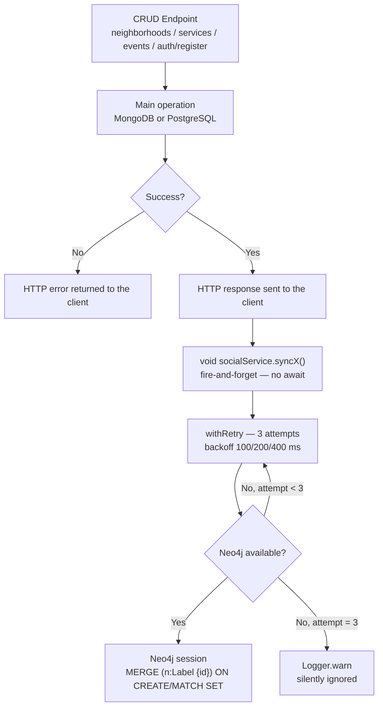

---

## 10. WebSocket — Real-time messaging

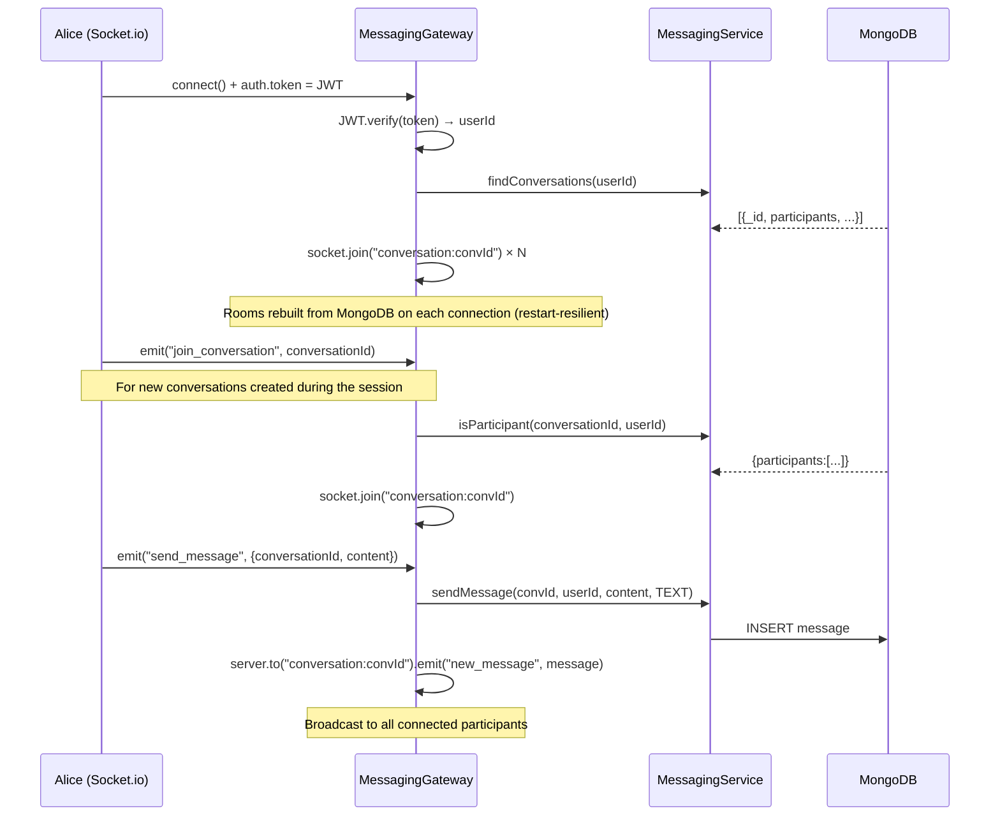

---

## 11. Voting system

### Strategy Pattern — two modes

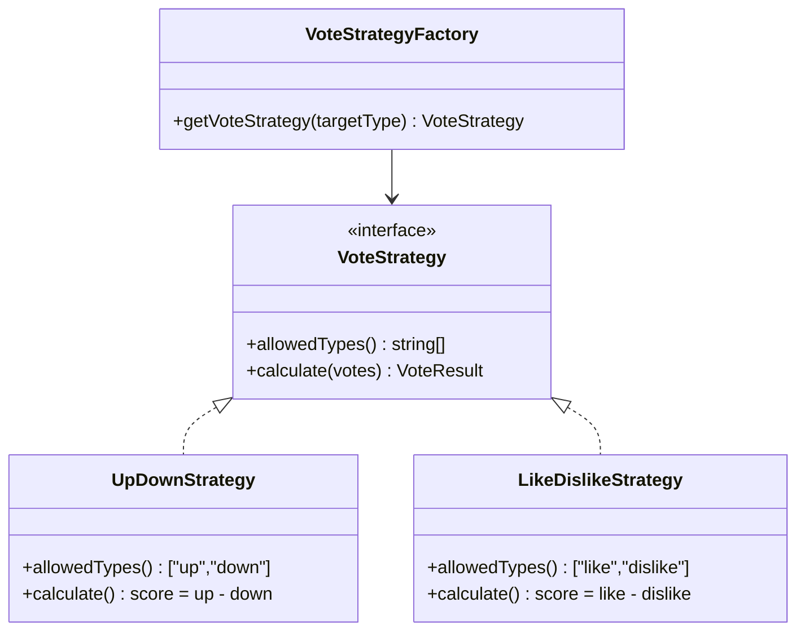

### Toggle logic

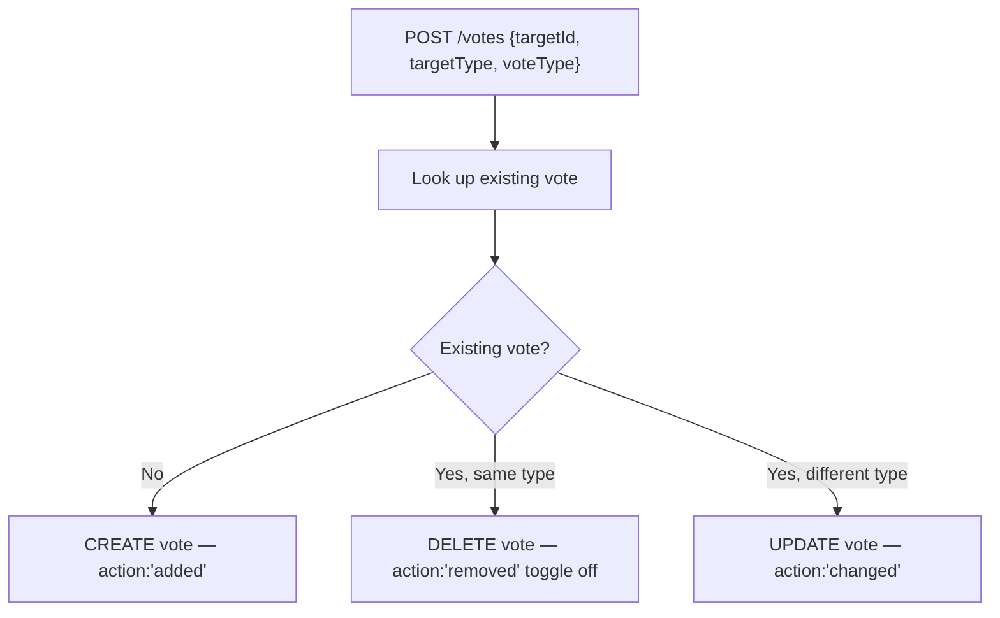

---

## 12. DSL — Compilation pipeline

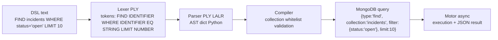

### Simplified grammar

```
query : FIND IDENTIFIER
      | FIND IDENTIFIER WHERE conditions
      | FIND IDENTIFIER LIMIT NUMBER
      | FIND IDENTIFIER WHERE conditions LIMIT NUMBER
      | COUNT IDENTIFIER
      | COUNT IDENTIFIER WHERE conditions

conditions : condition
           | conditions AND condition    → merge dicts
           | conditions OR condition     → {$or: [left, right]}

condition : IDENTIFIER EQ value         → {field: value}
          | IDENTIFIER NEQ value        → {field: {$ne: value}}
          | IDENTIFIER GT value         → {field: {$gt: value}}
          | IDENTIFIER LIKE value       → {field: {$regex: value, $options: 'i'}}
```

---

## 13. Java desktop offline mode

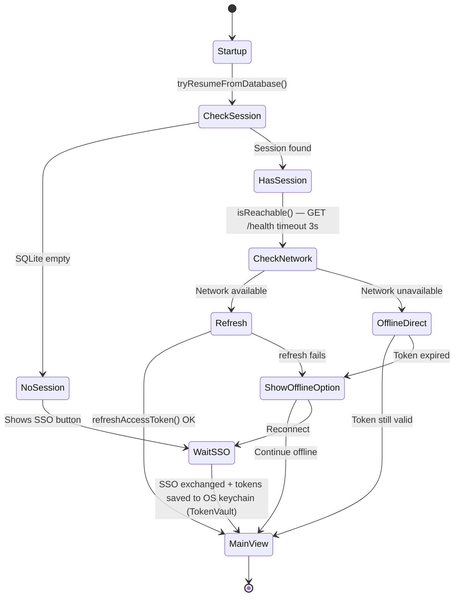

---

## 14. Java desktop plugin system

### 14.1 Architecture

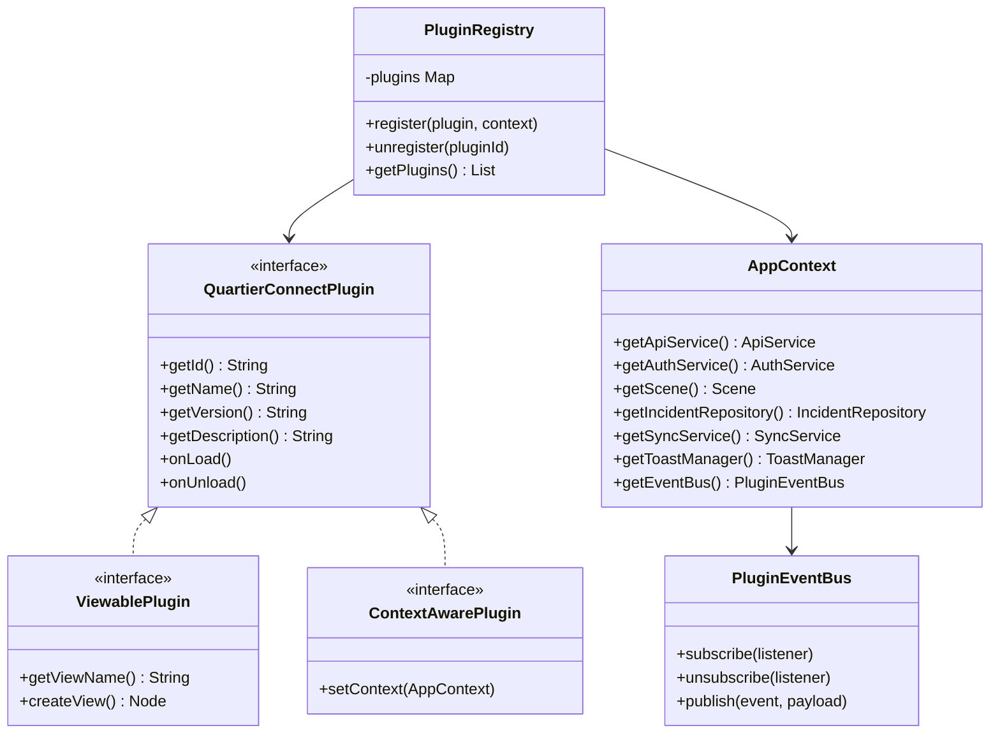

### 14.2 EventBus — inter-plugin communication

The `PluginEventBus` implements a thread-safe publish/subscribe pattern (`CopyOnWriteArrayList`) with 5 event types:

| Event | Emitter | Payload |
|-----------|----------|---------|
| `INCIDENTS_CHANGED` | SyncService, IncidentsView | null |
| `SYNC_STARTED` | SyncService | null |
| `SYNC_COMPLETED` | SyncService | null |
| `SYNC_FAILED` | SyncService | Exception message |
| `ONLINE_STATUS_CHANGED` | SyncService | Boolean (online) |

### 14.3 Built-in plugins

| Plugin | Type | Role |
|--------|------|------|
| ThemePlugin | ContextAware | CSS themes (Primer Dark by default), applied on `onLoad()` |
| CompactModePlugin | ContextAware | Compact UI mode |
| NotificationPlugin | ContextAware | Event-driven notifications via EventBus (no more polling) |
| ExportPlugin | ContextAware | Incident data export via AppContext |
| OfflineModePlugin | ContextAware | Offline toggle in AppTopBar.pluginSlot |

---

## 15. Auto-reconnect and token auto-refresh

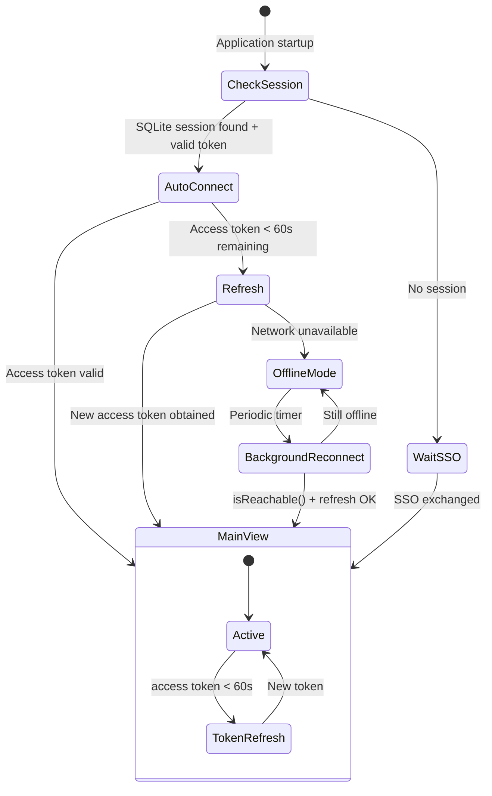

The 60-second threshold for proactive token renewal prevents API request failures caused by expiry during processing.

---

## 16. Layered security

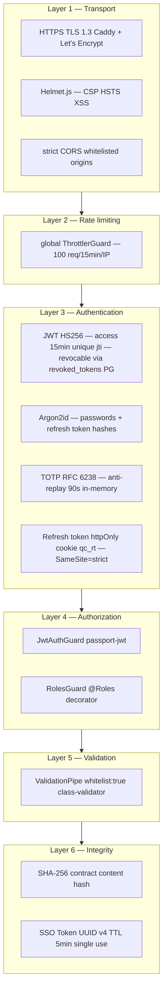

---

## 17. Request lifecycle

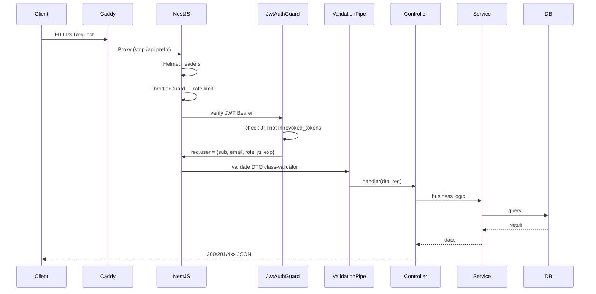

---

## 18. Shared mapping — `<Map>` component

`packages/ui/src/components/map.tsx` exposes a declarative React wrapper around
`react-leaflet@5` used across 6 surfaces (4 client + 2 admin) plus the
`admin/neighborhoods` refactor. Exports: `Map`, `Marker` (4 variants
mapped onto the Civic Editorial palette), `NeighborhoodPolygon`,
`MarkerCluster`, `DrawControl` (leaflet-draw), `UserLocation`, `useFitBounds`.

| Surface | Usage |
|---|---|
| `client/dashboard` | Neighborhood mini-map (h-48) with user geolocation |
| `client/services` | Clustered service pins (MarkerCluster) + popup |
| `client/events` | "Map" tab: event pins + date |
| `client/incidents` | Click-to-place in the dialog + incident map |
| `admin/services` | List/map tab + picker in the dialog |
| `admin/incidents` | List/map tab with pins colored by status |
| `admin/neighborhoods` | Polygon drawing via `<DrawControl>` (leaflet-draw) |

**Geo helpers**: `packages/shared/src/lib/geo.ts` exposes `centroidOf`,
`pointToLatLng`, `latLngToPoint` (3 Vitest tests).

**Backend schema**: reusable GeoJSON Point subdocument
`api/src/common/schemas/geo-point.schema.ts`. Services and Events use
this Mongoose subschema with a `2dsphere` (sparse) index; Postgres
Incidents simply store `lat REAL` + `lng REAL` (migration
`0002_incident_coords.sql`).
