# Architecture technique — QuartierConnect

> **Version** 0.2.0 · **Date** 16 avril 2026 · **Étape** 4 (95 %)

---

## Sommaire

1. [Vue d'ensemble](#1-vue-densemble)
2. [Conteneurs Docker](#2-conteneurs-docker)
3. [Diagramme des modules NestJS](#3-diagramme-des-modules-nestjs)
4. [Flux d'authentification complets](#4-flux-dauthentification-complets)
5. [SSO inter-surfaces](#5-sso-inter-surfaces)
6. [Refresh token et rotation](#6-refresh-token-et-rotation)
7. [Architecture des bases de données](#7-architecture-des-bases-de-données)
8. [Synchronisation bidirectionnelle Java ↔ API](#8-synchronisation-bidirectionnelle-java--api)
9. [Synchronisation Neo4j en temps réel](#9-synchronisation-neo4j-en-temps-réel)
10. [WebSocket — Messagerie temps réel](#10-websocket--messagerie-temps-réel)
11. [Système de vote](#11-système-de-vote)
12. [DSL — Pipeline de compilation](#12-dsl--pipeline-de-compilation)
13. [Mode hors ligne du bureau Java](#13-mode-hors-ligne-du-bureau-java)
14. [Système de plugins du bureau Java](#14-système-de-plugins-du-bureau-java)
15. [Reconnexion automatique et rafraîchissement automatique du token](#15-reconnexion-automatique-et-rafraîchissement-automatique-du-token)
16. [Sécurité en couches](#16-sécurité-en-couches)
17. [Cycle de vie d'une requête](#17-cycle-de-vie-dune-requête)
18. [Cartographie partagée — composant `<Map>`](#18-cartographie-partagée--composant-map)
19. [Architecture de déploiement en production](#19-architecture-de-déploiement-en-production)

---

## 1. Vue d'ensemble

QuartierConnect est une plateforme **multi-composants** constituée de 4 applications actives et de 3 bases de données, orchestrées via Docker Compose, plus une API HTTP externe (Nominatim / OpenStreetMap) utilisée pour le géocodage d'adresses.

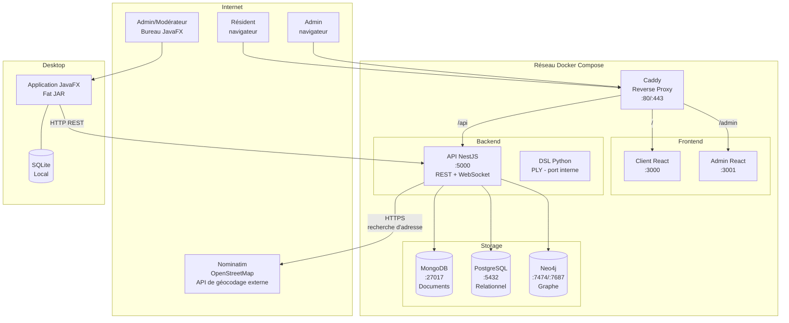
```mermaid
graph TB
    subgraph Internet
        U1[Résident<br/>navigateur]
        U2[Admin<br/>navigateur]
        U3[Admin/Modérateur<br/>Bureau JavaFX]
        NOM[Nominatim<br/>OpenStreetMap<br/>API de géocodage externe]
    end

    subgraph Docker["Réseau Docker Compose"]
        CADDY[Caddy<br/>Reverse Proxy<br/>:80/:443]

        subgraph Frontend
            CLIENT[Client React<br/>:3000]
            ADMIN[Admin React<br/>:3001]
        end

        subgraph Backend
            API[API NestJS<br/>:5000<br/>REST + WebSocket]
            PYTHON[DSL Python<br/>PLY - port interne]
        end

        subgraph Storage
            MONGO[(MongoDB<br/>:27017<br/>Documents)]
            PG[(PostgreSQL<br/>:5432<br/>Relationnel)]
            NEO4J[(Neo4j<br/>:7474/:7687<br/>Graphe)]
        end
    end

    subgraph Desktop
        JAVA[Application JavaFX<br/>Fat JAR]
        SQLITE[(SQLite<br/>Local)]
    end

    U1 --> CADDY
    U2 --> CADDY
    U3 --> JAVA
    CADDY -->|"/"| CLIENT
    CADDY -->|"/admin"| ADMIN
    CADDY -->|"/api"| API
    API --> MONGO
    API --> PG
    API --> NEO4J
    API -->|HTTPS<br/>recherche d'adresse| NOM
    JAVA -->|HTTP REST| API
    JAVA --- SQLITE
```

L'API est le **seul** composant à établir des connexions sortantes vers Internet :
le `GeocodingService` appelle le point d'accès public Nominatim (OpenStreetMap) pour
transformer une adresse saisie en coordonnées et pour alimenter l'autocomplétion
d'adresses.

---

## 2. Conteneurs Docker

| # | Conteneur | Image | Port(s) | Rôle |
|---|-----------|-------|---------|------|
| 1 | `caddy` | `caddy:2-alpine` | 80, 443 | Reverse proxy HTTPS + Let's Encrypt automatique |
| 2 | `client` | Node 20 + Vite | 3000 | SPA React — interface résident |
| 3 | `admin` | Node 20 + Vite | 3001 | SPA React — back office admin |
| 4 | `api` | Node 20 | 5000 | REST NestJS + WebSocket + passerelle DSL |
| 5 | `mongodb` | `mongo:7` | 27017 | Documents flexibles, GeoJSON, GridFS |
| 6 | `postgres` | `postgres:16` | 5432 | Données ACID — utilisateurs, incidents, points |
| 7 | `neo4j` | `neo4j:5` | 7474, 7687 | Graphe social — recommandations Cypher |

La stack tourne sur **7 conteneurs** (`caddy`, `client`, `admin`, `api`, `mongodb`,
`postgres`, `neo4j`). Le conteneur `api` embarque en outre la passerelle DSL Python
PLY et il est le seul service à effectuer des appels sortants vers une API externe
(Nominatim, voir ci-dessous).

### Routage Caddy

```
/ → client:3000
/admin → admin:3001
/api → api:5000
/api/docs → api:5000/docs (Scalar)
```

### API externe — Nominatim (OpenStreetMap)

Le `GeocodingService` (`api/src/geocoding/geocoding.service.ts`) est la seule
intégration sortante de la plateforme. Il appelle le point d'accès public Nominatim
`https://nominatim.openstreetmap.org/search` (`format=jsonv2`) à deux fins :

- **`geocode(address)`** — résoudre une adresse unique en `{ lat, lng }`.
- **`search(query, { lang, viewbox })`** — retourner jusqu'à 8 suggestions d'adresses
  pour l'autocomplétion, avec un biais géographique *souple* (sans `bounded`/`countrycodes`),
  de sorte qu'une adresse en dehors de la zone de l'utilisateur reste trouvable.

Garde-fous opérationnels, tous appliqués dans le service :

| Enjeu | Traitement |
|---------|----------|
| Politique d'usage | Auto-limitation à ≤ 1 requête/seconde (`MIN_INTERVAL_MS = 1100`) |
| Identification | En-tête `User-Agent` explicite (requis par Nominatim) |
| Délai d'expiration | `AbortSignal.timeout(5000)` (5 s) |
| Échec | Retourne `null` / `[]` et journalise un avertissement — ne lève jamais d'exception vers l'appelant |

Consommateurs : le `GeocodingModule` est importé par les modules Users (adresse),
Services et Events. Les résultats d'adresse alimentent `users.address_lat/lng` et le
composant `<Map>` partagé. Le point d'entrée côté client est `GET /geocoding/search`.

---

## 3. Diagramme des modules NestJS

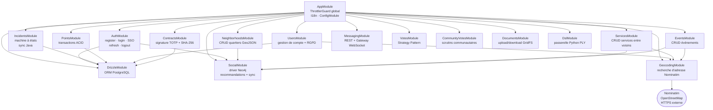
```mermaid
graph TB
    APP[AppModule<br/>ThrottlerGuard global<br/>I18n · ConfigModule]

    APP --> AUTH[AuthModule<br/>register · login · SSO<br/>refresh · logout]
    APP --> DB[DrizzleModule<br/>ORM PostgreSQL]
    APP --> NEO[SocialModule<br/>driver Neo4j<br/>recommandations + sync]

    APP --> NBH[NeighborhoodsModule<br/>CRUD quartiers GeoJSON]
    APP --> SVC[ServicesModule<br/>CRUD services entre voisins]
    APP --> EVT[EventsModule<br/>CRUD événements]
    APP --> INC[IncidentsModule<br/>machine à états<br/>sync Java]
    APP --> PTS[PointsModule<br/>transactions ACID]
    APP --> USR[UsersModule<br/>gestion de compte + RGPD]
    APP --> CTR[ContractsModule<br/>signature TOTP + SHA-256]
    APP --> MSG[MessagingModule<br/>REST + Gateway WebSocket]
    APP --> VOT[VotesModule<br/>Strategy Pattern]
    APP --> CVT[CommunityVotesModule<br/>scrutins communautaires]
    APP --> DOC[DocumentsModule<br/>upload/download GridFS]
    APP --> DSL[DslModule<br/>passerelle Python PLY]
    APP --> GEO[GeocodingModule<br/>recherche d'adresse Nominatim]

    AUTH --> DB
    AUTH --> NEO
    INC --> DB
    PTS --> DB
    USR --> DB
    USR --> GEO
    CTR --> DB
    NBH --> NEO
    SVC --> NEO
    SVC --> GEO
    EVT --> NEO
    EVT --> GEO
    GEO --> NOM([Nominatim<br/>OpenStreetMap<br/>HTTPS externe])
```

---

## 4. Flux d'authentification complets

### 4.1 Inscription

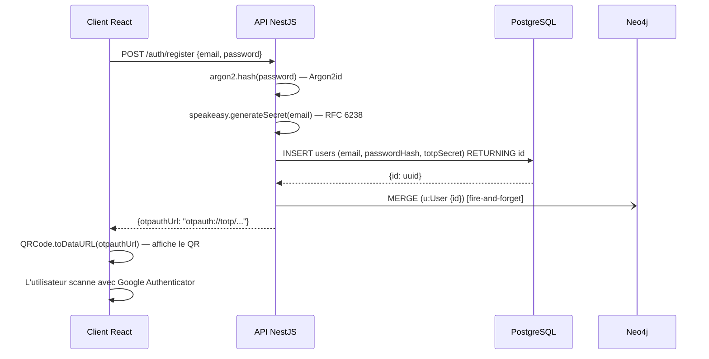
```mermaid
sequenceDiagram
    participant C as Client React
    participant API as API NestJS
    participant PG as PostgreSQL
    participant N4J as Neo4j

    C->>API: POST /auth/register {email, password}
    API->>API: argon2.hash(password) — Argon2id
    API->>API: speakeasy.generateSecret(email) — RFC 6238
    API->>PG: INSERT users (email, passwordHash, totpSecret) RETURNING id
    PG-->>API: {id: uuid}
    API-)N4J: MERGE (u:User {id}) [fire-and-forget]
    API-->>C: {otpauthUrl: "otpauth://totp/..."}
    C->>C: QRCode.toDataURL(otpauthUrl) — affiche le QR
    C->>C: L'utilisateur scanne avec Google Authenticator
```

### 4.2 Connexion (3 validations séquentielles)

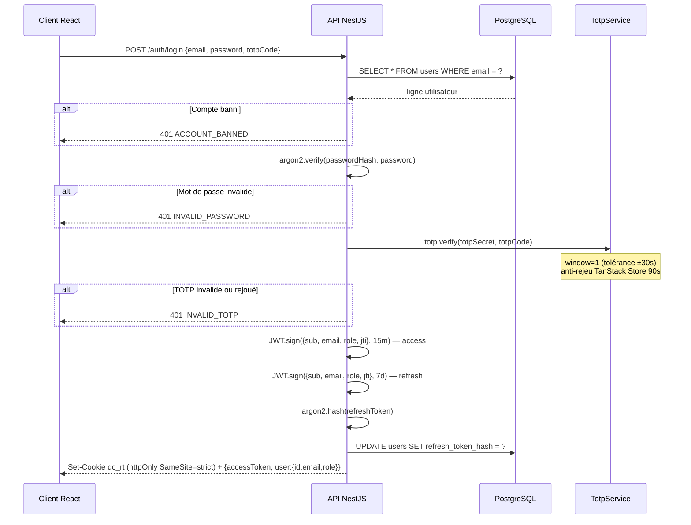
```mermaid
sequenceDiagram
    participant C as Client React
    participant API as API NestJS
    participant PG as PostgreSQL
    participant TS as TotpService

    C->>API: POST /auth/login {email, password, totpCode}
    API->>PG: SELECT * FROM users WHERE email = ?
    PG-->>API: ligne utilisateur

    alt Compte banni
        API-->>C: 401 ACCOUNT_BANNED
    end

    API->>API: argon2.verify(passwordHash, password)
    alt Mot de passe invalide
        API-->>C: 401 INVALID_PASSWORD
    end

    API->>TS: totp.verify(totpSecret, totpCode)
    Note over TS: window=1 (tolérance ±30s)<br/>anti-rejeu TanStack Store 90s
    alt TOTP invalide ou rejoué
        API-->>C: 401 INVALID_TOTP
    end

    API->>API: JWT.sign({sub, email, role, jti}, 15m) — access
    API->>API: JWT.sign({sub, email, role, jti}, 7d) — refresh
    API->>API: argon2.hash(refreshToken)
    API->>PG: UPDATE users SET refresh_token_hash = ?
    API-->>C: Set-Cookie qc_rt (httpOnly SameSite=strict) + {accessToken, user:{id,email,role}}
```

---

## 5. SSO inter-surfaces

Le SSO permet à un administrateur de s'authentifier dans l'**application de bureau Java** via l'**interface admin web**, sans ressaisir ses identifiants.

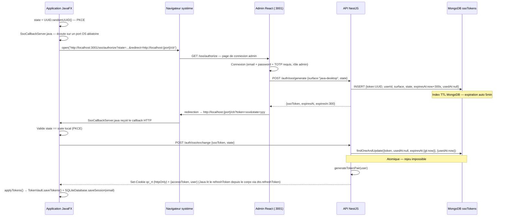
```mermaid
sequenceDiagram
    participant Java as Application JavaFX
    participant Browser as Navigateur système
    participant Admin as Admin React (:3001)
    participant API as API NestJS
    participant Mongo as MongoDB ssoTokens

    Java->>Java: state = UUID.randomUUID() — PKCE
    Java->>Java: SsoCallbackServer.java — écoute sur un port OS aléatoire
    Java->>Browser: open("http://localhost:3001/sso/authorize?state=...&redirect=http://localhost:{port}/cb")
    Browser->>Admin: GET /sso/authorize — page de connexion admin
    Admin->>Admin: Connexion (email + password + TOTP requis, rôle admin)
    Admin->>API: POST /auth/sso/generate {surface:"java-desktop", state}
    API->>Mongo: INSERT {token:UUID, userId, surface, state, expiresAt:now+300s, usedAt:null}
    Note over Mongo: Index TTL MongoDB — expiration auto 5min
    API-->>Admin: {ssoToken, expiresAt, expiresIn:300}
    Admin->>Browser: redirection → http://localhost:{port}/cb?token=xxx&state=yyy
    Browser->>Java: SsoCallbackServer.java reçoit le callback HTTP
    Java->>Java: Valide state == state local (PKCE)
    Java->>API: POST /auth/sso/exchange {ssoToken, state}
    API->>Mongo: findOneAndUpdate({token, usedAt:null, expiresAt:{gt:now}}, {usedAt:now})
    Note over API,Mongo: Atomique — rejeu impossible
    API->>API: generateTokenPair(user)
    API-->>Java: Set-Cookie qc_rt (httpOnly) + {accessToken, user} (Java lit le refreshToken depuis le corps via dto.refreshToken)
    Java->>Java: applyTokens() → TokenVault.saveTokens() + SQLiteDatabase.saveSession(email)
```

---

## 6. Refresh token et rotation

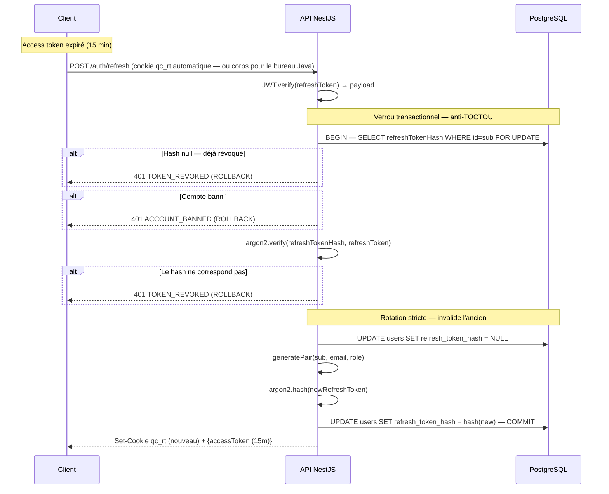
```mermaid
sequenceDiagram
    participant C as Client
    participant API as API NestJS
    participant PG as PostgreSQL

    Note over C: Access token expiré (15 min)
    C->>API: POST /auth/refresh (cookie qc_rt automatique — ou corps pour le bureau Java)
    API->>API: JWT.verify(refreshToken) → payload

    Note over API,PG: Verrou transactionnel — anti-TOCTOU
    API->>PG: BEGIN — SELECT refreshTokenHash WHERE id=sub FOR UPDATE
    alt Hash null — déjà révoqué
        API-->>C: 401 TOKEN_REVOKED (ROLLBACK)
    end
    alt Compte banni
        API-->>C: 401 ACCOUNT_BANNED (ROLLBACK)
    end
    API->>API: argon2.verify(refreshTokenHash, refreshToken)
    alt Le hash ne correspond pas
        API-->>C: 401 TOKEN_REVOKED (ROLLBACK)
    end

    Note over API,PG: Rotation stricte — invalide l'ancien
    API->>PG: UPDATE users SET refresh_token_hash = NULL
    API->>API: generatePair(sub, email, role)
    API->>API: argon2.hash(newRefreshToken)
    API->>PG: UPDATE users SET refresh_token_hash = hash(new) — COMMIT
    API-->>C: Set-Cookie qc_rt (nouveau) + {accessToken (15m)}
```

---

## 7. Architecture des bases de données

### 7.1 Répartition des données

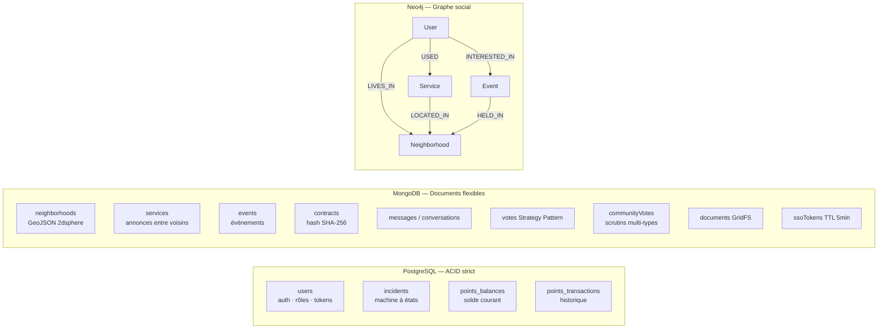
```mermaid
graph LR
    subgraph PG["PostgreSQL — ACID strict"]
        U[users<br/>auth · rôles · tokens]
        I[incidents<br/>machine à états]
        PB[points_balances<br/>solde courant]
        PT[points_transactions<br/>historique]
    end

    subgraph MDB["MongoDB — Documents flexibles"]
        N[neighborhoods<br/>GeoJSON 2dsphere]
        S[services<br/>annonces entre voisins]
        E[events<br/>événements]
        C[contracts<br/>hash SHA-256]
        M[messages / conversations]
        V[votes Strategy Pattern]
        CV[communityVotes<br/>scrutins multi-types]
        D[documents GridFS]
        SSO[ssoTokens TTL 5min]
    end

    subgraph N4J["Neo4j — Graphe social"]
        NU[User]
        NN[Neighborhood]
        NS[Service]
        NE[Event]
        NU -->|LIVES_IN| NN
        NS -->|LOCATED_IN| NN
        NE -->|HELD_IN| NN
        NU -->|INTERESTED_IN| NE
        NU -->|USED| NS
    end
```

### 7.2 Justification de la conception à trois bases

| Critère | PostgreSQL | MongoDB | Neo4j |
|---------|-----------|---------|-------|
| Transactions ACID | Obligatoires (points, auth) | Non critiques | Non applicable |
| Schéma flexible | Non | Oui (GeoJSON, sous-documents) | Propriétés libres |
| Géolocalisation | Non | Index `2dsphere` natif | Non |
| Recommandations | Non | Non | Parcours Cypher |

---

## 8. Synchronisation bidirectionnelle Java ↔ API

### 8.1 Flux de synchronisation

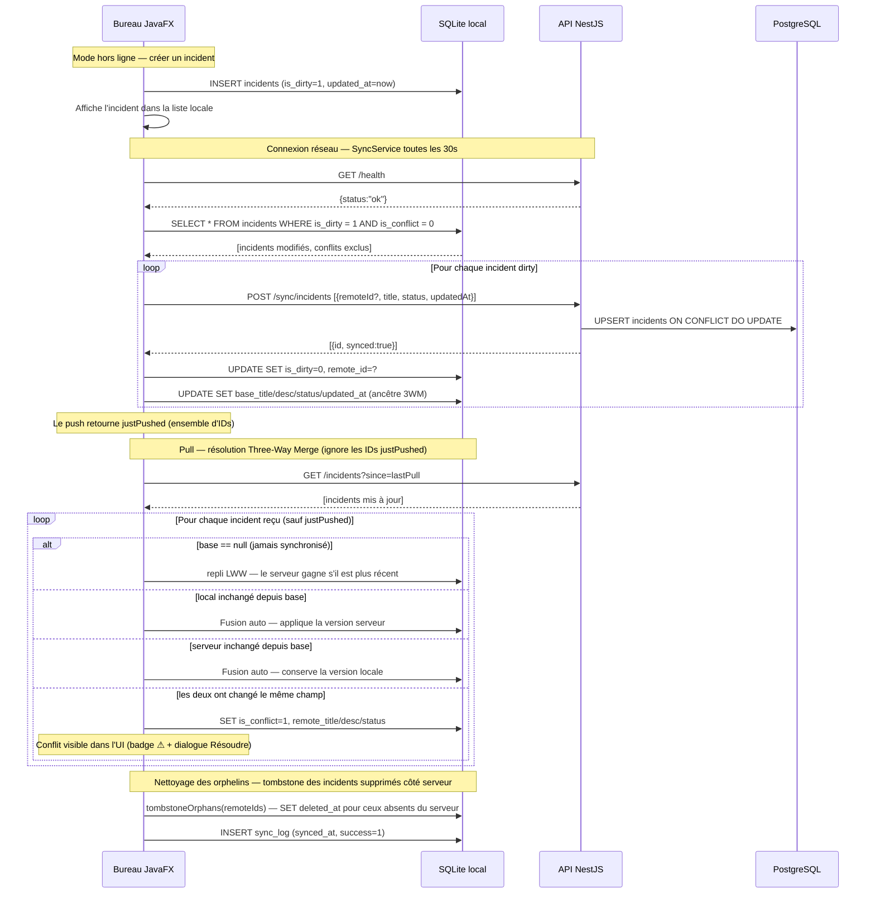
```mermaid
sequenceDiagram
    participant Java as Bureau JavaFX
    participant SQLite as SQLite local
    participant API as API NestJS
    participant PG as PostgreSQL

    Note over Java: Mode hors ligne — créer un incident
    Java->>SQLite: INSERT incidents (is_dirty=1, updated_at=now)
    Java->>Java: Affiche l'incident dans la liste locale

    Note over Java,API: Connexion réseau — SyncService toutes les 30s
    Java->>API: GET /health
    API-->>Java: {status:"ok"}

    Java->>SQLite: SELECT * FROM incidents WHERE is_dirty = 1 AND is_conflict = 0
    SQLite-->>Java: [incidents modifiés, conflits exclus]

    loop Pour chaque incident dirty
        Java->>API: POST /sync/incidents [{remoteId?, title, status, updatedAt}]
        API->>PG: UPSERT incidents ON CONFLICT DO UPDATE
        API-->>Java: [{id, synced:true}]
        Java->>SQLite: UPDATE SET is_dirty=0, remote_id=?
        Java->>SQLite: UPDATE SET base_title/desc/status/updated_at (ancêtre 3WM)
    end

    Note over Java: Le push retourne justPushed (ensemble d'IDs)
    Note over Java,SQLite: Pull — résolution Three-Way Merge (ignore les IDs justPushed)
    Java->>API: GET /incidents?since=lastPull
    API-->>Java: [incidents mis à jour]
    loop Pour chaque incident reçu (sauf justPushed)
        alt base == null (jamais synchronisé)
            Java->>SQLite: repli LWW — le serveur gagne s'il est plus récent
        else local inchangé depuis base
            Java->>SQLite: Fusion auto — applique la version serveur
        else serveur inchangé depuis base
            Java->>SQLite: Fusion auto — conserve la version locale
        else les deux ont changé le même champ
            Java->>SQLite: SET is_conflict=1, remote_title/desc/status
            Note over Java: Conflit visible dans l'UI (badge ⚠ + dialogue Résoudre)
        end
    end

    Note over Java,SQLite: Nettoyage des orphelins — tombstone des incidents supprimés côté serveur
    Java->>SQLite: tombstoneOrphans(remoteIds) — SET deleted_at pour ceux absents du serveur
    Java->>SQLite: INSERT sync_log (synced_at, success=1)
```

### 8.2 Three-Way Merge — résolution de conflits

Le Three-Way Merger compare trois versions de chaque champ (title, description, status) :

| Cas | Base | Local | Distant | Résultat |
|-----|------|-------|--------|----------|
| Pas de base (1ère sync) | null | L | R | LWW — le distant gagne s'il est plus récent |
| Local inchangé | B | B | R | Fusion auto — applique le distant |
| Distant inchangé | B | L | B | Fusion auto — conserve le local |
| Même modification | B | X | X | Fusion auto — les deux convergent |
| Vrai conflit | B | L | R | `is_conflict=1` — résolution manuelle requise |

### 8.3 Gestion des conflits dans l'UI

- **Bannière** : une alerte affichée en haut de la vue des incidents lorsqu'il existe des conflits
- **Filtre** : un bouton « Conflits » pour n'afficher que les incidents en conflit
- **Modale de fusion** : un double-clic ouvre un GridPane à 4 colonnes (champ / base / local / distant) avec mise en évidence des différences
- **Résolution** : l'utilisateur choisit chaque champ ; la résolution met à jour l'ancêtre et efface l'indicateur de conflit

### 8.4 Suppression par tombstone

Les suppressions côté serveur sont propagées localement via une colonne `deleted_at` (soft delete). `tombstoneOrphans()` marque les incidents absents de la réponse serveur lors d'un pull complet. Les incidents marqués sont exclus des vues mais conservés à des fins d'audit.

---

## 9. Synchronisation Neo4j en temps réel

À chaque opération CRUD impliquant des entités sociales, un appel **fire-and-forget** synchronise Neo4j. Une panne de Neo4j ne bloque jamais l'API principale. Sur une erreur récupérable (`ServiceUnavailable`, `SessionExpired`, `TransientError`), `withRetry` réessaie jusqu'à 3 fois avec un backoff exponentiel (100 ms → 200 ms → 400 ms). Les erreurs non récupérables (par ex. une syntaxe Cypher) échouent immédiatement sans réessai.

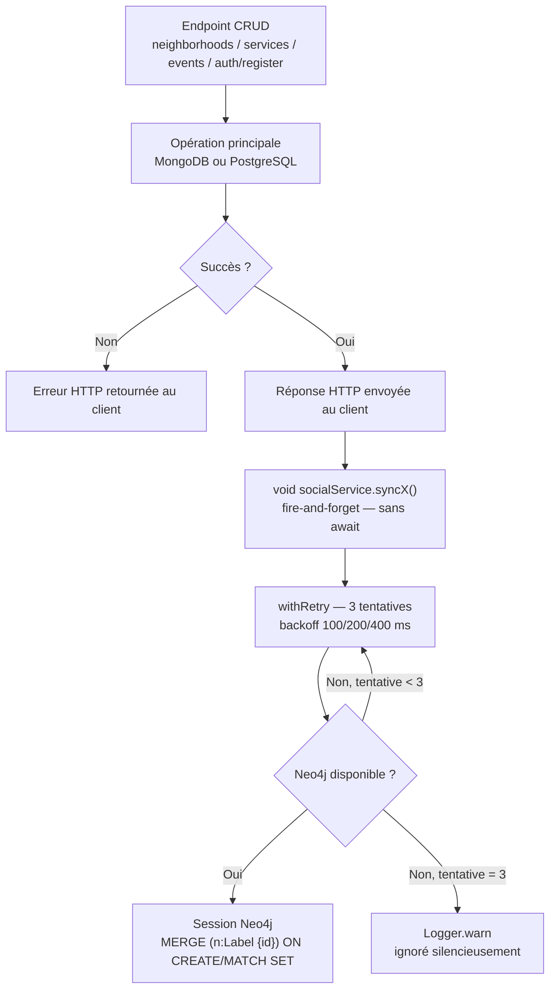
```mermaid
flowchart TD
    A["Endpoint CRUD<br/>neighborhoods / services / events / auth/register"] --> B["Opération principale<br/>MongoDB ou PostgreSQL"]
    B --> C{Succès ?}
    C -->|Non| D[Erreur HTTP retournée au client]
    C -->|Oui| E[Réponse HTTP envoyée au client]
    E --> F["void socialService.syncX()<br/>fire-and-forget — sans await"]
    F --> R["withRetry — 3 tentatives<br/>backoff 100/200/400 ms"]
    R --> G{Neo4j disponible ?}
    G -->|Oui| H["Session Neo4j<br/>MERGE (n:Label {id}) ON CREATE/MATCH SET"]
    G -->|Non, tentative < 3| R
    G -->|Non, tentative = 3| I["Logger.warn<br/>ignoré silencieusement"]
```

---

## 10. WebSocket — Messagerie temps réel

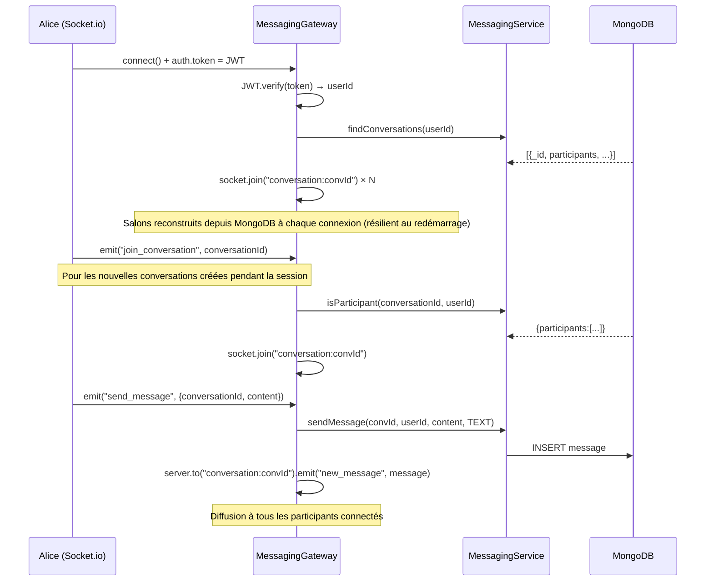
```mermaid
sequenceDiagram
    participant A as Alice (Socket.io)
    participant GW as MessagingGateway
    participant SVC as MessagingService
    participant Mongo as MongoDB

    A->>GW: connect() + auth.token = JWT
    GW->>GW: JWT.verify(token) → userId
    GW->>SVC: findConversations(userId)
    Mongo-->>SVC: [{_id, participants, ...}]
    GW->>GW: socket.join("conversation:convId") × N
    Note over GW: Salons reconstruits depuis MongoDB à chaque connexion (résilient au redémarrage)

    A->>GW: emit("join_conversation", conversationId)
    Note over A,GW: Pour les nouvelles conversations créées pendant la session
    GW->>SVC: isParticipant(conversationId, userId)
    Mongo-->>SVC: {participants:[...]}
    GW->>GW: socket.join("conversation:convId")

    A->>GW: emit("send_message", {conversationId, content})
    GW->>SVC: sendMessage(convId, userId, content, TEXT)
    SVC->>Mongo: INSERT message
    GW->>GW: server.to("conversation:convId").emit("new_message", message)
    Note over GW: Diffusion à tous les participants connectés
```

---

## 11. Système de vote

### Strategy Pattern — deux modes

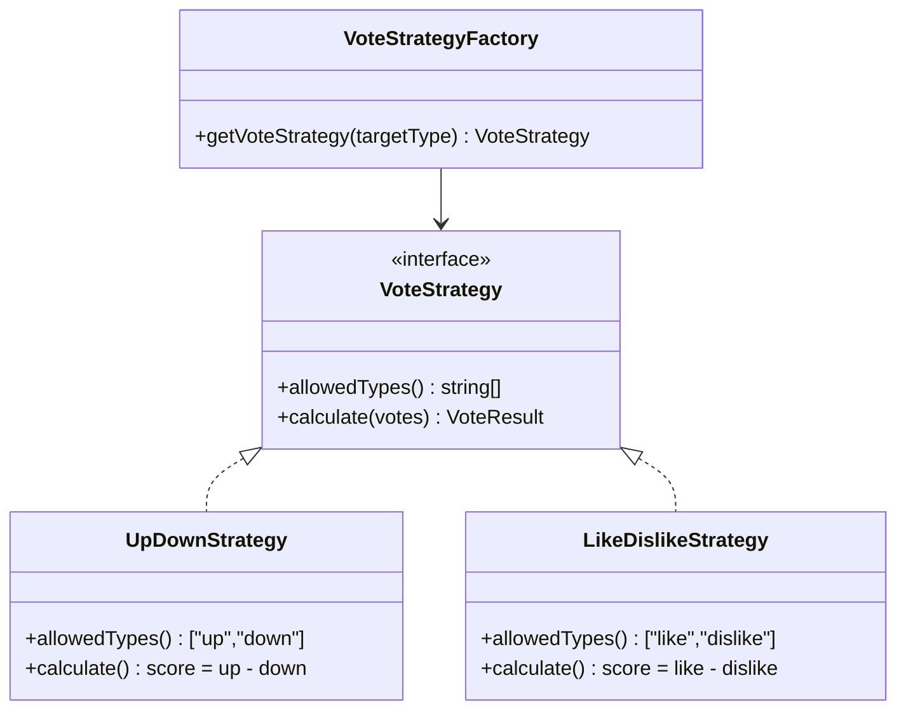
```mermaid
classDiagram
    class VoteStrategy {
        <<interface>>
        +allowedTypes() string[]
        +calculate(votes) VoteResult
    }
    class UpDownStrategy {
        +allowedTypes() ["up","down"]
        +calculate() score = up - down
    }
    class LikeDislikeStrategy {
        +allowedTypes() ["like","dislike"]
        +calculate() score = like - dislike
    }
    class VoteStrategyFactory {
        +getVoteStrategy(targetType) VoteStrategy
    }
    VoteStrategy <|.. UpDownStrategy
    VoteStrategy <|.. LikeDislikeStrategy
    VoteStrategyFactory --> VoteStrategy
```

### Logique de bascule

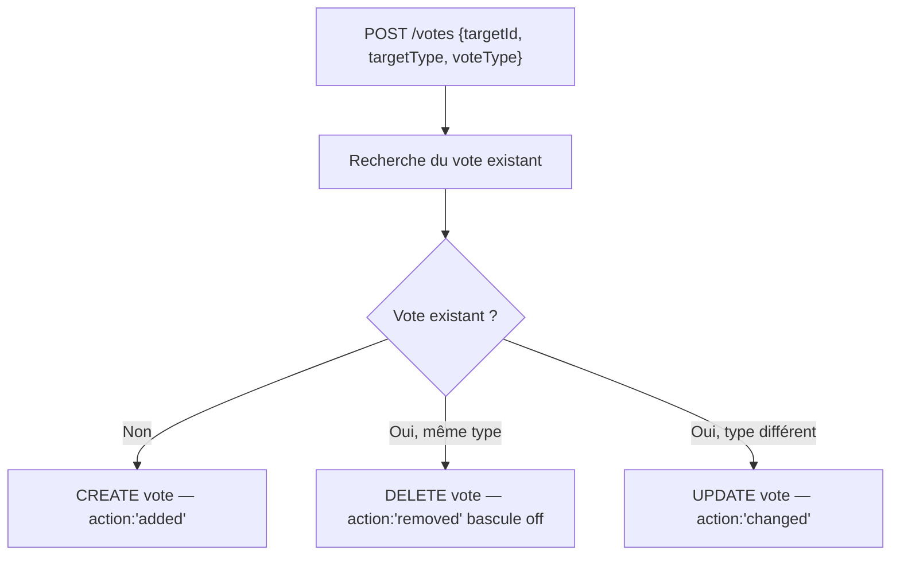
```mermaid
flowchart TD
    A["POST /votes {targetId, targetType, voteType}"] --> B[Recherche du vote existant]
    B --> C{Vote existant ?}
    C -->|Non| D["CREATE vote — action:'added'"]
    C -->|Oui, même type| E["DELETE vote — action:'removed' bascule off"]
    C -->|Oui, type différent| F["UPDATE vote — action:'changed'"]
```

---

## 12. DSL — Pipeline de compilation

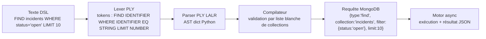
```mermaid
flowchart LR
    A["Texte DSL<br/>FIND incidents WHERE status='open' LIMIT 10"]
    B["Lexer PLY<br/>tokens : FIND IDENTIFIER WHERE IDENTIFIER EQ STRING LIMIT NUMBER"]
    C["Parser PLY LALR<br/>AST dict Python"]
    D["Compilateur<br/>validation par liste blanche de collections"]
    E["Requête MongoDB<br/>{type:'find', collection:'incidents', filter:{status:'open'}, limit:10}"]
    F["Motor async<br/>exécution + résultat JSON"]

    A --> B --> C --> D --> E --> F
```

### Grammaire simplifiée

```
query : FIND IDENTIFIER
      | FIND IDENTIFIER WHERE conditions
      | FIND IDENTIFIER LIMIT NUMBER
      | FIND IDENTIFIER WHERE conditions LIMIT NUMBER
      | COUNT IDENTIFIER
      | COUNT IDENTIFIER WHERE conditions

conditions : condition
           | conditions AND condition    → merge dicts
           | conditions OR condition     → {$or: [left, right]}

condition : IDENTIFIER EQ value         → {field: value}
          | IDENTIFIER NEQ value        → {field: {$ne: value}}
          | IDENTIFIER GT value         → {field: {$gt: value}}
          | IDENTIFIER LIKE value       → {field: {$regex: value, $options: 'i'}}
```

---

## 13. Mode hors ligne du bureau Java

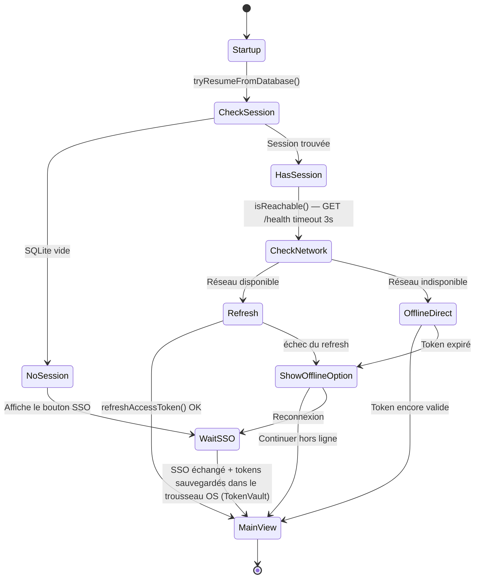
```mermaid
stateDiagram-v2
    [*] --> Startup

    Startup --> CheckSession : tryResumeFromDatabase()

    CheckSession --> NoSession : SQLite vide
    CheckSession --> HasSession : Session trouvée

    NoSession --> WaitSSO : Affiche le bouton SSO

    HasSession --> CheckNetwork : isReachable() — GET /health timeout 3s

    CheckNetwork --> Refresh : Réseau disponible
    CheckNetwork --> OfflineDirect : Réseau indisponible

    Refresh --> MainView : refreshAccessToken() OK
    Refresh --> ShowOfflineOption : échec du refresh

    OfflineDirect --> MainView : Token encore valide
    OfflineDirect --> ShowOfflineOption : Token expiré

    ShowOfflineOption --> MainView : Continuer hors ligne
    ShowOfflineOption --> WaitSSO : Reconnexion

    WaitSSO --> MainView : SSO échangé + tokens sauvegardés dans le trousseau OS (TokenVault)
    MainView --> [*]
```

---

## 14. Système de plugins du bureau Java

### 14.1 Architecture

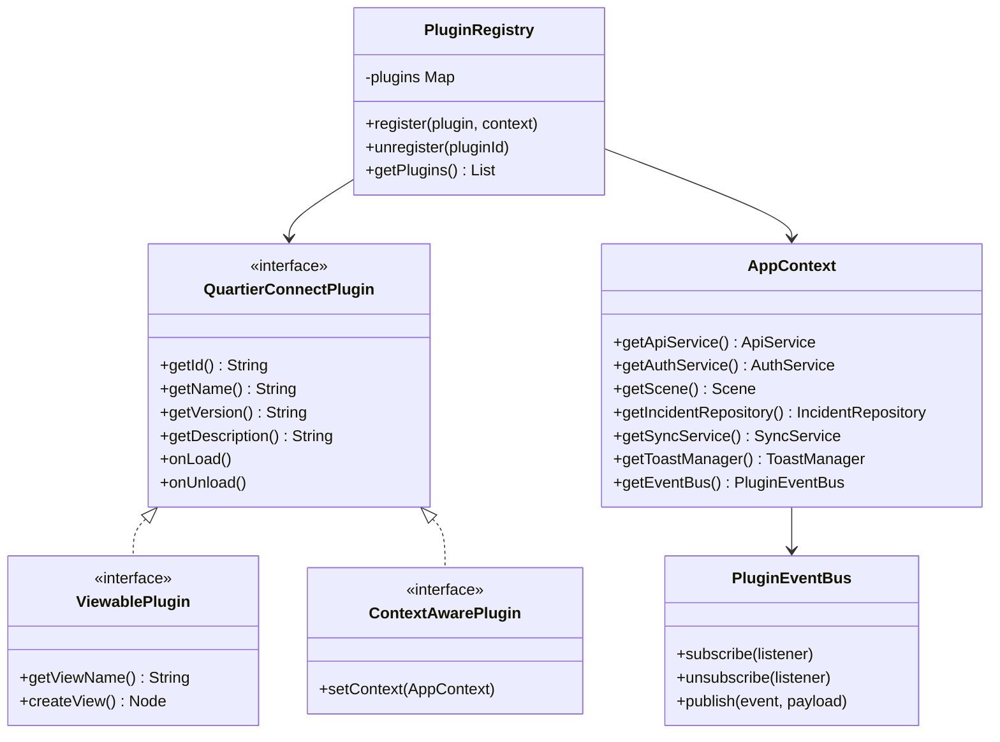
```mermaid
classDiagram
    class QuartierConnectPlugin {
        <<interface>>
        +getId() String
        +getName() String
        +getVersion() String
        +getDescription() String
        +onLoad()
        +onUnload()
    }
    class ViewablePlugin {
        <<interface>>
        +getViewName() String
        +createView() Node
    }
    class ContextAwarePlugin {
        <<interface>>
        +setContext(AppContext)
    }
    class PluginRegistry {
        -plugins Map
        +register(plugin, context)
        +unregister(pluginId)
        +getPlugins() List
    }
    class AppContext {
        +getApiService() ApiService
        +getAuthService() AuthService
        +getScene() Scene
        +getIncidentRepository() IncidentRepository
        +getSyncService() SyncService
        +getToastManager() ToastManager
        +getEventBus() PluginEventBus
    }
    class PluginEventBus {
        +subscribe(listener)
        +unsubscribe(listener)
        +publish(event, payload)
    }
    QuartierConnectPlugin <|.. ViewablePlugin
    QuartierConnectPlugin <|.. ContextAwarePlugin
    PluginRegistry --> QuartierConnectPlugin
    PluginRegistry --> AppContext
    AppContext --> PluginEventBus
```

### 14.2 EventBus — communication inter-plugins

Le `PluginEventBus` implémente un pattern publish/subscribe thread-safe (`CopyOnWriteArrayList`) avec 5 types d'événements :

| Événement | Émetteur | Payload |
|-----------|----------|---------|
| `INCIDENTS_CHANGED` | SyncService, IncidentsView | null |
| `SYNC_STARTED` | SyncService | null |
| `SYNC_COMPLETED` | SyncService | null |
| `SYNC_FAILED` | SyncService | Message d'exception |
| `ONLINE_STATUS_CHANGED` | SyncService | Boolean (en ligne) |

### 14.3 Plugins intégrés

| Plugin | Type | Rôle |
|--------|------|------|
| ThemePlugin | ContextAware | Thèmes CSS (Primer Dark par défaut), appliqués au `onLoad()` |
| CompactModePlugin | ContextAware | Mode UI compact |
| NotificationPlugin | ContextAware | Notifications pilotées par événements via EventBus (plus de polling) |
| ExportPlugin | ContextAware | Export des données d'incidents via AppContext |
| OfflineModePlugin | ContextAware | Bascule hors ligne dans AppTopBar.pluginSlot |

---

## 15. Reconnexion automatique et rafraîchissement automatique du token

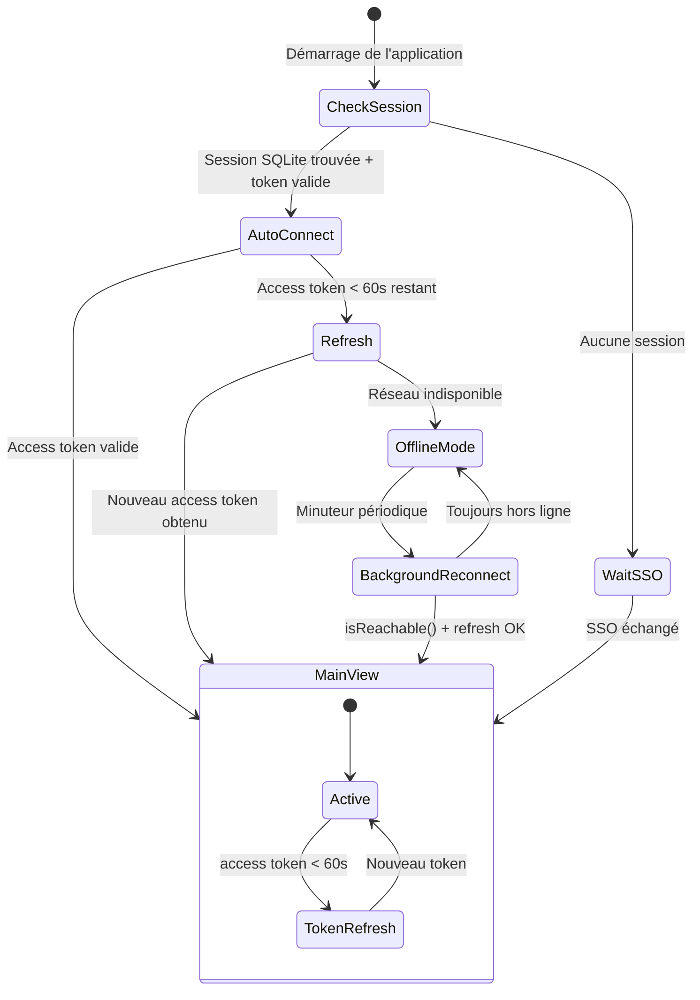
```mermaid
stateDiagram-v2
    [*] --> CheckSession : Démarrage de l'application

    CheckSession --> AutoConnect : Session SQLite trouvée + token valide
    CheckSession --> WaitSSO : Aucune session

    AutoConnect --> Refresh : Access token < 60s restant
    AutoConnect --> MainView : Access token valide

    Refresh --> MainView : Nouveau access token obtenu
    Refresh --> OfflineMode : Réseau indisponible

    OfflineMode --> BackgroundReconnect : Minuteur périodique
    BackgroundReconnect --> MainView : isReachable() + refresh OK
    BackgroundReconnect --> OfflineMode : Toujours hors ligne

    WaitSSO --> MainView : SSO échangé

    state MainView {
        [*] --> Active
        Active --> TokenRefresh : access token < 60s
        TokenRefresh --> Active : Nouveau token
    }
```

Le seuil de 60 secondes pour le renouvellement proactif du token évite les échecs de requêtes API causés par une expiration pendant le traitement.

---

## 16. Sécurité en couches

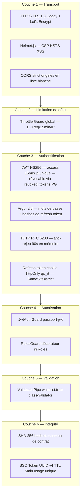
```mermaid
graph TD
    subgraph L1["Couche 1 — Transport"]
        HTTPS[HTTPS TLS 1.3 Caddy + Let's Encrypt]
        HELMET[Helmet.js — CSP HSTS XSS]
        CORS[CORS strict origines en liste blanche]
    end
    subgraph L2["Couche 2 — Limitation de débit"]
        THROTTLE[ThrottlerGuard global — 100 req/15min/IP]
    end
    subgraph L3["Couche 3 — Authentification"]
        JWT[JWT HS256 — access 15min jti unique — révocable via revoked_tokens PG]
        ARGON2[Argon2id — mots de passe + hashes de refresh token]
        TOTP[TOTP RFC 6238 — anti-rejeu 90s en mémoire]
        COOKIE[Refresh token cookie httpOnly qc_rt — SameSite=strict]
    end
    subgraph L4["Couche 4 — Autorisation"]
        JWTG[JwtAuthGuard passport-jwt]
        ROLESG[RolesGuard décorateur @Roles]
    end
    subgraph L5["Couche 5 — Validation"]
        PIPE[ValidationPipe whitelist:true class-validator]
    end
    subgraph L6["Couche 6 — Intégrité"]
        SHA[SHA-256 hash du contenu de contrat]
        SSO2[SSO Token UUID v4 TTL 5min usage unique]
    end

    L1 --> L2 --> L3 --> L4 --> L5 --> L6
```

---

## 17. Cycle de vie d'une requête

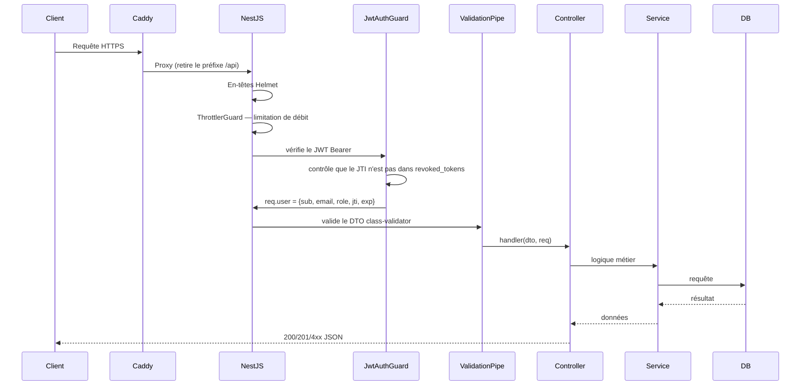
```mermaid
sequenceDiagram
    participant Client
    participant Caddy
    participant NestJS
    participant Guard as JwtAuthGuard
    participant Pipe as ValidationPipe
    participant Controller
    participant Service
    participant DB

    Client->>Caddy: Requête HTTPS
    Caddy->>NestJS: Proxy (retire le préfixe /api)
    NestJS->>NestJS: En-têtes Helmet
    NestJS->>NestJS: ThrottlerGuard — limitation de débit
    NestJS->>Guard: vérifie le JWT Bearer
    Guard->>Guard: contrôle que le JTI n'est pas dans revoked_tokens
    Guard->>NestJS: req.user = {sub, email, role, jti, exp}
    NestJS->>Pipe: valide le DTO class-validator
    Pipe->>Controller: handler(dto, req)
    Controller->>Service: logique métier
    Service->>DB: requête
    DB-->>Service: résultat
    Service-->>Controller: données
    Controller-->>Client: 200/201/4xx JSON
```

---

## 18. Cartographie partagée — composant `<Map>`

`packages/ui/src/components/map.tsx` expose un wrapper React déclaratif autour de
`react-leaflet@5`, utilisé sur 6 surfaces (4 client + 2 admin) plus le refactor
`admin/neighborhoods`. Exports : `Map`, `Marker` (4 variantes mappées sur la palette
Civic Editorial), `NeighborhoodPolygon`, `MarkerCluster`, `DrawControl` (leaflet-draw),
`UserLocation`, `useFitBounds`.

| Surface | Usage |
|---|---|
| `client/dashboard` | Mini-carte du quartier (h-48) avec géolocalisation de l'utilisateur |
| `client/services` | Pins de services regroupés (MarkerCluster) + popup |
| `client/events` | Onglet « Carte » : pins d'événements + date |
| `client/incidents` | Placement au clic dans le dialogue + carte des incidents |
| `admin/services` | Onglet liste/carte + sélecteur dans le dialogue |
| `admin/incidents` | Onglet liste/carte avec pins colorés par statut |
| `admin/neighborhoods` | Dessin de polygones via `<DrawControl>` (leaflet-draw) |

**Helpers géo** : `packages/shared/src/lib/geo.ts` expose `centroidOf`,
`pointToLatLng`, `latLngToPoint` (3 tests Vitest).

**Schéma backend** : sous-document GeoJSON Point réutilisable
`api/src/common/schemas/geo-point.schema.ts`. Services et Events utilisent ce
sous-schéma Mongoose avec un index `2dsphere` (sparse) ; les Incidents Postgres
stockent simplement `lat REAL` + `lng REAL` (migration
`0002_incident_coords.sql`).

## 19. Architecture de déploiement en production

> Section ajoutée pour la livraison DevOps. Décrit l'infrastructure de production réelle sur le VPS, distincte de l'environnement de développement local.

### 19.1 Vue réseau de production

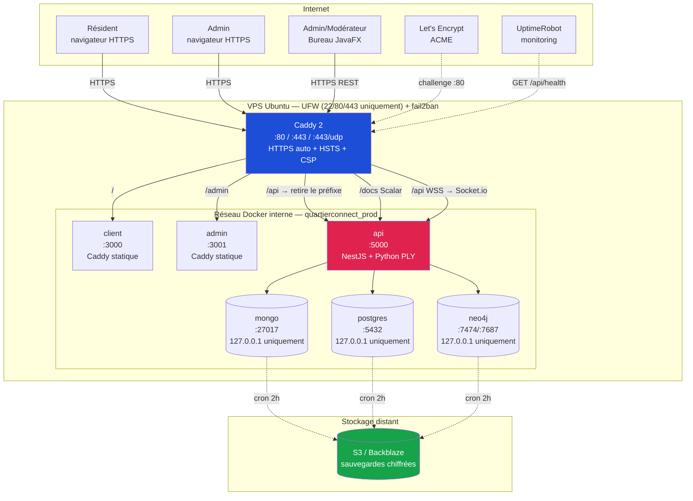
```mermaid
graph TB
    subgraph Internet
        U1[Résident<br/>navigateur HTTPS]
        U2[Admin<br/>navigateur HTTPS]
        U3[Admin/Modérateur<br/>Bureau JavaFX]
        LE[Let's Encrypt<br/>ACME]
        UR[UptimeRobot<br/>monitoring]
    end

    subgraph VPS["VPS Ubuntu — UFW (22/80/443 uniquement) + fail2ban"]
        CADDY["Caddy 2<br/>:80 / :443 / :443/udp<br/>HTTPS auto + HSTS + CSP"]

        subgraph DockerNet["Réseau Docker interne — quartierconnect_prod"]
            CLIENT["client<br/>:3000<br/>Caddy statique"]
            ADMIN["admin<br/>:3001<br/>Caddy statique"]
            API["api<br/>:5000<br/>NestJS + Python PLY"]

            MONGO[("mongo<br/>:27017<br/>127.0.0.1 uniquement")]
            PG[("postgres<br/>:5432<br/>127.0.0.1 uniquement")]
            NEO[("neo4j<br/>:7474/:7687<br/>127.0.0.1 uniquement")]
        end
    end

    subgraph Cloud["Stockage distant"]
        S3[("S3 / Backblaze<br/>sauvegardes chiffrées")]
    end

    U1 -->|HTTPS| CADDY
    U2 -->|HTTPS| CADDY
    U3 -->|HTTPS REST| CADDY
    LE -.->|challenge :80| CADDY
    UR -.->|GET /api/health| CADDY

    CADDY -->|"/"| CLIENT
    CADDY -->|"/admin"| ADMIN
    CADDY -->|"/api → retire le préfixe"| API
    CADDY -->|"/docs Scalar"| API
    CADDY -->|"/api WSS → Socket.io"| API

    API --> MONGO
    API --> PG
    API --> NEO

    MONGO -.->|cron 2h| S3
    PG -.->|cron 2h| S3
    NEO -.->|cron 2h| S3

    style CADDY fill:#1D4ED8,color:#fff
    style API fill:#E0234E,color:#fff
    style S3 fill:#16a34a,color:#fff
```

**Points clés de sécurité réseau :**

- Seuls les ports **22, 80, 443** sont exposés à Internet (UFW)
- Les trois bases de données sont liées à `127.0.0.1` → accessibles uniquement via le réseau Docker interne, jamais depuis l'extérieur
- Caddy est le **seul** point d'entrée HTTP/HTTPS — il termine le TLS et fait le proxy en interne
- Le WebSocket (messagerie Socket.io) passe par le même `/api` avec une bascule `wss://`
- La **seule** dépendance sortante est le conteneur `api` appelant le point d'accès HTTPS externe Nominatim (OpenStreetMap) pour le géocodage d'adresses ; toutes les bases de données restent internes

### 19.2 Flux CI/CD

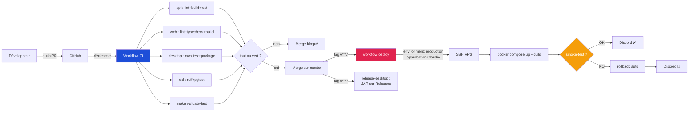
```mermaid
graph LR
    DEV[Développeur] -->|push PR| GH[GitHub]
    GH -->|déclenche| CI[Workflow CI]

    CI --> J1[api : lint+build+test]
    CI --> J2[web : lint+typecheck+build]
    CI --> J3[desktop : mvn test+package]
    CI --> J4[dsl : ruff+pytest]
    CI --> J5[make validate-fast]

    J1 & J2 & J3 & J4 & J5 --> OK{tout au vert ?}
    OK -->|non| BLOCK[Merge bloqué]
    OK -->|oui| MERGE[Merge sur master]

    MERGE -->|tag v*.*.*| DEPLOY[workflow deploy]
    MERGE -->|tag v*.*.*| REL[release-desktop :<br/>JAR sur Releases]

    DEPLOY -->|environment: production<br/>approbation Claudio| SSH[SSH VPS]
    SSH --> BUILD[docker compose up --build]
    BUILD --> SMOKE{smoke-test ?}
    SMOKE -->|OK| DISCORD1[Discord ✅]
    SMOKE -->|KO| RB[rollback auto]
    RB --> DISCORD2[Discord 🔴]

    style CI fill:#1D4ED8,color:#fff
    style DEPLOY fill:#E0234E,color:#fff
    style SMOKE fill:#f59e0b,color:#fff
```

### 19.3 Conteneurs production vs développement

| Aspect           | Dev (`docker-compose.yml`) | Prod (`+ docker-compose.prod.yml`)         |
| ---------------- | -------------------------- | ------------------------------------------ |
| Caddy            | HTTP `:80`, Caddyfile dev  | HTTPS `:443` Let's Encrypt, Caddyfile.prod |
| `restart`        | non                        | `unless-stopped` partout                   |
| Healthchecks     | partiels                   | api + mongo + postgres + neo4j + caddy     |
| `depends_on`     | basique                    | `condition: service_healthy`               |
| Limites de ressources | aucune                | mémoire + CPU plafonnées                   |
| Heap Neo4j       | par défaut (~4G)           | plafonné à 1G                              |
| Limite de débit login | 100 (dev)             | 5 (prod)                                   |
| CORS             | localhost                  | `https://quartierconnect.fr` uniquement    |
| Réseau           | par défaut                 | nommé `quartierconnect_prod`               |
| Logs Caddy       | stdout                     | fichier JSON + rotation 100MB/10           |

### 19.4 Stratégie de sauvegarde

```mermaid
graph TB
    CRON["cron VPS<br/>2h du matin"] --> ALL[backup-all.sh]

    ALL --> M[backup-mongo.sh<br/>mongodump --gzip]
    ALL --> P[backup-postgres.sh<br/>pg_dumpall gzip]
    ALL --> N[backup-neo4j.sh<br/>cold dump ~30s]
    ALL --> C{Lundi ?}
    C -->|oui| CD[Caddy certs tar.gz]

    M & P & N & CD --> LOCAL["/var/backups<br/>rétention 7 jours"]
    LOCAL --> REMOTE["S3/Backblaze<br/>7j + 4 semaines + 12 mois"]

    ALL -->|échec| DISC[Discord 🔴]

    style ALL fill:#16a34a,color:#fff
    style REMOTE fill:#1D4ED8,color:#fff
```
