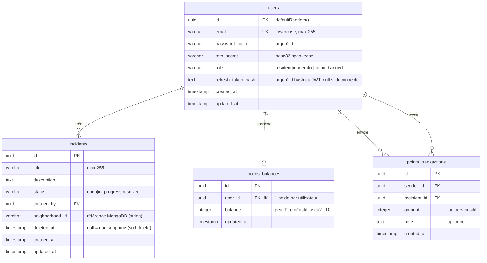
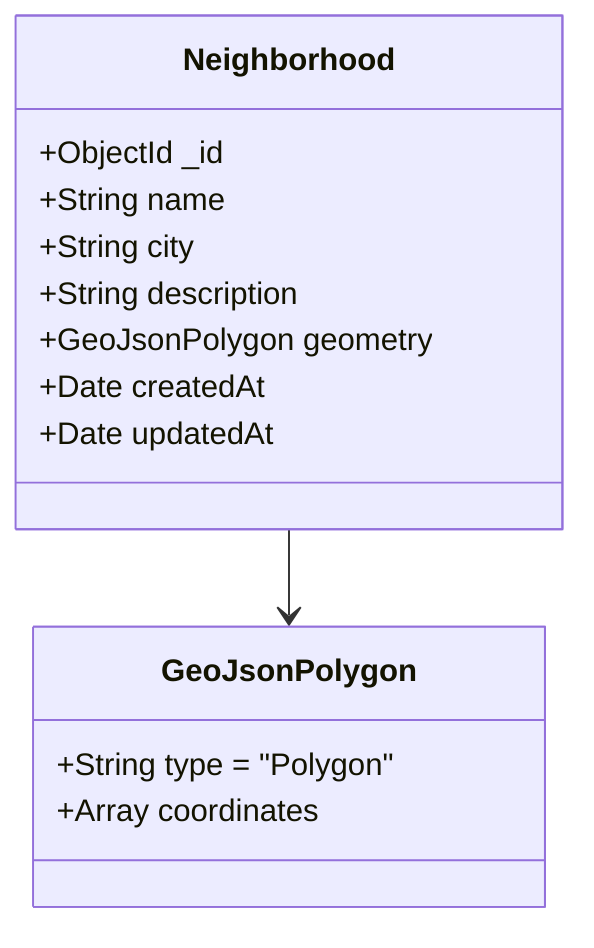
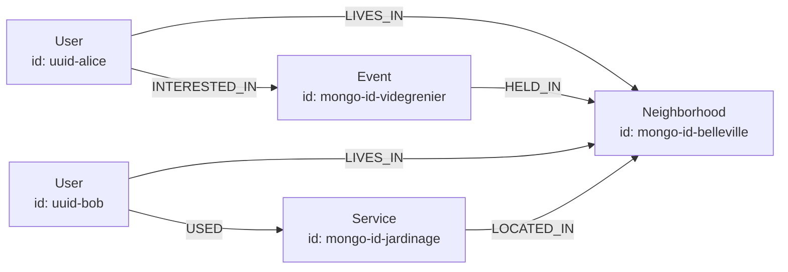

# Schémas des bases de données — QuartierConnect

> **Version** 0.1.3 · **Date** 7 avril 2026

QuartierConnect utilise trois bases de données complémentaires selon leurs forces respectives.

---

## Table des matières

1. [PostgreSQL — Données relationnelles ACID](#1-postgresql--données-relationnelles-acid)
2. [MongoDB — Documents flexibles](#2-mongodb--documents-flexibles)
3. [Neo4j — Graphe social](#3-neo4j--graphe-social)
4. [SQLite — Cache local desktop](#4-sqlite--cache-local-desktop)
5. [Règles d'utilisation par base](#5-règles-dutilisation-par-base)

---

## 1. PostgreSQL — Données relationnelles ACID

ORM : **Drizzle ORM** (TypeScript) avec migrations auto.

### 1.1 Diagramme ERD



### 1.2 Table `users`

```sql
CREATE TABLE users (
    id               UUID PRIMARY KEY DEFAULT gen_random_uuid(),
    email            VARCHAR(255) NOT NULL UNIQUE,
    password_hash    VARCHAR(255) NOT NULL,  -- argon2id
    totp_secret      VARCHAR(255) NOT NULL,  -- base32 RFC 6238
    role             VARCHAR(50)  NOT NULL DEFAULT 'resident',
    refresh_token_hash TEXT,                  -- null = déconnecté
    created_at       TIMESTAMP NOT NULL DEFAULT NOW(),
    updated_at       TIMESTAMP NOT NULL DEFAULT NOW()
);
```

**Règles métier :**
- Email stocké en minuscule (normalisé à l'insertion)
- `password_hash` : Argon2id — jamais bcrypt
- `refresh_token_hash` : hash argon2 du JWT refresh (rotation stricte)
- `role` : machine d'états `resident → moderator → admin` ; `banned` terminal

### 1.3 Table `incidents`

```sql
CREATE TABLE incidents (
    id               UUID PRIMARY KEY DEFAULT gen_random_uuid(),
    title            VARCHAR(255) NOT NULL,
    description      TEXT NOT NULL,
    status           VARCHAR(50) NOT NULL DEFAULT 'open',
    created_by       UUID NOT NULL REFERENCES users(id),
    neighborhood_id  VARCHAR(255),  -- ID MongoDB (string)
    deleted_at       TIMESTAMP,     -- NULL = actif
    created_at       TIMESTAMP NOT NULL DEFAULT NOW(),
    updated_at       TIMESTAMP NOT NULL DEFAULT NOW(),
    INDEX incidents_status_idx (status),
    INDEX incidents_deleted_at_idx (deleted_at)
);
```

**Machine d'états :**
```
open → in_progress → resolved
       (irréversible, transitions validées côté API)
```

**Soft delete :** `deleted_at IS NOT NULL` = supprimé logiquement.

### 1.4 Tables `points_balances` et `points_transactions`

```sql
CREATE TABLE points_balances (
    id          UUID PRIMARY KEY DEFAULT gen_random_uuid(),
    user_id     UUID NOT NULL UNIQUE REFERENCES users(id),
    balance     INTEGER NOT NULL DEFAULT 0,  -- min -10 validé en code
    updated_at  TIMESTAMP NOT NULL DEFAULT NOW()
);

CREATE TABLE points_transactions (
    id           UUID PRIMARY KEY DEFAULT gen_random_uuid(),
    sender_id    UUID NOT NULL REFERENCES users(id),
    recipient_id UUID NOT NULL REFERENCES users(id),
    amount       INTEGER NOT NULL,     -- toujours > 0
    note         TEXT,
    created_at   TIMESTAMP NOT NULL DEFAULT NOW(),
    INDEX points_tx_sender_idx (sender_id)
);
```

**Transaction ACID (PointsService) :**

```sql
-- Exécuté dans une transaction PostgreSQL
SELECT id, balance FROM points_balances WHERE user_id = $senderId FOR UPDATE;
-- Vérification balance >= amount - 10
INSERT INTO points_balances (user_id, balance) VALUES ($sender, balance - amount)
  ON CONFLICT (user_id) DO UPDATE SET balance = points_balances.balance - $amount;
INSERT INTO points_balances (user_id, balance) VALUES ($recipient, amount)
  ON CONFLICT (user_id) DO UPDATE SET balance = points_balances.balance + $amount;
INSERT INTO points_transactions (sender_id, recipient_id, amount, note) VALUES (...);
```

---

## 2. MongoDB — Documents flexibles

ODM : **Mongoose** (NestJS MongooseModule).

### 2.0 Vue d'ensemble — 9 collections

```mermaid
erDiagram
    neighborhoods {
        ObjectId _id PK
        String name
        String city
        String description
        Object geometry "GeoJSON Polygon - index 2dsphere"
        Date createdAt
        Date updatedAt
    }
    services {
        ObjectId _id PK
        String title
        String description
        String category
        String type "free - paid - exchange"
        String createdBy "UUID PostgreSQL"
        ObjectId neighborhoodId FK
        Date createdAt
        Date updatedAt
    }
    events {
        ObjectId _id PK
        String title
        String description
        String category
        Date date
        String createdBy "UUID PostgreSQL"
        ObjectId neighborhoodId FK
        Array interestedUserIds "addToSet idempotent"
        Date createdAt
        Date updatedAt
    }
    contracts {
        ObjectId _id PK
        String title
        String content
        String contentHash "SHA-256 du contenu"
        String createdBy "UUID PostgreSQL"
        Array signatories "UUIDs PostgreSQL"
        String status "draft - pending_signature - signed"
        Array signatures "userId - signedAt - hash SHA-256"
        Date createdAt
    }
    conversations {
        ObjectId _id PK
        Array participants "UUIDs PostgreSQL"
        Object lastMessage "content - sentAt"
        Date createdAt
    }
    messages {
        ObjectId _id PK
        ObjectId conversationId FK
        String senderId "UUID PostgreSQL"
        String content
        String type "text - image - file"
        String mediaUrl
        Array readBy
        Date createdAt
    }
    votes {
        ObjectId _id PK
        String userId "UUID PostgreSQL"
        ObjectId targetId
        String targetType "service - incident"
        String voteType "up - down - like - dislike"
        Date createdAt
    }
    communityVotes {
        ObjectId _id PK
        String title
        String voteType "binary - single_choice - multiple_choice - weighted"
        Array options "id - label"
        Date endsAt
        Int quorum
        Boolean isAnonymous
        String status "open - closed"
        String createdBy "UUID PostgreSQL"
        Array casts "userId - choices - weights - castAt"
        Date createdAt
    }
    documents {
        ObjectId _id PK
        String filename
        String mimeType
        Int size
        ObjectId gridfsId "binaire GridFS"
        String uploadedBy "UUID PostgreSQL"
        String category
        Array auditLog "action - userId - timestamp"
        Date createdAt
    }
    ssoTokens {
        ObjectId _id PK
        String userId "UUID PostgreSQL"
        String token "UUID v4"
        String surface "desktop"
        String state "UUID v4 PKCE"
        Date expiresAt "TTL index 300s"
        Date usedAt "null = non consomme"
    }

    neighborhoods ||--o{ services : "neighborhoodId"
    neighborhoods ||--o{ events : "neighborhoodId"
    conversations ||--o{ messages : "conversationId"
```



### 2.1 Collection `neighborhoods`



```javascript
{
  _id: ObjectId,
  name: "Belleville",
  city: "Paris",
  description: "Quartier populaire du 20e arr.",
  geometry: {
    type: "Polygon",
    coordinates: [[[2.385, 48.867], [2.392, 48.870], ...]]
  },
  createdAt: ISODate,
  updatedAt: ISODate
}
```

**Index spécial :** `geometry` → index `2dsphere` pour `$geoIntersects` (détection chevauchements).

### 2.2 Collection `services`

```javascript
{
  _id: ObjectId,
  title: "Aide au jardinage",
  description: "Disponible les week-ends",
  category: "gardening",
  type: "free",          // "free" | "paid" | "exchange"
  createdBy: "uuid-pg",  // UUID PostgreSQL user
  neighborhoodId: ObjectId,
  createdAt: ISODate,
  updatedAt: ISODate
}
```

### 2.3 Collection `events`

```javascript
{
  _id: ObjectId,
  title: "Vide-grenier annuel",
  description: "Grand marché communautaire",
  category: "community",
  date: ISODate,
  createdBy: "uuid-pg",
  neighborhoodId: ObjectId,
  interestedUserIds: ["uuid1", "uuid2"],   // $addToSet idempotent
  createdAt: ISODate,
  updatedAt: ISODate
}
```

### 2.4 Collection `contracts`

```javascript
{
  _id: ObjectId,
  title: "Bail de location cave",
  content: "Texte complet du contrat...",
  contentHash: "sha256hex",   // SHA-256 du contenu au moment de la création
  createdBy: "uuid-pg",
  signatories: ["uuid1", "uuid2"],
  status: "draft",            // "draft" | "pending_signature" | "signed"
  signedAt: ISODate,
  signatures: [
    {
      userId: "uuid1",
      signedAt: ISODate,
      hash: "sha256(content + userId + signedAt)"  // preuve d'intégrité
    }
  ],
  createdAt: ISODate
}
```

**Workflow de signature :**
```
draft → pending_signature (premier signataire) → signed (tous signent)
```

### 2.5 Collection `conversations` et `messages`

```javascript
// conversations
{
  _id: ObjectId,
  participants: ["uuid1", "uuid2"],
  lastMessage: { content: "...", sentAt: ISODate },
  createdAt: ISODate
}

// messages
{
  _id: ObjectId,
  conversationId: ObjectId,
  senderId: "uuid-pg",
  content: "Bonjour !",
  type: "text",    // "text" | "image" | "file"
  mediaUrl: null,
  readBy: ["uuid1"],
  createdAt: ISODate
}
```

### 2.6 Collection `votes`

```javascript
{
  _id: ObjectId,
  userId: "uuid-pg",
  targetId: ObjectId,
  targetType: "service",   // "service" | "incident"
  voteType: "up",          // "up"/"down" ou "like"/"dislike" selon targetType
  createdAt: ISODate
}
```

**Index unique :** `{ userId, targetId, targetType }` → 1 vote par utilisateur par entité.

### 2.7 Collection `communityVotes`

```javascript
{
  _id: ObjectId,
  title: "Choix jour réunion mensuelle",
  description: "Voter pour la date",
  voteType: "single_choice",  // "binary"|"single_choice"|"multiple_choice"|"weighted"
  options: [
    { id: "opt-1", label: "Lundi 14 avril" },
    { id: "opt-2", label: "Mardi 15 avril" }
  ],
  endsAt: ISODate,
  quorum: 10,          // 0 = pas de quorum
  isAnonymous: false,
  status: "open",      // "open" | "closed"
  createdBy: "uuid-pg",
  casts: [
    {
      userId: "uuid1",
      choices: ["opt-1"],
      weights: null,    // rempli pour voteType "weighted"
      castAt: ISODate
    }
  ],
  createdAt: ISODate
}
```

### 2.8 Collection `documents` (métadonnées GridFS)

```javascript
{
  _id: ObjectId,
  filename: "bail-2026.pdf",
  originalName: "bail-2026.pdf",
  mimeType: "application/pdf",
  size: 124300,
  gridfsId: ObjectId,   // référence au fichier binaire GridFS
  uploadedBy: "uuid-pg",
  category: "contract",
  auditLog: [
    { action: "upload", userId: "uuid1", timestamp: ISODate },
    { action: "download", userId: "uuid2", timestamp: ISODate }
  ],
  createdAt: ISODate
}
```

### 2.9 Collection `ssoTokens`

```javascript
{
  _id: ObjectId,
  userId: "uuid-pg",
  token: "UUID-v4",       // secret partagé web ↔ desktop
  surface: "desktop",
  state: "UUID-v4",       // PKCE — state parameter
  expiresAt: ISODate,     // TTL index MongoDB — auto-expiration
  usedAt: null            // non-null = token consommé
}
```

**Index TTL :** `expiresAt` → 300 secondes. Les documents expirés sont supprimés automatiquement.

---

## 3. Neo4j — Graphe social

### 3.1 Modèle de graphe



### 3.2 Labels et propriétés

| Label          | Propriétés                                                | Origine           |
| -------------- | --------------------------------------------------------- | ----------------- |
| `User`         | `id` (UUID PostgreSQL), `createdAt`, `updatedAt`          | Sync sur register |
| `Neighborhood` | `id` (ObjectId MongoDB), `name`, `createdAt`, `updatedAt` | Sync CRUD         |
| `Service`      | `id`, `name`, `createdAt`, `updatedAt`                    | Sync CRUD         |
| `Event`        | `id`, `name`, `date`, `createdAt`, `updatedAt`            | Sync CRUD         |

### 3.3 Relations

| Relation        | De      | Vers         | Créée quand                 |
| --------------- | ------- | ------------ | --------------------------- |
| `LIVES_IN`      | User    | Neighborhood | Mise à jour profil          |
| `LOCATED_IN`    | Service | Neighborhood | Création service            |
| `HELD_IN`       | Event   | Neighborhood | Création événement          |
| `INTERESTED_IN` | User    | Event        | `POST /events/:id/interest` |
| `USED`          | User    | Service      | Futur : appel de service    |

### 3.4 Requête de recommandation (Cypher)

```cypher
-- Services du même quartier non encore utilisés
MATCH (u:User {id: $userId})-[:LIVES_IN]->(n:Neighborhood)
OPTIONAL MATCH (n)<-[:LOCATED_IN]-(s:Service)
WHERE NOT (u)-[:USED]->(s)
RETURN s.id AS id, s.name AS name, 'service' AS type, 3 AS score,
       'Service in your neighborhood' AS reason

UNION

-- Événements à venir dans le même quartier
MATCH (u:User {id: $userId})-[:LIVES_IN]->(n:Neighborhood)
OPTIONAL MATCH (n)<-[:HELD_IN]-(e:Event)
WHERE NOT (u)-[:ATTENDING]->(e) AND e.date > datetime()
RETURN e.id AS id, e.name AS name, 'event' AS type, 2 AS score,
       'Upcoming event near you' AS reason

ORDER BY score DESC LIMIT 10
```

---

## 4. SQLite — Cache local desktop

Fichier : `quartierconnect.db` (répertoire courant de la JVM).

### 4.1 Schéma complet

```sql
-- Incidents locaux (sync bidirectionnelle)
CREATE TABLE IF NOT EXISTS incidents (
    id          INTEGER PRIMARY KEY AUTOINCREMENT,
    remote_id   TEXT,       -- UUID PostgreSQL après sync
    title       TEXT    NOT NULL,
    description TEXT,
    status      TEXT    NOT NULL DEFAULT 'open',
    is_dirty    INTEGER NOT NULL DEFAULT 1,  -- 1 = en attente de sync
    created_at  TEXT    NOT NULL,
    updated_at  TEXT    NOT NULL             -- LWW timestamp
);

-- Journal de synchronisation
CREATE TABLE IF NOT EXISTS sync_log (
    id         INTEGER PRIMARY KEY AUTOINCREMENT,
    synced_at  TEXT    NOT NULL,
    success    INTEGER NOT NULL  -- 0/1
);

-- Session persistante (upsert sur id=1)
CREATE TABLE IF NOT EXISTS session (
    id            INTEGER PRIMARY KEY,   -- toujours 1
    email         TEXT NOT NULL,         -- affiché en mode hors-ligne
    access_token  TEXT,                  -- JWT (peut être expiré)
    refresh_token TEXT,                  -- JWT refresh
    saved_at      TEXT NOT NULL          -- ISO-8601
);
```

### 4.2 Algorithme LWW (Last-Write-Wins)

```
Si remote_id connu :
  Si api.updated_at > local.updated_at → API gagne → mettre à jour SQLite
  Si local.updated_at > api.updated_at → Local gagne → pousser vers API
Sinon (nouvel incident local) :
  Créer dans API → récupérer remote_id → mettre à jour SQLite
```

---

## 5. Règles d'utilisation par base

| Règle                                             | Détail                                                 |
| ------------------------------------------------- | ------------------------------------------------------ |
| **Jamais de transaction MongoDB pour les points** | PostgreSQL ACID obligatoire                            |
| **Jamais de données auth dans MongoDB**           | Sécurité — seul PostgreSQL pour users                  |
| **Neo4j = lecture uniquement côté API**           | Écriture via socialService fire-and-forget uniquement  |
| **SQLite = cache local uniquement**               | Jamais de source de vérité — l'API PostgreSQL fait foi |
| **GridFS = binaires uniquement**                  | Métadonnées dans la collection `documents` MongoDB     |
