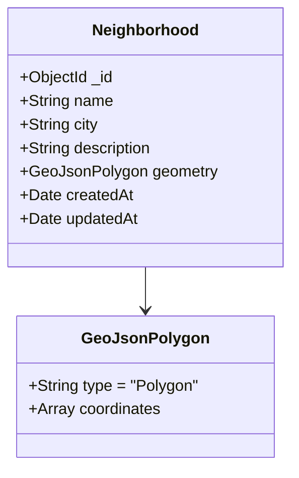

# Database schemas — QuartierConnect

> **Version** 0.1.3 · **Date** 7 April 2026

QuartierConnect uses three complementary databases, each chosen for its respective strengths.

---

## Table of contents

1. [PostgreSQL — ACID relational data](#1-postgresql--acid-relational-data)
2. [MongoDB — Flexible documents](#2-mongodb--flexible-documents)
3. [Neo4j — Social graph](#3-neo4j--social-graph)
4. [SQLite — Local desktop cache](#4-sqlite--local-desktop-cache)
5. [Per-database usage rules](#5-per-database-usage-rules)

---

## 1. PostgreSQL — ACID relational data

ORM: **Drizzle ORM** (TypeScript) with automatic migrations.

### 1.1 ERD diagram

```mermaid
erDiagram
    users {
        uuid id PK "defaultRandom()"
        varchar email UK "lowercase, max 255"
        varchar password_hash "argon2id"
        varchar totp_secret "base32 speakeasy"
        varchar role "resident|moderator|admin|banned"
        text refresh_token_hash "argon2id hash of the JWT, null if logged out"
        timestamp created_at
        timestamp updated_at
    }

    incidents {
        uuid id PK
        varchar title "max 255"
        text description
        varchar status "open|in_progress|resolved"
        uuid created_by FK
        varchar neighborhood_id "MongoDB reference (string)"
        timestamp deleted_at "null = not deleted (soft delete)"
        timestamp created_at
        timestamp updated_at
    }

    points_balances {
        uuid id PK
        uuid user_id FK UK "1 balance per user"
        integer balance "can be negative down to -10"
        timestamp updated_at
    }

    points_transactions {
        uuid id PK
        uuid sender_id FK
        uuid recipient_id FK
        integer amount "always positive"
        text note "optional"
        timestamp created_at
    }

    users ||--o{ incidents : "creates"
    users ||--o| points_balances : "owns"
    users ||--o{ points_transactions : "sends"
    users ||--o{ points_transactions : "receives"
```

### 1.2 Table `users`

```sql
CREATE TABLE users (
    id               UUID PRIMARY KEY DEFAULT gen_random_uuid(),
    email            VARCHAR(255) NOT NULL UNIQUE,
    password_hash    VARCHAR(255) NOT NULL,  -- argon2id
    totp_secret      VARCHAR(255) NOT NULL,  -- base32 RFC 6238
    role             VARCHAR(50)  NOT NULL DEFAULT 'resident',
    refresh_token_hash TEXT,                  -- null = logged out
    created_at       TIMESTAMP NOT NULL DEFAULT NOW(),
    updated_at       TIMESTAMP NOT NULL DEFAULT NOW()
);
```

**Business rules:**
- Email stored in lowercase (normalized on insert)
- `password_hash`: Argon2id — never bcrypt
- `refresh_token_hash`: argon2 hash of the refresh JWT (strict rotation)
- `role`: state machine `resident → moderator → admin`; `banned` is terminal

### 1.3 Table `incidents`

```sql
CREATE TABLE incidents (
    id               UUID PRIMARY KEY DEFAULT gen_random_uuid(),
    title            VARCHAR(255) NOT NULL,
    description      TEXT NOT NULL,
    status           VARCHAR(50) NOT NULL DEFAULT 'open',
    created_by       UUID NOT NULL REFERENCES users(id),
    neighborhood_id  VARCHAR(255),  -- MongoDB ID (string)
    deleted_at       TIMESTAMP,     -- NULL = active
    created_at       TIMESTAMP NOT NULL DEFAULT NOW(),
    updated_at       TIMESTAMP NOT NULL DEFAULT NOW(),
    INDEX incidents_status_idx (status),
    INDEX incidents_deleted_at_idx (deleted_at)
);
```

**State machine:**
```
open → in_progress → resolved
       (irreversible, transitions validated on the API side)
```

**Soft delete:** `deleted_at IS NOT NULL` = logically deleted.

### 1.4 Tables `points_balances` and `points_transactions`

```sql
CREATE TABLE points_balances (
    id          UUID PRIMARY KEY DEFAULT gen_random_uuid(),
    user_id     UUID NOT NULL UNIQUE REFERENCES users(id),
    balance     INTEGER NOT NULL DEFAULT 0,  -- min -10 enforced in code
    updated_at  TIMESTAMP NOT NULL DEFAULT NOW()
);

CREATE TABLE points_transactions (
    id           UUID PRIMARY KEY DEFAULT gen_random_uuid(),
    sender_id    UUID NOT NULL REFERENCES users(id),
    recipient_id UUID NOT NULL REFERENCES users(id),
    amount       INTEGER NOT NULL,     -- always > 0
    note         TEXT,
    created_at   TIMESTAMP NOT NULL DEFAULT NOW(),
    INDEX points_tx_sender_idx (sender_id)
);
```

**ACID transaction (PointsService):**

```sql
-- Executed inside a PostgreSQL transaction
SELECT id, balance FROM points_balances WHERE user_id = $senderId FOR UPDATE;
-- Check balance >= amount - 10
INSERT INTO points_balances (user_id, balance) VALUES ($sender, balance - amount)
  ON CONFLICT (user_id) DO UPDATE SET balance = points_balances.balance - $amount;
INSERT INTO points_balances (user_id, balance) VALUES ($recipient, amount)
  ON CONFLICT (user_id) DO UPDATE SET balance = points_balances.balance + $amount;
INSERT INTO points_transactions (sender_id, recipient_id, amount, note) VALUES (...);
```

---

## 2. MongoDB — Flexible documents

ODM: **Mongoose** (NestJS MongooseModule).

### 2.0 Overview — 9 collections

```mermaid
erDiagram
    neighborhoods {
        ObjectId _id PK
        String name
        String city
        String description
        Object geometry "GeoJSON Polygon - 2dsphere index"
        Date createdAt
        Date updatedAt
    }
    services {
        ObjectId _id PK
        String title
        String description
        String category
        String type "free - paid - exchange"
        String createdBy "PostgreSQL UUID"
        ObjectId neighborhoodId FK
        Date createdAt
        Date updatedAt
    }
    events {
        ObjectId _id PK
        String title
        String description
        String category
        Date date
        String createdBy "PostgreSQL UUID"
        ObjectId neighborhoodId FK
        Array interestedUserIds "addToSet idempotent"
        Date createdAt
        Date updatedAt
    }
    contracts {
        ObjectId _id PK
        String title
        String content
        String contentHash "SHA-256 of the content"
        String createdBy "PostgreSQL UUID"
        Array signatories "PostgreSQL UUIDs"
        String status "draft - pending_signature - signed"
        Array signatures "userId - signedAt - SHA-256 hash"
        Date createdAt
    }
    conversations {
        ObjectId _id PK
        Array participants "PostgreSQL UUIDs"
        Object lastMessage "content - sentAt"
        Date createdAt
    }
    messages {
        ObjectId _id PK
        ObjectId conversationId FK
        String senderId "PostgreSQL UUID"
        String content
        String type "text - image - file"
        String mediaUrl
        Array readBy
        Date createdAt
    }
    votes {
        ObjectId _id PK
        String userId "PostgreSQL UUID"
        ObjectId targetId
        String targetType "service - incident"
        String voteType "up - down - like - dislike"
        Date createdAt
    }
    communityVotes {
        ObjectId _id PK
        String title
        String voteType "binary - single_choice - multiple_choice - weighted"
        Array options "id - label"
        Date endsAt
        Int quorum
        Boolean isAnonymous
        String status "open - closed"
        String createdBy "PostgreSQL UUID"
        Array casts "userId - choices - weights - castAt"
        Date createdAt
    }
    documents {
        ObjectId _id PK
        String filename
        String mimeType
        Int size
        ObjectId gridfsId "GridFS binary"
        String uploadedBy "PostgreSQL UUID"
        String category
        Array auditLog "action - userId - timestamp"
        Date createdAt
    }
    ssoTokens {
        ObjectId _id PK
        String userId "PostgreSQL UUID"
        String token "UUID v4"
        String surface "desktop"
        String state "UUID v4 PKCE"
        Date expiresAt "TTL index 300s"
        Date usedAt "null = not consumed"
    }

    neighborhoods ||--o{ services : "neighborhoodId"
    neighborhoods ||--o{ events : "neighborhoodId"
    conversations ||--o{ messages : "conversationId"
```



### 2.1 Collection `neighborhoods`



```javascript
{
  _id: ObjectId,
  name: "Belleville",
  city: "Paris",
  description: "Working-class neighborhood in the 20th arrondissement.",
  geometry: {
    type: "Polygon",
    coordinates: [[[2.385, 48.867], [2.392, 48.870], ...]]
  },
  createdAt: ISODate,
  updatedAt: ISODate
}
```

**Special index:** `geometry` → `2dsphere` index for `$geoIntersects` (overlap detection).

### 2.2 Collection `services`

```javascript
{
  _id: ObjectId,
  title: "Gardening help",
  description: "Available on weekends",
  category: "gardening",
  type: "free",          // "free" | "paid" | "exchange"
  createdBy: "uuid-pg",  // PostgreSQL user UUID
  neighborhoodId: ObjectId,
  createdAt: ISODate,
  updatedAt: ISODate
}
```

### 2.3 Collection `events`

```javascript
{
  _id: ObjectId,
  title: "Annual flea market",
  description: "Large community market",
  category: "community",
  date: ISODate,
  createdBy: "uuid-pg",
  neighborhoodId: ObjectId,
  interestedUserIds: ["uuid1", "uuid2"],   // $addToSet idempotent
  createdAt: ISODate,
  updatedAt: ISODate
}
```

### 2.4 Collection `contracts`

```javascript
{
  _id: ObjectId,
  title: "Cellar rental lease",
  content: "Full contract text...",
  contentHash: "sha256hex",   // SHA-256 of the content at creation time
  createdBy: "uuid-pg",
  signatories: ["uuid1", "uuid2"],
  status: "draft",            // "draft" | "pending_signature" | "signed"
  signedAt: ISODate,
  signatures: [
    {
      userId: "uuid1",
      signedAt: ISODate,
      hash: "sha256(content + userId + signedAt)"  // integrity proof
    }
  ],
  createdAt: ISODate
}
```

**Signing workflow:**
```
draft → pending_signature (first signatory) → signed (everyone signs)
```

### 2.5 Collections `conversations` and `messages`

```javascript
// conversations
{
  _id: ObjectId,
  participants: ["uuid1", "uuid2"],
  lastMessage: { content: "...", sentAt: ISODate },
  createdAt: ISODate
}

// messages
{
  _id: ObjectId,
  conversationId: ObjectId,
  senderId: "uuid-pg",
  content: "Hello!",
  type: "text",    // "text" | "image" | "file"
  mediaUrl: null,
  readBy: ["uuid1"],
  createdAt: ISODate
}
```

### 2.6 Collection `votes`

```javascript
{
  _id: ObjectId,
  userId: "uuid-pg",
  targetId: ObjectId,
  targetType: "service",   // "service" | "incident"
  voteType: "up",          // "up"/"down" or "like"/"dislike" depending on targetType
  createdAt: ISODate
}
```

**Unique index:** `{ userId, targetId, targetType }` → 1 vote per user per entity.

### 2.7 Collection `communityVotes`

```javascript
{
  _id: ObjectId,
  title: "Monthly meeting day choice",
  description: "Vote for the date",
  voteType: "single_choice",  // "binary"|"single_choice"|"multiple_choice"|"weighted"
  options: [
    { id: "opt-1", label: "Monday 14 April" },
    { id: "opt-2", label: "Tuesday 15 April" }
  ],
  endsAt: ISODate,
  quorum: 10,          // 0 = no quorum
  isAnonymous: false,
  status: "open",      // "open" | "closed"
  createdBy: "uuid-pg",
  casts: [
    {
      userId: "uuid1",
      choices: ["opt-1"],
      weights: null,    // filled in for voteType "weighted"
      castAt: ISODate
    }
  ],
  createdAt: ISODate
}
```

### 2.8 Collection `documents` (GridFS metadata)

```javascript
{
  _id: ObjectId,
  filename: "bail-2026.pdf",
  originalName: "bail-2026.pdf",
  mimeType: "application/pdf",
  size: 124300,
  gridfsId: ObjectId,   // reference to the GridFS binary file
  uploadedBy: "uuid-pg",
  category: "contract",
  auditLog: [
    { action: "upload", userId: "uuid1", timestamp: ISODate },
    { action: "download", userId: "uuid2", timestamp: ISODate }
  ],
  createdAt: ISODate
}
```

### 2.9 Collection `ssoTokens`

```javascript
{
  _id: ObjectId,
  userId: "uuid-pg",
  token: "UUID-v4",       // shared secret web ↔ desktop
  surface: "desktop",
  state: "UUID-v4",       // PKCE — state parameter
  expiresAt: ISODate,     // MongoDB TTL index — auto-expiry
  usedAt: null            // non-null = token consumed
}
```

**TTL index:** `expiresAt` → 300 seconds. Expired documents are removed automatically.

---

## 3. Neo4j — Social graph

### 3.1 Graph model


### 3.2 Labels and properties

| Label | Properties | Origin |
|-------|-----------|---------|
| `User` | `id` (PostgreSQL UUID), `createdAt`, `updatedAt` | Sync on register |
| `Neighborhood` | `id` (MongoDB ObjectId), `name`, `createdAt`, `updatedAt` | CRUD sync |
| `Service` | `id`, `name`, `createdAt`, `updatedAt` | CRUD sync |
| `Event` | `id`, `name`, `date`, `createdAt`, `updatedAt` | CRUD sync |

### 3.3 Relationships

| Relationship | From | To | Created when |
|----------|-----|------|------------|
| `LIVES_IN` | User | Neighborhood | Profile update |
| `LOCATED_IN` | Service | Neighborhood | Service creation |
| `HELD_IN` | Event | Neighborhood | Event creation |
| `INTERESTED_IN` | User | Event | `POST /events/:id/interest` |
| `USED` | User | Service | Future: service request |

### 3.4 Recommendation query (Cypher)

```cypher
-- Services in the same neighborhood not yet used
MATCH (u:User {id: $userId})-[:LIVES_IN]->(n:Neighborhood)
OPTIONAL MATCH (n)<-[:LOCATED_IN]-(s:Service)
WHERE NOT (u)-[:USED]->(s)
RETURN s.id AS id, s.name AS name, 'service' AS type, 3 AS score,
       'Service in your neighborhood' AS reason

UNION

-- Upcoming events in the same neighborhood
MATCH (u:User {id: $userId})-[:LIVES_IN]->(n:Neighborhood)
OPTIONAL MATCH (n)<-[:HELD_IN]-(e:Event)
WHERE NOT (u)-[:ATTENDING]->(e) AND e.date > datetime()
RETURN e.id AS id, e.name AS name, 'event' AS type, 2 AS score,
       'Upcoming event near you' AS reason

ORDER BY score DESC LIMIT 10
```

---

## 4. SQLite — Local desktop cache

File: `quartierconnect.db` (the JVM's current directory).

### 4.1 Full schema

```sql
-- Local incidents (bidirectional sync)
CREATE TABLE IF NOT EXISTS incidents (
    id          INTEGER PRIMARY KEY AUTOINCREMENT,
    remote_id   TEXT,       -- PostgreSQL UUID after sync
    title       TEXT    NOT NULL,
    description TEXT,
    status      TEXT    NOT NULL DEFAULT 'open',
    is_dirty    INTEGER NOT NULL DEFAULT 1,  -- 1 = pending sync
    created_at  TEXT    NOT NULL,
    updated_at  TEXT    NOT NULL             -- LWW timestamp
);

-- Synchronization log
CREATE TABLE IF NOT EXISTS sync_log (
    id         INTEGER PRIMARY KEY AUTOINCREMENT,
    synced_at  TEXT    NOT NULL,
    success    INTEGER NOT NULL  -- 0/1
);

-- Persistent session (upsert on id=1)
CREATE TABLE IF NOT EXISTS session (
    id            INTEGER PRIMARY KEY,   -- always 1
    email         TEXT NOT NULL,         -- displayed in offline mode
    access_token  TEXT,                  -- JWT (may be expired)
    refresh_token TEXT,                  -- refresh JWT
    saved_at      TEXT NOT NULL          -- ISO-8601
);
```

### 4.2 LWW (Last-Write-Wins) algorithm

```
If remote_id is known:
  If api.updated_at > local.updated_at → API wins → update SQLite
  If local.updated_at > api.updated_at → Local wins → push to API
Otherwise (new local incident):
  Create in API → fetch remote_id → update SQLite
```

---

## 5. Per-database usage rules

| Rule | Detail |
|-------|--------|
| **Never use a MongoDB transaction for points** | PostgreSQL ACID is mandatory |
| **Never store auth data in MongoDB** | Security — only PostgreSQL for users |
| **Neo4j = read-only on the API side** | Writes only via socialService fire-and-forget |
| **SQLite = local cache only** | Never the source of truth — the PostgreSQL API is authoritative |
| **GridFS = binaries only** | Metadata in the MongoDB `documents` collection |
