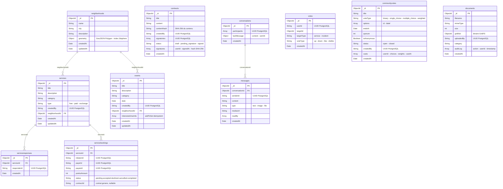
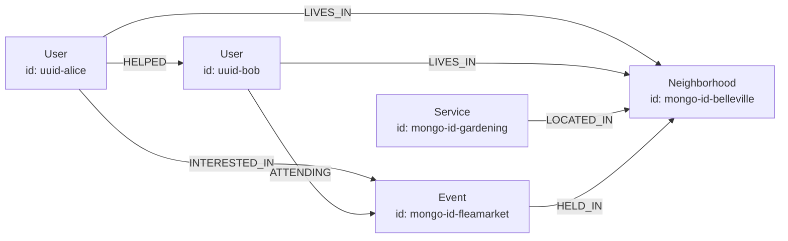

# Schémas de base de données — QuartierConnect

> **Version** 0.2.0 · **Date** 3 juillet 2026

QuartierConnect s'appuie sur **quatre** bases de données complémentaires, chacune
choisie pour ses atouts respectifs : PostgreSQL pour les données relationnelles
ACID, MongoDB pour les documents et binaires flexibles, Neo4j pour le graphe
social, et un cache SQLite embarqué dans le client bureautique JavaFX.

---

## Table des matières

1. [PostgreSQL — Données relationnelles ACID](#1-postgresql--données-relationnelles-acid)
2. [MongoDB — Documents flexibles](#2-mongodb--documents-flexibles)
3. [Neo4j — Graphe social](#3-neo4j--graphe-social)
4. [SQLite — Cache local du client bureautique](#4-sqlite--cache-local-du-client-bureautique)
5. [Règles d'usage par base de données](#5-règles-dusage-par-base-de-données)

---

## 1. PostgreSQL — Données relationnelles ACID

ORM : **Drizzle ORM** (TypeScript). Source de vérité :
`api/src/database/schema.ts`. **5 tables** : `users`, `incidents`,
`points_balances`, `points_transactions`, `revoked_tokens`.

### 1.1 Diagramme entités-associations (ERD)

```mermaid
erDiagram
    users {
        uuid id PK "defaultRandom()"
        varchar email UK "minuscules, max 255"
        varchar password_hash "argon2id"
        varchar totp_secret "base32 speakeasy"
        varchar role "resident|moderator|admin|banned"
        varchar previous_role "role detenu avant un bannissement, restaure au debannissement"
        varchar first_name "nullable"
        varchar last_name "nullable"
        text avatar_url "reference avatar GridFS, nullable"
        varchar neighborhood_id "reference MongoDB (chaine)"
        text phone "nullable"
        text address "nullable"
        real address_lat "latitude geocodee"
        real address_lng "longitude geocodee"
        text refresh_token_hash "hash argon2id du JWT, null si deconnecte"
        timestamp created_at
        timestamp updated_at
    }

    incidents {
        uuid id PK
        varchar title "max 255"
        text description
        varchar status "open|in_progress|resolved"
        varchar category "quartier par defaut"
        uuid created_by FK
        varchar neighborhood_id "reference MongoDB (chaine)"
        real lat "nullable"
        real lng "nullable"
        timestamp deleted_at "null = non supprime (soft delete)"
        timestamp created_at
        timestamp updated_at
    }

    points_balances {
        uuid id PK
        uuid user_id FK UK "1 solde par utilisateur"
        integer balance "CHECK >= -10"
        timestamp updated_at
    }

    points_transactions {
        uuid id PK
        uuid sender_id FK
        uuid recipient_id FK
        integer amount "toujours positif"
        text note "optionnel"
        text contract_id "reference contrat MongoDB, nullable"
        text type "service_payment|bonus|correction"
        text status "pending|completed|cancelled"
        timestamp completed_at "nullable"
        timestamp created_at
    }

    revoked_tokens {
        text jti PK "id du JWT revoque"
        timestamp expires_at
    }

    users ||--o{ incidents : "cree"
    users ||--o| points_balances : "possede"
    users ||--o{ points_transactions : "envoie"
    users ||--o{ points_transactions : "recoit"
```

### 1.2 Table `users`

```sql
CREATE TABLE users (
    id                 UUID PRIMARY KEY DEFAULT gen_random_uuid(),
    email              VARCHAR(255) NOT NULL UNIQUE,
    password_hash      VARCHAR(255) NOT NULL,   -- argon2id
    totp_secret        VARCHAR(255) NOT NULL,   -- base32 RFC 6238
    role               VARCHAR(50)  NOT NULL DEFAULT 'resident',
    previous_role      VARCHAR(50),             -- role conserve pendant un bannissement
    first_name         VARCHAR(100),
    last_name          VARCHAR(100),
    avatar_url         TEXT,                    -- reference avatar GridFS
    neighborhood_id    VARCHAR(255),            -- id de quartier MongoDB
    phone              TEXT,
    address            TEXT,
    address_lat        REAL,                    -- geocode via Nominatim
    address_lng        REAL,
    refresh_token_hash TEXT,                    -- null = deconnecte
    created_at         TIMESTAMP NOT NULL DEFAULT NOW(),
    updated_at         TIMESTAMP NOT NULL DEFAULT NOW()
);
```

**Règles métier :**
- Email stocké en minuscules (normalisé à l'insertion).
- `password_hash` : Argon2id — jamais bcrypt.
- `refresh_token_hash` : hash argon2 du JWT de rafraîchissement (rotation stricte).
- `role` : machine à états `resident → moderator → admin` ; `banned` est terminal
  mais réversible.
- `previous_role` : **suivi de bannissement.** Lorsqu'un compte passe à `banned`,
  son rôle courant est copié dans `previous_role`. À la réactivation, le rôle
  d'origine est restauré depuis `previous_role` (et non le rôle par défaut
  `resident`), et la colonne est réinitialisée à `NULL`. Logique dans
  `api/src/users/users.controller.ts` (`updateRole`).
- `address_lat` / `address_lng` : renseignés à partir de l'adresse saisie par
  l'utilisateur, géocodée via le service Nominatim (OpenStreetMap).

### 1.3 Table `incidents`

```sql
CREATE TABLE incidents (
    id               UUID PRIMARY KEY DEFAULT gen_random_uuid(),
    title            VARCHAR(255) NOT NULL,
    description      TEXT NOT NULL,
    status           VARCHAR(50) NOT NULL DEFAULT 'open',
    category         VARCHAR(50) NOT NULL DEFAULT 'neighborhood',
    created_by       UUID NOT NULL REFERENCES users(id),
    neighborhood_id  VARCHAR(255),  -- ID MongoDB (chaine)
    lat              REAL,          -- localisation carte optionnelle
    lng              REAL,
    deleted_at       TIMESTAMP,     -- NULL = actif
    created_at       TIMESTAMP NOT NULL DEFAULT NOW(),
    updated_at       TIMESTAMP NOT NULL DEFAULT NOW()
);
CREATE INDEX incidents_status_idx     ON incidents (status);
CREATE INDEX incidents_deleted_at_idx ON incidents (deleted_at);
```

**Machine à états :**
```
open → in_progress → resolved
       (transitions validées côté API)
```

**Suppression logique (soft delete) :** `deleted_at IS NOT NULL` = supprimé
logiquement. Utilisé pour propager les suppressions côté serveur vers le client
bureautique hors ligne (tombstones).

### 1.4 Tables `points_balances` et `points_transactions`

```sql
CREATE TABLE points_balances (
    id          UUID PRIMARY KEY DEFAULT gen_random_uuid(),
    user_id     UUID NOT NULL UNIQUE REFERENCES users(id),
    balance     INTEGER NOT NULL DEFAULT 0,
    updated_at  TIMESTAMP NOT NULL DEFAULT NOW(),
    CONSTRAINT points_balances_min_balance CHECK (balance >= -10)
);

CREATE TABLE points_transactions (
    id           UUID PRIMARY KEY DEFAULT gen_random_uuid(),
    sender_id    UUID NOT NULL REFERENCES users(id),
    recipient_id UUID NOT NULL REFERENCES users(id),
    amount       INTEGER NOT NULL,        -- toujours > 0
    note         TEXT,
    contract_id  TEXT,                    -- reference contrat MongoDB
    type         TEXT NOT NULL DEFAULT 'bonus',
    status       TEXT NOT NULL DEFAULT 'completed',
    completed_at TIMESTAMP,
    created_at   TIMESTAMP NOT NULL DEFAULT NOW(),
    CONSTRAINT points_tx_type_check
        CHECK (type IN ('service_payment','bonus','correction')),
    CONSTRAINT points_tx_status_check
        CHECK (status IN ('pending','completed','cancelled'))
);
CREATE INDEX points_tx_sender_idx   ON points_transactions (sender_id);
CREATE INDEX points_tx_contract_idx ON points_transactions (contract_id);
```

- Le solde minimum de `-10` est garanti au niveau de la base par une contrainte
  `CHECK` (pas seulement dans le code applicatif).
- `type` distingue un `service_payment` (lié à un `contract_id`) d'un `bonus` ou
  d'une `correction` manuelle.
- `status` permet de créer un paiement en `pending` puis de le finaliser en
  `completed` (ou `cancelled`) au fil du cycle de vie de la réservation/du contrat.

**Transfert ACID (PointsService) :**

```sql
-- Execute dans une transaction PostgreSQL
SELECT id, balance FROM points_balances WHERE user_id = $senderId FOR UPDATE;
-- Verifie que le solde resultant reste >= -10
INSERT INTO points_balances (user_id, balance) VALUES ($sender, -amount)
  ON CONFLICT (user_id) DO UPDATE SET balance = points_balances.balance - $amount;
INSERT INTO points_balances (user_id, balance) VALUES ($recipient, amount)
  ON CONFLICT (user_id) DO UPDATE SET balance = points_balances.balance + $amount;
INSERT INTO points_transactions (sender_id, recipient_id, amount, note, type)
  VALUES (...);
```

### 1.5 Table `revoked_tokens`

```sql
CREATE TABLE revoked_tokens (
    jti        TEXT PRIMARY KEY,          -- id du JWT revoque
    expires_at TIMESTAMP NOT NULL
);
CREATE INDEX revoked_tokens_expires_at_idx ON revoked_tokens (expires_at);
```

Un JWT porte un `jti` unique. À la déconnexion (ou lors d'une révocation
explicite), le `jti` est inséré ici ; le `JwtAuthGuard` rejette tout token
d'accès dont le `jti` est présent. `expires_at` permet de purger les entrées
expirées une fois que le token ne serait de toute façon plus valide.

---

## 2. MongoDB — Documents flexibles

ODM : **Mongoose** (NestJS `MongooseModule`).

### 2.0 Inventaire — 17 collections

La base contient **11 collections de documents** plus **3 buckets GridFS** (chacun
matérialisé par MongoDB sous la forme d'une paire `.files` + `.chunks`, soit 6
collections physiques), pour un total de **17 collections**.

| # | Collection | Contenu |
|---|-----------|---------|
| 1 | `neighborhoods` | Polygones GeoJSON (index 2dsphere) |
| 2 | `services` | Annonces de services entre voisins |
| 3 | `serviceresponses` | Réponses aux annonces de services |
| 4 | `servicebookings` | Réservations de services payants + lien vers contrat |
| 5 | `events` | Événements de quartier |
| 6 | `contracts` | Contrats + hash de contenu SHA-256 + signatures |
| 7 | `conversations` | Conversations de messagerie |
| 8 | `messages` | Messages |
| 9 | `votes` | Votes de réaction (Strategy Pattern) |
| 10 | `communityvotes` | Scrutins communautaires multi-types |
| 11 | `documents` | Métadonnées de fichiers GridFS + journal d'audit |

| Bucket GridFS | Collections physiques | Stocke |
|---------------|----------------------|--------|
| `pdfs` | `pdfs.files`, `pdfs.chunks` | Binaires PDF des contrats |
| `avatars` | `avatars.files`, `avatars.chunks` | Images d'avatar des utilisateurs |
| `messaging_files` | `messaging_files.files`, `messaging_files.chunks` | Pièces jointes des messages |

> Une collection éphémère `ssotokens` existe également (modèle Mongoose
> `SsoToken`). Il s'agit d'une collection TTL à courte durée de vie (expiration
> automatique de 300 s), utilisée uniquement lors d'un échange SSO inter-surfaces,
> et qui ne fait pas partie de l'inventaire persistant des 17 collections ci-dessus.
> Voir §2.11.


```mermaid
erDiagram
    neighborhoods {
        ObjectId _id PK
        String name
        String city
        String description
        Object geometry "GeoJSON Polygon - index 2dsphere"
        Date createdAt
        Date updatedAt
    }
    services {
        ObjectId _id PK
        String title
        String description
        String category
        String type "free - paid - exchange"
        String createdBy "UUID PostgreSQL"
        ObjectId neighborhoodId FK
        Date createdAt
        Date updatedAt
    }
    serviceresponses {
        ObjectId _id PK
        ObjectId serviceId FK
        String responderId "UUID PostgreSQL"
        Date createdAt
    }
    servicebookings {
        ObjectId _id PK
        ObjectId serviceId FK
        String initiatorId "UUID PostgreSQL"
        String payerId "UUID PostgreSQL"
        String payeeId "UUID PostgreSQL"
        Int pointsAmount
        String status "pending-accepted-declined-cancelled-completed"
        String contractId "contrat genere, nullable"
    }
    events {
        ObjectId _id PK
        String title
        String description
        String category
        Date date
        String createdBy "UUID PostgreSQL"
        ObjectId neighborhoodId FK
        Array interestedUserIds "addToSet idempotent"
        Date createdAt
        Date updatedAt
    }
    contracts {
        ObjectId _id PK
        String title
        String content
        String contentHash "SHA-256 du contenu"
        String createdBy "UUID PostgreSQL"
        Array signatories "UUID PostgreSQL"
        String status "draft - pending_signature - signed"
        Array signatures "userId - signedAt - hash SHA-256"
        Date createdAt
    }
    conversations {
        ObjectId _id PK
        Array participants "UUID PostgreSQL"
        Object lastMessage "content - sentAt"
        Date createdAt
    }
    messages {
        ObjectId _id PK
        ObjectId conversationId FK
        String senderId "UUID PostgreSQL"
        String content
        String type "text - image - file"
        String mediaUrl
        Array readBy
        Date createdAt
    }
    votes {
        ObjectId _id PK
        String userId "UUID PostgreSQL"
        ObjectId targetId
        String targetType "service - incident"
        String voteType "up - down - like - dislike"
        Date createdAt
    }
    communityvotes {
        ObjectId _id PK
        String title
        String voteType "binary - single_choice - multiple_choice - weighted"
        Array options "id - label"
        Date endsAt
        Int quorum
        Boolean isAnonymous
        String status "open - closed"
        String createdBy "UUID PostgreSQL"
        Array casts "userId - choices - weights - castAt"
        Date createdAt
    }
    documents {
        ObjectId _id PK
        String filename
        String mimeType
        Int size
        ObjectId gridfsId "binaire GridFS"
        String uploadedBy "UUID PostgreSQL"
        String category
        Array auditLog "action - userId - timestamp"
        Date createdAt
    }

    neighborhoods ||--o{ services : "neighborhoodId"
    neighborhoods ||--o{ events : "neighborhoodId"
    services ||--o{ serviceresponses : "serviceId"
    services ||--o{ servicebookings : "serviceId"
    conversations ||--o{ messages : "conversationId"
```

### 2.1 Collection `neighborhoods`

```javascript
{
  _id: ObjectId,
  name: "Belleville",
  city: "Paris",
  description: "Quartier populaire du 20e arrondissement.",
  geometry: {
    type: "Polygon",
    coordinates: [[[2.385, 48.867], [2.392, 48.870], ...]]
  },
  createdAt: ISODate,
  updatedAt: ISODate
}
```

**Index spécial :** `geometry` → index `2dsphere` pour `$geoIntersects`
(détection de chevauchement et recherche d'appartenance d'une adresse à un
quartier).

### 2.2 Collection `services`

```javascript
{
  _id: ObjectId,
  title: "Aide au jardinage",
  description: "Disponible le week-end",
  category: "gardening",
  type: "free",          // "free" | "paid" | "exchange"
  createdBy: "uuid-pg",  // UUID utilisateur PostgreSQL
  neighborhoodId: ObjectId,
  createdAt: ISODate,
  updatedAt: ISODate
}
```

### 2.3 Collection `serviceresponses`

Enregistre la réponse d'un résident à une annonce de service.

```javascript
{
  _id: ObjectId,
  serviceId: ObjectId,      // ref Service
  responderId: "uuid-pg",   // UUID utilisateur PostgreSQL
  createdAt: ISODate
}
```

**Index unique :** `{ serviceId, responderId }` → une seule réponse par
utilisateur et par annonce.

### 2.4 Collection `servicebookings`

Une réservation placée sur un service payant. Accepter une réservation génère le
contrat associé et le relie via `contractId`.

```javascript
{
  _id: ObjectId,
  serviceId: ObjectId,       // ref Service
  initiatorId: "uuid-pg",    // auteur de la demande de reservation
  payerId: "uuid-pg",
  payeeId: "uuid-pg",
  pointsAmount: 20,
  status: "pending",         // pending|accepted|declined|cancelled|completed
  contractId: null           // renseigne une fois la reservation acceptee
}
```

**Index :** `{ serviceId, initiatorId, status }` ainsi que des index mono-champ
sur `serviceId` et `initiatorId`.

### 2.5 Collection `events`

```javascript
{
  _id: ObjectId,
  title: "Vide-grenier annuel",
  description: "Grand marche communautaire",
  category: "community",
  date: ISODate,
  createdBy: "uuid-pg",
  neighborhoodId: ObjectId,
  interestedUserIds: ["uuid1", "uuid2"],   // $addToSet idempotent
  createdAt: ISODate,
  updatedAt: ISODate
}
```

### 2.6 Collection `contracts`

```javascript
{
  _id: ObjectId,
  title: "Bail de location de cave",
  content: "Texte complet du contrat...",
  contentHash: "sha256hex",   // SHA-256 du contenu au moment de la creation
  createdBy: "uuid-pg",
  signatories: ["uuid1", "uuid2"],
  status: "draft",            // "draft" | "pending_signature" | "signed"
  signatures: [
    {
      userId: "uuid1",
      signedAt: ISODate,
      hash: "sha256(content + userId + signedAt)"  // preuve d'integrite
    }
  ],
  createdAt: ISODate
}
```

**Circuit de signature :**
```
draft → pending_signature (premier signataire) → signed (tous ont signe)
```

### 2.7 Collections `conversations` et `messages`

```javascript
// conversations
{
  _id: ObjectId,
  participants: ["uuid1", "uuid2"],
  lastMessage: { content: "...", sentAt: ISODate },
  createdAt: ISODate
}

// messages
{
  _id: ObjectId,
  conversationId: ObjectId,
  senderId: "uuid-pg",
  content: "Bonjour !",
  type: "text",    // "text" | "image" | "file"
  mediaUrl: null,  // reference GridFS pour les messages image/fichier
  readBy: ["uuid1"],
  createdAt: ISODate
}
```

### 2.8 Collection `votes`

```javascript
{
  _id: ObjectId,
  userId: "uuid-pg",
  targetId: ObjectId,
  targetType: "service",   // "service" | "incident"
  voteType: "up",          // "up"/"down" ou "like"/"dislike" selon targetType
  createdAt: ISODate
}
```

**Index unique :** `{ userId, targetId, targetType }` → 1 vote par utilisateur et
par entité.

### 2.9 Collection `communityvotes`

```javascript
{
  _id: ObjectId,
  title: "Choix du jour de reunion mensuelle",
  description: "Votez pour la date",
  voteType: "single_choice",  // "binary"|"single_choice"|"multiple_choice"|"weighted"
  options: [
    { id: "opt-1", label: "Lundi 14 avril" },
    { id: "opt-2", label: "Mardi 15 avril" }
  ],
  endsAt: ISODate,
  quorum: 10,          // 0 = pas de quorum
  isAnonymous: false,
  status: "open",      // "open" | "closed"
  createdBy: "uuid-pg",
  casts: [
    {
      userId: "uuid1",
      choices: ["opt-1"],
      weights: null,    // rempli pour le voteType "weighted"
      castAt: ISODate
    }
  ],
  createdAt: ISODate
}
```

### 2.10 Collection `documents` et buckets GridFS

La collection `documents` stocke les métadonnées et un journal d'audit ; les
charges binaires résident dans les buckets GridFS (`pdfs`, `avatars`,
`messaging_files`).

```javascript
{
  _id: ObjectId,
  filename: "bail-2026.pdf",
  mimeType: "application/pdf",
  size: 124300,
  gridfsId: ObjectId,   // reference vers le fichier binaire GridFS
  uploadedBy: "uuid-pg",
  category: "contract",
  auditLog: [
    { action: "upload", userId: "uuid1", timestamp: ISODate },
    { action: "download", userId: "uuid2", timestamp: ISODate }
  ],
  createdAt: ISODate
}
```

### 2.11 Collection `ssotokens` (éphémère, TTL)

```javascript
{
  _id: ObjectId,
  userId: "uuid-pg",
  token: "UUID-v4",       // secret partage web <-> desktop
  surface: "desktop",
  state: "UUID-v4",       // PKCE - parametre state
  expiresAt: ISODate,     // index TTL MongoDB - expiration auto 300 s
  usedAt: null            // non-null = token consomme (anti-rejeu)
}
```

**Index TTL :** `expiresAt` → 300 secondes. Les documents expirés sont supprimés
automatiquement, de sorte que la collection est vide la plupart du temps.

---

## 3. Neo4j — Graphe social

Les écritures se font exclusivement via `SocialService`
(`api/src/social/social.service.ts`) sous forme d'effets de bord
fire-and-forget ; les lectures alimentent l'endpoint de recommandation.

### 3.1 Modèle de graphe


```mermaid
graph LR
    U1[User<br/>id: uuid-alice]
    U2[User<br/>id: uuid-bob]
    N1[Neighborhood<br/>id: mongo-id-belleville]
    S1[Service<br/>id: mongo-id-gardening]
    E1[Event<br/>id: mongo-id-fleamarket]

    U1 -->|LIVES_IN| N1
    U2 -->|LIVES_IN| N1
    S1 -->|LOCATED_IN| N1
    E1 -->|HELD_IN| N1
    U1 -->|INTERESTED_IN| E1
    U2 -->|ATTENDING| E1
    U1 -->|HELPED| U2
```

### 3.2 Labels et propriétés

| Label | Propriétés | Origine |
|-------|-----------|---------|
| `User` | `id` (UUID PostgreSQL), `createdAt`, `updatedAt` | Synchronisation à l'inscription / mise à jour du profil |
| `Neighborhood` | `id` (ObjectId MongoDB), `name`, `createdAt`, `updatedAt` | Synchronisation CRUD |
| `Service` | `id`, `name`, `createdBy`, `createdAt`, `updatedAt` | Synchronisation CRUD |
| `Event` | `id`, `name`, `date`, `createdBy`, `createdAt`, `updatedAt` | Synchronisation CRUD |

### 3.3 Relations

| Relation | De | Vers | Créée lorsque |
|--------------|------|----|--------------|
| `LIVES_IN` | User | Neighborhood | Synchronisation utilisateur / mise à jour du profil |
| `LOCATED_IN` | Service | Neighborhood | Création d'un service |
| `HELD_IN` | Event | Neighborhood | Création d'un événement |
| `INTERESTED_IN` | User | Event | Intérêt pour un événement, source `swipe` |
| `ATTENDING` | User | Event | Participation à un événement, source `participate` |
| `NOT_INTERESTED_IN` | User | Event | « Pas intéressé » explicite |
| `HELPED` | User | User | Aide rendue via un service (porte `serviceId`, `points`) |

> La requête de recommandation référence également un motif `USED`
> (`WHERE NOT (u)-[:USED]->(s)`) pour exclure les services déjà consommés ; il
> s'agit d'un filtre côté lecture et aucune relation `USED` n'est actuellement
> écrite par l'API.

### 3.4 Requête de recommandation (Cypher)

L'endpoint de recommandation combine par union quatre sources classées (voir
`RECOMMENDATIONS_QUERY` dans `social.service.ts`) :

1. **`serviceInNeighborhood`** — services situés dans le quartier de
   l'utilisateur, pas encore utilisés et non créés par l'utilisateur (score 3).
2. **`upcomingEventNearby`** — événements futurs se tenant dans le quartier de
   l'utilisateur auxquels il ne participe pas déjà (score 2).
3. **`sharedInterests`** — événements auxquels ont participé/qu'ont aimés des
   voisins partageant les centres d'intérêt de l'utilisateur (score `3 +
   peerCount`).
4. **`reliableNeighbor`** — voisins ayant reçu des relations `HELPED`, pondérés
   par le nombre d'aides et les événements partagés (score `4 + helpCount +
   sharedEvents`).

```cypher
MATCH (u:User {id: $userId})-[:LIVES_IN]->(n:Neighborhood)
MATCH (n)<-[:LOCATED_IN]-(s:Service)
WHERE NOT (u)-[:USED]->(s)
  AND (s.createdBy IS NULL OR s.createdBy <> $userId)
RETURN s.id AS id, s.name AS name, 'service' AS type, 3 AS score,
       'serviceInNeighborhood' AS reason
UNION
MATCH (u:User {id: $userId})-[:LIVES_IN]->(n:Neighborhood)
MATCH (n)<-[:HELD_IN]-(e:Event)
WHERE NOT (u)-[:ATTENDING]->(e)
  AND e.date > datetime()
  AND (e.createdBy IS NULL OR e.createdBy <> $userId)
RETURN e.id AS id, e.name AS name, 'event' AS type, 2 AS score,
       'upcomingEventNearby' AS reason
-- + branches sharedInterests et reliableNeighbor
```

Les résultats sont triés par score décroissant, dédupliqués par `type + name` et
limités à 10.

### 3.5 Résilience

Chaque écriture est encapsulée dans `withRetry` (3 tentatives, backoff
exponentiel 100/200/400 ms) et fonctionne en fire-and-forget : une panne de Neo4j
ne bloque jamais l'API principale. En cas d'échec, les lectures retombent sur une
liste de recommandations vide.

---

## 4. SQLite — Cache local du client bureautique

Embarqué dans le client bureautique JavaFX. Fichier : `quartierconnect.db` (dans
le répertoire courant de la JVM, redéfinissable via la propriété système
`sqlite.url`). Schéma : `desktop-app/.../database/SQLiteDatabase.java`. **3
tables** : `incidents`, `sync_log`, `session`.

### 4.1 Schéma complet

```sql
-- Incidents locaux (sync bidirectionnelle, Three-Way Merge)
CREATE TABLE IF NOT EXISTS incidents (
    id                 INTEGER PRIMARY KEY AUTOINCREMENT,
    remote_id          TEXT,       -- UUID PostgreSQL apres sync
    title              TEXT    NOT NULL,
    description        TEXT,
    status             TEXT    NOT NULL DEFAULT 'open',
    is_dirty           INTEGER NOT NULL DEFAULT 1,   -- 1 = push en attente
    created_at         TEXT    NOT NULL,
    updated_at         TEXT    NOT NULL,             -- timestamp LWW
    -- Ancetre du Three-Way Merge (derniere version synchronisee)
    base_title         TEXT,
    base_description   TEXT,
    base_status        TEXT,
    base_updated_at    TEXT,
    -- Etat de conflit (version serveur conservee cote a cote)
    is_conflict        INTEGER NOT NULL DEFAULT 0,
    remote_title       TEXT,
    remote_description TEXT,
    remote_status      TEXT,
    deleted_at         TEXT         -- tombstone (ajoute par migration)
);

-- Journal de synchronisation
CREATE TABLE IF NOT EXISTS sync_log (
    id         INTEGER PRIMARY KEY AUTOINCREMENT,
    synced_at  TEXT    NOT NULL,
    success    INTEGER NOT NULL  -- 0/1
);

-- Session persistante (ligne unique, id = 1)
CREATE TABLE IF NOT EXISTS session (
    id       INTEGER PRIMARY KEY,   -- toujours 1
    email    TEXT NOT NULL,         -- affiche en mode hors ligne
    saved_at TEXT NOT NULL          -- ISO-8601
);
```

> **Note de sécurité.** La table `session` ne stocke **que** l'e-mail. Les tokens
> d'accès et de rafraîchissement ne sont **pas** persistés dans SQLite : ils
> résident dans le trousseau du système d'exploitation via `TokenVault`. Les
> anciennes colonnes `access_token` / `refresh_token` sont supprimées par une
> migration au démarrage.

### 4.2 Three-Way Merge et LWW

À chaque synchronisation, le client compare trois versions de chaque champ
(title, description, status) : l'ancêtre commun (`base_*`), la valeur locale et
la valeur serveur (`remote_*`).

| Cas | Base | Locale | Serveur | Résultat |
|------|------|-------|--------|--------|
| Pas de base (1re sync) | null | L | R | LWW — le serveur gagne s'il est plus récent |
| Locale inchangée | B | B | R | Fusion auto — applique le serveur |
| Serveur inchangé | B | L | B | Fusion auto — conserve la version locale |
| Même modification | B | X | X | Fusion auto — les deux convergent |
| Vrai conflit | B | L | R | `is_conflict = 1` — résolution manuelle |

Les suppressions côté serveur sont propagées localement via `deleted_at`
(tombstone) : les incidents absents d'un pull complet sont marqués supprimés,
exclus des vues et conservés à des fins d'audit.

---

## 5. Règles d'usage par base de données

| Règle | Détail |
|------|--------|
| **Ne jamais utiliser de transaction MongoDB pour les points** | L'ACID de PostgreSQL est obligatoire (soldes + `CHECK >= -10`) |
| **Ne jamais stocker de données d'authentification dans MongoDB** | Sécurité — utilisateurs, rôles et hashes de tokens résident uniquement dans PostgreSQL |
| **Neo4j = orienté lecture côté API** | Écritures uniquement via `SocialService`, fire-and-forget avec retry |
| **SQLite = cache local uniquement** | Jamais la source de vérité — l'API PostgreSQL fait autorité |
| **GridFS = binaires uniquement** | Les métadonnées vont dans la collection MongoDB `documents` |
| **Tokens jamais dans SQLite** | Les tokens du client bureautique résident dans le trousseau de l'OS (`TokenVault`) |
