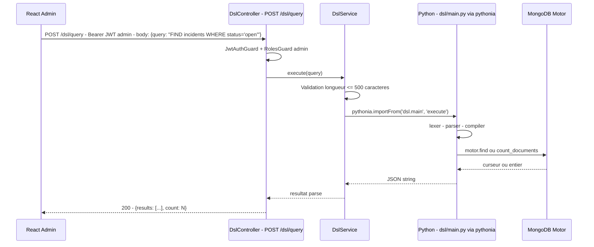

# DSL — Micro-langage de requête QuartierConnect

> **Composant** : `dsl/` · **Technologie** : Python PLY + pythonia bridge · **Version** : 0.1.3 · **Date** : 7 avril 2026

---

## Table des matières

1. [Présentation](#1-présentation)
2. [Architecture du pipeline](#2-architecture-du-pipeline)
3. [Lexer — Analyse lexicale](#3-lexer--analyse-lexicale)
4. [Parser — Grammaire LALR(1)](#4-parser--grammaire-lalr1)
5. [Compiler — Validation et compilation](#5-compiler--validation-et-compilation)
6. [Bridge NestJS → Python](#6-bridge-nestjs--python)
7. [Exemples complets](#7-exemples-complets)
8. [Gestion des erreurs](#8-gestion-des-erreurs)
9. [Sécurité](#9-sécurité)

---

## 1. Présentation

Le DSL QuartierConnect est un **micro-langage de requête** permettant aux administrateurs d'interroger les collections MongoDB sans écrire de code. Il est exposé via `POST /dsl/query` et accessible depuis le panneau admin React.

**Pourquoi un DSL et pas MongoDB directement ?**

- Sécurité : les requêtes MongoDB brutes peuvent exprimer des injections complexes
- Simplicité : syntaxe proche du langage naturel, accessible sans formation MongoDB
- Contrôle : whitelist de collections, pas d'opérations destructives

---

## 2. Architecture du pipeline

### 2.1 Vue linéaire

```mermaid
flowchart LR
    A["Texte DSL<br/>ex: FIND incidents WHERE status='open' LIMIT 10"]
    B["Lexer PLY<br/>dsl/lexer.py - lex.lex()"]
    C["Tokens<br/>FIND IDENTIFIER WHERE IDENTIFIER EQ STRING LIMIT NUMBER"]
    D["Parser PLY<br/>dsl/parser.py - yacc.yacc() LALR1"]
    E["AST Python dict<br/>type - collection - filter - limit"]
    F["Compiler<br/>dsl/compiler.py - validation whitelist collections"]
    G["MongoDB query dict<br/>pret pour motor.find() ou motor.count_documents()"]
    H["Motor Python async<br/>dsl/main.py - execute()"]
    I["Resultat JSON<br/>liste de documents ou entier"]

    A --> B --> C --> D --> E --> F --> G --> H --> I
```



### 2.2 Intégration NestJS-Python via pythonia bridge



---

## 3. Lexer — Analyse lexicale

Fichier : `dsl/lexer.py`

### 3.1 Mots réservés

```python
reserved = {
    'FIND': 'FIND', 'WHERE': 'WHERE', 'AND': 'AND', 'OR': 'OR',
    'LIMIT': 'LIMIT', 'COUNT': 'COUNT', 'IN': 'IN', 'LIKE': 'LIKE',
}
```

Les mots réservés sont **insensibles à la casse** : `find`, `FIND`, `Find` sont tous reconnus.

### 3.2 Règles de tokens

| Token | Regex | Exemple |
|-------|-------|---------|
| `STRING` | `"([^"\\]|\\.)*"\|'([^'\\]|\\.)*'` | `"open"`, `'Paris'` |
| `NUMBER` | `\d+(\.\d+)?` | `42`, `3.14` |
| `IDENTIFIER` | `[a-zA-Z_][a-zA-Z0-9_]*` | `incidents`, `status` |
| `EQ` | `=` | `=` |
| `NEQ` | `!=` | `!=` |
| `GT` | `>` | `>` |
| `GTE` | `>=` | `>=` |
| `LT` | `<` | `<` |
| `LTE` | `<=` | `<=` |
| `LPAREN` | `\(` | `(` |
| `RPAREN` | `\)` | `)` |
| `COMMA` | `,` | `,` |

Les espaces, tabulations et retours à la ligne sont ignorés (`t_ignore = ' \t\n'`).

---

## 4. Parser — Grammaire LALR(1)

Fichier : `dsl/parser.py`

### 4.1 Grammaire complète

```
query : FIND IDENTIFIER
      | FIND IDENTIFIER WHERE conditions
      | FIND IDENTIFIER LIMIT NUMBER
      | FIND IDENTIFIER WHERE conditions LIMIT NUMBER
      | COUNT IDENTIFIER
      | COUNT IDENTIFIER WHERE conditions

conditions : condition
           | conditions AND condition   → {**left, **right} (merge)
           | conditions OR condition    → {'$or': [left, right]}

condition : IDENTIFIER EQ value         → {field: value}
          | IDENTIFIER NEQ value        → {field: {'$ne': value}}
          | IDENTIFIER GT value         → {field: {'$gt': value}}
          | IDENTIFIER GTE value        → {field: {'$gte': value}}
          | IDENTIFIER LT value         → {field: {'$lt': value}}
          | IDENTIFIER LTE value        → {field: {'$lte': value}}
          | IDENTIFIER LIKE value       → {field: {'$regex': v, '$options': 'i'}}

value : STRING | NUMBER | IDENTIFIER
```

### 4.2 Exemple d'AST généré

```python
# Entrée : "FIND incidents WHERE status = 'open' LIMIT 10"
{
    'type': 'find',
    'collection': 'incidents',
    'filter': {'status': 'open'},
    'limit': 10,
}

# Entrée : "FIND incidents WHERE status = 'open' OR status = 'in_progress'"
{
    'type': 'find',
    'collection': 'incidents',
    'filter': {'$or': [{'status': 'open'}, {'status': 'in_progress'}]},
    'limit': None,
}

# Entrée : "COUNT neighborhoods WHERE city = 'Paris'"
{
    'type': 'count',
    'collection': 'neighborhoods',
    'filter': {'city': 'Paris'},
}
```

---

## 5. Compiler — Validation et compilation

Fichier : `dsl/compiler.py`

### 5.1 Whitelist de collections

```python
ALLOWED_COLLECTIONS = {
    'incidents', 'neighborhoods', 'services', 'events', 'users',
}

def compile_query(query_string: str) -> dict:
    ast = parser.parse(query_string)
    collection = ast.get('collection', '')
    if collection not in ALLOWED_COLLECTIONS:
        raise ValueError(
            f"Unknown collection '{collection}'. "
            f"Allowed: {', '.join(sorted(ALLOWED_COLLECTIONS))}"
        )
    return ast
```

### 5.2 Exécution

```python
# main.py
async def execute(query_string: str) -> list | int:
    ast = compile_query(query_string)

    if ast['type'] == 'find':
        cursor = db[ast['collection']].find(ast['filter'])
        if ast.get('limit'):
            cursor = cursor.limit(ast['limit'])
        return await cursor.to_list(length=1000)

    elif ast['type'] == 'count':
        return await db[ast['collection']].count_documents(ast['filter'])
```

---

## 6. Bridge NestJS → Python

Fichier : `api/src/dsl/dsl.service.ts`

La bibliothèque **pythonia** permet d'appeler des fonctions Python depuis Node.js de manière synchrone.

```typescript
// dsl.service.ts
@Injectable()
export class DslService {
  async execute(query: string): Promise<unknown> {
    const { execute } = await import('pythonia');
    const result = await execute(query);
    return result;
  }
}

// dsl.controller.ts
@Post('query')
@UseGuards(JwtAuthGuard, RolesGuard)
@Roles('admin')
async query(@Body() dto: DslQueryDto) {
  return this.dslService.execute(dto.query);
}
```

---

## 7. Exemples complets

### Requêtes basiques

```
FIND incidents
→ db.incidents.find({})

FIND incidents LIMIT 5
→ db.incidents.find({}).limit(5)

COUNT incidents
→ db.incidents.countDocuments({})
```

### Requêtes avec filtres

```
FIND incidents WHERE status = 'open'
→ db.incidents.find({status: 'open'})

FIND services WHERE type = 'free' AND category = 'gardening'
→ db.services.find({type:'free', category:'gardening'})

FIND services WHERE type = 'free' OR type = 'exchange'
→ db.services.find({$or:[{type:'free'},{type:'exchange'}]})
```

### Recherche textuelle (LIKE)

```
FIND services WHERE title LIKE 'jardin'
→ db.services.find({title:{$regex:'jardin',$options:'i'}})

FIND neighborhoods WHERE name LIKE 'belle'
→ db.neighborhoods.find({name:{$regex:'belle',$options:'i'}})
```

### Comparaisons numériques

```
FIND incidents WHERE priority > 3
→ db.incidents.find({priority:{$gt:3}})

FIND events WHERE maxAttendees >= 50 LIMIT 10
→ db.events.find({maxAttendees:{$gte:50}}).limit(10)
```

---

## 8. Gestion des erreurs

| Erreur | Cause | Message retourné |
|--------|-------|-----------------|
| `SyntaxError` | Token illégal : `FIND !@#` | `"Illegal character '!' at position 5"` |
| `SyntaxError` | Grammaire incorrecte : `FIND WHERE incidents` | `"Syntax error at 'WHERE'"` |
| `SyntaxError` | Fin prématurée : `FIND incidents WHERE` | `"Unexpected end of input"` |
| `ValueError` | Collection non autorisée : `FIND passwords` | `"Unknown collection 'passwords'. Allowed: ..."` |

---

## 9. Sécurité

| Vecteur | Mitigation |
|---------|-----------|
| Collections arbitraires | Whitelist stricte de 5 collections |
| Opérations destructives | Seul FIND et COUNT — pas de DELETE/UPDATE/INSERT |
| Injections MongoDB | Les valeurs passent par le moteur — pas de concaténation |
| Accès non autorisé | Route protégée par `@Roles('admin')` |
| Ressources excessives | `limit(1000)` maximum par requête |
