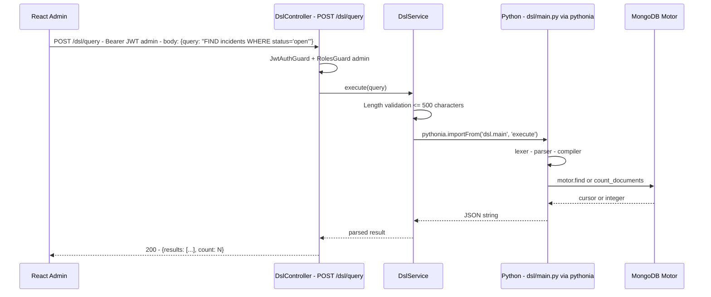

# DSL — QuartierConnect query micro-language

> **Component**: `dsl/` · **Technology**: Python PLY + pythonia bridge · **Version**: 0.1.3 · **Date**: 7 April 2026

---

## Table of contents

1. [Introduction](#1-introduction)
2. [Pipeline architecture](#2-pipeline-architecture)
3. [Lexer — Lexical analysis](#3-lexer--lexical-analysis)
4. [Parser — LALR(1) grammar](#4-parser--lalr1-grammar)
5. [Compiler — Validation and compilation](#5-compiler--validation-and-compilation)
6. [NestJS → Python bridge](#6-nestjs--python-bridge)
7. [Complete examples](#7-complete-examples)
8. [Error handling](#8-error-handling)
9. [Security](#9-security)

---

## 1. Introduction

The QuartierConnect DSL is a **query micro-language** that lets administrators query the MongoDB collections without writing code. It is exposed via `POST /dsl/query` and accessible from the React admin panel.

**Why a DSL rather than MongoDB directly?**

- Security: raw MongoDB queries can express complex injections
- Simplicity: a near-natural-language syntax, usable without MongoDB training
- Control: a collection whitelist, no destructive operations

---

## 2. Pipeline architecture

### 2.1 Linear view

```mermaid
flowchart LR
    A["DSL text<br/>e.g. FIND incidents WHERE status='open' LIMIT 10"]
    B["PLY Lexer<br/>dsl/lexer.py - lex.lex()"]
    C["Tokens<br/>FIND IDENTIFIER WHERE IDENTIFIER EQ STRING LIMIT NUMBER"]
    D["PLY Parser<br/>dsl/parser.py - yacc.yacc() LALR1"]
    E["Python dict AST<br/>type - collection - filter - limit"]
    F["Compiler<br/>dsl/compiler.py - collection whitelist validation"]
    G["MongoDB query dict<br/>ready for motor.find() or motor.count_documents()"]
    H["Python async Motor<br/>dsl/main.py - execute()"]
    I["JSON result<br/>list of documents or integer"]

    A --> B --> C --> D --> E --> F --> G --> H --> I
```



### 2.2 NestJS-Python integration via the pythonia bridge



---

## 3. Lexer — Lexical analysis

File: `dsl/lexer.py`

### 3.1 Reserved words

```python
reserved = {
    'FIND': 'FIND', 'WHERE': 'WHERE', 'AND': 'AND', 'OR': 'OR',
    'LIMIT': 'LIMIT', 'COUNT': 'COUNT', 'IN': 'IN', 'LIKE': 'LIKE',
}
```

Reserved words are **case-insensitive**: `find`, `FIND`, `Find` are all recognized.

### 3.2 Token rules

| Token | Regex | Example |
|-------|-------|---------|
| `STRING` | `"([^"\\]|\\.)*"\|'([^'\\]|\\.)*'` | `"open"`, `'Paris'` |
| `NUMBER` | `\d+(\.\d+)?` | `42`, `3.14` |
| `IDENTIFIER` | `[a-zA-Z_][a-zA-Z0-9_]*` | `incidents`, `status` |
| `EQ` | `=` | `=` |
| `NEQ` | `!=` | `!=` |
| `GT` | `>` | `>` |
| `GTE` | `>=` | `>=` |
| `LT` | `<` | `<` |
| `LTE` | `<=` | `<=` |
| `LPAREN` | `\(` | `(` |
| `RPAREN` | `\)` | `)` |
| `COMMA` | `,` | `,` |

Spaces, tabs, and line breaks are ignored (`t_ignore = ' \t\n'`).

---

## 4. Parser — LALR(1) grammar

File: `dsl/parser.py`

### 4.1 Full grammar

```
query : FIND IDENTIFIER
      | FIND IDENTIFIER WHERE conditions
      | FIND IDENTIFIER LIMIT NUMBER
      | FIND IDENTIFIER WHERE conditions LIMIT NUMBER
      | COUNT IDENTIFIER
      | COUNT IDENTIFIER WHERE conditions

conditions : condition
           | conditions AND condition   → {**left, **right} (merge)
           | conditions OR condition    → {'$or': [left, right]}

condition : IDENTIFIER EQ value         → {field: value}
          | IDENTIFIER NEQ value        → {field: {'$ne': value}}
          | IDENTIFIER GT value         → {field: {'$gt': value}}
          | IDENTIFIER GTE value        → {field: {'$gte': value}}
          | IDENTIFIER LT value         → {field: {'$lt': value}}
          | IDENTIFIER LTE value        → {field: {'$lte': value}}
          | IDENTIFIER LIKE value       → {field: {'$regex': v, '$options': 'i'}}

value : STRING | NUMBER | IDENTIFIER
```

### 4.2 Example of a generated AST

```python
# Input: "FIND incidents WHERE status = 'open' LIMIT 10"
{
    'type': 'find',
    'collection': 'incidents',
    'filter': {'status': 'open'},
    'limit': 10,
}

# Input: "FIND incidents WHERE status = 'open' OR status = 'in_progress'"
{
    'type': 'find',
    'collection': 'incidents',
    'filter': {'$or': [{'status': 'open'}, {'status': 'in_progress'}]},
    'limit': None,
}

# Input: "COUNT neighborhoods WHERE city = 'Paris'"
{
    'type': 'count',
    'collection': 'neighborhoods',
    'filter': {'city': 'Paris'},
}
```

---

## 5. Compiler — Validation and compilation

File: `dsl/compiler.py`

### 5.1 Collection whitelist

```python
ALLOWED_COLLECTIONS = {
    'incidents', 'neighborhoods', 'services', 'events', 'users',
}

def compile_query(query_string: str) -> dict:
    ast = parser.parse(query_string)
    collection = ast.get('collection', '')
    if collection not in ALLOWED_COLLECTIONS:
        raise ValueError(
            f"Unknown collection '{collection}'. "
            f"Allowed: {', '.join(sorted(ALLOWED_COLLECTIONS))}"
        )
    return ast
```

### 5.2 Execution

```python
# main.py
async def execute(query_string: str) -> list | int:
    ast = compile_query(query_string)

    if ast['type'] == 'find':
        cursor = db[ast['collection']].find(ast['filter'])
        if ast.get('limit'):
            cursor = cursor.limit(ast['limit'])
        return await cursor.to_list(length=1000)

    elif ast['type'] == 'count':
        return await db[ast['collection']].count_documents(ast['filter'])
```

---

## 6. NestJS → Python bridge

File: `api/src/dsl/dsl.service.ts`

The **pythonia** library allows calling Python functions from Node.js synchronously.

```typescript
// dsl.service.ts
@Injectable()
export class DslService {
  async execute(query: string): Promise<unknown> {
    const { execute } = await import('pythonia');
    const result = await execute(query);
    return result;
  }
}

// dsl.controller.ts
@Post('query')
@UseGuards(JwtAuthGuard, RolesGuard)
@Roles('admin')
async query(@Body() dto: DslQueryDto) {
  return this.dslService.execute(dto.query);
}
```

---

## 7. Complete examples

### Basic queries

```
FIND incidents
→ db.incidents.find({})

FIND incidents LIMIT 5
→ db.incidents.find({}).limit(5)

COUNT incidents
→ db.incidents.countDocuments({})
```

### Queries with filters

```
FIND incidents WHERE status = 'open'
→ db.incidents.find({status: 'open'})

FIND services WHERE type = 'free' AND category = 'gardening'
→ db.services.find({type:'free', category:'gardening'})

FIND services WHERE type = 'free' OR type = 'exchange'
→ db.services.find({$or:[{type:'free'},{type:'exchange'}]})
```

### Text search (LIKE)

```
FIND services WHERE title LIKE 'garden'
→ db.services.find({title:{$regex:'garden',$options:'i'}})

FIND neighborhoods WHERE name LIKE 'belle'
→ db.neighborhoods.find({name:{$regex:'belle',$options:'i'}})
```

### Numeric comparisons

```
FIND incidents WHERE priority > 3
→ db.incidents.find({priority:{$gt:3}})

FIND events WHERE maxAttendees >= 50 LIMIT 10
→ db.events.find({maxAttendees:{$gte:50}}).limit(10)
```

---

## 8. Error handling

| Error | Cause | Returned message |
|--------|-------|-----------------|
| `SyntaxError` | Illegal token: `FIND !@#` | `"Illegal character '!' at position 5"` |
| `SyntaxError` | Invalid grammar: `FIND WHERE incidents` | `"Syntax error at 'WHERE'"` |
| `SyntaxError` | Premature end: `FIND incidents WHERE` | `"Unexpected end of input"` |
| `ValueError` | Disallowed collection: `FIND passwords` | `"Unknown collection 'passwords'. Allowed: ..."` |

---

## 9. Security

| Vector | Mitigation |
|---------|-----------|
| Arbitrary collections | Strict whitelist of 5 collections |
| Destructive operations | FIND and COUNT only — no DELETE/UPDATE/INSERT |
| MongoDB injections | Values go through the engine — no concatenation |
| Unauthorized access | Route protected by `@Roles('admin')` |
| Excessive resources | `limit(1000)` maximum per query |
