# Rapport de Projet — Étape 2
## QuartierConnect — *Connected Neighbours*

---

|                    |                                                                         |
| ------------------ | ----------------------------------------------------------------------- |
| **Groupe**         | 1 — 3AL2                                                                |
| **Membres**        | Claudio REIBAUD · Andras SCHULLER · Mouhamadou N'DIAYE                  |
| **Enseignant**     | Frédéric SANANES                                                        |
| **Date de remise** | 8 avril 2026                                                            |
| **Avancement**     | Étape 2 — 30 % réalisé (légère avance sur certains points de l'Étape 3) |

---

## Table des matières

1. [Descriptif fonctionnel](#1-descriptif-fonctionnel)
2. [Cas d'utilisation](#2-cas-dutilisation)
3. [Modèle Conceptuel de Données](#3-modèle-conceptuel-de-données)
4. [Diagramme de classes — Java Desktop](#4-diagramme-de-classes--java-desktop)
5. [Architecture logicielle](#5-architecture-logicielle)
6. [Algorithmes complexes](#6-algorithmes-complexes)
7. [APIs et frameworks utilisés](#7-apis-et-frameworks-utilisés)
8. [Tests](#8-tests)
9. [Démonstration Java Desktop](#9-démonstration-java-desktop)

---

## 1. Descriptif fonctionnel

### 1.1 Présentation du projet

QuartierConnect est une plateforme collaborative destinée aux habitants d'un quartier résidentiel. Elle permet de gérer des services entre voisins, de signaler des incidents, de participer à des événements communautaires et d'échanger des points représentant des créances de service.

La plateforme est accessible sur trois surfaces :

- **React Client** (port 3000) — interface habitant, accessible depuis un navigateur ;
- **React Admin** (port 3001) — back-office administrateur ;
- **Java Desktop** — application lourde JavaFX, fonctionnant hors-ligne via SQLite.

### 1.2 Profils utilisateurs

| Profil                   | Surface                                   | Droits                                                                |
| ------------------------ | ----------------------------------------- | --------------------------------------------------------------------- |
| Habitant (`resident`)    | React Client                              | Créer incidents, consulter services et événements, envoyer des points |
| Modérateur (`moderator`) | React Client                              | Droits habitant + changement de statut et suppression d'incidents     |
| Administrateur (`admin`) | React Client + React Admin + Java Desktop | Gestion complète (utilisateurs, quartiers, modération, stats)         |
| Banni (`banned`)         | —                                         | Accès révoqué ; tous les tokens en cours sont invalidés               |

### 1.3 État d'avancement

#### Cible Étape 2 — ✅ Complète

| Module                                                                           | Statut    |
| -------------------------------------------------------------------------------- | --------- |
| Authentification (register, login 2FA, refresh, logout)                          | ✅ Terminé |
| SSO PKCE (web → Java Desktop)                                                    | ✅ Terminé |
| Interface React Client — pages login, register, dashboard                        | ✅ Terminé |
| Interface React Admin — page login + dashboard placeholder                       | ✅ Terminé |
| Application Java Desktop (SSO, sync, SQLite)                                     | ✅ Terminé |
| Infrastructure Docker 7 conteneurs (Caddy, API, Mongo, PG, Neo4j, Client, Admin) | ✅ Terminé |

#### Avance partielle sur l'Étape 3 (backend uniquement, sans interface)

| Module                                                   | Statut                                     |
| -------------------------------------------------------- | ------------------------------------------ |
| CRUD Quartiers (API)                                     | ✅ Terminé — *pas d'interface React Client* |
| CRUD Services (API)                                      | ✅ Terminé — *pas d'interface React Client* |
| CRUD Événements (API)                                    | ✅ Terminé — *pas d'interface React Client* |
| CRUD Incidents + workflow de statuts + soft-delete (API) | ✅ Terminé — *pas d'interface React Client* |
| Synchronisation offline incidents (Java → API)           | ✅ Terminé                                  |
| Transactions de points ACID PostgreSQL (API)             | ✅ Terminé — *pas d'interface React Client* |
| Gestion utilisateurs (API)                               | ✅ Terminé — *pas d'interface React Admin*  |

#### Non commencé — Étape 3/4

| Module                                                       | Cible   |
| ------------------------------------------------------------ | ------- |
| Pages React Client (incidents, services, événements, points) | Étape 3 |
| React Admin complet (modération, stats réelles)              | Étape 3 |
| Recommandations Neo4j + DSL Python                           | Étape 4 |

---

## 2. Cas d'utilisation

### 2.1 Diagramme général

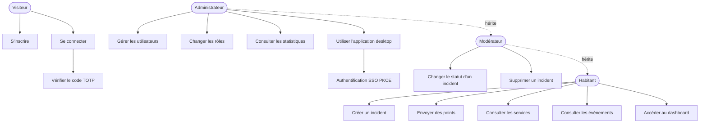
```mermaid
graph TD
    Visiteur([Visiteur])
    Habitant([Habitant])
    Moderateur([Modérateur])
    Admin([Administrateur])

    Visiteur --> UC_REG[S'inscrire]
    Visiteur --> UC_LOG[Se connecter]

    Habitant --> UC_INC[Créer un incident]
    Habitant --> UC_PTS[Envoyer des points]
    Habitant --> UC_SVC[Consulter les services]
    Habitant --> UC_EVT[Consulter les événements]
    Habitant --> UC_DASH[Accéder au dashboard]

    Moderateur --> UC_STATUS[Changer le statut d'un incident]
    Moderateur --> UC_DEL[Supprimer un incident]

    Admin --> UC_USERS[Gérer les utilisateurs]
    Admin --> UC_ROLES[Changer les rôles]
    Admin --> UC_STATS[Consulter les statistiques]
    Admin --> UC_JAVA[Utiliser l'application desktop]

    UC_LOG --> UC_TOTP[Vérifier le code TOTP]
    UC_JAVA --> UC_SSO[Authentification SSO PKCE]

    Moderateur -.->|hérite| Habitant
    Admin -.->|hérite| Moderateur
```

### 2.2 UC-01 — Inscription et activation TOTP


```mermaid
sequenceDiagram
    actor V as Visiteur
    participant C as React Client
    participant A as API NestJS
    participant DB as PostgreSQL

    V->>C: Remplit email + mot de passe
    C->>A: POST /auth/register { email, password }
    A->>A: argon2.hash(password)
    A->>A: speakeasy.generateSecret(email)
    A->>DB: INSERT users { email, passwordHash, totpSecret }
    DB-->>A: OK
    A-->>C: { otpauthUrl }
    C-->>V: Affiche le QR code TOTP

    V->>V: Scanne le QR avec une app TOTP
    V->>C: Saisit le code à 6 chiffres
    C->>A: POST /auth/verify-totp { totpCode }
    A->>A: speakeasy.verify(totpCode, secret, window=1)
    A-->>C: 200 OK
    C-->>V: Redirection vers /dashboard
```

### 2.3 UC-02 — Connexion en deux étapes

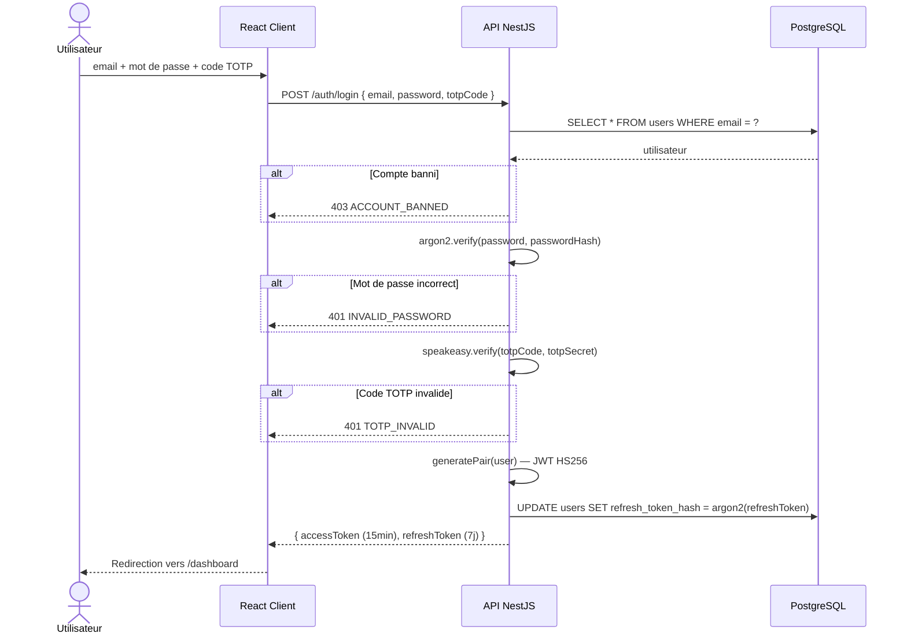
```mermaid
sequenceDiagram
    actor U as Utilisateur
    participant C as React Client
    participant A as API NestJS
    participant DB as PostgreSQL

    U->>C: email + mot de passe + code TOTP
    C->>A: POST /auth/login { email, password, totpCode }

    A->>DB: SELECT * FROM users WHERE email = ?
    DB-->>A: utilisateur

    alt Compte banni
        A-->>C: 403 ACCOUNT_BANNED
    end

    A->>A: argon2.verify(password, passwordHash)

    alt Mot de passe incorrect
        A-->>C: 401 INVALID_PASSWORD
    end

    A->>A: speakeasy.verify(totpCode, totpSecret)

    alt Code TOTP invalide
        A-->>C: 401 TOTP_INVALID
    end

    A->>A: generatePair(user) — JWT HS256
    A->>DB: UPDATE users SET refresh_token_hash = argon2(refreshToken)
    A-->>C: { accessToken (15min), refreshToken (7j) }
    C-->>U: Redirection vers /dashboard
```

### 2.4 UC-03 — SSO PKCE (Java Desktop → navigateur → API)

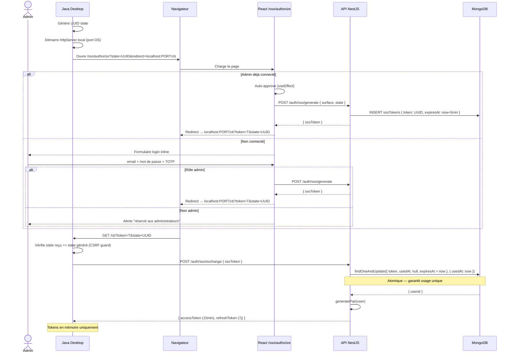
```mermaid
sequenceDiagram
    actor Admin
    participant D as Java Desktop
    participant B as Navigateur
    participant W as React /sso/authorize
    participant A as API NestJS
    participant DB as MongoDB

    D->>D: Génère UUID state
    D->>D: Démarre HttpServer local (port OS)
    D->>B: Ouvre /sso/authorize?state=UUID&redirect=localhost:PORT/cb

    B->>W: Charge la page

    alt Admin déjà connecté
        W->>W: Auto-approve (useEffect)
        W->>A: POST /auth/sso/generate { surface, state }
        A->>DB: INSERT ssoTokens { token: UUID, expiresAt: now+5min }
        A-->>W: { ssoToken }
        W-->>B: Redirect → localhost:PORT/cb?token=T&state=UUID
    else Non connecté
        W-->>Admin: Formulaire login inline
        Admin->>W: email + mot de passe + TOTP
        alt Rôle admin
            W->>A: POST /auth/sso/generate
            A-->>W: { ssoToken }
            W-->>B: Redirect → localhost:PORT/cb?token=T&state=UUID
        else Non admin
            W-->>Admin: Alerte "réservé aux administrateurs"
        end
    end

    B->>D: GET /cb?token=T&state=UUID
    D->>D: Vérifie state reçu == state généré (CSRF guard)
    D->>A: POST /auth/sso/exchange { ssoToken }
    A->>DB: findOneAndUpdate({ token, usedAt: null, expiresAt > now }, { usedAt: now })
    Note over A,DB: Atomique — garantit usage unique
    DB-->>A: { userId }
    A->>A: generatePair(user)
    A-->>D: { accessToken (15min), refreshToken (7j) }
    Note over D: Tokens en mémoire uniquement
```

### 2.5 UC-04 — Cycle de vie d'un incident

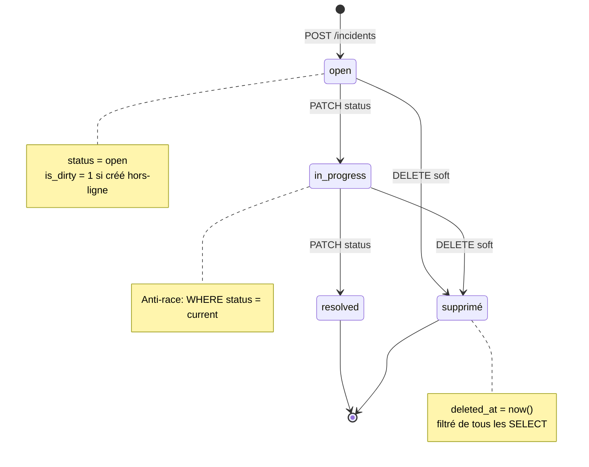
```mermaid
stateDiagram-v2
    [*] --> open : POST /incidents
    open --> in_progress : PATCH status
    in_progress --> resolved : PATCH status
    resolved --> [*]
    open --> supprimé : DELETE soft
    in_progress --> supprimé : DELETE soft
    supprimé --> [*]

    note right of open
        status = open
        is_dirty = 1 si créé hors-ligne
    end note
    note right of in_progress
        Anti-race: WHERE status = current
    end note
    note right of supprimé
        deleted_at = now()
        filtré de tous les SELECT
    end note
```

### 2.6 UC-05 — Synchronisation offline (Java Desktop)

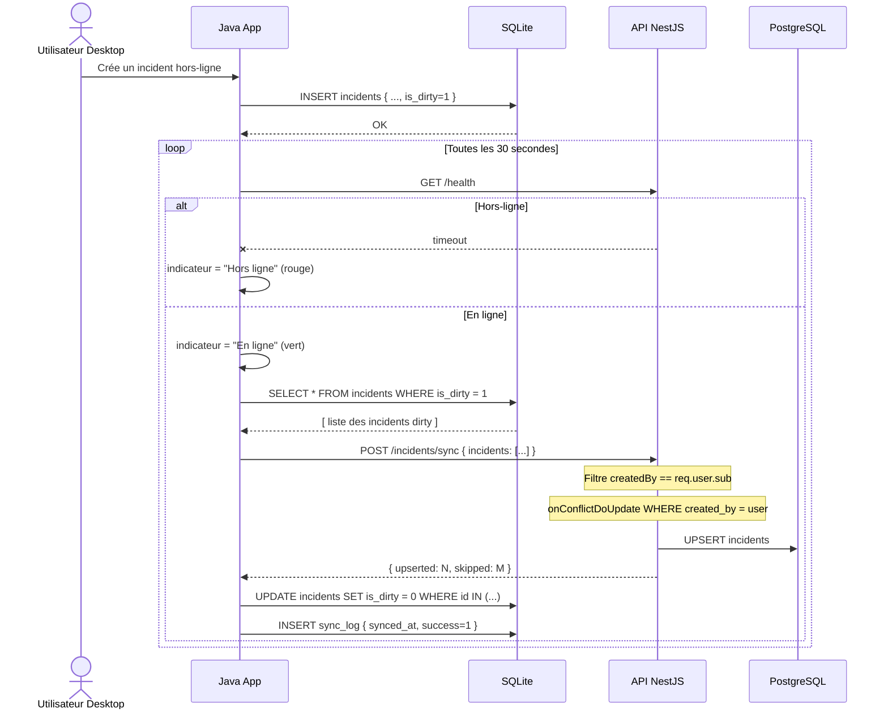
```mermaid
sequenceDiagram
    actor U as Utilisateur Desktop
    participant J as Java App
    participant S as SQLite
    participant API as API NestJS
    participant PG as PostgreSQL

    U->>J: Crée un incident hors-ligne
    J->>S: INSERT incidents { ..., is_dirty=1 }
    S-->>J: OK

    loop Toutes les 30 secondes
        J->>API: GET /health
        alt Hors-ligne
            API--xJ: timeout
            J->>J: indicateur = "Hors ligne" (rouge)
        else En ligne
            J->>J: indicateur = "En ligne" (vert)
            J->>S: SELECT * FROM incidents WHERE is_dirty = 1
            S-->>J: [ liste des incidents dirty ]
            J->>API: POST /incidents/sync { incidents: [...] }
            Note over API: Filtre createdBy == req.user.sub
            Note over API: onConflictDoUpdate WHERE created_by = user
            API->>PG: UPSERT incidents
            API-->>J: { upserted: N, skipped: M }
            J->>S: UPDATE incidents SET is_dirty = 0 WHERE id IN (...)
            J->>S: INSERT sync_log { synced_at, success=1 }
        end
    end
```

### 2.7 UC-06 — Transfert de points

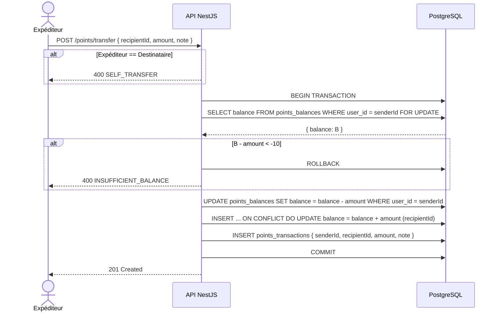
```mermaid
sequenceDiagram
    actor E as Expéditeur
    participant A as API NestJS
    participant PG as PostgreSQL

    E->>A: POST /points/transfer { recipientId, amount, note }

    alt Expéditeur == Destinataire
        A-->>E: 400 SELF_TRANSFER
    end

    A->>PG: BEGIN TRANSACTION
    A->>PG: SELECT balance FROM points_balances WHERE user_id = senderId FOR UPDATE
    PG-->>A: { balance: B }

    alt B - amount < -10
        A->>PG: ROLLBACK
        A-->>E: 400 INSUFFICIENT_BALANCE
    end

    A->>PG: UPDATE points_balances SET balance = balance - amount WHERE user_id = senderId
    A->>PG: INSERT ... ON CONFLICT DO UPDATE balance = balance + amount (recipientId)
    A->>PG: INSERT points_transactions { senderId, recipientId, amount, note }
    A->>PG: COMMIT
    A-->>E: 201 Created
```

---

## 3. Modèle Conceptuel de Données

### 3.1 PostgreSQL — Données relationnelles

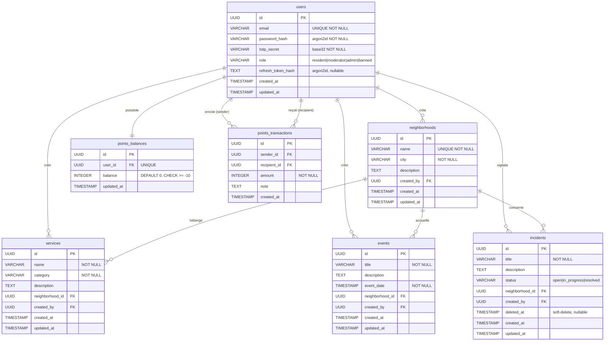
```mermaid
erDiagram
    users {
        UUID      id               PK
        VARCHAR   email            "UNIQUE NOT NULL"
        VARCHAR   password_hash    "argon2id NOT NULL"
        VARCHAR   totp_secret      "base32 NOT NULL"
        VARCHAR   role             "resident|moderator|admin|banned"
        TEXT      refresh_token_hash "argon2id, nullable"
        TIMESTAMP created_at
        TIMESTAMP updated_at
    }

    neighborhoods {
        UUID      id           PK
        VARCHAR   name         "UNIQUE NOT NULL"
        VARCHAR   city         "NOT NULL"
        TEXT      description
        UUID      created_by   FK
        TIMESTAMP created_at
        TIMESTAMP updated_at
    }

    services {
        UUID      id               PK
        VARCHAR   name             "NOT NULL"
        VARCHAR   category         "NOT NULL"
        TEXT      description
        UUID      neighborhood_id  FK
        UUID      created_by       FK
        TIMESTAMP created_at
        TIMESTAMP updated_at
    }

    events {
        UUID      id               PK
        VARCHAR   title            "NOT NULL"
        TEXT      description
        TIMESTAMP event_date       "NOT NULL"
        UUID      neighborhood_id  FK
        UUID      created_by       FK
        TIMESTAMP created_at
        TIMESTAMP updated_at
    }

    incidents {
        UUID      id               PK
        VARCHAR   title            "NOT NULL"
        TEXT      description
        VARCHAR   status           "open|in_progress|resolved"
        UUID      neighborhood_id  FK
        UUID      created_by       FK
        TIMESTAMP deleted_at       "soft-delete, nullable"
        TIMESTAMP created_at
        TIMESTAMP updated_at
    }

    points_balances {
        UUID      id        PK
        UUID      user_id   FK "UNIQUE"
        INTEGER   balance   "DEFAULT 0, CHECK >= -10"
        TIMESTAMP updated_at
    }

    points_transactions {
        UUID      id           PK
        UUID      sender_id    FK
        UUID      recipient_id FK
        INTEGER   amount       "NOT NULL"
        TEXT      note
        TIMESTAMP created_at
    }

    users         ||--o{ neighborhoods      : "crée"
    users         ||--o{ services           : "crée"
    users         ||--o{ events             : "crée"
    users         ||--o{ incidents          : "signale"
    users         ||--|| points_balances    : "possède"
    users         ||--o{ points_transactions : "envoie (sender)"
    users         ||--o{ points_transactions : "reçoit (recipient)"
    neighborhoods ||--o{ services           : "héberge"
    neighborhoods ||--o{ events             : "accueille"
    neighborhoods ||--o{ incidents          : "concerne"
```

### 3.2 MongoDB — Collection SSO Tokens

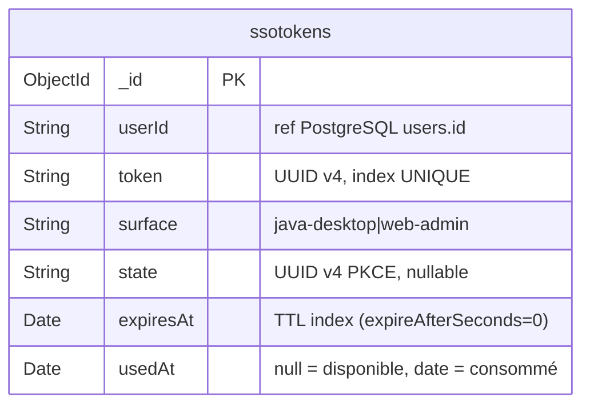
```mermaid
erDiagram
    ssotokens {
        ObjectId  _id       PK
        String    userId    "ref PostgreSQL users.id"
        String    token     "UUID v4, index UNIQUE"
        String    surface   "java-desktop|web-admin"
        String    state     "UUID v4 PKCE, nullable"
        Date      expiresAt "TTL index (expireAfterSeconds=0)"
        Date      usedAt    "null = disponible, date = consommé"
    }
```

> Le TTL index MongoDB supprime automatiquement le document dès que `expiresAt` est atteint (5 minutes). L'opération `findOneAndUpdate` avec filtre `{ usedAt: null, expiresAt: { $gt: now } }` garantit l'usage unique de façon atomique.

### 3.3 SQLite — Application Java Desktop

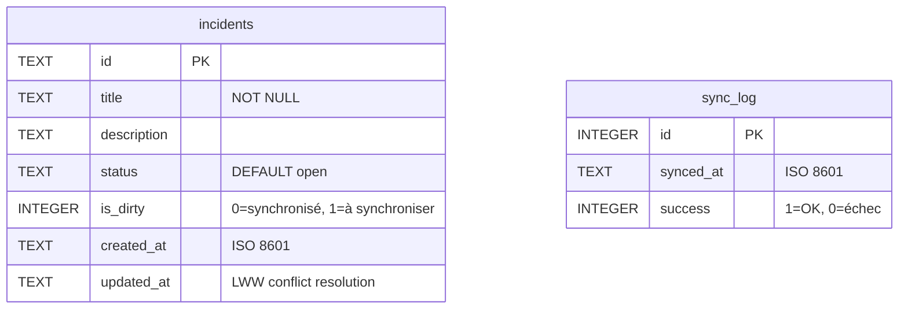
```mermaid
erDiagram
    incidents {
        TEXT    id          PK
        TEXT    title       "NOT NULL"
        TEXT    description
        TEXT    status      "DEFAULT open"
        INTEGER is_dirty    "0=synchronisé, 1=à synchroniser"
        TEXT    created_at  "ISO 8601"
        TEXT    updated_at  "LWW conflict resolution"
    }

    sync_log {
        INTEGER id        PK
        TEXT    synced_at "ISO 8601"
        INTEGER success   "1=OK, 0=échec"
    }
```

### 3.4 Neo4j — Graphe social (Étape 4)

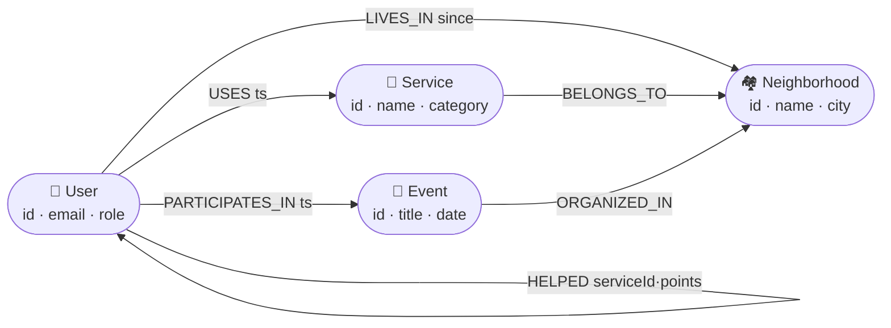
```mermaid
graph LR
    User(["👤 User\nid · email · role"])
    Neighborhood(["🏘 Neighborhood\nid · name · city"])
    Service(["🔧 Service\nid · name · category"])
    Event(["📅 Event\nid · title · date"])

    User -->|"LIVES_IN since"| Neighborhood
    User -->|"PARTICIPATES_IN ts"| Event
    User -->|"USES ts"| Service
    User -->|"HELPED serviceId·points"| User
    Service -->|"BELONGS_TO"| Neighborhood
    Event -->|"ORGANIZED_IN"| Neighborhood
```

---

## 4. Diagramme de classes — Java Desktop

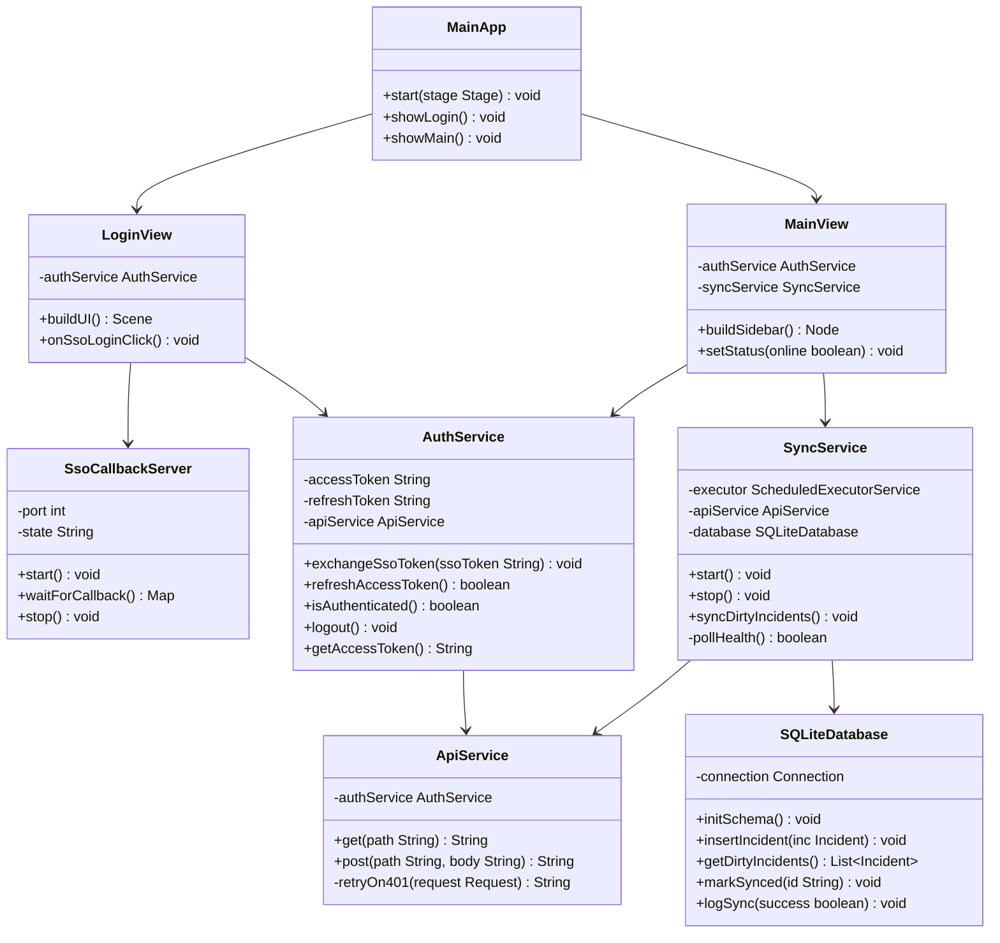
```mermaid
classDiagram
    class MainApp {
        +start(stage Stage) void
        +showLogin() void
        +showMain() void
    }

    class LoginView {
        -authService AuthService
        +buildUI() Scene
        +onSsoLoginClick() void
    }

    class MainView {
        -authService AuthService
        -syncService SyncService
        +buildSidebar() Node
        +setStatus(online boolean) void
    }

    class SsoCallbackServer {
        -port int
        -state String
        +start() void
        +waitForCallback() Map
        +stop() void
    }

    class AuthService {
        -accessToken String
        -refreshToken String
        -apiService ApiService
        +exchangeSsoToken(ssoToken String) void
        +refreshAccessToken() boolean
        +isAuthenticated() boolean
        +logout() void
        +getAccessToken() String
    }

    class ApiService {
        -authService AuthService
        +get(path String) String
        +post(path String, body String) String
        -retryOn401(request Request) String
    }

    class SyncService {
        -executor ScheduledExecutorService
        -apiService ApiService
        -database SQLiteDatabase
        +start() void
        +stop() void
        +syncDirtyIncidents() void
        -pollHealth() boolean
    }

    class SQLiteDatabase {
        -connection Connection
        +initSchema() void
        +insertIncident(inc Incident) void
        +getDirtyIncidents() List~Incident~
        +markSynced(id String) void
        +logSync(success boolean) void
    }

    MainApp --> LoginView
    MainApp --> MainView
    LoginView --> AuthService
    LoginView --> SsoCallbackServer
    MainView --> AuthService
    MainView --> SyncService
    AuthService --> ApiService
    SyncService --> ApiService
    SyncService --> SQLiteDatabase
```

---

## 5. Architecture logicielle

### 5.1 Vue d'ensemble — Infrastructure Docker

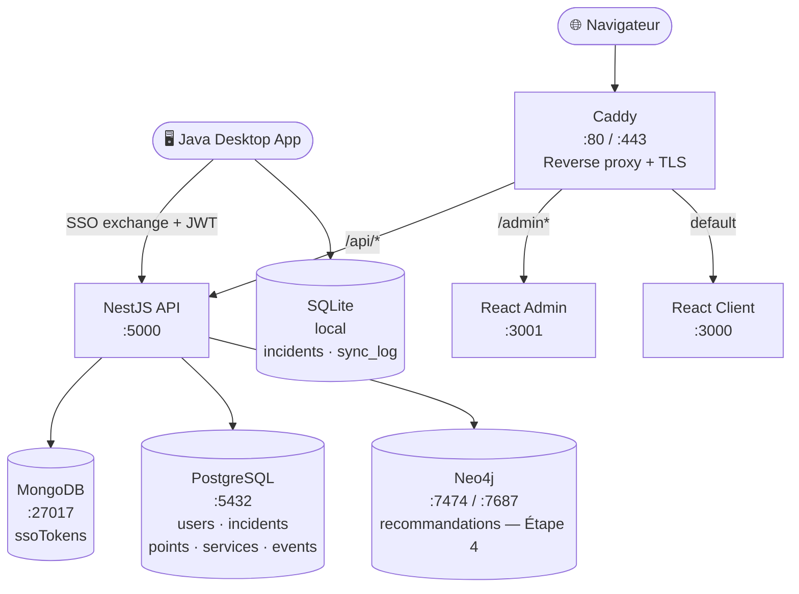
```mermaid
graph TD
    Browser(["🌐 Navigateur"])
    Desktop(["🖥 Java Desktop App"])

    Browser --> Caddy["Caddy\n:80 / :443\nReverse proxy + TLS"]
    Desktop -->|"SSO exchange + JWT"| API

    Caddy -->|"/api/*"| API["NestJS API\n:5000"]
    Caddy -->|"/admin*"| Admin["React Admin\n:3001"]
    Caddy -->|"default"| Client["React Client\n:3000"]

    API --> MongoDB[("MongoDB\n:27017\nssoTokens")]
    API --> PostgreSQL[("PostgreSQL\n:5432\nusers · incidents\npoints · services · events")]
    API --> Neo4j[("Neo4j\n:7474 / :7687\nrecommandations — Étape 4")]
    Desktop --> SQLite[("SQLite\nlocal\nincidents · sync_log")]
```

### 5.2 Justification du choix de chaque base de données

| Base           | Rôle                                           | Raison du choix                                                                                                                                                                                                      |
| -------------- | ---------------------------------------------- | -------------------------------------------------------------------------------------------------------------------------------------------------------------------------------------------------------------------- |
| **PostgreSQL** | Données relationnelles, transactions de points | ACID natif. Les transferts de points nécessitent une transaction `BEGIN/COMMIT` avec `SELECT FOR UPDATE` pour éviter les courses concurrentes. La contrainte `CHECK (balance >= -10)` est garantie au niveau moteur. |
| **MongoDB**    | SSO tokens                                     | TTL index natif pour l'expiration automatique (5 min). `findOneAndUpdate` atomique pour l'usage unique. Prévu pour GridFS (PDF, médias) et GeoJSON (quartiers) aux étapes suivantes.                                 |
| **Neo4j**      | Recommandations                                | Les recommandations sociales reposent sur un traversal de graphe. En SQL cela exigerait 5 jointures récursives (>500 ms). En Cypher un seul `MATCH` suffit (<5 ms).                                                  |
| **SQLite**     | Cache offline Java                             | Embarqué dans le JAR, zéro dépendance réseau, miroir léger de PostgreSQL avec le flag `is_dirty` pour la synchronisation.                                                                                            |

### 5.3 Architecture NestJS par modules


```mermaid
graph TD
    AppModule --> AuthModule
    AppModule --> UsersModule
    AppModule --> NeighborhoodsModule
    AppModule --> ServicesModule
    AppModule --> EventsModule
    AppModule --> IncidentsModule
    AppModule --> PointsModule
    AppModule --> DatabaseModule

    AuthModule --> DrizzleDB["Drizzle ORM\nPostgreSQL"]
    AuthModule --> MongooseDB["Mongoose\nMongoDB"]
    UsersModule --> DrizzleDB
    IncidentsModule --> DrizzleDB
    PointsModule --> DrizzleDB
    NeighborhoodsModule --> DrizzleDB
    ServicesModule --> DrizzleDB
    EventsModule --> DrizzleDB

    JwtGuard["JwtAuthGuard\n(Passport-JWT)"] -.->|protège| AuthModule
    RolesGuard["RolesGuard\n(@Roles decorator)"] -.->|protège| UsersModule
    RolesGuard -.->|protège| IncidentsModule
    Throttler["ThrottlerGuard\n5 req/15min"] -.->|protège| AuthModule
```

### 5.4 Structure du monorepo web (Turbo + pnpm)

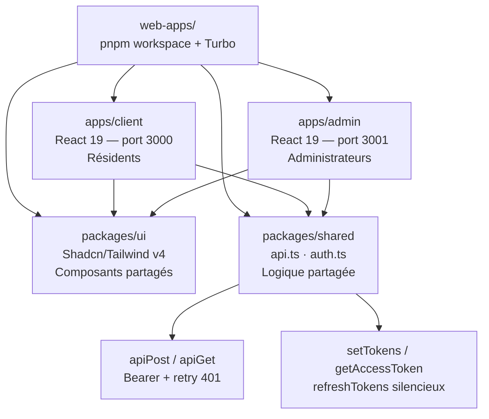
```mermaid
graph TD
    Root["web-apps/\npnpm workspace + Turbo"]
    Root --> Client["apps/client\nReact 19 — port 3000\nRésidents"]
    Root --> AdminApp["apps/admin\nReact 19 — port 3001\nAdministrateurs"]
    Root --> UI["packages/ui\nShadcn/Tailwind v4\nComposants partagés"]
    Root --> Shared["packages/shared\napi.ts · auth.ts\nLogique partagée"]

    Client --> UI
    Client --> Shared
    AdminApp --> UI
    AdminApp --> Shared

    Shared --> APICall["apiPost / apiGet\nBearer + retry 401"]
    Shared --> TokenMgr["setTokens / getAccessToken\nrefreshTokens silencieux"]
```

---

## 6. Algorithmes complexes

### 6.1 TOTP — Time-based One-Time Password (RFC 6238)

**Problème :** valider l'identité sans transmettre un secret réutilisable à chaque connexion.

**Principe :** le serveur et l'application TOTP du client calculent indépendamment `HMAC-SHA1(secret, floor(now / 30))` et comparent les codes à 6 chiffres. Aucun échange réseau n'est nécessaire pour le calcul.

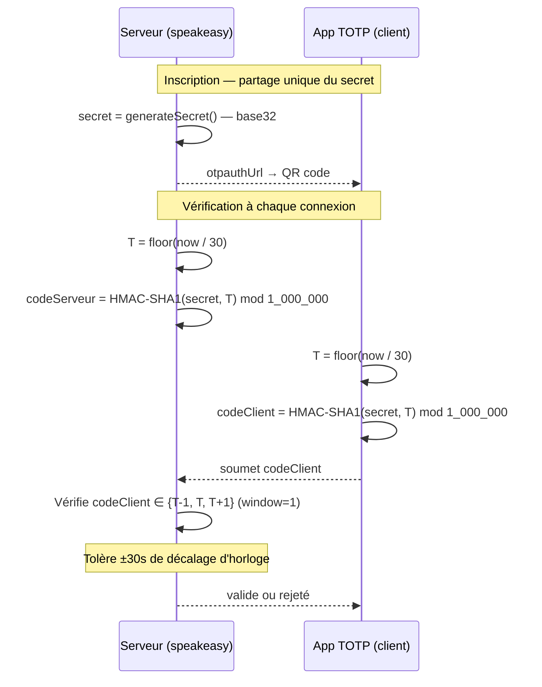
```mermaid
sequenceDiagram
    participant S as Serveur (speakeasy)
    participant C as App TOTP (client)

    Note over S,C: Inscription — partage unique du secret
    S->>S: secret = generateSecret() — base32
    S-->>C: otpauthUrl → QR code

    Note over S,C: Vérification à chaque connexion
    S->>S: T = floor(now / 30)
    S->>S: codeServeur = HMAC-SHA1(secret, T) mod 1_000_000
    C->>C: T = floor(now / 30)
    C->>C: codeClient = HMAC-SHA1(secret, T) mod 1_000_000
    C-->>S: soumet codeClient

    S->>S: Vérifie codeClient ∈ {T-1, T, T+1} (window=1)
    Note over S: Tolère ±30s de décalage d'horloge
    S-->>C: valide ou rejeté
```

**Sécurité :** le secret n'est jamais retransmis après l'inscription. Un code intercepté est inutilisable après 60 secondes.

### 6.2 Rotation des Refresh Tokens (anti-vol)

**Objectif :** détecter le vol de token. Si un attaquant vole un refresh token et l'utilise, la victime détectera la révocation à son prochain accès.

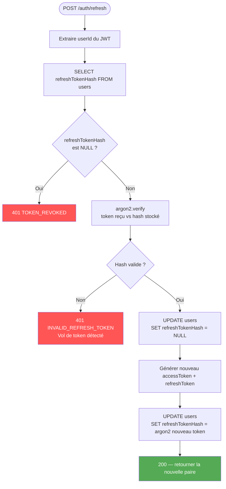
```mermaid
flowchart TD
    A([POST /auth/refresh]) --> B[Extraire userId du JWT]
    B --> C[SELECT refreshTokenHash FROM users]
    C --> D{refreshTokenHash\nest NULL ?}
    D -- Oui --> E[401 TOKEN_REVOKED]
    D -- Non --> F[argon2.verify\ntoken reçu vs hash stocké]
    F --> G{Hash valide ?}
    G -- Non --> H[401 INVALID_REFRESH_TOKEN\nVol de token détecté]
    G -- Oui --> I[UPDATE users\nSET refreshTokenHash = NULL]
    I --> J[Générer nouveau accessToken + refreshToken]
    J --> K[UPDATE users\nSET refreshTokenHash = argon2 nouveau token]
    K --> L[200 — retourner la nouvelle paire]

    style E fill:#f55,color:#fff
    style H fill:#f55,color:#fff
    style L fill:#5a5,color:#fff
```

> **Rotation complète :** à chaque refresh, l'ancien hash est écrasé. Si le même ancien token est rejoué (attaquant), il est rejeté car le hash ne correspond plus.

### 6.3 Synchronisation offline — Last-Write-Wins

**Stratégie :** le champ `updated_at` de chaque enregistrement sert d'arbitre en cas de conflit. La version la plus récente l'emporte.

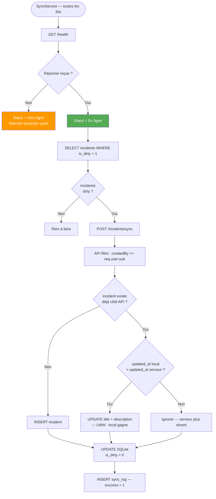
```mermaid
flowchart TD
    A([SyncService — toutes les 30s]) --> B[GET /health]
    B --> C{Réponse reçue ?}
    C -- Non --> D[Statut = Hors ligne\nAttendre prochain cycle]
    C -- Oui --> E[Statut = En ligne]
    E --> F[SELECT incidents WHERE is_dirty = 1]
    F --> G{Incidents\ndirty ?}
    G -- Non --> H[Rien à faire]
    G -- Oui --> I[POST /incidents/sync]
    I --> J[API filtre : createdBy == req.user.sub]
    J --> K{Incident existe\ndéjà côté API ?}
    K -- Non --> L[INSERT incident]
    K -- Oui --> M{updated_at local\n> updated_at serveur ?}
    M -- Oui --> N[UPDATE title + description\n--- LWW : local gagne]
    M -- Non --> O[Ignorer --- serveur plus récent]
    L --> P[UPDATE SQLite\nis_dirty = 0]
    N --> P
    O --> P
    P --> Q[INSERT sync_log — success = 1]

    style D fill:#f90,color:#fff
    style E fill:#5a5,color:#fff
```

### 6.4 Transfert de points — Transaction ACID

**Problème :** deux transferts simultanés depuis le même compte pourraient tous deux passer la vérification de solde avant que l'un ne débite, conduisant à un solde négatif inférieur à -10.

**Solution :** `SELECT ... FOR UPDATE` verrouille la ligne jusqu'au `COMMIT`.

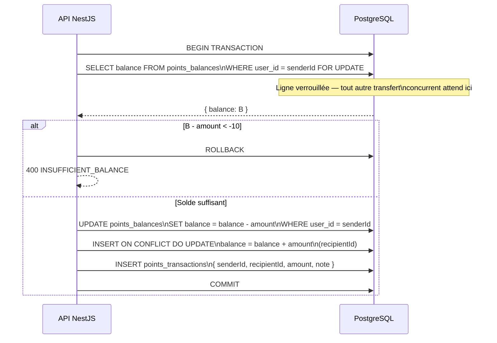
```mermaid
sequenceDiagram
    participant A as API NestJS
    participant PG as PostgreSQL

    A->>PG: BEGIN TRANSACTION
    A->>PG: SELECT balance FROM points_balances\nWHERE user_id = senderId FOR UPDATE
    Note over PG: Ligne verrouillée — tout autre transfert\nconcurrent attend ici
    PG-->>A: { balance: B }

    alt B - amount < -10
        A->>PG: ROLLBACK
        A-->>A: 400 INSUFFICIENT_BALANCE
    else Solde suffisant
        A->>PG: UPDATE points_balances\nSET balance = balance - amount\nWHERE user_id = senderId
        A->>PG: INSERT ON CONFLICT DO UPDATE\nbalance = balance + amount\n(recipientId)
        A->>PG: INSERT points_transactions\n{ senderId, recipientId, amount, note }
        A->>PG: COMMIT
    end
```

> La contrainte `CHECK (balance >= -10)` au niveau PostgreSQL constitue un filet de sécurité supplémentaire indépendant du code applicatif.

### 6.5 Machine à états des incidents — Anti-race condition

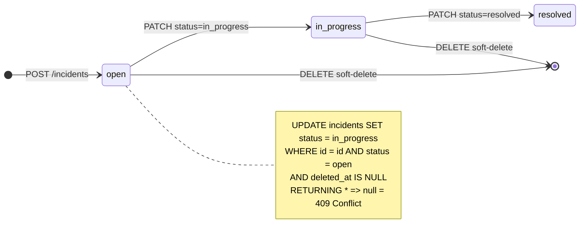
```mermaid
stateDiagram-v2
    direction LR
    [*] --> open : POST /incidents

    open --> in_progress : PATCH status=in_progress
    in_progress --> resolved : PATCH status=resolved

    open --> [*] : DELETE soft-delete
    in_progress --> [*] : DELETE soft-delete

    note right of open
        UPDATE incidents SET status = in_progress
        WHERE id = id AND status = open
        AND deleted_at IS NULL
        RETURNING * => null = 409 Conflict
    end note
```

**Vérification du statut courant dans le `WHERE` :** si deux modérateurs tentent simultanément de passer un incident à `in_progress`, l'un des deux obtiendra `null` en retour (la condition `status = 'open'` sera fausse) et recevra une erreur `409 Concurrent update detected`.

---

## 7. APIs et frameworks utilisés

### 7.1 Backend NestJS (TypeScript)

| Bibliothèque          | Version | Rôle dans le projet                                                         |
| --------------------- | ------- | --------------------------------------------------------------------------- |
| **NestJS**            | 11      | Framework principal — injection de dépendances, guards, decorators, modules |
| **Drizzle ORM**       | 0.40    | ORM PostgreSQL type-safe — requêtes, migrations, `onConflictDoUpdate`       |
| **Mongoose**          | 8       | ODM MongoDB — SSO tokens, TTL index, `findOneAndUpdate` atomique            |
| **Passport-JWT**      | 4       | Stratégie de validation JWT injectable (`JwtStrategy`)                      |
| **@nestjs/jwt**       | 11      | Signature HS256, durées access 15 min / refresh 7 j                         |
| **argon2**            | 0.40    | Hash argon2id des mots de passe et des refresh tokens                       |
| **speakeasy**         | 2.0     | Génération et vérification TOTP (RFC 6238), window ±1                       |
| **@nestjs/throttler** | 6       | Rate limiting — 5 requêtes / 15 min sur `/auth/login`                       |
| **Zod**               | 3       | Validation des DTOs entrants (class-validator remplacé)                     |

### 7.2 Frontend React (TypeScript)

> **Périmètre Étape 2 :** seules les pages d'authentification sont implémentées à ce stade.
> Les pages métier (incidents, services, événements, solde de points) et le back-office Admin complet
> sont prévus pour l'Étape 3 (31 mai 2026).

**Pages existantes :**

| Application          | Route                                           | État      |
| -------------------- | ----------------------------------------------- | --------- |
| React Client (:3000) | `/login` — connexion 2 étapes                   | ✅         |
| React Client (:3000) | `/register` — inscription + QR TOTP             | ✅         |
| React Client (:3000) | `/dashboard` — profil + SSO token               | ✅         |
| React Admin (:3001)  | `/login` — contrôle rôle admin                  | ✅         |
| React Admin (:3001)  | `/dashboard` — placeholder stats                | ✅         |
| React Client (:3000) | `/incidents`, `/services`, `/events`            | ❌ Étape 3 |
| React Admin (:3001)  | Gestion utilisateurs, modération, stats réelles | ❌ Étape 3 |

**Bibliothèques utilisées :**

| Bibliothèque        | Version | Rôle dans le projet                                                |
| ------------------- | ------- | ------------------------------------------------------------------ |
| **React**           | 19      | Bibliothèque UI                                                    |
| **Vite**            | 6       | Build + Hot Module Replacement                                     |
| **TanStack Router** | 1       | Routage file-based 100 % type-safe, `routeTree.gen.ts` auto-généré |
| **TanStack Form**   | 1       | Gestion des formulaires et validation                              |
| **TanStack Query**  | 5       | Cache serveur, invalidation automatique (préparé pour Étape 3)     |
| **Shadcn/ui**       | latest  | Composants accessibles basés sur Radix UI                          |
| **Tailwind CSS**    | v4      | Styles utilitaires                                                 |
| **Turbo**           | 2       | Cache de build pour le monorepo                                    |

### 7.3 Java Desktop (JSE / JavaFX)

| API / Bibliothèque                                | Rôle                                                                   |
| ------------------------------------------------- | ---------------------------------------------------------------------- |
| **JavaFX** (JSE inclus)                           | Interface graphique — `BorderPane`, `VBox`, `Label`, `Button`, `Stage` |
| **java.net.http.HttpClient**                      | Requêtes HTTP/HTTPS vers l'API NestJS                                  |
| **java.util.concurrent.ScheduledExecutorService** | Thread de sync — poll `/health` toutes les 30 s                        |
| **java.sql (JDBC)** + **SQLite JDBC**             | Base locale SQLite (org.xerial:sqlite-jdbc)                            |
| **com.sun.net.httpserver.HttpServer**             | Serveur HTTP local pour recevoir le callback SSO PKCE                  |
| **Maven Shade Plugin**                            | Génération du Fat JAR auto-suffisant (~25 MB)                          |

### 7.4 DSL Python (PLY)

| Bibliothèque              | Rôle                                                                                        |
| ------------------------- | ------------------------------------------------------------------------------------------- |
| **PLY** (Python Lex-Yacc) | Lexer (`lexer.py`) + parser (`parser.py`) — analyse syntaxique du langage de requête maison |
| **pythonia**              | Bridge Python ↔ Node.js — appel du compilateur depuis NestJS via `POST /dsl/query`          |

---

## 8. Tests

### 8.1 Bilan global

| Suite               | Résultat      | Outil                                         |
| ------------------- | ------------- | --------------------------------------------- |
| Tests unitaires API | **103 / 103** | Jest + ts-jest                                |
| Tests E2E API       | **56 / 56**   | Jest + Supertest (MongoDB + PostgreSQL réels) |
| Tests Desktop       | **8 / 8**     | JUnit 5 + Mockito                             |
| Tests Web           | **14 / 14**   | Playwright (Chrome headless)                  |
| **Total**           | **181 / 181** | —                                             |

**Couverture API :** 80,58 % de branches (seuil minimum : 75 %, cible : 80 %)

### 8.2 Stratégie de test

```mermaid
graph TD
    T1["Tests unitaires\n(Jest — API)\nMock base de données\nLogique métier isolée"]
    T2["Tests E2E\n(Supertest — API)\nBases réelles\nFlux complets HTTP"]
    T3["Tests unitaires\n(JUnit 5 — Desktop)\nMock ApiService\nLogique sync + auth"]
    T4["Tests UI\n(Playwright — Web)\nNavigateur réel\nFlux utilisateur complets"]

    T1 -->|"103 tests\n80% couverture"| OK1([Confiance logique])
    T2 -->|"56 tests\nZéro mock sur BDD"| OK2([Confiance intégration])
    T3 -->|"8 tests\nMockito"| OK3([Confiance Java])
    T4 -->|"14 tests\nChrome headless"| OK4([Confiance UI])
```

> **Principe des tests E2E :** aucun mock sur les bases de données. Les tests utilisent MongoDB et PostgreSQL réels, avec un `beforeAll` qui peuple les données via l'API (pas d'insertion directe en base).

### 8.3 Exemples de tests unitaires API

**Test de sécurité — rejet du filtre de statut invalide :**

```typescript
// api/src/incidents/incidents.controller.spec.ts
it('should throw BadRequestException for invalid status', async () => {
  await expect(
    controller.findAll('hacked_status', '1', '20')
  ).rejects.toThrow(BadRequestException);
});
```

**Test de sécurité — `createdBy` forcé depuis le token JWT :**

```typescript
it('should force createdBy to req.user.sub, ignoring client value', () => {
  const dto = { title: 'Test', createdBy: 'attacker-uuid', ... };
  controller.create(dto, { user: { sub: 'real-user-uuid' } });

  expect(insertValues).toMatchObject({ createdBy: 'real-user-uuid' });
  // 'attacker-uuid' n'est jamais utilisé
});
```

**Test de sécurité — bannissement révoque les tokens existants :**

```typescript
// api/src/auth/auth.service.spec.ts
it('should reject banned user even with valid refresh token', async () => {
  mockUser.role = 'banned';
  await expect(service.refresh({ refreshToken: validToken }))
    .rejects.toThrow(new HttpException('ACCOUNT_BANNED', 403));
});
```

### 8.4 Exemple de test JUnit — Desktop

```java
// AuthServiceTest.java
@Test
void exchangeSsoToken_shouldStoreTokensInMemoryOnly() throws Exception {
    when(mockApiService.post("/auth/sso/exchange", anyString()))
        .thenReturn("{\"accessToken\":\"at123\",\"refreshToken\":\"rt456\"}");

    authService.exchangeSsoToken("valid-sso-token");

    assertEquals("at123", authService.getAccessToken());
    // Vérification critique : jamais écrit sur disque
    assertFalse(Files.exists(Path.of("access_token.txt")));
    assertFalse(Files.exists(Path.of("refresh_token.txt")));
}
```

### 8.5 Commandes pour lancer les tests

```bash
# Tests unitaires API avec couverture
cd api && pnpm run test:cov

# Tests E2E API (nécessite MongoDB + PostgreSQL actifs)
docker compose up -d mongodb postgresql
cd api && pnpm run test:e2e

# Tests Desktop JUnit
cd desktop-app && ./mvnw test

# Validation complète (lint + typecheck + tests + build)
make validate
```

---

## 9. Démonstration Java Desktop

### 9.1 Lancer l'application

```bash
# Build du Fat JAR (~25 MB, auto-suffisant)
cd desktop-app && ./mvnw clean package -q

# Lancement
java -jar target/quartierconnect-desktop.jar
```

### 9.2 Comptes de démonstration

```bash
# Générer les données de test
npx ts-node scripts/seed-demo.ts

# Comptes créés :
#   alice@demo.fr     — rôle: resident
#   bob@demo.fr       — rôle: moderator
#   admin@demo.fr     — rôle: admin  (+ UPDATE SQL nécessaire pour définir le rôle admin)

# Mot de passe commun : Demo1234!
# Secret TOTP : généré aléatoirement par compte — récupérer depuis PostgreSQL :
#   docker exec docker-postgres-1 psql -U qc -d quartierconnect \
#     -c "SELECT email, totp_secret FROM users;"

# Générer le code TOTP en ligne de commande :
oathtool --totp --base32 <SECRET_DU_COMPTE>

# Définir le rôle admin après seed :
docker exec docker-postgres-1 psql -U qc -d quartierconnect \
  -c "UPDATE users SET role = 'admin' WHERE email = 'admin@demo.fr';"
```

### 9.3 Scénario SSO PKCE (admin déjà connecté)

```mermaid
sequenceDiagram
    actor Admin
    participant J as Java Desktop
    participant B as Navigateur
    participant A as API

    Admin->>B: Se connecter sur localhost:3000 avec admin@demo.fr
    Admin->>J: Lancer l'app Java
    Admin->>J: Cliquer "Se connecter via le navigateur"
    J->>J: Générer state UUID + démarrer HttpServer local
    J->>B: Ouvrir /sso/authorize?state=...&redirect=localhost:PORT/cb
    B->>B: useEffect détecte la session admin active
    B->>A: POST /auth/sso/generate
    A-->>B: { ssoToken }
    B->>J: Redirect → /cb?token=...&state=...
    J->>J: Vérifier state (CSRF guard)
    J->>A: POST /auth/sso/exchange { ssoToken }
    A-->>J: { accessToken, refreshToken }
    J->>J: Stocker en mémoire, afficher MainView
    Note over Admin,J: Connexion transparente — zéro saisie manuelle
```

### 9.4 Scénario de détection hors-ligne

```mermaid
sequenceDiagram
    participant J as Java Desktop
    participant S as SyncService
    participant DB as SQLite
    participant API as API NestJS

    loop Toutes les 30 secondes
        S->>API: GET /health
        alt API inaccessible
            API--xS: timeout
            S->>J: Indicateur = "Hors ligne" (rouge)
            Note over J: L'utilisateur peut continuer\nde créer des incidents locaux
        else API accessible
            API-->>S: 200 { status: "ok" }
            S->>J: Indicateur = "En ligne" (vert)
            S->>DB: SELECT incidents WHERE is_dirty = 1
            DB-->>S: [incidents à synchroniser]
            S->>API: POST /incidents/sync { incidents }
            API-->>S: { upserted: N }
            S->>DB: UPDATE is_dirty = 0
        end
    end
```

### 9.5 Points de démonstration prévus

| Point                | Scénario                                                             |
| -------------------- | -------------------------------------------------------------------- |
| SSO PKCE auto        | Admin déjà connecté → connexion Java sans interaction                |
| SSO PKCE manuel      | Navigateur non connecté → formulaire inline → connexion Java         |
| Refus non-admin      | Tenter SSO avec `alice@demo.fr` (resident) → alerte                  |
| Détection hors-ligne | `docker stop docker-api-1` → indicateur rouge en <30s                |
| Retour en ligne      | `docker start docker-api-1` → indicateur vert                        |
| Sync offline         | Créer un incident hors-ligne → remettre en ligne → vérifier côté API |

---

*Rapport de projet — QuartierConnect · Groupe 1 · 3AL2 · ESGI 2025-2026*
*Rendu Étape 2 — 8 avril 2026 — Enseignant : Frédéric SANANES*
