# Project Report — Stage 2
## QuartierConnect — *Connected Neighbours*

---

|                    |                                                                         |
| ------------------ | ----------------------------------------------------------------------- |
| **Group**          | 1 — 3AL2                                                                |
| **Members**        | Claudio REIBAUD · Andras SCHULLER · Mouhamadou N'DIAYE                  |
| **Instructor**     | Frédéric SANANES                                                        |
| **Due date**       | 8 April 2026                                                            |
| **Progress**       | Stage 2 — 30% complete (slightly ahead on some Stage 3 items)          |

---

## Table of contents

1. [Functional description](#1-functional-description)
2. [Use cases](#2-use-cases)
3. [Conceptual Data Model](#3-conceptual-data-model)
4. [Class diagram — Java Desktop](#4-class-diagram--java-desktop)
5. [Software architecture](#5-software-architecture)
6. [Complex algorithms](#6-complex-algorithms)
7. [APIs and frameworks used](#7-apis-and-frameworks-used)
8. [Tests](#8-tests)
9. [Java Desktop demonstration](#9-java-desktop-demonstration)

---

## 1. Functional description

### 1.1 Project overview

QuartierConnect is a collaborative platform for the residents of a residential neighbourhood. It allows neighbours to manage services among themselves, report incidents, take part in community events, and exchange points that represent service credits.

The platform is available on three surfaces:

- **React Client** (port 3000) — resident interface, accessible from a browser;
- **React Admin** (port 3001) — administrator back-office;
- **Java Desktop** — heavyweight JavaFX application, working offline via SQLite.

### 1.2 User profiles

| Profile                  | Surface                                   | Rights                                                                |
| ------------------------ | ----------------------------------------- | --------------------------------------------------------------------- |
| Resident (`resident`)    | React Client                              | Create incidents, view services and events, send points              |
| Moderator (`moderator`)  | React Client                              | Resident rights + change incident status and delete incidents        |
| Administrator (`admin`)  | React Client + React Admin + Java Desktop | Full management (users, neighbourhoods, moderation, stats)           |
| Banned (`banned`)        | —                                         | Access revoked; all current tokens are invalidated                   |

### 1.3 Progress status

#### Stage 2 target — ✅ Complete

| Module                                                                           | Status    |
| -------------------------------------------------------------------------------- | --------- |
| Authentication (register, login 2FA, refresh, logout)                            | ✅ Done    |
| SSO PKCE (web → Java Desktop)                                                    | ✅ Done    |
| React Client interface — login, register, dashboard pages                        | ✅ Done    |
| React Admin interface — login page + dashboard placeholder                       | ✅ Done    |
| Java Desktop application (SSO, sync, SQLite)                                     | ✅ Done    |
| Docker infrastructure, 7 containers (Caddy, API, Mongo, PG, Neo4j, Client, Admin) | ✅ Done   |

#### Partial head start on Stage 3 (backend only, no interface)

| Module                                                   | Status                                     |
| -------------------------------------------------------- | ------------------------------------------ |
| Neighbourhoods CRUD (API)                                | ✅ Done — *no React Client interface*       |
| Services CRUD (API)                                      | ✅ Done — *no React Client interface*       |
| Events CRUD (API)                                        | ✅ Done — *no React Client interface*       |
| Incidents CRUD + status workflow + soft-delete (API)     | ✅ Done — *no React Client interface*       |
| Offline incident synchronization (Java → API)           | ✅ Done                                     |
| ACID points transactions in PostgreSQL (API)            | ✅ Done — *no React Client interface*       |
| User management (API)                                    | ✅ Done — *no React Admin interface*        |

#### Not started — Stage 3/4

| Module                                                       | Target  |
| ------------------------------------------------------------ | ------- |
| React Client pages (incidents, services, events, points)     | Stage 3 |
| Complete React Admin (moderation, real stats)                | Stage 3 |
| Neo4j recommendations + Python DSL                           | Stage 4 |

---

## 2. Use cases

### 2.1 General diagram

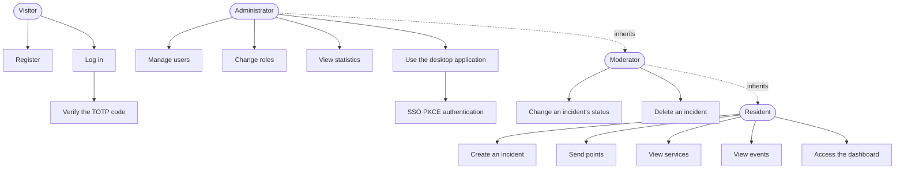

### 2.2 UC-01 — Registration and TOTP activation

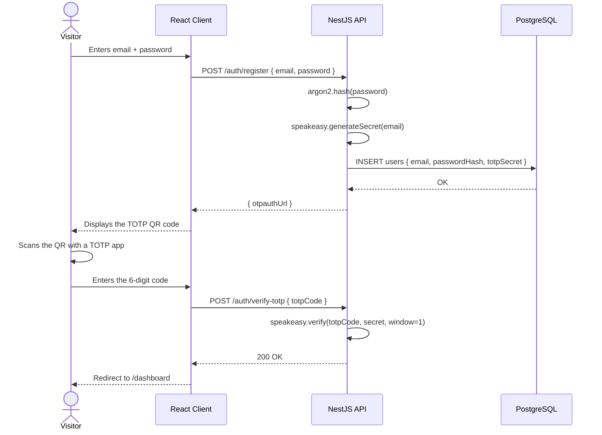

### 2.3 UC-02 — Two-step login

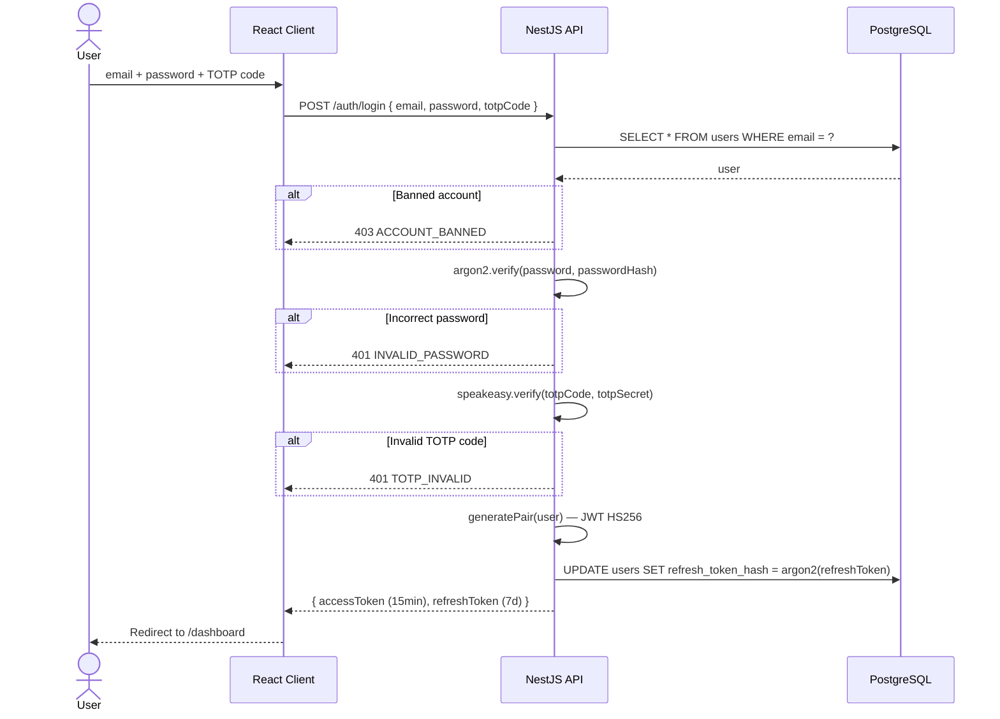

### 2.4 UC-03 — SSO PKCE (Java Desktop → browser → API)

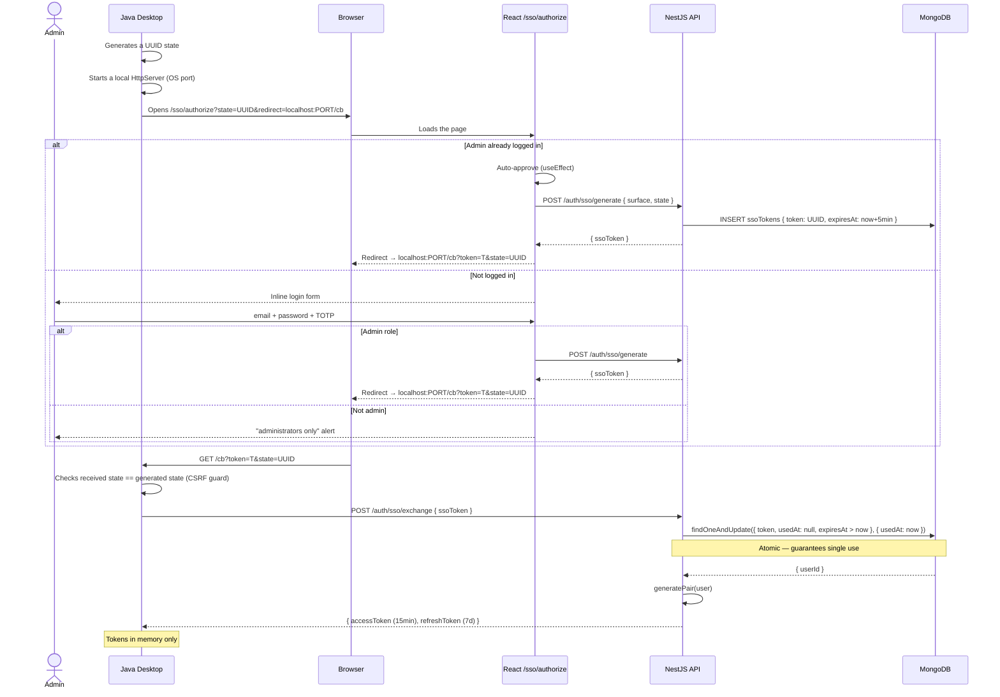

### 2.5 UC-04 — Incident lifecycle

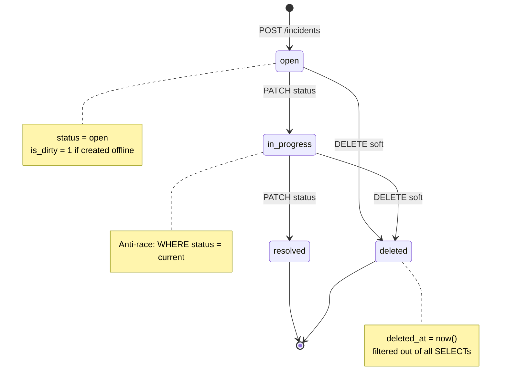

### 2.6 UC-05 — Offline synchronization (Java Desktop)


### 2.7 UC-06 — Points transfer


---

## 3. Conceptual Data Model

### 3.1 PostgreSQL — Relational data

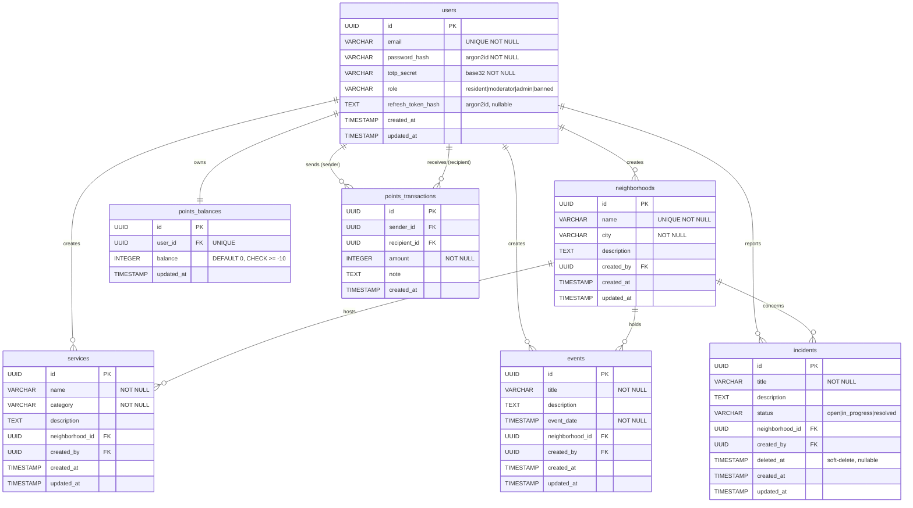

### 3.2 MongoDB — SSO Tokens collection

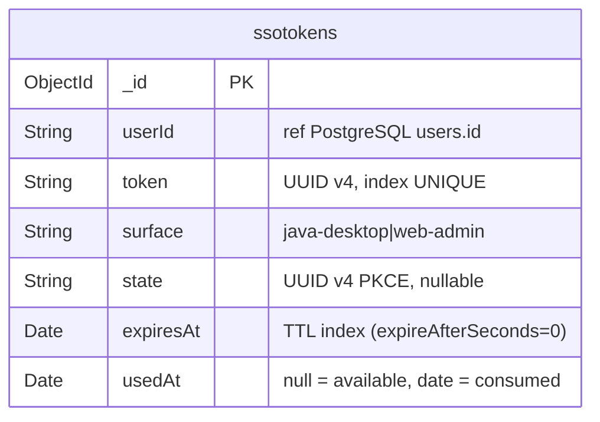

> The MongoDB TTL index automatically deletes the document as soon as `expiresAt` is reached (5 minutes). The `findOneAndUpdate` operation with the filter `{ usedAt: null, expiresAt: { $gt: now } }` guarantees single use atomically.

### 3.3 SQLite — Java Desktop application

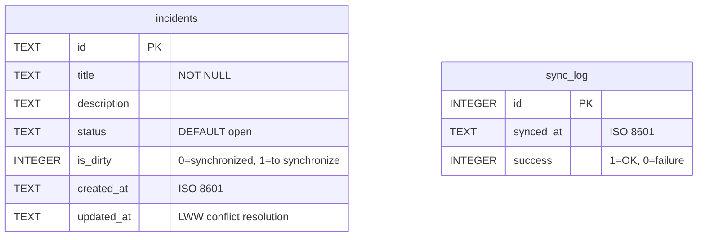

### 3.4 Neo4j — Social graph (Stage 4)


---

## 4. Class diagram — Java Desktop

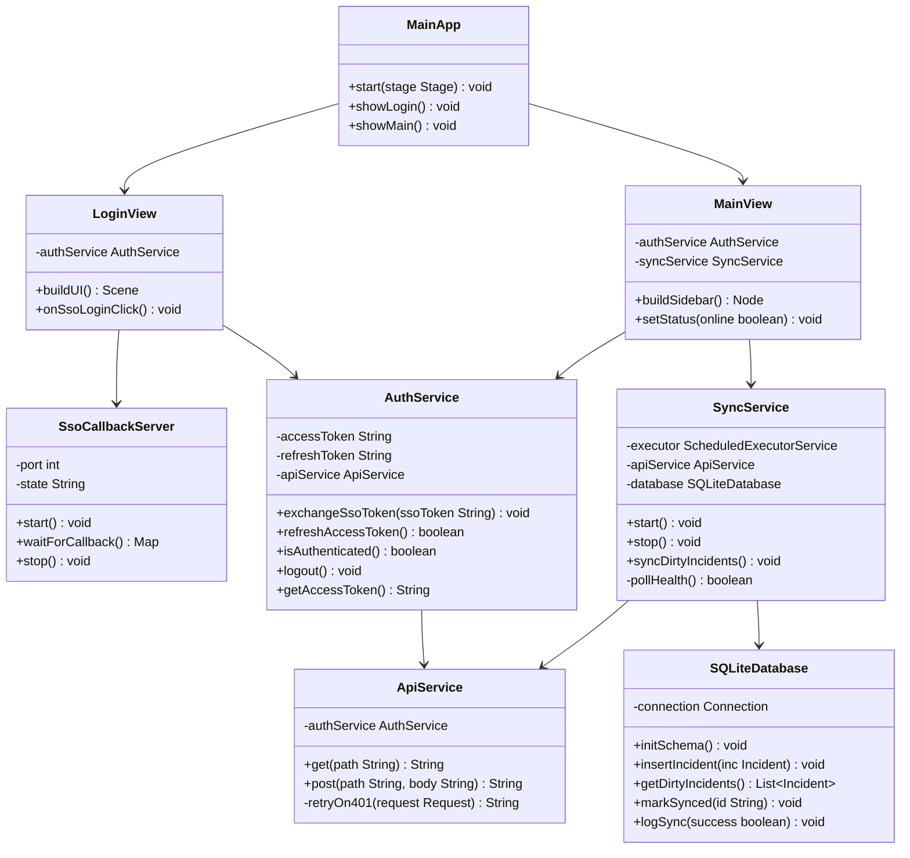

---

## 5. Software architecture

### 5.1 Overview — Docker infrastructure

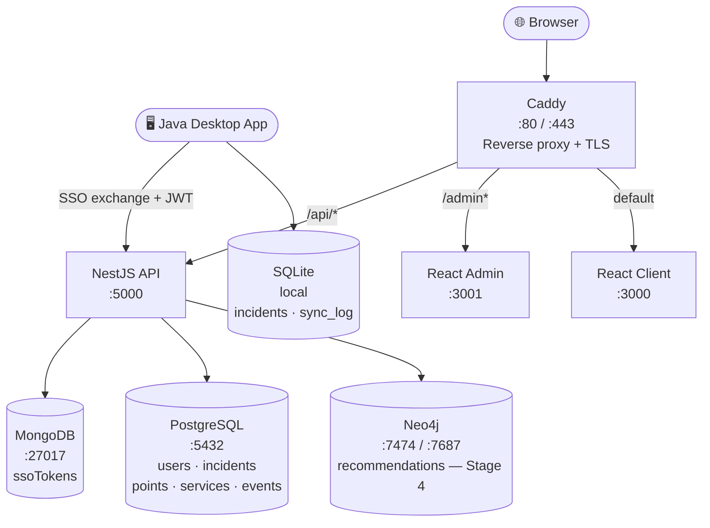

### 5.2 Rationale for each database choice

| Database       | Role                                           | Reason for the choice                                                                                                                                                                                                  |
| -------------- | ---------------------------------------------- | -------------------------------------------------------------------------------------------------------------------------------------------------------------------------------------------------------------------- |
| **PostgreSQL** | Relational data, points transactions           | Native ACID. Points transfers require a `BEGIN/COMMIT` transaction with `SELECT FOR UPDATE` to avoid race conditions. The `CHECK (balance >= -10)` constraint is enforced at the engine level. |
| **MongoDB**    | SSO tokens                                     | Native TTL index for automatic expiration (5 min). Atomic `findOneAndUpdate` for single use. Planned for GridFS (PDFs, media) and GeoJSON (neighbourhoods) in the upcoming stages.                                 |
| **Neo4j**      | Recommendations                                | Social recommendations rely on a graph traversal. In SQL this would require 5 recursive joins (>500 ms). In Cypher a single `MATCH` is enough (<5 ms).                                                  |
| **SQLite**     | Java offline cache                             | Embedded in the JAR, zero network dependency, lightweight mirror of PostgreSQL with the `is_dirty` flag for synchronization.                                                                                            |

### 5.3 NestJS module architecture

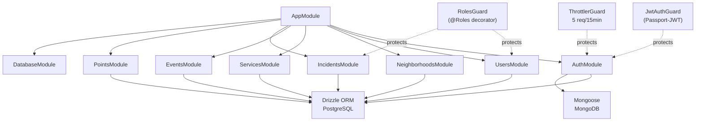

### 5.4 Web monorepo structure (Turbo + pnpm)

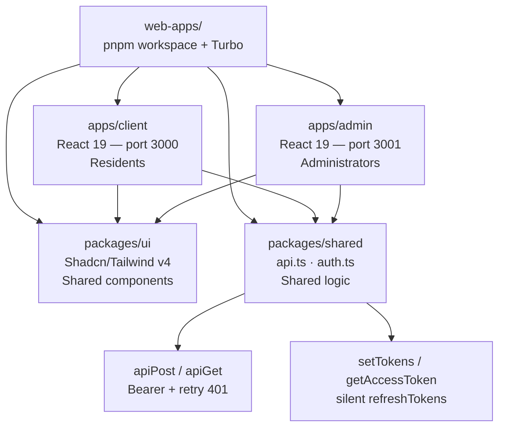

---

## 6. Complex algorithms

### 6.1 TOTP — Time-based One-Time Password (RFC 6238)

**Problem:** verify identity without transmitting a reusable secret on every login.

**Principle:** the server and the client's TOTP app independently compute `HMAC-SHA1(secret, floor(now / 30))` and compare the 6-digit codes. No network exchange is needed for the computation.

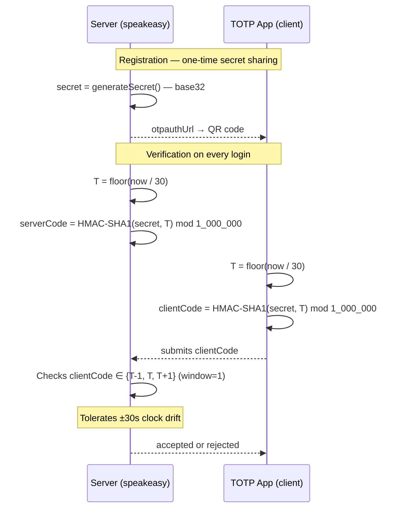

**Security:** the secret is never retransmitted after registration. An intercepted code is unusable after 60 seconds.

### 6.2 Refresh Token Rotation (anti-theft)

**Goal:** detect token theft. If an attacker steals a refresh token and uses it, the victim will detect the revocation on their next access.

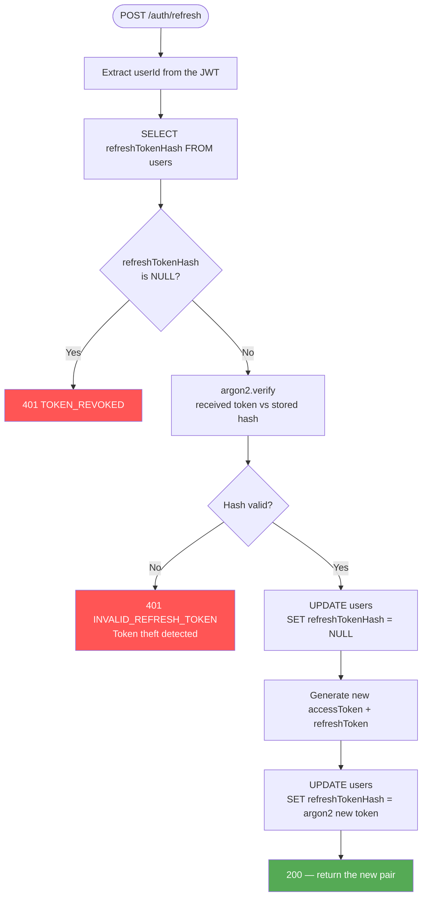

> **Full rotation:** on every refresh, the old hash is overwritten. If the same old token is replayed (by an attacker), it is rejected because the hash no longer matches.

### 6.3 Offline synchronization — Last-Write-Wins

**Strategy:** each record's `updated_at` field acts as the tie-breaker in case of conflict. The most recent version wins.

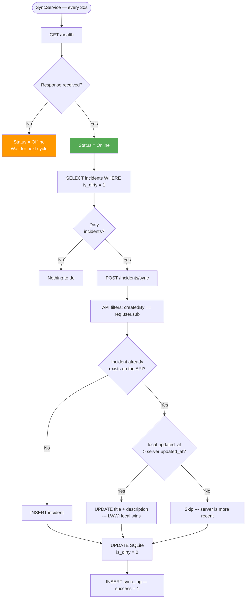

### 6.4 Points transfer — ACID transaction

**Problem:** two simultaneous transfers from the same account could both pass the balance check before either one debits, leading to a negative balance below -10.

**Solution:** `SELECT ... FOR UPDATE` locks the row until `COMMIT`.

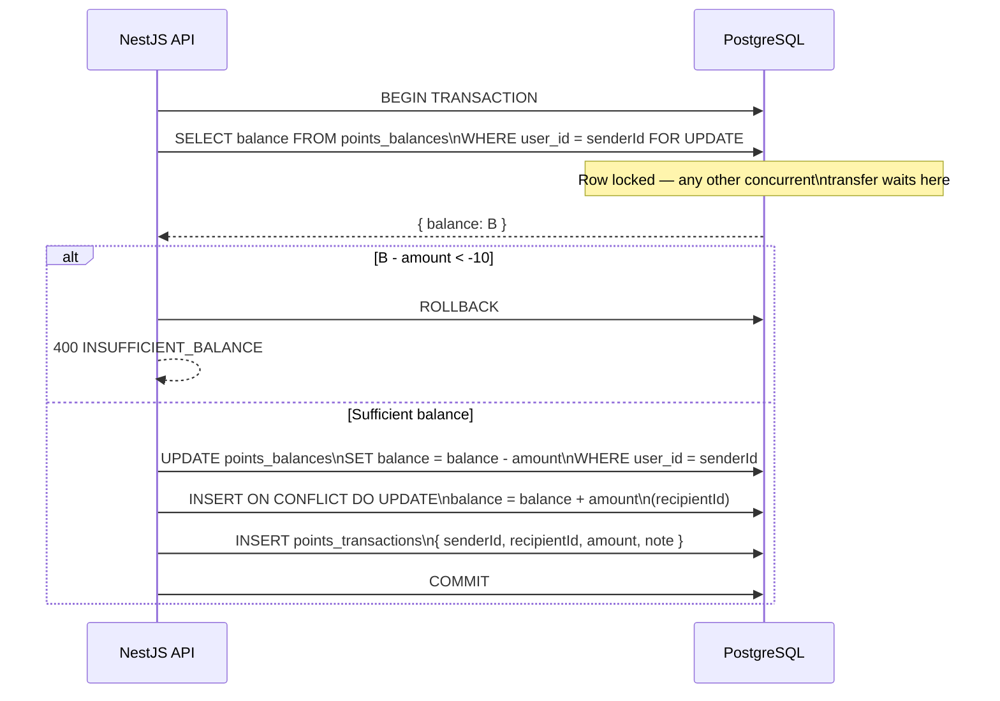

> The `CHECK (balance >= -10)` constraint at the PostgreSQL level provides an extra safety net independent of the application code.

### 6.5 Incident state machine — Anti-race condition

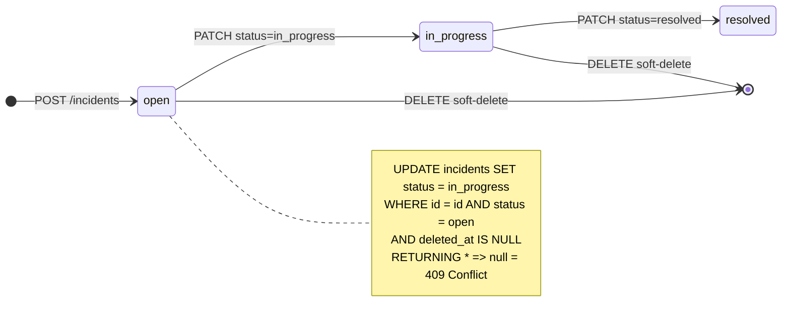

**Checking the current status in the `WHERE` clause:** if two moderators try to move an incident to `in_progress` at the same time, one of them will get `null` back (the `status = 'open'` condition will be false) and will receive a `409 Concurrent update detected` error.

---

## 7. APIs and frameworks used

### 7.1 NestJS backend (TypeScript)

| Library               | Version | Role in the project                                                         |
| --------------------- | ------- | --------------------------------------------------------------------------- |
| **NestJS**            | 11      | Main framework — dependency injection, guards, decorators, modules          |
| **Drizzle ORM**       | 0.40    | Type-safe PostgreSQL ORM — queries, migrations, `onConflictDoUpdate`        |
| **Mongoose**          | 8       | MongoDB ODM — SSO tokens, TTL index, atomic `findOneAndUpdate`              |
| **Passport-JWT**      | 4       | Injectable JWT validation strategy (`JwtStrategy`)                          |
| **@nestjs/jwt**       | 11      | HS256 signing, access lifetime 15 min / refresh 7 d                         |
| **argon2**            | 0.40    | argon2id hashing of passwords and refresh tokens                           |
| **speakeasy**         | 2.0     | TOTP generation and verification (RFC 6238), window ±1                      |
| **@nestjs/throttler** | 6       | Rate limiting — 5 requests / 15 min on `/auth/login`                        |
| **Zod**               | 3       | Validation of incoming DTOs (replaced class-validator)                      |

### 7.2 React frontend (TypeScript)

> **Stage 2 scope:** only the authentication pages are implemented at this point.
> The business pages (incidents, services, events, points balance) and the complete Admin back-office
> are planned for Stage 3 (31 May 2026).

**Existing pages:**

| Application          | Route                                           | Status    |
| -------------------- | ----------------------------------------------- | --------- |
| React Client (:3000) | `/login` — two-step login                       | ✅         |
| React Client (:3000) | `/register` — registration + TOTP QR            | ✅         |
| React Client (:3000) | `/dashboard` — profile + SSO token              | ✅         |
| React Admin (:3001)  | `/login` — admin role check                     | ✅         |
| React Admin (:3001)  | `/dashboard` — stats placeholder                | ✅         |
| React Client (:3000) | `/incidents`, `/services`, `/events`            | ❌ Stage 3 |
| React Admin (:3001)  | User management, moderation, real stats         | ❌ Stage 3 |

**Libraries used:**

| Library             | Version | Role in the project                                               |
| ------------------- | ------- | ------------------------------------------------------------------ |
| **React**           | 19      | UI library                                                        |
| **Vite**            | 6       | Build + Hot Module Replacement                                     |
| **TanStack Router** | 1       | 100% type-safe file-based routing, auto-generated `routeTree.gen.ts` |
| **TanStack Form**   | 1       | Form handling and validation                                       |
| **TanStack Query**  | 5       | Server cache, automatic invalidation (prepared for Stage 3)        |
| **Shadcn/ui**       | latest  | Accessible components based on Radix UI                            |
| **Tailwind CSS**    | v4      | Utility styles                                                     |
| **Turbo**           | 2       | Build cache for the monorepo                                       |

### 7.3 Java Desktop (JSE / JavaFX)

| API / Library                                     | Role                                                                   |
| ------------------------------------------------- | ---------------------------------------------------------------------- |
| **JavaFX** (JSE included)                         | Graphical interface — `BorderPane`, `VBox`, `Label`, `Button`, `Stage` |
| **java.net.http.HttpClient**                      | HTTP/HTTPS requests to the NestJS API                                  |
| **java.util.concurrent.ScheduledExecutorService** | Sync thread — polls `/health` every 30 s                              |
| **java.sql (JDBC)** + **SQLite JDBC**             | Local SQLite database (org.xerial:sqlite-jdbc)                         |
| **com.sun.net.httpserver.HttpServer**             | Local HTTP server to receive the SSO PKCE callback                    |
| **Maven Shade Plugin**                            | Generation of the self-contained Fat JAR (~25 MB)                     |

### 7.4 Python DSL (PLY)

| Library                   | Role                                                                                        |
| ------------------------- | ------------------------------------------------------------------------------------------- |
| **PLY** (Python Lex-Yacc) | Lexer (`lexer.py`) + parser (`parser.py`) — syntactic analysis of the in-house query language |
| **pythonia**              | Python ↔ Node.js bridge — calling the compiler from NestJS via `POST /dsl/query`            |

---

## 8. Tests

### 8.1 Overall summary

| Suite               | Result        | Tooling                                       |
| ------------------- | ------------- | --------------------------------------------- |
| API unit tests      | **103 / 103** | Jest + ts-jest                                |
| API E2E tests       | **56 / 56**   | Jest + Supertest (real MongoDB + PostgreSQL)  |
| Desktop tests       | **8 / 8**     | JUnit 5 + Mockito                             |
| Web tests           | **14 / 14**   | Playwright (headless Chrome)                  |
| **Total**           | **181 / 181** | —                                             |

**API coverage:** 80.58% of branches (minimum threshold: 75%, target: 80%)

### 8.2 Testing strategy

```mermaid
graph TD
    T1["Unit tests\n(Jest — API)\nMocked database\nIsolated business logic"]
    T2["E2E tests\n(Supertest — API)\nReal databases\nFull HTTP flows"]
    T3["Unit tests\n(JUnit 5 — Desktop)\nMocked ApiService\nSync + auth logic"]
    T4["UI tests\n(Playwright — Web)\nReal browser\nFull user flows"]

    T1 -->|"103 tests\n80% coverage"| OK1([Logic confidence])
    T2 -->|"56 tests\nZero DB mocks"| OK2([Integration confidence])
    T3 -->|"8 tests\nMockito"| OK3([Java confidence])
    T4 -->|"14 tests\nheadless Chrome"| OK4([UI confidence])
```

> **E2E testing principle:** no database mocks. The tests use real MongoDB and PostgreSQL, with a `beforeAll` that seeds the data via the API (no direct database inserts).

### 8.3 API unit test examples

**Security test — rejecting an invalid status filter:**

```typescript
// api/src/incidents/incidents.controller.spec.ts
it('should throw BadRequestException for invalid status', async () => {
  await expect(
    controller.findAll('hacked_status', '1', '20')
  ).rejects.toThrow(BadRequestException);
});
```

**Security test — `createdBy` forced from the JWT token:**

```typescript
it('should force createdBy to req.user.sub, ignoring client value', () => {
  const dto = { title: 'Test', createdBy: 'attacker-uuid', ... };
  controller.create(dto, { user: { sub: 'real-user-uuid' } });

  expect(insertValues).toMatchObject({ createdBy: 'real-user-uuid' });
  // 'attacker-uuid' is never used
});
```

**Security test — banning revokes existing tokens:**

```typescript
// api/src/auth/auth.service.spec.ts
it('should reject banned user even with valid refresh token', async () => {
  mockUser.role = 'banned';
  await expect(service.refresh({ refreshToken: validToken }))
    .rejects.toThrow(new HttpException('ACCOUNT_BANNED', 403));
});
```

### 8.4 JUnit test example — Desktop

```java
// AuthServiceTest.java
@Test
void exchangeSsoToken_shouldStoreTokensInMemoryOnly() throws Exception {
    when(mockApiService.post("/auth/sso/exchange", anyString()))
        .thenReturn("{\"accessToken\":\"at123\",\"refreshToken\":\"rt456\"}");

    authService.exchangeSsoToken("valid-sso-token");

    assertEquals("at123", authService.getAccessToken());
    // Critical check: never written to disk
    assertFalse(Files.exists(Path.of("access_token.txt")));
    assertFalse(Files.exists(Path.of("refresh_token.txt")));
}
```

### 8.5 Commands to run the tests

```bash
# API unit tests with coverage
cd api && pnpm run test:cov

# API E2E tests (requires MongoDB + PostgreSQL running)
docker compose up -d mongodb postgresql
cd api && pnpm run test:e2e

# Desktop JUnit tests
cd desktop-app && ./mvnw test

# Full validation (lint + typecheck + tests + build)
make validate
```

---

## 9. Java Desktop demonstration

### 9.1 Launch the application

```bash
# Build the Fat JAR (~25 MB, self-contained)
cd desktop-app && ./mvnw clean package -q

# Launch
java -jar target/quartierconnect-desktop.jar
```

### 9.2 Demo accounts

```bash
# Generate the test data
npx ts-node scripts/seed-demo.ts

# Created accounts:
#   alice@demo.fr     — role: resident
#   bob@demo.fr       — role: moderator
#   admin@demo.fr     — role: admin  (+ SQL UPDATE needed to set the admin role)

# Shared password: Demo1234!
# TOTP secret: randomly generated per account — retrieve it from PostgreSQL:
#   docker exec docker-postgres-1 psql -U qc -d quartierconnect \
#     -c "SELECT email, totp_secret FROM users;"

# Generate the TOTP code from the command line:
oathtool --totp --base32 <ACCOUNT_SECRET>

# Set the admin role after seeding:
docker exec docker-postgres-1 psql -U qc -d quartierconnect \
  -c "UPDATE users SET role = 'admin' WHERE email = 'admin@demo.fr';"
```

### 9.3 SSO PKCE scenario (admin already logged in)

```mermaid
sequenceDiagram
    actor Admin
    participant J as Java Desktop
    participant B as Browser
    participant A as API

    Admin->>B: Log in at localhost:3000 with admin@demo.fr
    Admin->>J: Launch the Java app
    Admin->>J: Click "Log in via the browser"
    J->>J: Generate state UUID + start local HttpServer
    J->>B: Open /sso/authorize?state=...&redirect=localhost:PORT/cb
    B->>B: useEffect detects the active admin session
    B->>A: POST /auth/sso/generate
    A-->>B: { ssoToken }
    B->>J: Redirect → /cb?token=...&state=...
    J->>J: Verify state (CSRF guard)
    J->>A: POST /auth/sso/exchange { ssoToken }
    A-->>J: { accessToken, refreshToken }
    J->>J: Store in memory, show MainView
    Note over Admin,J: Seamless login — zero manual entry
```

### 9.4 Offline detection scenario

```mermaid
sequenceDiagram
    participant J as Java Desktop
    participant S as SyncService
    participant DB as SQLite
    participant API as NestJS API

    loop Every 30 seconds
        S->>API: GET /health
        alt API unreachable
            API--xS: timeout
            S->>J: Indicator = "Offline" (red)
            Note over J: The user can keep\ncreating local incidents
        else API reachable
            API-->>S: 200 { status: "ok" }
            S->>J: Indicator = "Online" (green)
            S->>DB: SELECT incidents WHERE is_dirty = 1
            DB-->>S: [incidents to synchronize]
            S->>API: POST /incidents/sync { incidents }
            API-->>S: { upserted: N }
            S->>DB: UPDATE is_dirty = 0
        end
    end
```

### 9.5 Planned demonstration points

| Point                | Scenario                                                             |
| -------------------- | -------------------------------------------------------------------- |
| Auto SSO PKCE        | Admin already logged in → Java login with no interaction            |
| Manual SSO PKCE      | Browser not logged in → inline form → Java login                    |
| Non-admin rejection  | Attempt SSO with `alice@demo.fr` (resident) → alert                 |
| Offline detection    | `docker stop docker-api-1` → red indicator in <30s                  |
| Back online          | `docker start docker-api-1` → green indicator                       |
| Offline sync         | Create an incident offline → go back online → verify on the API side |

---

*Project report — QuartierConnect · Group 1 · 3AL2 · ESGI 2025-2026*
*Stage 2 submission — 8 April 2026 — Instructor: Frédéric SANANES*
