# Project Report — Stage 3
## QuartierConnect — *Connected Neighbours*

---

|                    |                                                                            |
| ------------------ | -------------------------------------------------------------------------- |
| **Group**          | 1 — 3AL2                                                                   |
| **Members**        | Claudio REIBAUD · Andras SCHULLER · Mouhamadou N'DIAYE                     |
| **Instructor**     | Frédéric SANANES                                                          |
| **Submission date**| 31 May 2026                                                                |
| **Meeting**        | 4 June 2026                                                                |
| **Progress**       | Stage 3 — 60% complete (partial progress on some Stage 4 items)            |

---

## Table of contents

1. [Functional overview](#1-functional-overview)
2. [Use cases](#2-use-cases)
3. [Conceptual data model](#3-conceptual-data-model)
4. [Geographic modelling of the neighbourhood](#4-geographic-modelling-of-the-neighbourhood)
5. [Software architecture](#5-software-architecture)
6. [Complex algorithms](#6-complex-algorithms)
7. [APIs and frameworks used](#7-apis-and-frameworks-used)
8. [Tests](#8-tests)
9. [Demonstration](#9-demonstration)

---

## 1. Functional overview

### 1.1 Project recap

QuartierConnect is a collaborative platform for the residents of a residential neighbourhood. It lets them exchange services valued through a points system, sign digital documents, take part in community events, communicate in real time and vote on neighbourhood matters. A JavaFX desktop application rounds out the suite for offline-first management of incidents and statistics.

The platform is available across three surfaces:

- **React Client** (port 3000) — resident interface;
- **React Admin** (port 3001) — administrator back office;
- **Java Desktop** — JavaFX rich-client application, working offline through SQLite.

### 1.2 Objective of Stage 3 (60%)

Stage 2 (30%) had delivered full authentication, cross-surface SSO and the backend CRUD operations without any interface. Stage 3 targets **60%**: exposing all business modules through a **complete documented API (Scalar)**, wiring **every React page to real data**, finalising the **two-way synchronisation** of the Java client and delivering the **geographic modelling of the neighbourhood** (polygon drawing tool).

### 1.3 Progress status

#### Stage 3 target — ✅ Complete

| Deliverable (CDC §14.3)                                          | Status                                  |
| --------------------------------------------------------------- | --------------------------------------- |
| ServicesModule + ContractsModule + PointsModule (ACID)          | ✅ Done                                  |
| DocumentsModule (SHA-256 signature, GridFS, audit)              | ✅ Done                                  |
| SocialModule (Neo4j, recommendations)                           | ✅ Done                                  |
| MessagingModule (WebSocket Socket.io)                           | ✅ Done                                  |
| VotesModule + CommunityVotesModule (4 types, Strategy)          | ✅ Done                                  |
| IncidentsModule (PostgreSQL, state machine)                     | ✅ Done                                  |
| Geographic modelling (GeoJSON + Leaflet drawing tool)           | ✅ Done                                  |
| React Client — all pages backed by real data                   | ✅ Done                                  |
| Java Desktop — two-way offline/online LWW sync                 | ✅ Done                                  |
| Scalar API documentation (`GET /api/docs`)                      | ✅ Done                                  |
| E2E tests (auth, services, contracts, points, neo4j, messaging) | ✅ Done                                  |
| Coverage ≥ 60%                                                  | ✅ Exceeded (statements 95.7%)           |

#### Partial progress on Stage 4

| Module                                          | Status                                      |
| ----------------------------------------------- | ------------------------------------------- |
| PLY DSL (lex/yacc) + pythonia bridge            | ✅ Done — *test consolidation planned*       |
| Neo4j recommendations (real-time sync)          | ✅ Done — *scoring refinement to come*       |
| GDPR JSON export                                | ✅ Done — *deletion flow to finish*          |
| React Admin — management views                  | 🟡 Advanced — *main views delivered*        |

#### Remaining work — Stage 4 (95%)

| Module                                                | Target  |
| ----------------------------------------------------- | ------- |
| React Admin — all views + real statistics             | Stage 4 |
| Java plugin system + 4 plugins                        | Stage 4 |
| Java theme system + 3 themes                          | Stage 4 |
| Full FR/EN API i18n                                   | Stage 4 |
| Full GDPR (access, rectification, erasure)            | Stage 4 |

---

## 2. Use cases

### 2.1 Overview diagram

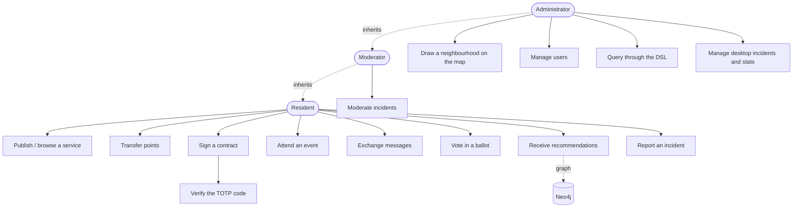

### 2.2 UC-07 — Point transfer between neighbours

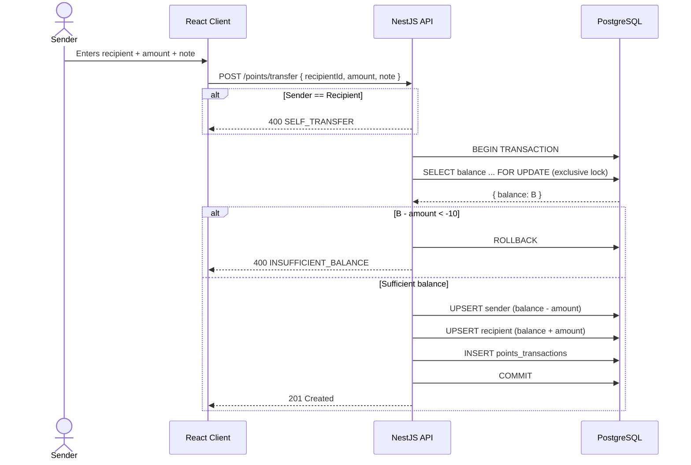

### 2.3 UC-08 — Signing a contract (MFA required)

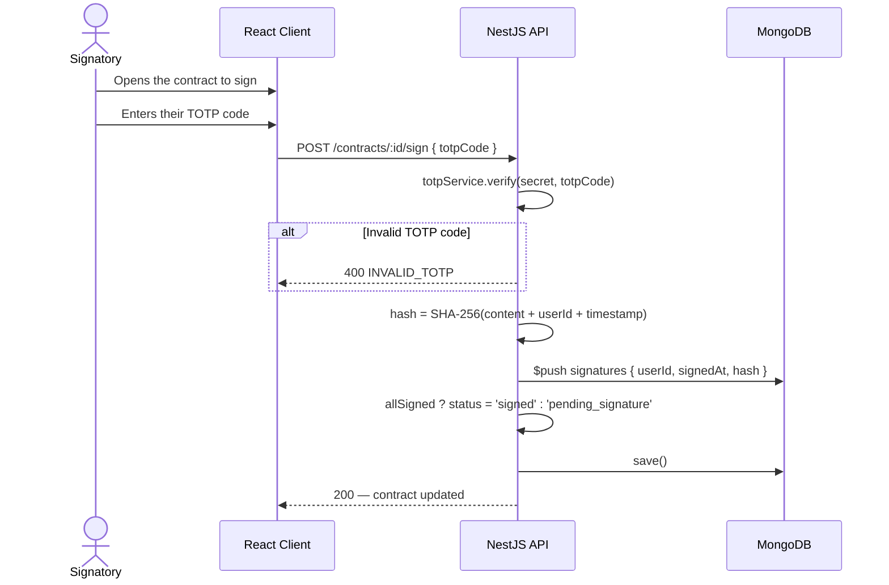

### 2.4 UC-09 — Real-time messaging

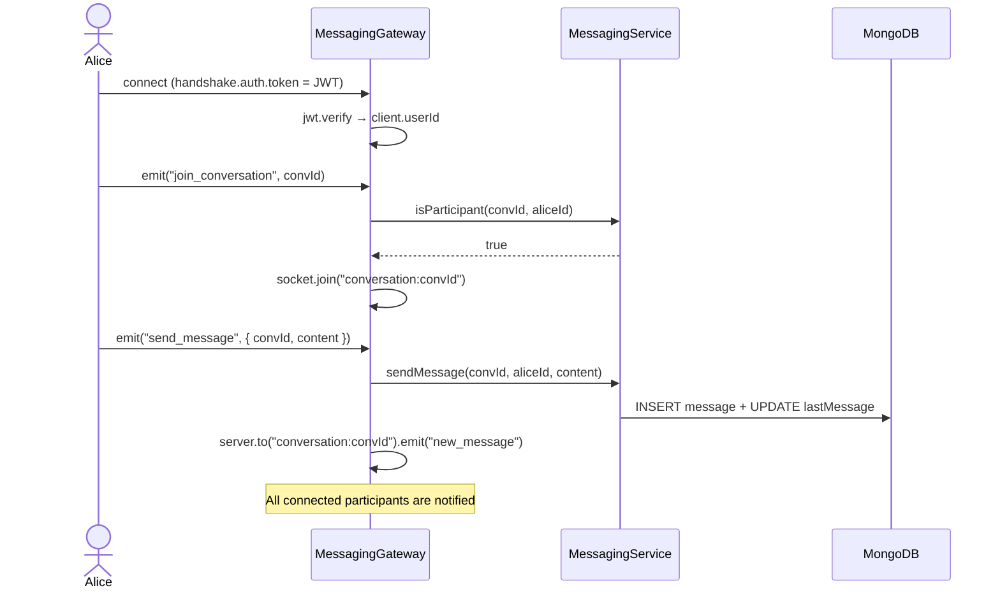

### 2.5 UC-10 — Weighted community ballot

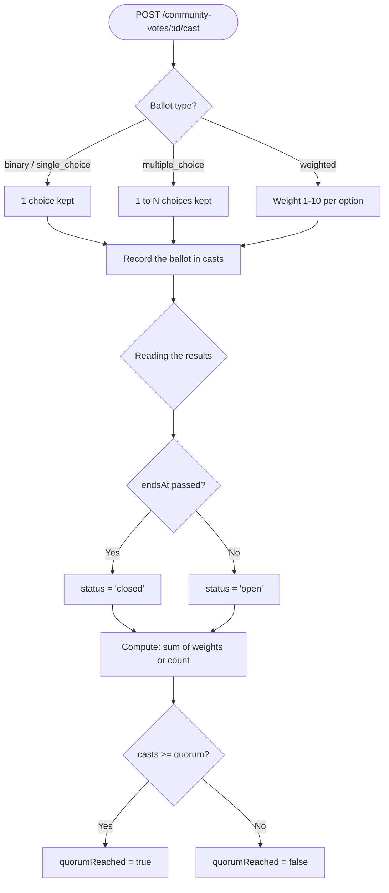

### 2.6 UC-11 — Social recommendation (Neo4j)

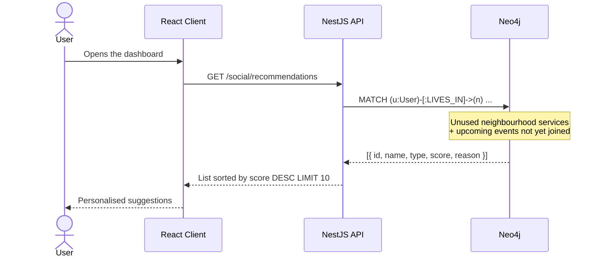

### 2.7 UC-12 — Geographic definition of a neighbourhood (admin)

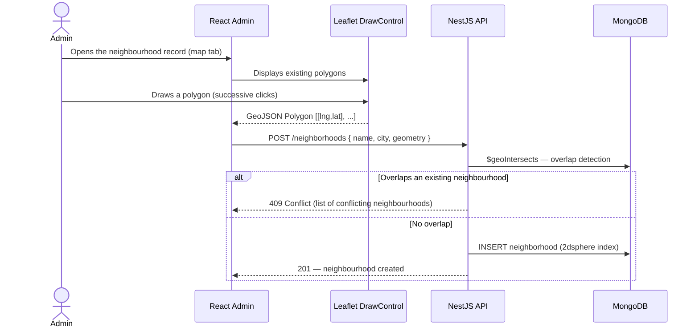

---

## 3. Conceptual data model

Stage 3 confirms the three-database split: **PostgreSQL** for transactional data (auth, incidents, points), **MongoDB** for flexible and geospatial documents, **Neo4j** for the social graph, **SQLite** for the desktop offline cache.

### 3.1 PostgreSQL — Relational data

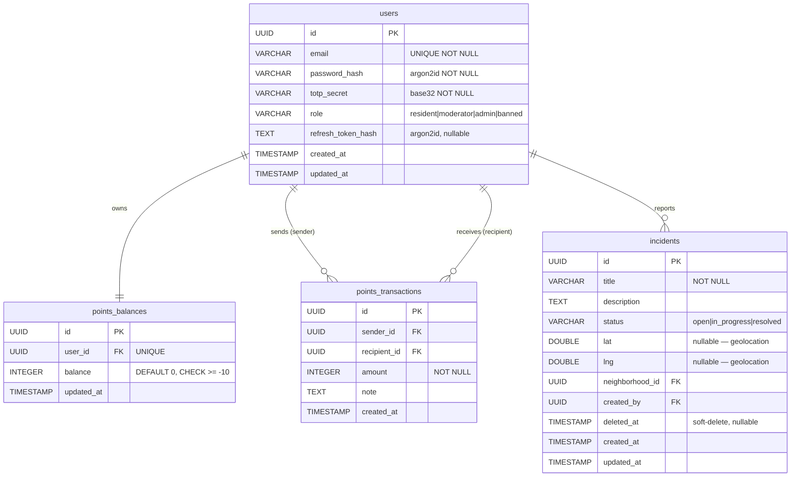

### 3.2 MongoDB — Flexible and geospatial documents

```mermaid
erDiagram
    neighborhoods {
        ObjectId _id        PK
        String   name       "UNIQUE"
        String   city
        Object   geometry   "GeoJSON Polygon — index 2dsphere"
        String   createdBy
    }

    services {
        ObjectId _id        PK
        String   name
        String   category
        String   type       "free|paid"
        Object   location   "GeoJSON Point, nullable"
        String   neighborhoodId
        String   createdBy
    }

    events {
        ObjectId _id        PK
        String   title
        Date     eventDate
        String   address    "nullable"
        Object   location   "GeoJSON Point, nullable"
        String   neighborhoodId
    }

    contracts {
        ObjectId _id          PK
        String   title
        String   content
        String   contentHash  "SHA-256"
        Array    signatories  "userId[]"
        Array    signatures   "{ userId, signedAt, hash }[]"
        String   status       "draft|pending_signature|signed"
    }

    documents {
        ObjectId _id        PK
        ObjectId gridfsId   "GridFS FK — PDF / media"
        String   ownerId
        Array    auditTrail  "{ action, userId, at }[]"
    }

    conversations {
        ObjectId _id          PK
        Array    participants  "userId[]"
        Object   lastMessage
    }

    messages {
        ObjectId _id            PK
        ObjectId conversationId FK
        String   senderId
        String   type           "text|image|audio"
        String   content
        Date     createdAt
    }

    community_votes {
        ObjectId _id       PK
        String   voteType  "binary|single_choice|multiple_choice|weighted"
        Array    options
        Array    casts     "{ userId, choices[], weights{} }[]"
        Number   quorum
        Date     endsAt
        String   status    "open|closed"
    }

    ssotokens {
        ObjectId _id       PK
        String   token     "UUID v4, index UNIQUE"
        String   userId
        Date     expiresAt "TTL index"
        Date     usedAt    "null = available"
    }

    conversations ||--o{ messages : "contains"
```

> The `contracts`, `events` and `messages` collections, along with the `documents` files (PDFs, voice notes, photos), are stored on MongoDB in line with the brief, using **GridFS** for large binaries.

### 3.3 Neo4j — Social graph

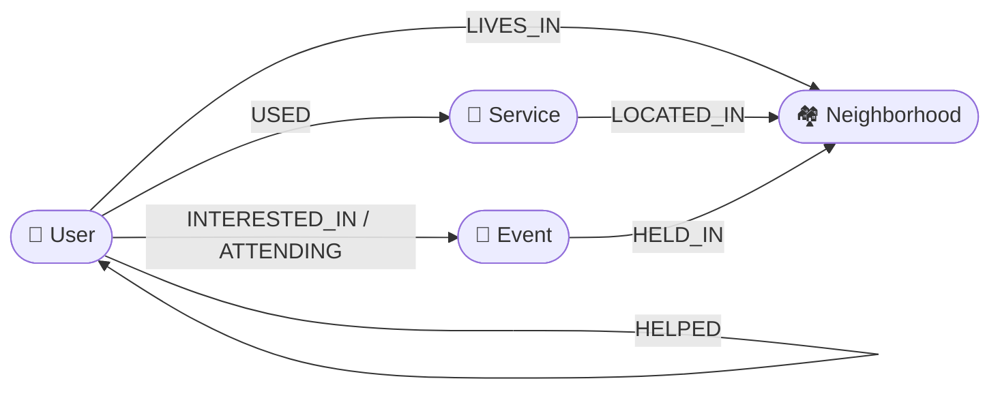

### 3.4 SQLite — Desktop offline cache

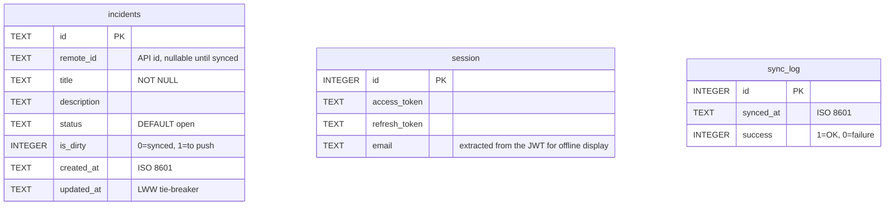

---

## 4. Geographic modelling of the neighbourhood

Geographic modelling is the flagship deliverable of Stage 3. It directly addresses the requirement of the brief: *"allow the administrator to define a neighbourhood geographically, using a drawing tool. Account for boundary problems."*

### 4.1 Shared map component

A shared `Map` component was extracted into `packages/ui` so that both the client and the admin can reuse it without duplication:

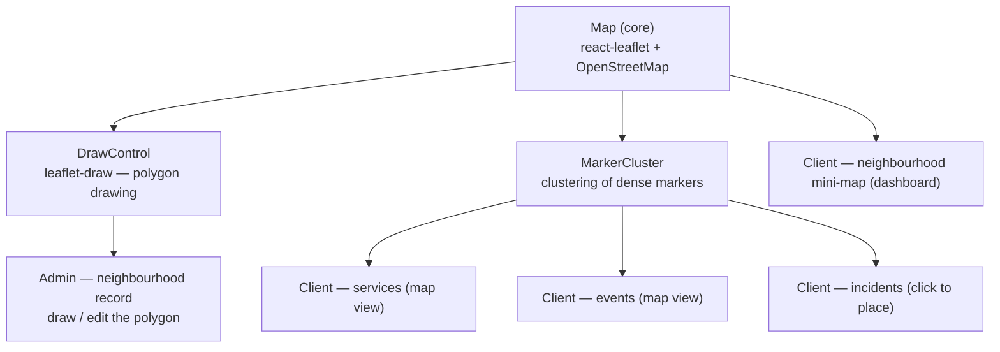

| Surface       | Page                | Map usage                                               |
| ------------- | ------------------- | ------------------------------------------------------- |
| React Admin   | Neighbourhoods      | Draw / edit a polygon, see neighbouring neighbourhoods  |
| React Admin   | Services, Incidents | Map tab + coordinate picker                             |
| React Client  | Dashboard           | Mini-map of the resident's neighbourhood               |
| React Client  | Services, Events    | Map view of geolocated listings                         |
| React Client  | Incidents           | Click on the map to place a report                      |

### 4.2 Boundary handling — overlap detection

Each neighbourhood is a **GeoJSON polygon** indexed with `2dsphere` in MongoDB. On both creation and update, the service rejects any polygon that would overlap another:

```typescript
// neighborhoods.service.ts
async assertNoOverlap(geometry: GeoJsonPolygon, excludeId?: string): Promise<void> {
  const overlapping = await this.neighborhoodModel.find({
    geometry: { $geoIntersects: { $geometry: geometry } }
  }).exec();

  const conflicts = overlapping.filter(n => n._id.toString() !== excludeId);
  if (conflicts.length > 0) {
    throw new ConflictException(
      `The polygon overlaps ${conflicts.length} neighbourhood(s): ${conflicts.map(n => n.name).join(', ')}`
    );
  }
}
```

The `$geoIntersects` query relies on MongoDB's native geodesic algorithm and detects any overlap, even partial. This is the answer to the "boundary problems" of the brief: no resident can belong to two neighbourhoods at once.

### 4.3 Demonstration data

The seed populates several **Paris** neighbourhoods with real polygons and with geolocated services / events / incidents inside them, so that the map views are immediately meaningful during the defence.

---

## 5. Software architecture

### 5.1 NestJS architecture — Stage 3 modules

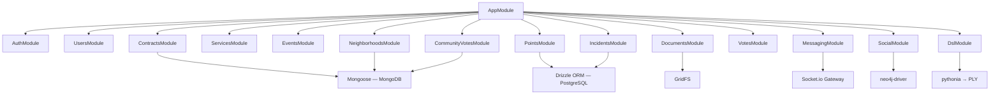

### 5.2 Docker infrastructure — 7 containers

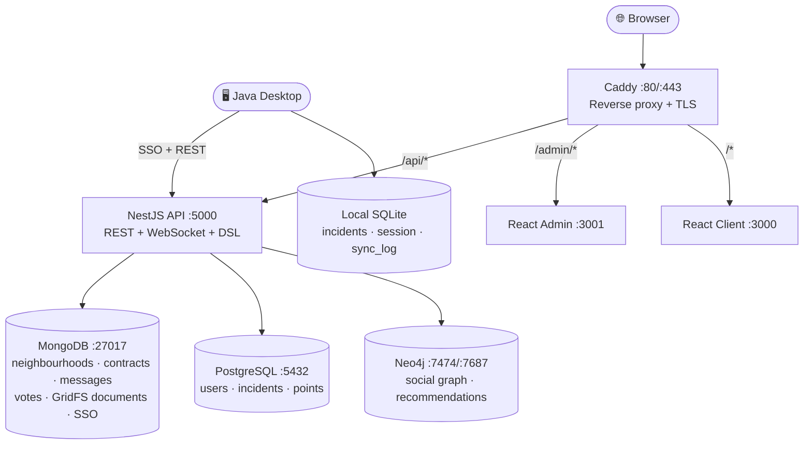

### 5.3 Web monorepo — shared map component

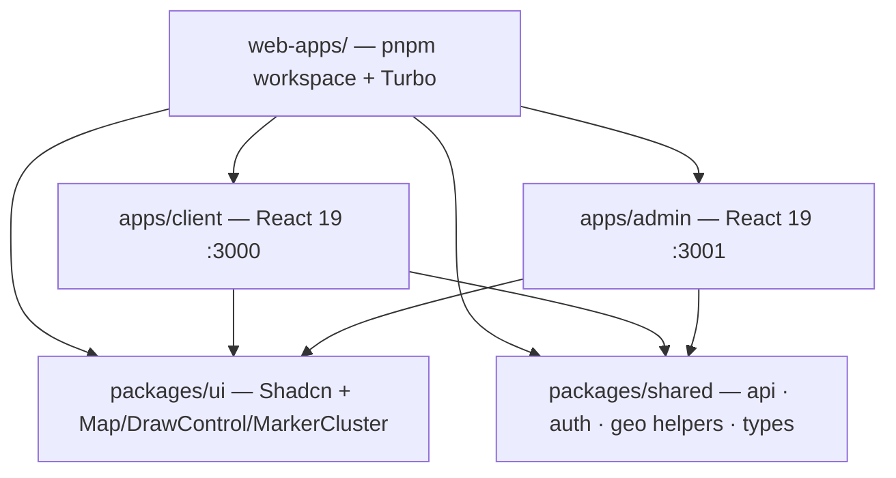

---

## 6. Complex algorithms

### 6.1 Point transfer — ACID transaction

**Problem:** two simultaneous transfers from the same account could both pass the balance check before being debited, producing a balance below the -10 floor.

**Solution:** `SELECT ... FOR UPDATE` locks the row until `COMMIT`.

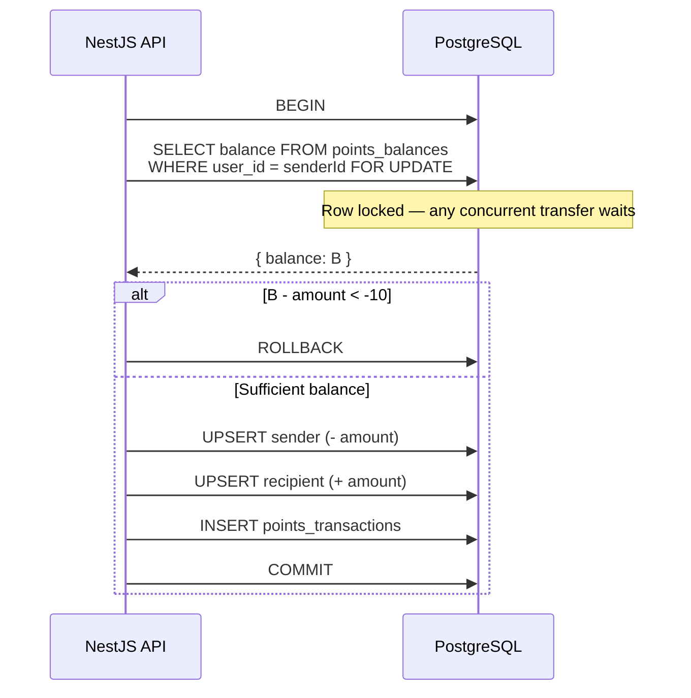

> The `CHECK (balance >= -10)` constraint at the PostgreSQL level is a safety net independent of the application code.

### 6.2 Contract signing — SHA-256 + TOTP

**Principle:** each signatory proves their identity via TOTP, then their signature seals a hash combining the content, their identity and the timestamp. The contract moves to `signed` only once every signatory has signed.

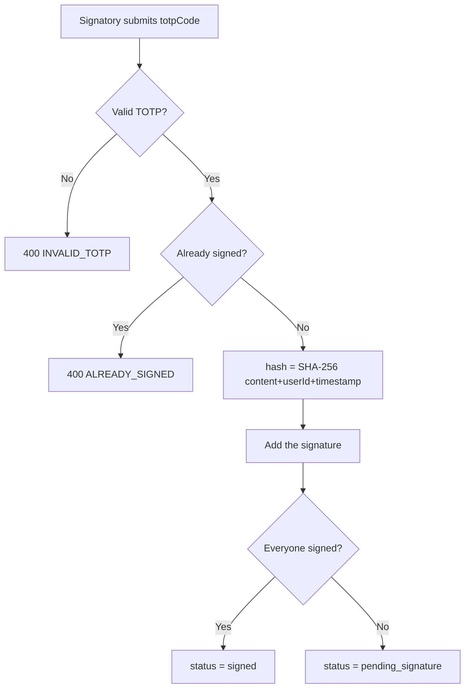

### 6.3 Votes — Strategy Pattern

Simple votes have distinct modes (`up/down` for incidents, `like/dislike` for services). The **Strategy Pattern** isolates each mode in a class, avoiding a cascade of `switch` statements:

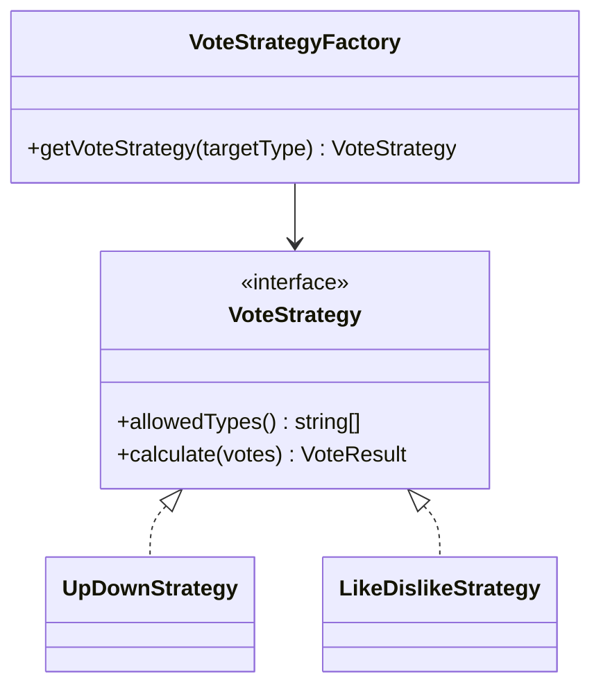

The same vote submitted twice cancels itself out (toggle off); a different vote replaces the previous one.

### 6.4 Social recommendation — Cypher traversal

**Why Neo4j?** A recommendation of "nearby services not yet used + upcoming neighbourhood events" would require several recursive joins in SQL. In Cypher, a single `MATCH` is enough:

```cypher
MATCH (u:User {id: $userId})-[:LIVES_IN]->(n:Neighborhood)
OPTIONAL MATCH (n)<-[:LOCATED_IN]-(s:Service)
WHERE NOT (u)-[:USED]->(s)
RETURN s.id AS id, s.name AS name, 'service' AS type, 3 AS score,
       'Service in your neighborhood' AS reason
UNION
MATCH (u:User {id: $userId})-[:LIVES_IN]->(n:Neighborhood)
OPTIONAL MATCH (n)<-[:HELD_IN]-(e:Event)
WHERE NOT (u)-[:ATTENDING]->(e) AND e.date > datetime()
RETURN e.id AS id, e.name AS name, 'event' AS type, 2 AS score,
       'Upcoming event near you' AS reason
ORDER BY score DESC LIMIT 10
```

The MongoDB → Neo4j synchronisation is **fire-and-forget** (`void socialService.syncX()`): it never blocks the HTTP response, and an unavailable Neo4j is simply logged.

### 6.5 Geospatial overlap detection

Described in [§4.2](#42-boundary-handling--overlap-detection): `$geoIntersects` on a `2dsphere` index rejects any polygon overlapping an existing neighbourhood — this is the boundary handling required by the brief.

### 6.6 Desktop synchronisation — two-way Last-Write-Wins

Stage 2 only pushed incidents created offline. Stage 3 delivers **two-way** synchronisation: based on the `updated_at` timestamp, the client pushes (PUT) or pulls (GET) the most recent version.

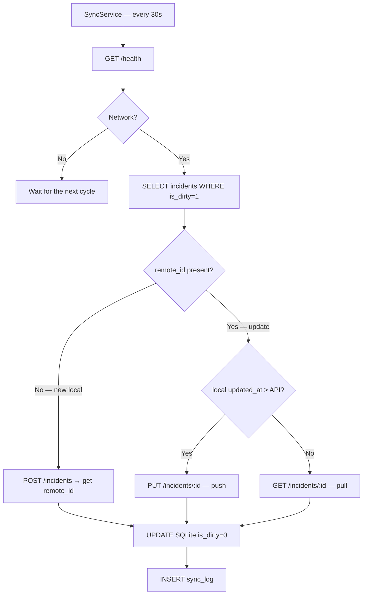

---

## 7. APIs and frameworks used

### 7.1 NestJS backend — Stage 3 additions

| Library            | Version | Role added in Stage 3                                               |
| ------------------ | ------- | ------------------------------------------------------------------- |
| **Socket.io**      | —       | Real-time messaging — `/messaging` namespace, rooms per conversation |
| **neo4j-driver**   | 5       | Social graph — managed sessions, Cypher recommendation queries      |
| **GridFS** (Mongo) | —       | Storage of document binaries (PDFs, photos, voice notes)            |
| **crypto** (Node)  | native  | SHA-256 hash of contract content and signatures                     |
| **pythonia**       | —       | Node.js ↔ Python bridge to run the PLY DSL                          |

(For reference, Stage 2: NestJS 11, Drizzle ORM, Mongoose, Passport-JWT, argon2, speakeasy, @nestjs/throttler, Zod.)

### 7.2 React frontend — business pages wired to real data

> **Major change since Stage 2:** all business pages are now fed by the real API through TanStack Query.

| Application          | Routes delivered                                                          |
| -------------------- | ------------------------------------------------------------------------- |
| React Client (:3000) | `/dashboard`, `/services`, `/events`, `/votes`, `/contracts`, `/incidents`, `/messages` |
| React Admin (:3001)  | `/users`, `/neighborhoods`, `/services`, `/events`, `/incidents`, `/community-votes`, `/dsl`, `/sso`, `/dashboard` |

| Library              | Version | Role added in Stage 3                                         |
| -------------------- | ------- | ------------------------------------------------------------- |
| **react-leaflet**    | —       | Interactive map (shared `Map` component)                      |
| **leaflet-draw**     | —       | Drawing / editing of neighbourhood polygons (`DrawControl`)   |
| **leaflet.markercluster** | —  | Clustering of markers on dense views (`MarkerCluster`)        |
| **TanStack Query**   | 5       | Now used on every page (cache + invalidation)                 |

### 7.3 Java Desktop

| API / Library                       | Role added in Stage 3                                       |
| ----------------------------------- | ----------------------------------------------------------- |
| **StatisticsService**               | Live participation statistics from the API                  |
| **SQLite session**                  | Offline session resume (cached tokens + email)              |
| **Two-way sync**                    | PUT/GET based on LWW arbitration over `updated_at`          |

---

## 8. Tests

### 8.1 Overall summary

| Suite                       | Result   | Tool                                         |
| --------------------------- | -------- | -------------------------------------------- |
| API unit tests              | **261**  | Jest + ts-jest                               |
| API E2E tests               | **149**  | Jest + Supertest (real MongoDB + PostgreSQL) |
| Desktop tests               | **139**  | JUnit 5 + Mockito                            |
| Web tests (shared hooks)    | **73**   | Vitest                                       |
| Web E2E tests               | **87**   | Playwright (headless Chrome)                 |
| DSL tests                   | **21**   | pytest                                       |
| **Total**                   | **~730** | —                                            |

**API coverage:** statements **95.7%**, branches **86.1%** — well beyond the Stage 3 threshold (≥ 60%).

### 8.2 New Stage 3 E2E suites

| E2E file                                       | Covers                                            |
| ---------------------------------------------- | ------------------------------------------------- |
| `api/test/contracts.e2e-spec.ts`               | Creation, TOTP signing, `signed` status           |
| `api/test/points.e2e-spec.ts`                  | ACID transfer, floor balance, self-transfer       |
| `api/test/neighborhoods.e2e-spec.ts`           | GeoJSON CRUD + `$geoIntersects` overlap            |
| `api/test/messaging-ws.e2e-spec.ts`            | WebSocket: JWT auth, `join`, `send_message`        |
| `api/test/modules.e2e-spec.ts`                 | Services, events, community votes                  |
| `e2e/admin/neighborhoods-draw.spec.ts`         | Map rendering + polygon drawing toolbar           |
| `e2e/client/services-map.spec.ts`              | Client-side map view, markers                     |
| `e2e/client/messages.spec.ts`                  | Messaging page: `/login` guard, authenticated render |

### 8.3 Strategy

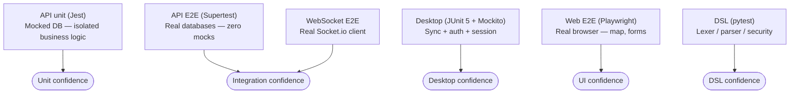

> **Principle of the API E2E tests:** no mocks on the databases. The tests use real MongoDB and PostgreSQL, seeded via the API in a `beforeAll`.

### 8.4 Commands

```bash
make test          # API unit (261) + web hooks (73) + Desktop (139) + DSL (21)
make test-cov      # + coverage report (stmts 95.7% / branches 86.1%)
make test-e2e      # API E2E Supertest (149) — requires Docker
make test-e2e-web  # Playwright E2E (87) — requires the apps running
make validate      # lint + typecheck + tests + build, in sequence
```

---

## 9. Demonstration

### 9.1 Starting the platform

```bash
cp .env.example .env      # fill in the secrets
make docker-up            # 7 containers
make seed                 # demo accounts + Paris neighbourhoods + Neo4j
```

| Surface               | URL                       |
| --------------------- | ------------------------- |
| Resident client       | http://localhost          |
| Admin back office      | http://localhost/admin    |
| API docs (Scalar)     | http://localhost/api/docs |
| Neo4j Browser         | http://localhost:7474     |

### 9.2 Demonstration accounts

| Email         | Password     | Role      | TOTP               |
| ------------- | ------------ | --------- | ------------------ |
| alice@demo.fr | Demo1234!    | resident  | `JBSWY3DPEHPK3PXP` |
| bob@demo.fr   | Demo1234!    | moderator | `JBSWY3DPEHPK3PXP` |
| admin@demo.fr | Demo1234!    | admin     | `JBSWY3DPEHPK3PXP` |

```bash
make totp   # or: oathtool --totp --base32 JBSWY3DPEHPK3PXP
```

### 9.3 Planned demonstration scenarios

| Item                     | Scenario                                                                   |
| ------------------------ | -------------------------------------------------------------------------- |
| Neighbourhood drawing    | Admin → neighbourhood record → draw a polygon → save                       |
| Boundary handling        | Draw a polygon that overlaps an existing neighbourhood → `409 Conflict`    |
| Point transfer           | Alice → Bob, check the balances; attempt to exceed the limit → `400`       |
| Contract signing         | Open a contract, sign with a wrong TOTP (rejected) then the correct one (signed) |
| Real-time messaging      | Two browsers (Alice / Bob) → instant message over WebSocket                |
| Neo4j recommendation     | Alice's dashboard → suggested services and events from her neighbourhood   |
| Weighted ballot          | Create a `weighted` ballot, vote, read the results and the quorum          |
| Client map view          | Geolocated services / events / incidents on the map                        |
| Two-way offline sync     | `docker stop` API → create an incident → restart → check the sync          |
| API documentation        | Browse Scalar at `/api/docs`                                               |

---

*Project report — QuartierConnect · Group 1 · 3AL2 · ESGI 2025-2026*
*Stage 3 submission — 31 May 2026 — Instructor: Frédéric SANANES*
