# Rapport de Projet — Étape 3
## QuartierConnect — *Connected Neighbours*

---

|                    |                                                                            |
| ------------------ | -------------------------------------------------------------------------- |
| **Groupe**         | 1 — 3AL2                                                                   |
| **Membres**        | Claudio REIBAUD · Andras SCHULLER · Mouhamadou N'DIAYE                     |
| **Enseignant**     | Frédéric SANANES                                                          |
| **Date de remise** | 31 mai 2026                                                                |
| **Réunion**        | 4 juin 2026                                                                |
| **Avancement**     | Étape 3 — 60 % réalisé (avance partielle sur certains points de l'Étape 4) |

---

## Table des matières

1. [Descriptif fonctionnel](#1-descriptif-fonctionnel)
2. [Cas d'utilisation](#2-cas-dutilisation)
3. [Modèle Conceptuel de Données](#3-modèle-conceptuel-de-données)
4. [Modélisation géographique du quartier](#4-modélisation-géographique-du-quartier)
5. [Architecture logicielle](#5-architecture-logicielle)
6. [Algorithmes complexes](#6-algorithmes-complexes)
7. [APIs et frameworks utilisés](#7-apis-et-frameworks-utilisés)
8. [Tests](#8-tests)
9. [Démonstration](#9-démonstration)

---

## 1. Descriptif fonctionnel

### 1.1 Rappel du projet

QuartierConnect est une plateforme collaborative destinée aux habitants d'un quartier résidentiel. Elle permet d'échanger des services valorisés par un système de points, de signer des documents numériques, de participer à des événements communautaires, de communiquer en temps réel et de voter sur la vie du quartier. Une application desktop JavaFX complète l'ensemble pour la gestion offline-first des incidents et des statistiques.

La plateforme reste accessible sur trois surfaces :

- **React Client** (port 3000) — interface habitant ;
- **React Admin** (port 3001) — back-office administrateur ;
- **Java Desktop** — application lourde JavaFX, fonctionnant hors-ligne via SQLite.

### 1.2 Objectif de l'Étape 3 (60 %)

L'Étape 2 (30 %) avait livré l'authentification complète, le SSO cross-surface et les CRUD backend sans interface. L'Étape 3 vise les **60 %** : exposer l'ensemble des modules métier via une **API complète documentée (Scalar)**, brancher **toutes les pages React sur des données réelles**, finaliser la **synchronisation bidirectionnelle** du client Java et livrer la **modélisation géographique du quartier** (outil de dessin de polygones).

### 1.3 État d'avancement

#### Cible Étape 3 — ✅ Complète

| Livrable (CDC §14.3)                                            | Statut                                  |
| --------------------------------------------------------------- | --------------------------------------- |
| ServicesModule + ContractsModule + PointsModule (ACID)          | ✅ Terminé                               |
| DocumentsModule (signature SHA-256, GridFS, audit)              | ✅ Terminé                               |
| SocialModule (Neo4j, recommandations)                           | ✅ Terminé                               |
| MessagingModule (WebSocket Socket.io)                           | ✅ Terminé                               |
| VotesModule + CommunityVotesModule (4 types, Strategy)          | ✅ Terminé                               |
| IncidentsModule (PostgreSQL, machine d'états)                   | ✅ Terminé                               |
| Modélisation géographique (GeoJSON + outil de dessin Leaflet)   | ✅ Terminé                               |
| React Client — toutes les pages avec données réelles            | ✅ Terminé                               |
| Java Desktop — sync offline/online LWW bidirectionnelle         | ✅ Terminé                               |
| Documentation API Scalar (`GET /api/docs`)                      | ✅ Terminé                               |
| Tests E2E (auth, services, contrats, points, neo4j, messagerie) | ✅ Terminé                               |
| Coverage ≥ 60 %                                                 | ✅ Dépassé (statements 95,7 %)           |

#### Avance partielle sur l'Étape 4

| Module                                          | Statut                                      |
| ----------------------------------------------- | ------------------------------------------- |
| DSL PLY (lex/yacc) + bridge pythonia            | ✅ Terminé — *consolidation tests prévue*    |
| Recommandations Neo4j (sync temps réel)         | ✅ Terminé — *affinage du scoring à venir*   |
| Export RGPD JSON                                | ✅ Terminé — *parcours suppression à finir*  |
| React Admin — vues de gestion                   | 🟡 Avancé — *vues principales livrées*      |

#### Reste à faire — Étape 4 (95 %)

| Module                                                | Cible   |
| ----------------------------------------------------- | ------- |
| React Admin — toutes les vues + statistiques réelles  | Étape 4 |
| Système de plugins Java + 4 plugins                   | Étape 4 |
| Système de thèmes Java + 3 thèmes                     | Étape 4 |
| i18n API FR/EN complet                                | Étape 4 |
| RGPD complet (accès, rectification, suppression)      | Étape 4 |

---

## 2. Cas d'utilisation

### 2.1 Diagramme général

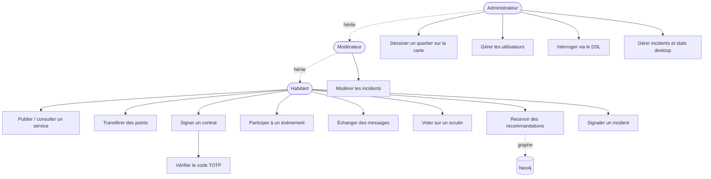

### 2.2 UC-07 — Transfert de points entre voisins

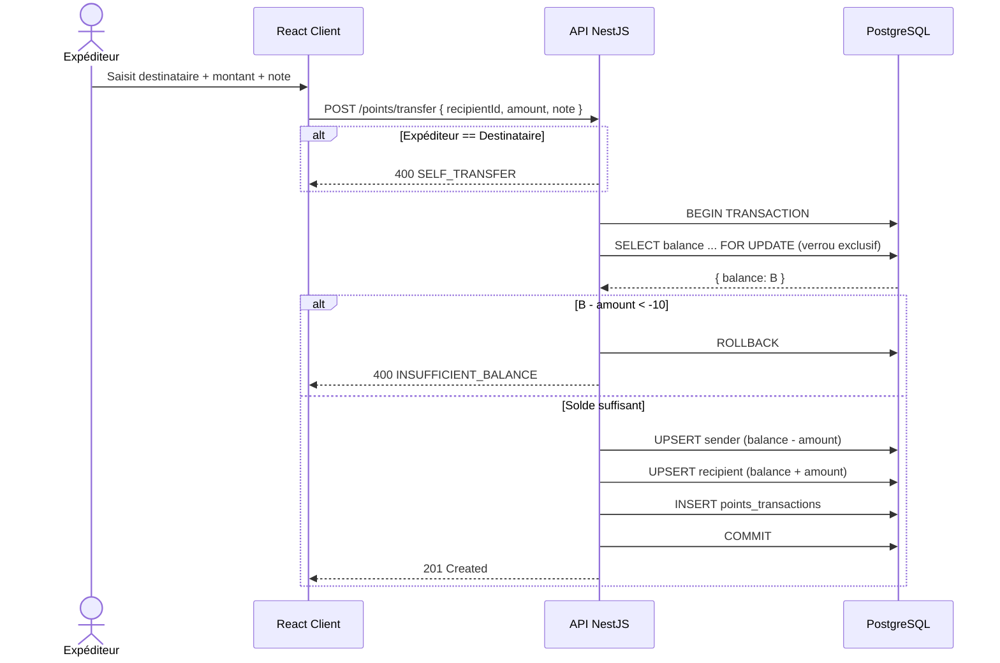

### 2.3 UC-08 — Signature d'un contrat (MFA obligatoire)

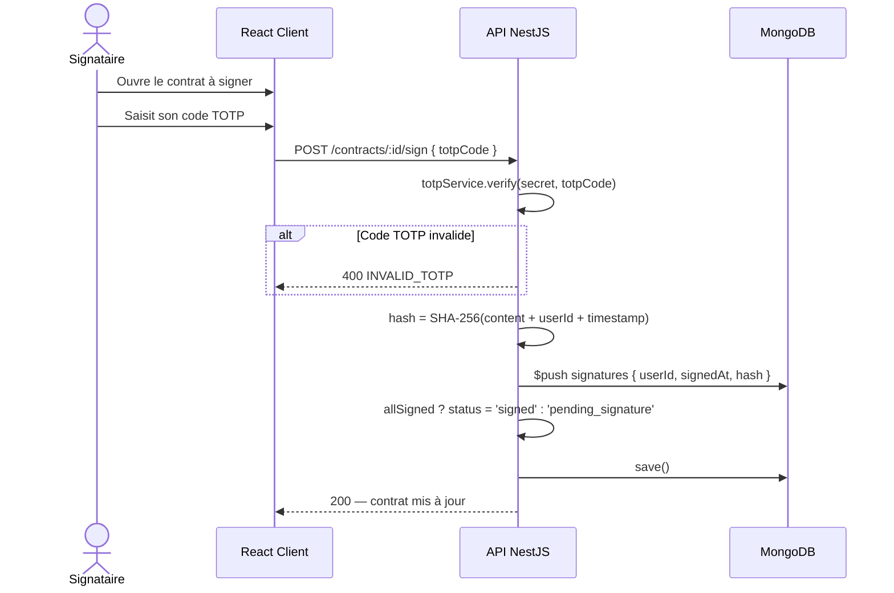

### 2.4 UC-09 — Messagerie temps réel

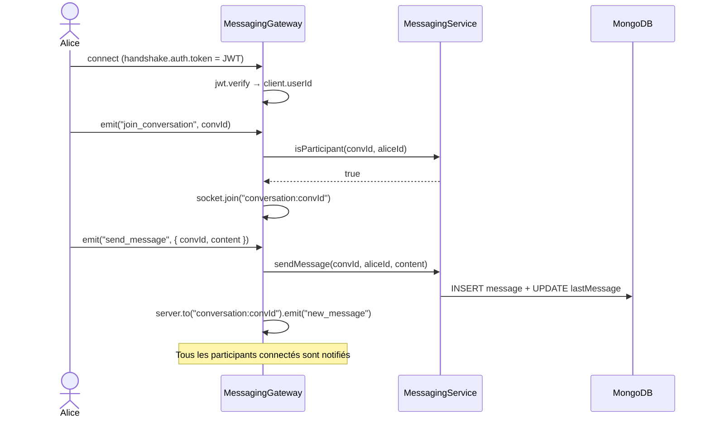

### 2.5 UC-10 — Scrutin communautaire pondéré

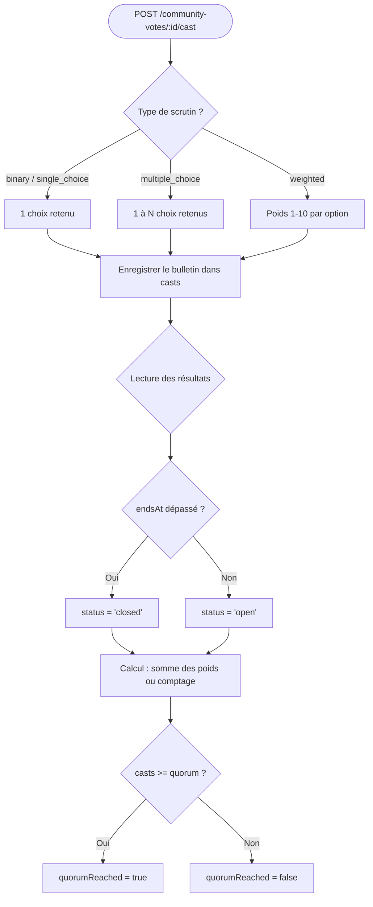

### 2.6 UC-11 — Recommandation sociale (Neo4j)

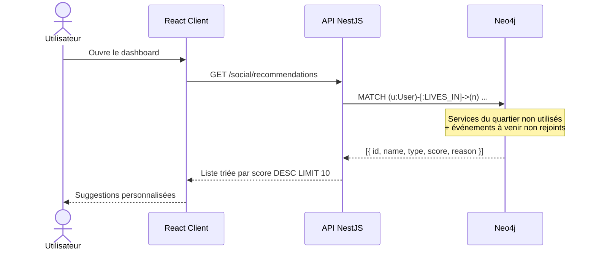

### 2.7 UC-12 — Définition géographique d'un quartier (admin)

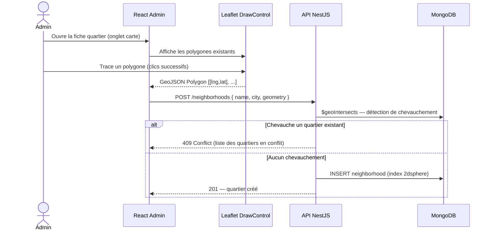

---

## 3. Modèle Conceptuel de Données

L'Étape 3 confirme la répartition tri-base : **PostgreSQL** pour les données transactionnelles (auth, incidents, points), **MongoDB** pour les documents flexibles et géospatiaux, **Neo4j** pour le graphe social, **SQLite** pour le cache offline desktop.

### 3.1 PostgreSQL — Données relationnelles


### 3.2 MongoDB — Documents flexibles et géospatiaux


> Les collections `contracts`, `events`, `messages` et les fichiers `documents` (PDF, vocaux, photos) sont stockés conformément au sujet sur MongoDB, avec **GridFS** pour les binaires volumineux.

### 3.3 Neo4j — Graphe social

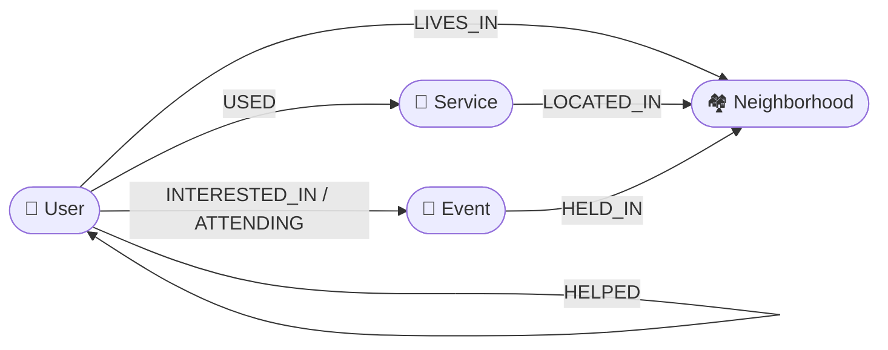

### 3.4 SQLite — Cache offline desktop

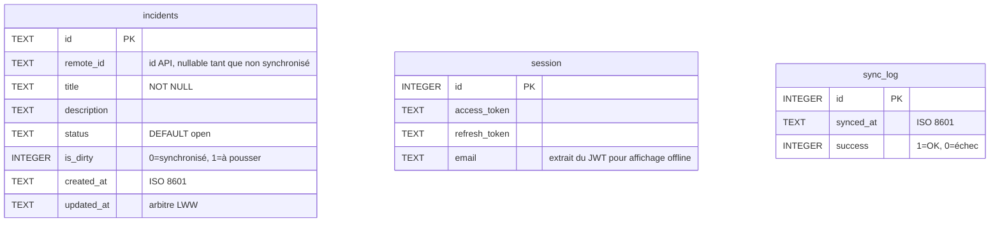

---

## 4. Modélisation géographique du quartier

La modélisation géographique est le livrable phare de l'Étape 3. Elle répond directement à l'exigence du sujet : *« permettre à l'administrateur de définir un quartier géographiquement, à l'aide d'un outil de dessin. Prévoir les problèmes de limites. »*

### 4.1 Composant carte partagé

Un composant `Map` mutualisé a été extrait dans `packages/ui` afin d'être réutilisé par le client et l'admin sans duplication :

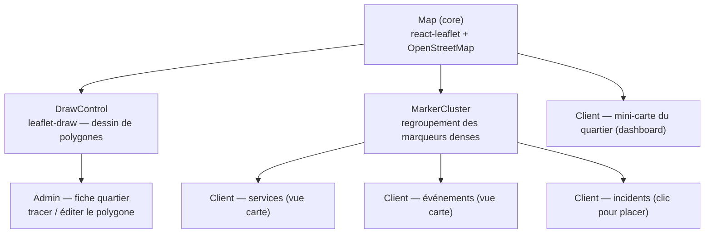

| Surface       | Page                | Usage de la carte                                       |
| ------------- | ------------------- | ------------------------------------------------------- |
| React Admin   | Quartiers           | Tracer / éditer un polygone, voir les quartiers voisins |
| React Admin   | Services, Incidents | Onglet carte + sélecteur de coordonnées                 |
| React Client  | Dashboard           | Mini-carte du quartier de l'habitant                    |
| React Client  | Services, Événements| Vue carte des annonces géolocalisées                    |
| React Client  | Incidents           | Clic sur la carte pour placer un signalement            |

### 4.2 Gestion des limites — détection de chevauchement

Chaque quartier est un **polygone GeoJSON** indexé `2dsphere` dans MongoDB. À la création comme à la modification, le service refuse tout polygone qui en chevaucherait un autre :

```typescript
// neighborhoods.service.ts
async assertNoOverlap(geometry: GeoJsonPolygon, excludeId?: string): Promise<void> {
  const overlapping = await this.neighborhoodModel.find({
    geometry: { $geoIntersects: { $geometry: geometry } }
  }).exec();

  const conflicts = overlapping.filter(n => n._id.toString() !== excludeId);
  if (conflicts.length > 0) {
    throw new ConflictException(
      `Le polygone chevauche ${conflicts.length} quartier(s) : ${conflicts.map(n => n.name).join(', ')}`
    );
  }
}
```

La requête `$geoIntersects` s'appuie sur l'algorithme géodésique natif de MongoDB et détecte tout recouvrement, même partiel. C'est la réponse aux « problèmes de limites » du sujet : aucun habitant ne peut appartenir à deux quartiers simultanément.

### 4.3 Données de démonstration

Le seed peuple plusieurs quartiers de **Paris** avec des polygones réels et des services / événements / incidents géolocalisés à l'intérieur, afin que les vues carte soient immédiatement parlantes lors de la soutenance.

---

## 5. Architecture logicielle

### 5.1 Architecture NestJS — modules de l'Étape 3

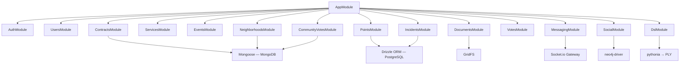

### 5.2 Infrastructure Docker — 7 conteneurs

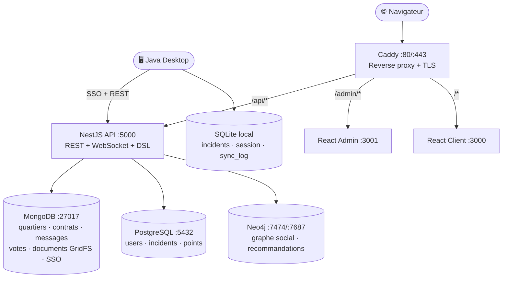

### 5.3 Monorepo web — composant carte mutualisé

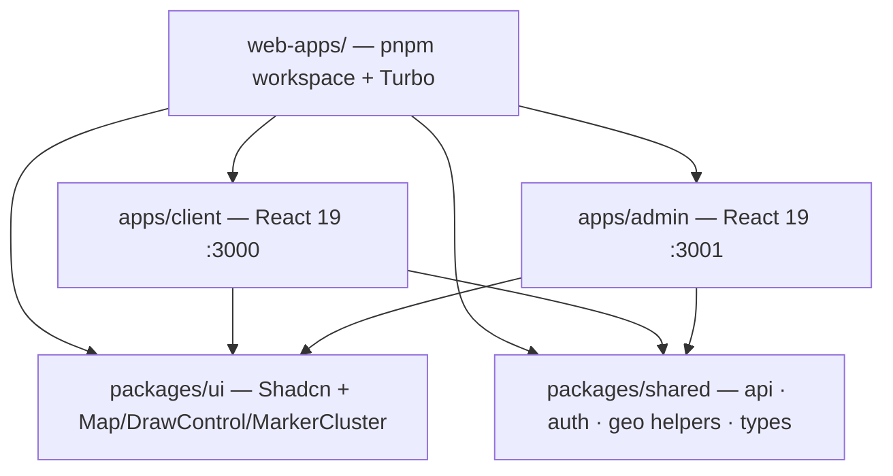

---

## 6. Algorithmes complexes

### 6.1 Transfert de points — Transaction ACID

**Problème :** deux transferts simultanés depuis le même compte pourraient tous deux passer la vérification de solde avant débit, produisant un solde sous le plancher de -10.

**Solution :** `SELECT ... FOR UPDATE` verrouille la ligne jusqu'au `COMMIT`.

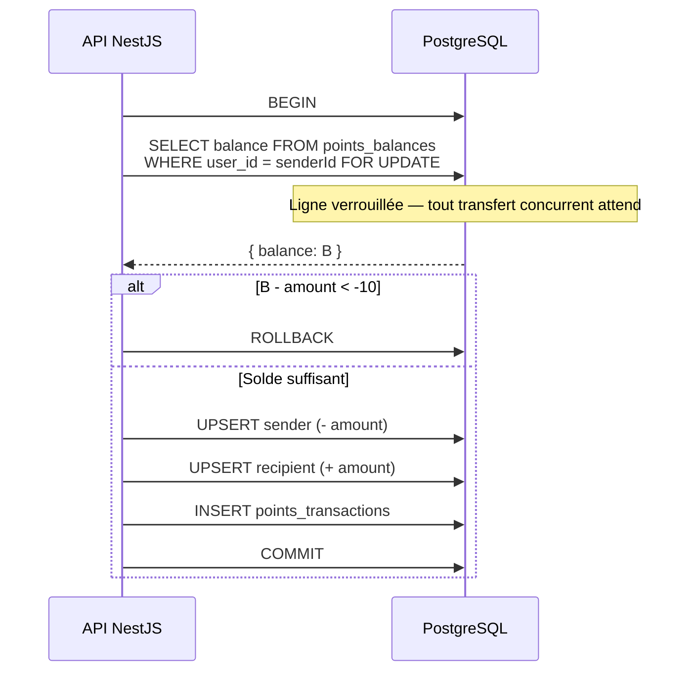

> La contrainte `CHECK (balance >= -10)` au niveau PostgreSQL est un filet de sécurité indépendant du code applicatif.

### 6.2 Signature de contrat — SHA-256 + TOTP

**Principe :** chaque signataire prouve son identité via TOTP, puis sa signature scelle un hash combinant le contenu, son identité et l'horodatage. Le contrat passe à `signed` uniquement lorsque tous les signataires ont signé.

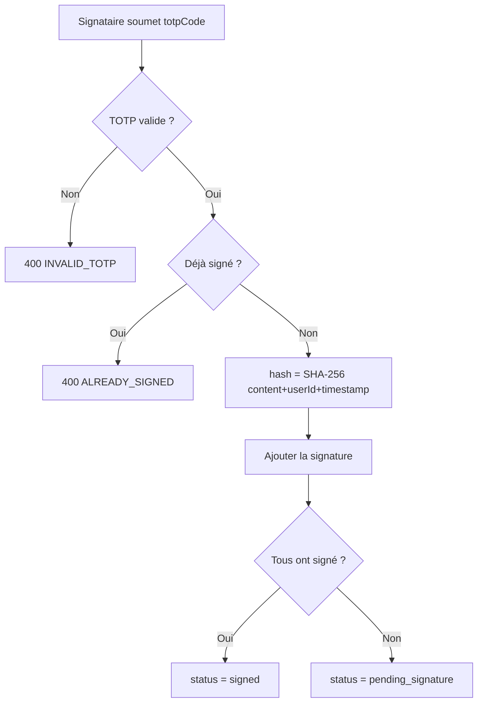

### 6.3 Votes — Strategy Pattern

Les votes simples ont des modes distincts (`up/down` pour les incidents, `like/dislike` pour les services). Le **Strategy Pattern** isole chaque mode dans une classe, évitant une cascade de `switch` :

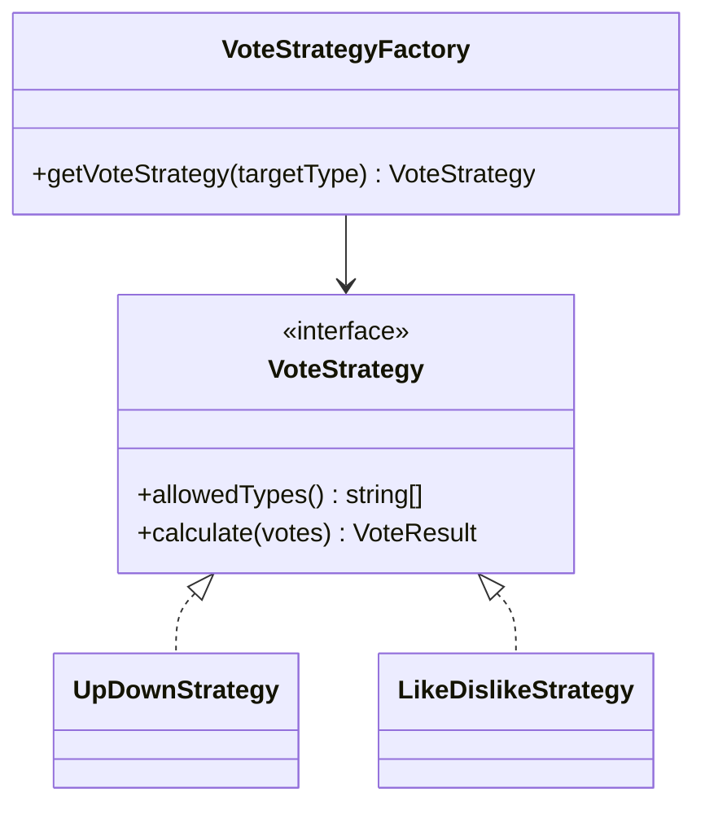

Un même vote soumis deux fois s'annule (toggle off) ; un vote différent remplace l'ancien.

### 6.4 Recommandation sociale — traversal Cypher

**Pourquoi Neo4j ?** Une recommandation « services proches non encore utilisés + événements à venir du quartier » exigerait en SQL plusieurs jointures récursives. En Cypher, un seul `MATCH` suffit :

```cypher
MATCH (u:User {id: $userId})-[:LIVES_IN]->(n:Neighborhood)
OPTIONAL MATCH (n)<-[:LOCATED_IN]-(s:Service)
WHERE NOT (u)-[:USED]->(s)
RETURN s.id AS id, s.name AS name, 'service' AS type, 3 AS score,
       'Service in your neighborhood' AS reason
UNION
MATCH (u:User {id: $userId})-[:LIVES_IN]->(n:Neighborhood)
OPTIONAL MATCH (n)<-[:HELD_IN]-(e:Event)
WHERE NOT (u)-[:ATTENDING]->(e) AND e.date > datetime()
RETURN e.id AS id, e.name AS name, 'event' AS type, 2 AS score,
       'Upcoming event near you' AS reason
ORDER BY score DESC LIMIT 10
```

La synchronisation MongoDB → Neo4j est **fire-and-forget** (`void socialService.syncX()`) : elle ne bloque jamais la réponse HTTP, et un Neo4j indisponible est simplement journalisé.

### 6.5 Détection de chevauchement géospatial

Décrite en [§4.2](#42-gestion-des-limites--détection-de-chevauchement) : `$geoIntersects` sur index `2dsphere` rejette tout polygone recouvrant un quartier existant — c'est la gestion des limites exigée par le sujet.

### 6.6 Synchronisation desktop — Last-Write-Wins bidirectionnelle

L'Étape 2 ne poussait que les incidents créés hors-ligne. L'Étape 3 livre une synchronisation **bidirectionnelle** : selon l'horodatage `updated_at`, le client pousse (PUT) ou tire (GET) la version la plus récente.

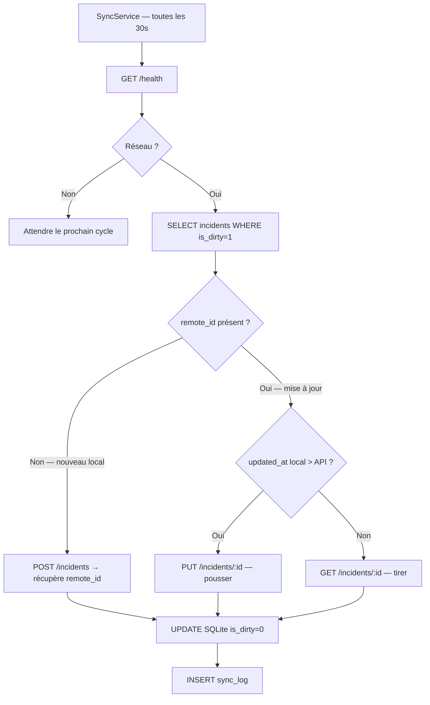

---

## 7. APIs et frameworks utilisés

### 7.1 Backend NestJS — nouveautés de l'Étape 3

| Bibliothèque       | Version | Rôle ajouté à l'Étape 3                                              |
| ------------------ | ------- | ------------------------------------------------------------------- |
| **Socket.io**      | —       | Messagerie temps réel — namespace `/messaging`, rooms par conversation |
| **neo4j-driver**   | 5       | Graphe social — sessions managées, requêtes Cypher de recommandation |
| **GridFS** (Mongo) | —       | Stockage des binaires de documents (PDF, photos, vocaux)            |
| **crypto** (Node)  | natif   | Hash SHA-256 du contenu des contrats et des signatures              |
| **pythonia**       | —       | Bridge Node.js ↔ Python pour exécuter le DSL PLY                    |

(Pour rappel Étape 2 : NestJS 11, Drizzle ORM, Mongoose, Passport-JWT, argon2, speakeasy, @nestjs/throttler, Zod.)

### 7.2 Frontend React — pages métier branchées sur des données réelles

> **Évolution majeure depuis l'Étape 2 :** toutes les pages métier sont désormais alimentées par l'API réelle via TanStack Query.

| Application          | Routes livrées                                                            |
| -------------------- | ------------------------------------------------------------------------- |
| React Client (:3000) | `/dashboard`, `/services`, `/events`, `/votes`, `/contracts`, `/incidents`, `/messages` |
| React Admin (:3001)  | `/users`, `/neighborhoods`, `/services`, `/events`, `/incidents`, `/community-votes`, `/dsl`, `/sso`, `/dashboard` |

| Bibliothèque         | Version | Rôle ajouté à l'Étape 3                                       |
| -------------------- | ------- | ------------------------------------------------------------- |
| **react-leaflet**    | —       | Carte interactive (composant `Map` partagé)                   |
| **leaflet-draw**     | —       | Dessin / édition de polygones de quartier (`DrawControl`)     |
| **leaflet.markercluster** | —  | Regroupement des marqueurs sur les vues denses (`MarkerCluster`) |
| **TanStack Query**   | 5       | Désormais utilisé sur toutes les pages (cache + invalidation) |

### 7.3 Java Desktop

| API / Bibliothèque                  | Rôle ajouté à l'Étape 3                                     |
| ----------------------------------- | ----------------------------------------------------------- |
| **StatisticsService**               | Statistiques live des participations depuis l'API           |
| **Session SQLite**                  | Reprise de session offline (tokens + email mis en cache)    |
| **Sync bidirectionnelle**           | PUT/GET selon arbitrage LWW sur `updated_at`                |

---

## 8. Tests

### 8.1 Bilan global

| Suite                       | Résultat | Outil                                        |
| --------------------------- | -------- | -------------------------------------------- |
| Tests unitaires API         | **261**  | Jest + ts-jest                               |
| Tests E2E API               | **149**  | Jest + Supertest (MongoDB + PostgreSQL réels) |
| Tests Desktop               | **139**  | JUnit 5 + Mockito                            |
| Tests Web (hooks partagés)  | **73**   | Vitest                                       |
| Tests E2E Web               | **87**   | Playwright (Chrome headless)                 |
| Tests DSL                   | **21**   | pytest                                       |
| **Total**                   | **~730** | —                                            |

**Couverture API :** statements **95,7 %**, branches **86,1 %** — bien au-delà du seuil Étape 3 (≥ 60 %).

### 8.2 Nouvelles suites E2E de l'Étape 3

| Fichier E2E                                    | Couvre                                            |
| ---------------------------------------------- | ------------------------------------------------- |
| `api/test/contracts.e2e-spec.ts`               | Création, signature TOTP, statut `signed`         |
| `api/test/points.e2e-spec.ts`                  | Transfert ACID, solde plancher, auto-transfert    |
| `api/test/neighborhoods.e2e-spec.ts`           | CRUD GeoJSON + chevauchement `$geoIntersects`     |
| `api/test/messaging-ws.e2e-spec.ts`            | WebSocket : auth JWT, `join`, `send_message`      |
| `api/test/modules.e2e-spec.ts`                 | Services, événements, votes communautaires        |
| `e2e/admin/neighborhoods-draw.spec.ts`         | Rendu carte + barre d'outils de dessin de polygone |
| `e2e/client/services-map.spec.ts`              | Vue carte côté client, marqueurs                  |
| `e2e/client/messages.spec.ts`                  | Page messagerie : garde `/login`, rendu authentifié |

### 8.3 Stratégie

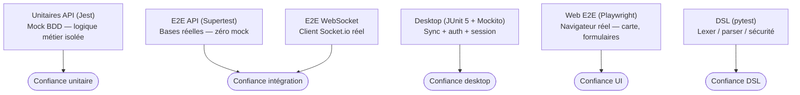

> **Principe des tests E2E API :** aucun mock sur les bases. Les tests utilisent MongoDB et PostgreSQL réels, peuplés via l'API dans un `beforeAll`.

### 8.4 Commandes

```bash
make test          # Unitaires API (261) + hooks web (73) + Desktop (139) + DSL (21)
make test-cov      # + rapport coverage (stmts 95,7 % / branches 86,1 %)
make test-e2e      # E2E API Supertest (149) — nécessite Docker
make test-e2e-web  # E2E Playwright (87) — nécessite les apps lancées
make validate      # lint + typecheck + tests + build, en séquence
```

---

## 9. Démonstration

### 9.1 Lancer la plateforme

```bash
cp .env.example .env      # renseigner les secrets
make docker-up            # 7 conteneurs
make seed                 # comptes démo + quartiers Paris + Neo4j
```

| Surface               | URL                       |
| --------------------- | ------------------------- |
| Client habitant       | http://localhost          |
| Admin back-office     | http://localhost/admin    |
| API docs (Scalar)     | http://localhost/api/docs |
| Neo4j Browser         | http://localhost:7474     |

### 9.2 Comptes de démonstration

| Email         | Mot de passe | Rôle      | TOTP               |
| ------------- | ------------ | --------- | ------------------ |
| alice@demo.fr | Demo1234!    | resident  | `JBSWY3DPEHPK3PXP` |
| bob@demo.fr   | Demo1234!    | moderator | `JBSWY3DPEHPK3PXP` |
| admin@demo.fr | Demo1234!    | admin     | `JBSWY3DPEHPK3PXP` |

```bash
make totp   # ou : oathtool --totp --base32 JBSWY3DPEHPK3PXP
```

### 9.3 Scénarios de démonstration prévus

| Point                    | Scénario                                                                   |
| ------------------------ | -------------------------------------------------------------------------- |
| Dessin de quartier       | Admin → fiche quartier → tracer un polygone → enregistrer                  |
| Gestion des limites      | Tracer un polygone qui chevauche un quartier existant → `409 Conflict`     |
| Transfert de points      | Alice → Bob, vérifier les soldes ; tenter un dépassement → `400`           |
| Signature de contrat     | Ouvrir un contrat, signer avec un mauvais TOTP (refus) puis le bon (signé) |
| Messagerie temps réel    | Deux navigateurs (Alice / Bob) → message instantané via WebSocket          |
| Recommandation Neo4j     | Dashboard d'Alice → services et événements suggérés de son quartier        |
| Scrutin pondéré          | Créer un scrutin `weighted`, voter, lire les résultats et le quorum        |
| Vue carte client         | Services / événements / incidents géolocalisés sur la carte                |
| Sync offline bidirect.   | `docker stop` API → créer un incident → relancer → vérifier la sync        |
| Documentation API        | Parcourir Scalar sur `/api/docs`                                           |

---

*Rapport de projet — QuartierConnect · Groupe 1 · 3AL2 · ESGI 2025-2026*
*Rendu Étape 3 — 31 mai 2026 — Enseignant : Frédéric SANANES*
