# Technical Report — QuartierConnect

> **Project** : Connected Neighbours · **Group** : 1 · **Cohort** : 3AL2 · **ESGI 2025-2026**
> **Submission** : 19 July 2026 · **Instructor** : Frédéric SANANES

---

## Team

| Member | Role | Responsibilities |
|--------|------|----------------|
| **Claudio REIBAUD** | Project lead & Fullstack Dev | NestJS backend, React Client & Admin, JavaFX Desktop, Docker, tests |
| **Andras SCHULLER** | Front-end & Documentation | Jest/Playwright tests, technical documentation, React |
| **Mouhamadou N'DIAYE** | Infrastructure & DevOps | VPS, Caddy, Docker Compose, CI/CD GitHub Actions |

---

## Table of contents

1. [Context and objectives](#1-context-and-objectives)
2. [Overall architecture](#2-overall-architecture)
3. [Detailed technical stack](#3-detailed-technical-stack)
4. [Authentication module — Full analysis](#4-authentication-module--full-analysis)
5. [Neighbourhood management — GeoJSON and overlaps](#5-neighbourhood-management--geojson-and-overlaps)
6. [Points system — ACID transactions](#6-points-system--acid-transactions)
7. [Digital contracts — Strong signature](#7-digital-contracts--strong-signature)
8. [Real-time messaging — WebSocket](#8-real-time-messaging--websocket)
9. [Voting system — Strategy Pattern](#9-voting-system--strategy-pattern)
10. [Community polls — Multi-type ballots](#10-community-polls--multi-type-ballots)
11. [Neo4j social graph — Recommendations](#11-neo4j-social-graph--recommendations)
12. [DSL — Query micro-language](#12-dsl--query-micro-language)
13. [JavaFX Desktop application](#13-javafx-desktop-application)
14. [Offline mode and synchronization](#14-offline-mode-and-synchronization)
15. [Infrastructure and deployment](#15-infrastructure-and-deployment)
16. [Software quality and testing](#16-software-quality-and-testing)
17. [Outcome and outlook](#17-outcome-and-outlook)

---

## 1. Context and objectives

### 1.1 Problem identified

Residential neighbourhoods lack suitable digital tools to structure local mutual aid, formalize service exchanges, and manage community affairs. General-purpose solutions (WhatsApp, Facebook Groups) offer neither strong security, nor traceability of commitments, nor offline operation.

### 1.2 Proposed solution

QuartierConnect is a **geolocated and secure community platform** that lets the residents of a neighbourhood:

- Exchange services valued through a points system
- Sign digital documents (SHA-256 + MFA)
- Take part in events with personalized recommendations (Neo4j)
- Communicate in real time (WebSocket)
- Manage incidents and alerts via an offline-first desktop application

### 1.3 Target audience and surfaces

| Profile | Surface | Permissions |
|--------|---------|------------|
| Resident | React Client web :3000 | Services, events, messaging, votes, contracts |
| Moderator | React Client web :3000 | + Incident moderation |
| Administrator | React Admin web :3001 + JavaFX | + Full back-office, desktop sync |

---

## 2. Overall architecture

### 2.1 High-level view — 7 Docker containers


### 2.2 Caddy routing

```caddyfile
quartierconnect.local {
    reverse_proxy /api/* api:5000
    reverse_proxy /admin/* admin:3001
    reverse_proxy /* client:3000
}
```

### 2.3 Why three databases?

The choice of a tri-database setup is not gratuitous complexity — each database is chosen for its fundamental properties:

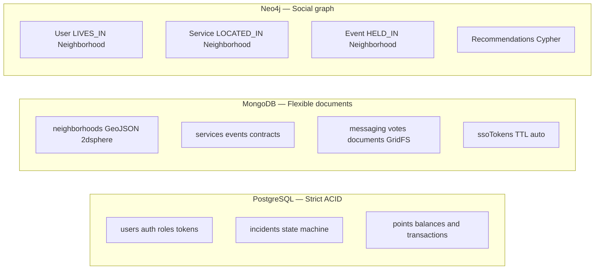

| Decisive criterion | PostgreSQL | MongoDB | Neo4j |
|----------------|-----------|---------|-------|
| Atomic multi-table transactions | Yes | No | No |
| Native GeoJSON schema | No | Yes (2dsphere) | No |
| Efficient graph traversals | No | No | Yes |
| QuartierConnect use case | Points, auth | Neighbourhoods, services | Recommendations |

---

## 3. Detailed technical stack

| Layer | Technology | Version | Rationale |
|--------|------------|---------|--------------|
| **Back-end** | NestJS | 11 | Modular, native DI, guards, WebSocket |
| **PostgreSQL ORM** | Drizzle ORM | — | Type-safe, migrations, no magic |
| **MongoDB ODM** | Mongoose | — | Strict schema, hooks, TypeScript |
| **Graph** | neo4j-driver | 5 | Native Cypher, managed sessions |
| **Auth** | Passport-JWT | — | NestJS standard, extensible |
| **Hashing** | argon2 npm | — | Argon2id PHC 2015 winner |
| **TOTP** | speakeasy | — | RFC 6238, ±1 window |
| **WebSocket** | Socket.io | — | Rooms, namespaces, auto reconnect |
| **DSL** | PLY (Python) | — | Production-ready LALR(1) lexer/parser |
| **Python bridge** | pythonia | — | Synchronous Python call from Node.js |
| **Front-end** | React 19 + Vite | — | HMR, Server Components |
| **Routing** | TanStack Router | — | File-based, type-safe |
| **Forms** | TanStack Form | v1 | Client-side validation |
| **UI** | Shadcn/ui + Tailwind v4 | — | Accessible components |
| **Desktop** | JavaFX + Maven | 21 | Portable Fat JAR, FXML |
| **SQLite Java** | JDBC sqlite | — | Local offline cache |
| **CI/CD** | GitHub Actions | — | Automated build + tests |
| **Proxy** | Caddy 2 | — | Automatic Let's Encrypt |

---

## 4. Authentication module — Full analysis

### 4.1 Hashing algorithm — Argon2id

Argon2id is the winner of the Password Hashing Competition (PHC) 2015. It combines:
- **Argon2d** : resistance to GPU attacks thanks to data-dependent memory cost
- **Argon2i** : resistance to side-channel attacks

Effective parameters:
```
memoryCost: 65536 (64 MB)
timeCost: 3 iterations
parallelism: 4 threads
```

An attacker with a high-end GPU cannot parallelize the computation because each iteration depends on 64 MB of memory.

### 4.2 TOTP — Detailed operation

RFC 6238 : Time-based One-Time Password.

```
TOTP code = HOTP(secret, T)
where T = floor(Unix_timestamp / 30)
and HOTP(K, C) = truncate(HMAC-SHA1(K, C_bytes_big_endian))
```

**Anti-replay** : a TOTP code valid for 30s can be submitted several times within that window. The mitigation:

```typescript
const key = `${secret}:${token}`;
if (this.usedCodes.state[key] !== undefined) return false;  // already used
// Remember for 90s (covers ±1 window)
this.usedCodes.setState(prev => ({ ...prev, [key]: Date.now() + 90_000 }));
```

### 4.3 JWT — Payload and lifetime details

```json
{
  "sub": "uuid-postgresql",
  "email": "alice@demo.fr",
  "role": "resident",
  "jti": "uuid-v4-unique",
  "iat": 1712345678,
  "exp": 1712346578
}
```

- `jti` (JWT ID) : unique UUID v4 per token — enables auditing and future revocation
- access token : **15 minutes** — short lifetime limits the attack window if stolen
- refresh token : **7 days** — Argon2-hashed in the PostgreSQL database

### 4.4 SSO — Cross-surface Single Sign-On

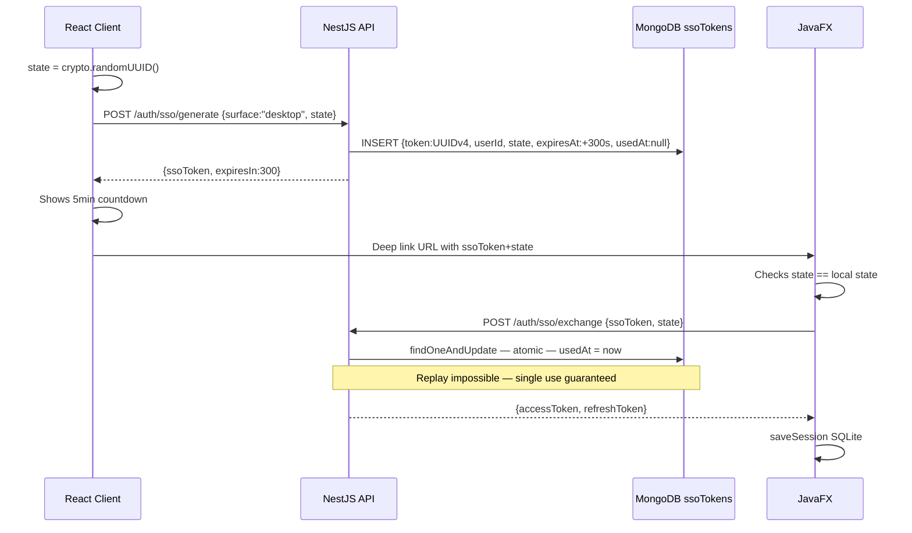

**Security properties** :
- UUID v4 token : 122 bits of entropy — not guessable
- 5-minute TTL : minimal attack window
- Atomic `findOneAndUpdate` : no race condition possible
- PKCE state : prevents token injection by a third party

---

## 5. Neighbourhood management — GeoJSON and overlaps

### 5.1 GeoJSON schema

Each neighbourhood is defined by a **GeoJSON polygon** stored in MongoDB with a `2dsphere` index:

```javascript
{
  geometry: {
    type: "Polygon",
    coordinates: [[[lng1, lat1], [lng2, lat2], ...]]
  }
}
```

The `2dsphere` index enables native MongoDB geospatial queries (`$geoIntersects`, `$geoWithin`, `$near`).

### 5.2 Overlap detection

```typescript
// neighborhoods.service.ts
async assertNoOverlap(geometry: GeoJsonPolygon, excludeId?: string): Promise<void> {
  const overlapping = await this.neighborhoodModel.find({
    geometry: { $geoIntersects: { $geometry: geometry } }
  }).exec();

  const conflicts = overlapping.filter(n => n._id.toString() !== excludeId);
  if (conflicts.length > 0) {
    throw new ConflictException(
      `The polygon overlaps ${conflicts.length} neighbourhood(s): ${conflicts.map(n => n.name).join(', ')}`
    );
  }
}
```

The `$geoIntersects` query uses MongoDB's geodesic algorithm — it detects any overlap, even partial, between two polygons.

---

## 6. Points system — ACID transactions

### 6.1 Transfer algorithm

The minimum allowed balance is **-10 points** (limited overdraft). The transfer runs entirely within a PostgreSQL transaction:

```typescript
// points.service.ts
await this.db.transaction(async (tx) => {
  // 1. Read the balance with an exclusive lock (FOR UPDATE = no phantom read)
  const [senderRow] = await tx.execute(
    sql`SELECT id, balance FROM points_balances WHERE user_id = ${senderId} FOR UPDATE`
  );

  const currentBalance = senderRow?.balance ?? 0;

  // 2. Check the minimum balance
  if (currentBalance - dto.amount < MIN_BALANCE) {    // MIN_BALANCE = -10
    throw new BadRequestException(`Insufficient balance`);
  }

  // 3. Decrement sender (idempotent upsert)
  await tx.insert(pointsBalances).values({ userId: senderId, balance: -dto.amount })
    .onConflictDoUpdate({
      target: pointsBalances.userId,
      set: { balance: sql`points_balances.balance - ${dto.amount}` },
    });

  // 4. Increment recipient
  await tx.insert(pointsBalances).values({ userId: dto.recipientId, balance: dto.amount })
    .onConflictDoUpdate({
      target: pointsBalances.userId,
      set: { balance: sql`points_balances.balance + ${dto.amount}` },
    });

  // 5. Record the transaction
  await tx.insert(pointsTransactions).values({
    senderId, recipientId: dto.recipientId, amount: dto.amount, note: dto.note
  });
});
```

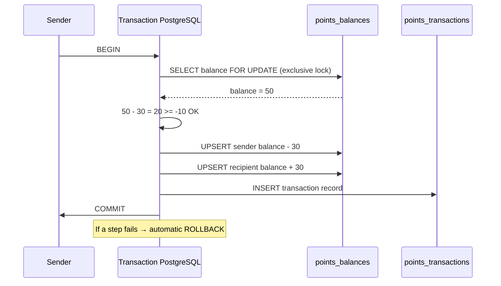

**Why `FOR UPDATE`?** It prevents another concurrent transfer from reading the same balance before the first one is committed (avoids double spending).

---

## 7. Digital contracts — Strong signature

### 7.1 Content hash

At creation time, a SHA-256 hash of the content is computed and stored:

```typescript
const hash = crypto.createHash('sha256').update(dto.content).digest('hex');
// contentHash = "a1b2c3d4..."
```

### 7.2 Individual signature with TOTP

Each signatory must provide a valid TOTP code. The signature includes content + identity + timestamp:

```typescript
async sign(id: string, userId: string, totpCode: string) {
  // 1. Verify TOTP
  const isValid = this.totpService.verify(user.totpSecret, totpCode);
  if (!isValid) throw new BadRequestException('Invalid TOTP code');

  // 2. Compute signature hash
  const hash = crypto.createHash('sha256')
    .update(contract.content + userId + new Date().toISOString())
    .digest('hex');

  // 3. Add the signature
  contract.signatures.push({ userId, signedAt: new Date(), hash });

  // 4. Check whether all signatories have signed
  const allSigned = contract.signatories.every(s =>
    contract.signatures.some(sig => sig.userId === s)
  );
  contract.status = allSigned ? 'signed' : 'pending_signature';

  return contract.save();
}
```

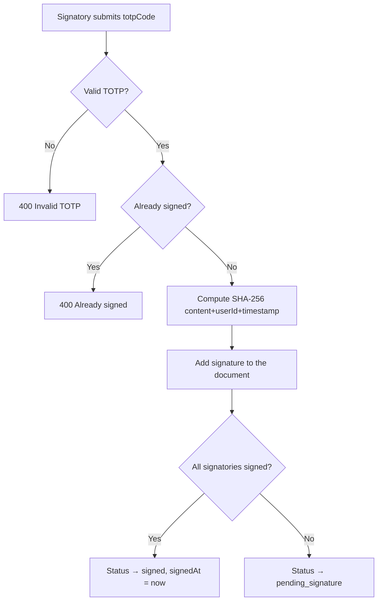

---

## 8. Real-time messaging — WebSocket

### 8.1 Socket.io architecture

The `MessagingGateway` manages the `/messaging` namespace. Each connection is authenticated via JWT.

```typescript
handleConnection(client: Socket) {
  const token = client.handshake.auth?.token;
  if (!token) { client.disconnect(); return; }

  const payload = this.jwtService.verify<{sub: string}>(token);
  (client as AuthSocket).userId = payload.sub;
  this.userSockets.set(payload.sub, client.id);
}
```

### 8.2 Message-send flow

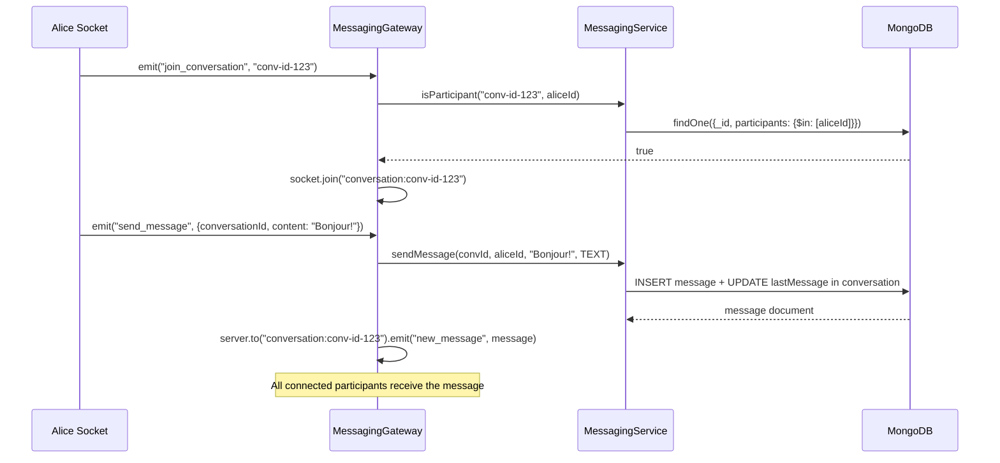

### 8.3 WebSocket security

- Connection refused if the JWT is missing or invalid
- `isParticipant` checked before each `join_conversation`
- Rooms are named `conversation:{id}` — isolated per conversation

---

## 9. Voting system — Strategy Pattern

### 9.1 Why the Strategy Pattern?

Votes have two modes (up/down for incidents, like/dislike for services) with different rules. Without Strategy, we would have a cascade of `if/switch` statements in the service. With Strategy, each mode is an independent class.

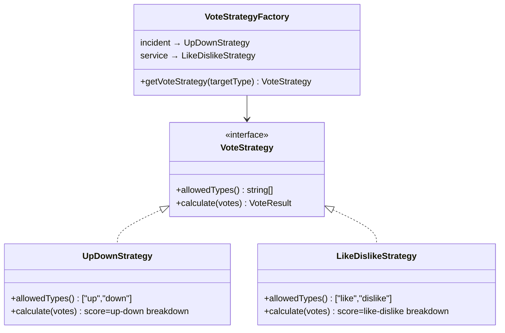

### 9.2 Toggle logic

The same vote submitted twice cancels itself out (toggle off). A different vote replaces the previous one.

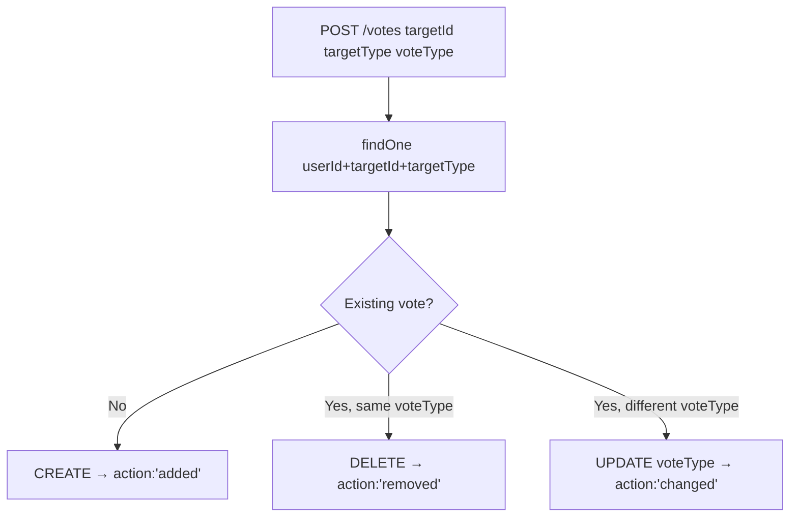

---

## 10. Community polls — Multi-type ballots

### 10.1 Ballot types

| Type | Rule | Use case |
|------|-------|------------|
| `binary` | 1 choice among {yes, no} | Approve regulation |
| `single_choice` | 1 choice among N options | Elect representative |
| `multiple_choice` | 1 to N choices | Choose meeting date |
| `weighted` | Weight (1-10) per option | Work priorities |

### 10.2 Computing weighted results

```typescript
for (const cast of vote.casts) {
  if (vote.voteType === CommunityVoteType.WEIGHTED && cast.weights) {
    for (const [optionId, weight] of Object.entries(cast.weights)) {
      totals[optionId] = (totals[optionId] ?? 0) + weight;  // sum of weights
    }
  } else {
    for (const choice of cast.choices) {
      totals[choice] = (totals[choice] ?? 0) + 1;  // simple count
    }
  }
}
```

### 10.3 Quorum

```typescript
const quorumReached = vote.quorum === 0 || vote.casts.length >= vote.quorum;
// quorum=0 means: no minimum quorum required
```

The vote is automatically closed (`status = 'closed'`) when results are read if `endsAt` has passed.

---

## 11. Neo4j social graph — Recommendations

### 11.1 Graph model


### 11.2 Cypher recommendation query

```cypher
-- Nearby unused services
MATCH (u:User {id: $userId})-[:LIVES_IN]->(n:Neighborhood)
OPTIONAL MATCH (n)<-[:LOCATED_IN]-(s:Service)
WHERE NOT (u)-[:USED]->(s)
RETURN s.id AS id, s.name AS name, 'service' AS type, 3 AS score,
       'Service in your neighborhood' AS reason

UNION

-- Nearby upcoming events
MATCH (u:User {id: $userId})-[:LIVES_IN]->(n:Neighborhood)
OPTIONAL MATCH (n)<-[:HELD_IN]-(e:Event)
WHERE NOT (u)-[:ATTENDING]->(e) AND e.date > datetime()
RETURN e.id AS id, e.name AS name, 'event' AS type, 2 AS score,
       'Upcoming event near you' AS reason

ORDER BY score DESC LIMIT 10
```

### 11.3 Real-time sync (fire-and-forget)

```typescript
// Example in neighborhoods.controller.ts
async create(@Body() dto, @Request() req) {
  const created = await this.neighborhoodModel.create(dto);    // Primary MongoDB
  void this.socialService.syncNeighborhood(                    // Neo4j non-blocking
    created._id.toString(), created.name
  );
  return created;  // immediate response — Neo4j never blocks
}
```

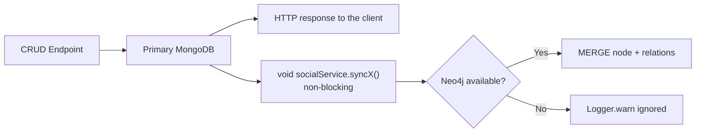

---

## 12. DSL — Query micro-language

### 12.1 Complete grammar

The DSL is implemented with **PLY** (Python Lex-Yacc) — a production-ready LALR(1) generator.

```
query : FIND IDENTIFIER
      | FIND IDENTIFIER WHERE conditions
      | FIND IDENTIFIER LIMIT NUMBER
      | FIND IDENTIFIER WHERE conditions LIMIT NUMBER
      | COUNT IDENTIFIER
      | COUNT IDENTIFIER WHERE conditions

conditions : condition
           | conditions AND condition
           | conditions OR condition

condition : IDENTIFIER EQ value         → {field: value}
          | IDENTIFIER NEQ value        → {field: {$ne: value}}
          | IDENTIFIER GT value         → {field: {$gt: value}}
          | IDENTIFIER GTE value        → {field: {$gte: value}}
          | IDENTIFIER LT value         → {field: {$lt: value}}
          | IDENTIFIER LTE value        → {field: {$lte: value}}
          | IDENTIFIER LIKE value       → {field: {$regex: v, $options: 'i'}}

value : STRING | NUMBER | IDENTIFIER
```

### 12.2 Compilation pipeline

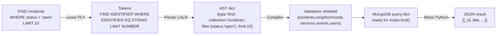

### 12.3 DSL security

1. **Collection whitelist** : only 5 collections are allowed. `FIND passwords` → `ValueError`
2. **Native parameterization** : values pass through the MongoDB engine, no string concatenation
3. **pythonia bridge** : the DSL is executed in an isolated Python process

### 12.4 Examples

```
FIND incidents WHERE status = 'open'
→ db.incidents.find({status: 'open'})

FIND services WHERE type = 'free' AND category = 'gardening' LIMIT 5
→ db.services.find({type:'free', category:'gardening'}).limit(5)

FIND incidents WHERE status = 'open' OR status = 'in_progress'
→ db.incidents.find({$or:[{status:'open'},{status:'in_progress'}]})

COUNT neighborhoods WHERE city = 'Paris'
→ db.neighborhoods.countDocuments({city:'Paris'})

FIND services WHERE title LIKE 'jardin'
→ db.services.find({title:{$regex:'jardin',$options:'i'}})
```

---

## 13. JavaFX Desktop application

### 13.1 Architecture

```
desktop-app/src/main/java/fr/quartierconnect/desktopapp/
├── MainApp.java              extends Application — JavaFX entry point
├── Launcher.java             main() → Application.launch()
├── views/
│   ├── LoginView.java        SSO flow + offline mode
│   └── MainView.java         BorderPane sidebar + content
├── services/
│   ├── AuthService.java      Singleton — tokens + SQLite session
│   ├── ApiService.java       HttpClient Java 11 + retry 401
│   ├── SyncService.java      ScheduledExecutorService 30s
│   ├── SsoCallbackServer.java Local HTTP server — receives PKCE callback
│   └── StatisticsService.java Live stats from API
└── database/
    └── SQLiteDatabase.java   JDBC — incidents + sync_log + session
```

### 13.2 Fat JAR (Maven Shade)

```xml
<!-- pom.xml -->
<plugin>
  <groupId>org.apache.maven.plugins</groupId>
  <artifactId>maven-shade-plugin</artifactId>
  <configuration>
    <shadedArtifactAttached>false</shadedArtifactAttached>
    <transformers>
      <transformer implementation="...ManifestResourceTransformer">
        <mainClass>fr.quartierconnect.desktopapp.Launcher</mainClass>
      </transformer>
    </transformers>
  </configuration>
</plugin>
```

The resulting JAR (~25 MB) contains all dependencies — it runs with `java -jar quartierconnect-desktop.jar` without installation.

### 13.3 Plugin system

```java
// PluginRegistry.java
public interface QuartierConnectPlugin {
    String getId();
    String getVersion();
    void onLoad(PluginContext context);
    void onUnload();
}

// Dynamic loading (runtime)
public void register(QuartierConnectPlugin plugin) {
    try {
        plugin.onLoad(context);
        plugins.put(plugin.getId(), plugin);
    } catch (Exception e) {
        log.severe("Plugin " + plugin.getId() + " failed to load: " + e.getMessage());
        // Graceful failure — the rest of the application continues
    }
}
```

---

## 14. Offline mode and synchronization

### 14.1 Startup state machine

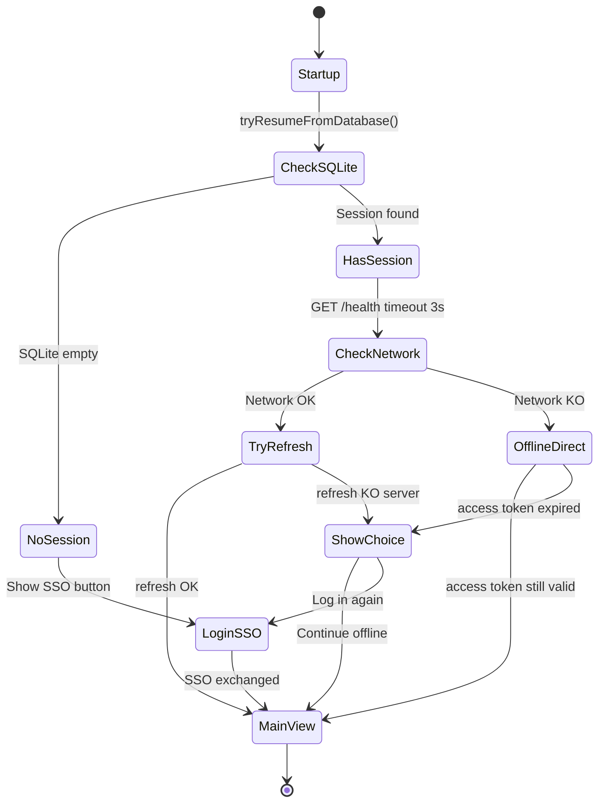

### 14.2 Extracting the email without network

The email is extracted from the JWT payload (base64-decoded) and cached in SQLite. It is available even when the JWT is expired, in order to display "Logged in as alice@demo.fr" in offline mode.

```java
private String extractEmailFromJwt(String token) {
    if (token == null) return null;
    try {
        String[] parts = token.split("\\.");
        String payload = new String(Base64.getUrlDecoder().decode(parts[1]));
        JsonNode node = MAPPER.readTree(payload);
        return node.has("email") ? node.get("email").asText() : null;
    } catch (Exception e) { return null; }
}
```

### 14.3 LWW synchronization (Last-Write-Wins)

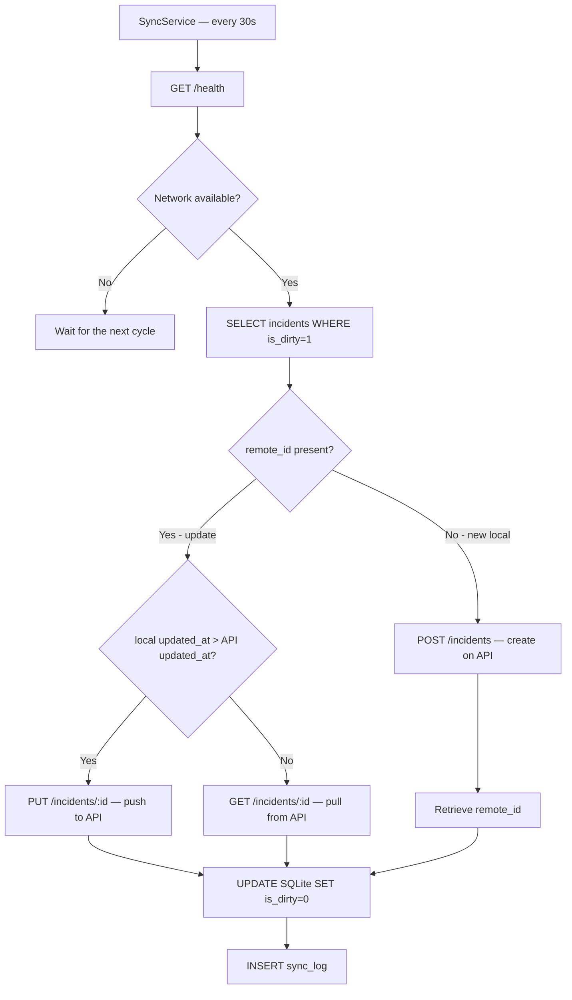

---

## 15. Infrastructure and deployment

### 15.1 Environment variables

```bash
# .env
POSTGRES_HOST=postgres
POSTGRES_PORT=5432
POSTGRES_DB=quartierconnect
POSTGRES_USER=qc_user
POSTGRES_PASSWORD=<secret>

MONGO_URI=mongodb://qc_user:<secret>@mongodb:27017/quartierconnect
NEO4J_URI=bolt://neo4j:7687
NEO4J_USER=neo4j
NEO4J_PASSWORD=<secret>

JWT_SECRET=<min-32-chars>
CORS_ORIGINS=http://localhost:3000,http://localhost:3001
```

### 15.2 CI/CD GitHub Actions

```yaml
# .github/workflows/ci.yml
jobs:
  api:
    steps:
      - pnpm install
      - pnpm run lint
      - pnpm run test:cov
      - pnpm run build
  desktop:
    steps:
      - ./mvnw test
      - ./mvnw package -q
  dsl:
    steps:
      - uv sync
      - uv run ruff check .
      - uv run pytest
```

### 15.3 Caddy — Reverse proxy

```caddyfile
{
    email admin@quartierconnect.fr
}

quartierconnect.fr {
    reverse_proxy /api/* api:5000
    reverse_proxy /admin/* admin:3001
    reverse_proxy /* client:3000
    encode gzip
}
```

Let's Encrypt is handled automatically by Caddy — no manual SSL configuration.

---

## 16. Software quality and testing

### 16.1 Test dashboard

| Component | Framework | Tests | Coverage |
|-----------|-----------|-------|---------|
| NestJS API unit | Jest | 236/236 ✓ | 95.7% stmts |
| NestJS API E2E | Supertest | 148/148 ✓ | — |
| Web shared hooks | Vitest | 73/73 ✓ | — |
| Java Desktop | JUnit 5 | 63/63 ✓ | — |
| DSL Python | pytest | 21/21 ✓ | — |
| Web Playwright | Playwright | 79/79 ✓ | — |
| **Total** | | **620/620 ✓** | |

### 16.2 Non-negotiable quality rules

- Zero `console.log` in production code
- Zero `TODO` in committed code
- Zero inline comment explaining obvious code
- API coverage thresholds : statements 80%, branches 75%, functions 80%
- `routeTree.gen.ts` never edited manually

### 16.3 Commit convention

```
feat(auth): add SSO token generation endpoint
fix(points): prevent race condition in balance update
test(contracts): cover TOTP validation cases
docs: update architecture with Neo4j sync flow
chore(ci): add Playwright step to GitHub Actions
```

---

## 17. Outcome and outlook

### 17.1 Delivered features

| Feature | Status |
|---------------|--------|
| Registration + QR TOTP | ✅ |
| MFA login (email + password + TOTP) | ✅ |
| Cross-surface SSO (web → desktop) | ✅ |
| JWT access 15min + refresh 7d with rotation | ✅ |
| Neighbourhood CRUD with GeoJSON overlap detection | ✅ |
| Service CRUD with filters | ✅ |
| Event CRUD with calendar | ✅ |
| Incident state machine (open→in_progress→resolved) | ✅ |
| ACID PostgreSQL points transfer | ✅ |
| Contract signature SHA-256 + TOTP | ✅ |
| Real-time WebSocket messaging (Socket.io) | ✅ |
| Votes (Strategy Pattern: up/down, like/dislike) | ✅ |
| Community polls (4 types, quorum, weighted) | ✅ |
| Neo4j recommendations + real-time sync | ✅ |
| DSL PLY + pythonia bridge | ✅ |
| GDPR JSON export | ✅ |
| Offline-first JavaFX desktop application | ✅ |
| Bidirectional desktop ↔ API sync (LWW) | ✅ |
| JavaFX plugin system | ✅ |
| CI/CD GitHub Actions | ✅ |
| Interactive Scalar documentation | ✅ |
| 620 automated tests | ✅ |

### 17.2 Identified technical debt

| Item | Description | Priority |
|-------|------------|---------|
| SQLite refresh token | Stored in plaintext — use OS keychain in prod | High |
| WebSocket rooms | No persistence if the server restarts | Medium |
| Neo4j sync | Fire-and-forget without retry — may miss updates | Low |

### 17.3 Outlook

- Push notifications (Firebase / Web Push API)
- React Native mobile application (sharing the back-end code)
- Payment integration for paid services (Stripe)
- Interactive mapping (Mapbox / Leaflet)
- End-to-end encryption for messaging (Signal Protocol)
