# Rapport Technique — QuartierConnect

> **Projet** : Connected Neighbours · **Groupe** : 1 · **Promo** : 3AL2 · **ESGI 2025-2026**
> **Rendu** : 19 juillet 2026 · **Enseignant** : Frédéric SANANES

---

## Équipe

| Membre | Rôle | Responsabilités |
|--------|------|----------------|
| **Claudio REIBAUD** | Chef de projet & Fullstack Dev | Backend NestJS, React Client & Admin, JavaFX Desktop, Docker, tests |
| **Andras SCHULLER** | Front-end & Documentation | Tests Jest/Playwright, documentation technique, React |
| **Mouhamadou N'DIAYE** | Infrastructure & DevOps | VPS, Caddy, Docker Compose, CI/CD GitHub Actions |

---

## Table des matières

1. [Contexte et objectifs](#1-contexte-et-objectifs)
2. [Architecture générale](#2-architecture-générale)
3. [Stack technique détaillée](#3-stack-technique-détaillée)
4. [Module d'authentification — Analyse complète](#4-module-dauthentification--analyse-complète)
5. [Gestion des quartiers — GeoJSON et chevauchements](#5-gestion-des-quartiers--geojson-et-chevauchements)
6. [Système de points — Transactions ACID](#6-système-de-points--transactions-acid)
7. [Contrats numériques — Signature forte](#7-contrats-numériques--signature-forte)
8. [Messagerie temps réel — WebSocket](#8-messagerie-temps-réel--websocket)
9. [Système de votes — Strategy Pattern](#9-système-de-votes--strategy-pattern)
10. [Votes communautaires — Scrutins multi-types](#10-votes-communautaires--scrutins-multi-types)
11. [Graphe social Neo4j — Recommandations](#11-graphe-social-neo4j--recommandations)
12. [DSL — Micro-langage de requête](#12-dsl--micro-langage-de-requête)
13. [Application Desktop JavaFX](#13-application-desktop-javafx)
14. [Mode hors-ligne et synchronisation](#14-mode-hors-ligne-et-synchronisation)
15. [Infrastructure et déploiement](#15-infrastructure-et-déploiement)
16. [Qualité logicielle et tests](#16-qualité-logicielle-et-tests)
17. [Bilan et perspectives](#17-bilan-et-perspectives)

---

## 1. Contexte et objectifs

### 1.1 Problème identifié

Les quartiers résidentiels manquent d'outils numériques adaptés pour structurer l'entraide locale, formaliser les échanges de services et gérer les affaires communautaires. Les solutions généralistes (WhatsApp, Facebook Groups) ne proposent ni sécurité forte, ni traçabilité des engagements, ni fonctionnement hors-ligne.

### 1.2 Solution proposée

QuartierConnect est une **plateforme communautaire géolocalisée et sécurisée** permettant aux habitants d'un quartier de :

- Échanger des services valorisés par un système de points
- Signer des documents numériques (SHA-256 + MFA)
- Participer à des événements avec recommandations personnalisées (Neo4j)
- Communiquer en temps réel (WebSocket)
- Gérer incidents et alertes via une application desktop offline-first

### 1.3 Public cible et surfaces

| Profil | Surface | Permissions |
|--------|---------|------------|
| Habitant | React Client web :3000 | Services, événements, messagerie, votes, contrats |
| Modérateur | React Client web :3000 | + Modération incidents |
| Administrateur | React Admin web :3001 + JavaFX | + Back-office complet, desktop sync |

---

## 2. Architecture générale

### 2.1 Vue macroscopique — 7 conteneurs Docker

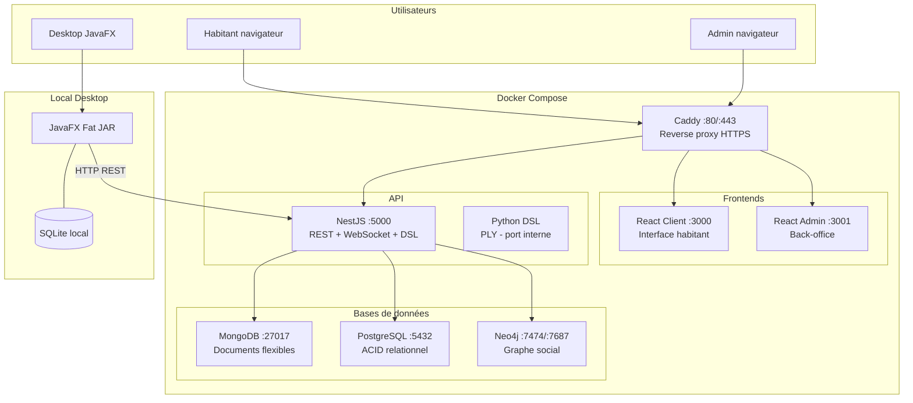

### 2.2 Routage Caddy

```caddyfile
quartierconnect.local {
    reverse_proxy /api/* api:5000
    reverse_proxy /admin/* admin:3001
    reverse_proxy /* client:3000
}
```

### 2.3 Pourquoi trois bases de données ?

Le choix d'un tri-base n'est pas une complexité gratuite — chaque base est choisie pour ses propriétés fondamentales :

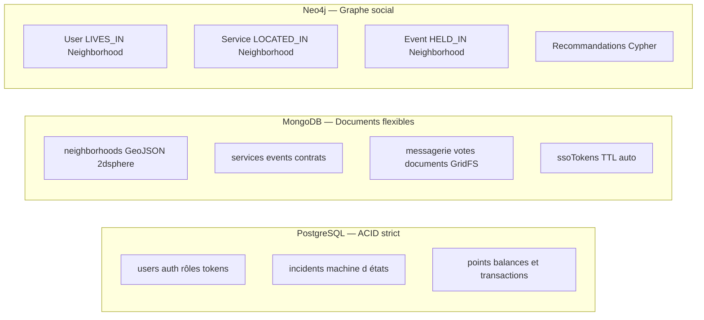

| Critère décisif | PostgreSQL | MongoDB | Neo4j |
|----------------|-----------|---------|-------|
| Transactions atomiques multi-tables | Oui | Non | Non |
| Schéma GeoJSON natif | Non | Oui (2dsphere) | Non |
| Traversals de graphe efficaces | Non | Non | Oui |
| Cas d'usage QuartierConnect | Points, auth | Quartiers, services | Recommandations |

---

## 3. Stack technique détaillée

| Couche | Technologie | Version | Justification |
|--------|------------|---------|--------------|
| **Back-end** | NestJS | 11 | Modulaire, DI native, guards, WebSocket |
| **ORM PostgreSQL** | Drizzle ORM | — | Type-safe, migrations, pas de magie |
| **ODM MongoDB** | Mongoose | — | Schéma strict, hooks, TypeScript |
| **Graphe** | neo4j-driver | 5 | Cypher natif, sessions managées |
| **Auth** | Passport-JWT | — | Standard NestJS, extensible |
| **Hachage** | argon2 npm | — | Argon2id vainqueur PHC 2015 |
| **TOTP** | speakeasy | — | RFC 6238, fenêtre ±1 |
| **WebSocket** | Socket.io | — | Rooms, namespaces, reconnect auto |
| **DSL** | PLY (Python) | — | Lexer/parser LALR(1) production-ready |
| **Bridge Python** | pythonia | — | Appel Python synchrone depuis Node.js |
| **Front-end** | React 19 + Vite | — | HMR, Server Components |
| **Routing** | TanStack Router | — | File-based, type-safe |
| **Formulaires** | TanStack Form | v1 | Validation côté client |
| **UI** | Shadcn/ui + Tailwind v4 | — | Composants accessibles |
| **Desktop** | JavaFX + Maven | 21 | Fat JAR portable, FXML |
| **SQLite Java** | JDBC sqlite | — | Cache local offline |
| **CI/CD** | GitHub Actions | — | Build + tests automatisés |
| **Proxy** | Caddy 2 | — | Let's Encrypt automatique |

---

## 4. Module d'authentification — Analyse complète

### 4.1 Algorithme de hachage — Argon2id

Argon2id est le vainqueur du Password Hashing Competition (PHC) 2015. Il combine :
- **Argon2d** : résistance aux attaques GPU grâce au coût mémoire dépendant des données
- **Argon2i** : résistance aux attaques par canal latéral (side-channel)

Paramètres effectifs :
```
memoryCost: 65536 (64 MB)
timeCost: 3 itérations
parallelism: 4 threads
```

Un attaquant avec un GPU haut de gamme ne peut pas paralléliser le calcul car chaque itération dépend de 64 MB de mémoire.

### 4.2 TOTP — Fonctionnement détaillé

RFC 6238 : Time-based One-Time Password.

```
Code TOTP = HOTP(secret, T)
où T = floor(Unix_timestamp / 30)
et HOTP(K, C) = truncate(HMAC-SHA1(K, C_bytes_big_endian))
```

**Anti-replay** : un code TOTP valide 30s peut être soumis plusieurs fois dans cette fenêtre. La mitigation :

```typescript
const key = `${secret}:${token}`;
if (this.usedCodes.state[key] !== undefined) return false;  // déjà utilisé
// Mémoriser 90s (couvre fenêtre ±1)
this.usedCodes.setState(prev => ({ ...prev, [key]: Date.now() + 90_000 }));
```

### 4.3 JWT — Détail du payload et des durées

```json
{
  "sub": "uuid-postgresql",
  "email": "alice@demo.fr",
  "role": "resident",
  "jti": "uuid-v4-unique",
  "iat": 1712345678,
  "exp": 1712346578
}
```

- `jti` (JWT ID) : UUID v4 unique par token — permet audit et révocation future
- access token : **15 minutes** — courte durée limite la fenêtre d'attaque si volé
- refresh token : **7 jours** — hashé Argon2 en base PostgreSQL

### 4.4 SSO — Single Sign-On cross-surface


**Propriétés de sécurité** :
- Token UUID v4 : 122 bits d'entropie — non devinable
- TTL 5 minutes : fenêtre d'attaque minimale
- `findOneAndUpdate` atomique : pas de race condition possible
- State PKCE : empêche l'injection de token par un tiers

---

## 5. Gestion des quartiers — GeoJSON et chevauchements

### 5.1 Schéma GeoJSON

Chaque quartier est défini par un **polygone GeoJSON** stocké dans MongoDB avec un index `2dsphere` :

```javascript
{
  geometry: {
    type: "Polygon",
    coordinates: [[[lng1, lat1], [lng2, lat2], ...]]
  }
}
```

L'index `2dsphere` permet des requêtes géospatiales natives MongoDB (`$geoIntersects`, `$geoWithin`, `$near`).

### 5.2 Détection de chevauchements

```typescript
// neighborhoods.service.ts
async assertNoOverlap(geometry: GeoJsonPolygon, excludeId?: string): Promise<void> {
  const overlapping = await this.neighborhoodModel.find({
    geometry: { $geoIntersects: { $geometry: geometry } }
  }).exec();

  const conflicts = overlapping.filter(n => n._id.toString() !== excludeId);
  if (conflicts.length > 0) {
    throw new ConflictException(
      `Le polygone chevauche ${conflicts.length} quartier(s) : ${conflicts.map(n => n.name).join(', ')}`
    );
  }
}
```

La requête `$geoIntersects` utilise l'algorithme géodésique de MongoDB — elle détecte tout chevauchement même partiel entre deux polygones.

---

## 6. Système de points — Transactions ACID

### 6.1 Algorithme de transfert

Le solde minimum autorisé est **-10 points** (découvert limité). Le transfert est entièrement dans une transaction PostgreSQL :

```typescript
// points.service.ts
await this.db.transaction(async (tx) => {
  // 1. Lire le solde avec verrou exclusif (FOR UPDATE = pas de lecture fantôme)
  const [senderRow] = await tx.execute(
    sql`SELECT id, balance FROM points_balances WHERE user_id = ${senderId} FOR UPDATE`
  );

  const currentBalance = senderRow?.balance ?? 0;

  // 2. Vérifier le solde minimum
  if (currentBalance - dto.amount < MIN_BALANCE) {    // MIN_BALANCE = -10
    throw new BadRequestException(`Insufficient balance`);
  }

  // 3. Décrémenter sender (upsert idempotent)
  await tx.insert(pointsBalances).values({ userId: senderId, balance: -dto.amount })
    .onConflictDoUpdate({
      target: pointsBalances.userId,
      set: { balance: sql`points_balances.balance - ${dto.amount}` },
    });

  // 4. Incrémenter recipient
  await tx.insert(pointsBalances).values({ userId: dto.recipientId, balance: dto.amount })
    .onConflictDoUpdate({
      target: pointsBalances.userId,
      set: { balance: sql`points_balances.balance + ${dto.amount}` },
    });

  // 5. Enregistrer la transaction
  await tx.insert(pointsTransactions).values({
    senderId, recipientId: dto.recipientId, amount: dto.amount, note: dto.note
  });
});
```

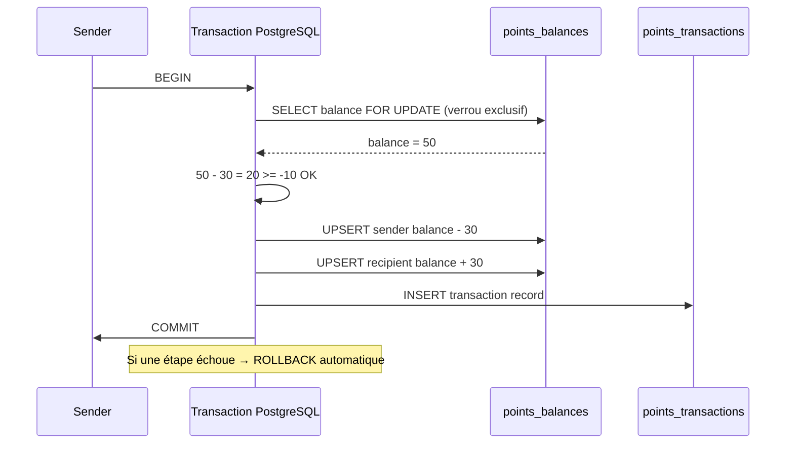

**Pourquoi `FOR UPDATE` ?** Empêche qu'un autre transfert concurrent lise le même solde avant que le premier ne soit commité (évite la double dépense).

---

## 7. Contrats numériques — Signature forte

### 7.1 Hash du contenu

À la création, un hash SHA-256 du contenu est calculé et stocké :

```typescript
const hash = crypto.createHash('sha256').update(dto.content).digest('hex');
// contentHash = "a1b2c3d4..."
```

### 7.2 Signature individuelle avec TOTP

Chaque signataire doit fournir un code TOTP valide. La signature inclut contenu + identité + timestamp :

```typescript
async sign(id: string, userId: string, totpCode: string) {
  // 1. Vérifier TOTP
  const isValid = this.totpService.verify(user.totpSecret, totpCode);
  if (!isValid) throw new BadRequestException('Invalid TOTP code');

  // 2. Calculer hash de signature
  const hash = crypto.createHash('sha256')
    .update(contract.content + userId + new Date().toISOString())
    .digest('hex');

  // 3. Ajouter la signature
  contract.signatures.push({ userId, signedAt: new Date(), hash });

  // 4. Vérifier si tous les signataires ont signé
  const allSigned = contract.signatories.every(s =>
    contract.signatures.some(sig => sig.userId === s)
  );
  contract.status = allSigned ? 'signed' : 'pending_signature';

  return contract.save();
}
```

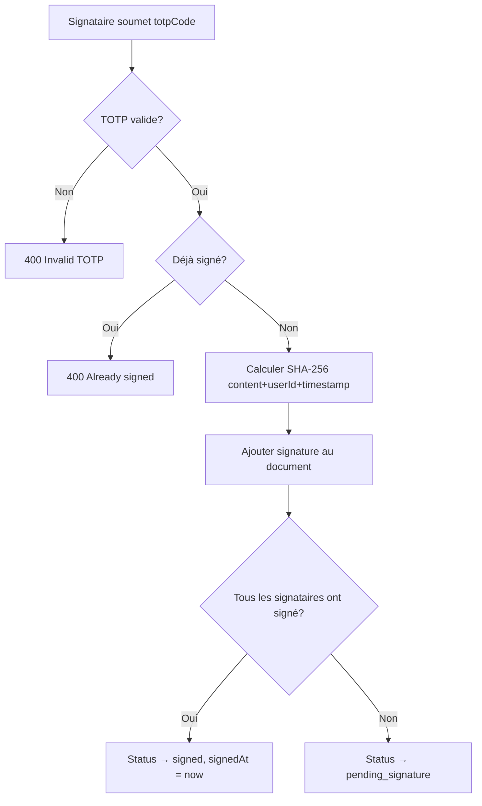

---

## 8. Messagerie temps réel — WebSocket

### 8.1 Architecture Socket.io

Le `MessagingGateway` gère le namespace `/messaging`. Chaque connexion est authentifiée via JWT.

```typescript
handleConnection(client: Socket) {
  const token = client.handshake.auth?.token;
  if (!token) { client.disconnect(); return; }

  const payload = this.jwtService.verify<{sub: string}>(token);
  (client as AuthSocket).userId = payload.sub;
  this.userSockets.set(payload.sub, client.id);
}
```

### 8.2 Flux envoi de message

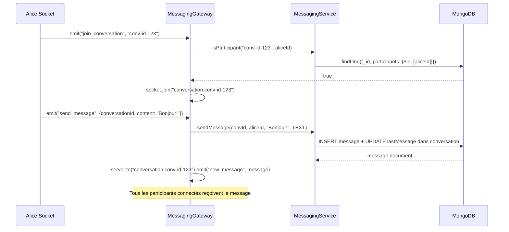

### 8.3 Sécurité du WebSocket

- Connexion refusée si JWT absent ou invalide
- `isParticipant` vérifié avant chaque `join_conversation`
- Les rooms sont nommées `conversation:{id}` — isolées par conversation

---

## 9. Système de votes — Strategy Pattern

### 9.1 Pourquoi le Strategy Pattern ?

Les votes ont deux modes (up/down pour incidents, like/dislike pour services) avec des règles différentes. Sans Strategy, on aurait une cascade de `if/switch` dans le service. Avec Strategy, chaque mode est une classe indépendante.

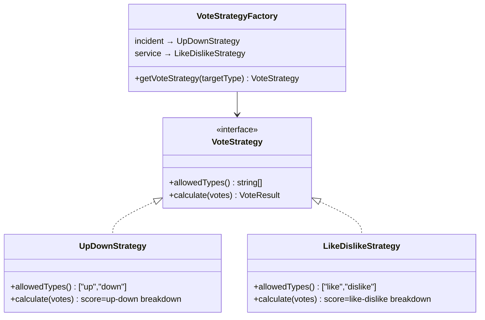

### 9.2 Logique toggle

Un même vote soumis deux fois s'annule (toggle off). Un vote différent remplace l'ancien.


---

## 10. Votes communautaires — Scrutins multi-types

### 10.1 Types de scrutin

| Type | Règle | Cas d'usage |
|------|-------|------------|
| `binary` | 1 choix parmi {oui, non} | Approbation règlement |
| `single_choice` | 1 choix parmi N options | Élection représentant |
| `multiple_choice` | 1 à N choix | Choix date réunion |
| `weighted` | Poids (1-10) par option | Priorités travaux |

### 10.2 Calcul des résultats pondérés

```typescript
for (const cast of vote.casts) {
  if (vote.voteType === CommunityVoteType.WEIGHTED && cast.weights) {
    for (const [optionId, weight] of Object.entries(cast.weights)) {
      totals[optionId] = (totals[optionId] ?? 0) + weight;  // somme des poids
    }
  } else {
    for (const choice of cast.choices) {
      totals[choice] = (totals[choice] ?? 0) + 1;  // comptage simple
    }
  }
}
```

### 10.3 Quorum

```typescript
const quorumReached = vote.quorum === 0 || vote.casts.length >= vote.quorum;
// quorum=0 signifie : pas de quorum minimum requis
```

Le vote est automatiquement fermé (`status = 'closed'`) à la lecture des résultats si `endsAt` est dépassé.

---

## 11. Graphe social Neo4j — Recommandations

### 11.1 Modèle de graphe

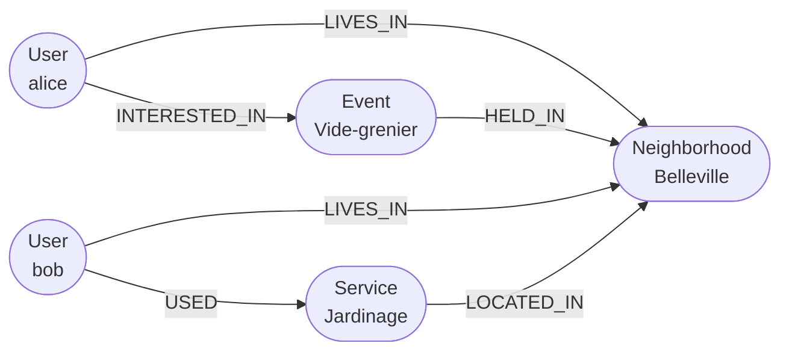

### 11.2 Requête de recommandation Cypher

```cypher
-- Services proches non utilisés
MATCH (u:User {id: $userId})-[:LIVES_IN]->(n:Neighborhood)
OPTIONAL MATCH (n)<-[:LOCATED_IN]-(s:Service)
WHERE NOT (u)-[:USED]->(s)
RETURN s.id AS id, s.name AS name, 'service' AS type, 3 AS score,
       'Service in your neighborhood' AS reason

UNION

-- Événements à venir proches
MATCH (u:User {id: $userId})-[:LIVES_IN]->(n:Neighborhood)
OPTIONAL MATCH (n)<-[:HELD_IN]-(e:Event)
WHERE NOT (u)-[:ATTENDING]->(e) AND e.date > datetime()
RETURN e.id AS id, e.name AS name, 'event' AS type, 2 AS score,
       'Upcoming event near you' AS reason

ORDER BY score DESC LIMIT 10
```

### 11.3 Sync temps réel (fire-and-forget)

```typescript
// Exemple dans neighborhoods.controller.ts
async create(@Body() dto, @Request() req) {
  const created = await this.neighborhoodModel.create(dto);    // MongoDB principal
  void this.socialService.syncNeighborhood(                    // Neo4j non-bloquant
    created._id.toString(), created.name
  );
  return created;  // réponse immédiate — Neo4j ne bloque jamais
}
```

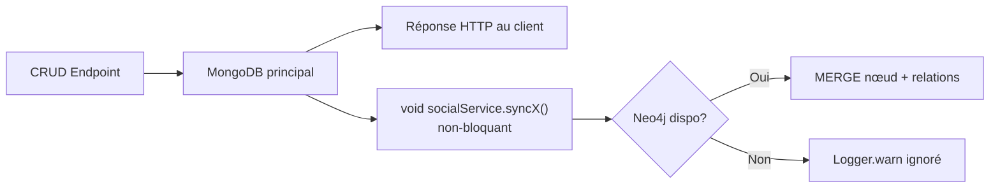

---

## 12. DSL — Micro-langage de requête

### 12.1 Grammaire complète

Le DSL est implémenté avec **PLY** (Python Lex-Yacc) — un générateur LALR(1) production-ready.

```
query : FIND IDENTIFIER
      | FIND IDENTIFIER WHERE conditions
      | FIND IDENTIFIER LIMIT NUMBER
      | FIND IDENTIFIER WHERE conditions LIMIT NUMBER
      | COUNT IDENTIFIER
      | COUNT IDENTIFIER WHERE conditions

conditions : condition
           | conditions AND condition
           | conditions OR condition

condition : IDENTIFIER EQ value         → {field: value}
          | IDENTIFIER NEQ value        → {field: {$ne: value}}
          | IDENTIFIER GT value         → {field: {$gt: value}}
          | IDENTIFIER GTE value        → {field: {$gte: value}}
          | IDENTIFIER LT value         → {field: {$lt: value}}
          | IDENTIFIER LTE value        → {field: {$lte: value}}
          | IDENTIFIER LIKE value       → {field: {$regex: v, $options: 'i'}}

value : STRING | NUMBER | IDENTIFIER
```

### 12.2 Pipeline de compilation

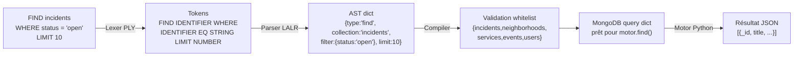

### 12.3 Sécurité du DSL

1. **Whitelist de collections** : seules 5 collections sont autorisées. `FIND passwords` → `ValueError`
2. **Paramétrage natif** : les valeurs passent par le moteur MongoDB, pas de concaténation de chaîne
3. **Bridge pythonia** : le DSL est exécuté dans un processus Python isolé

### 12.4 Exemples

```
FIND incidents WHERE status = 'open'
→ db.incidents.find({status: 'open'})

FIND services WHERE type = 'free' AND category = 'gardening' LIMIT 5
→ db.services.find({type:'free', category:'gardening'}).limit(5)

FIND incidents WHERE status = 'open' OR status = 'in_progress'
→ db.incidents.find({$or:[{status:'open'},{status:'in_progress'}]})

COUNT neighborhoods WHERE city = 'Paris'
→ db.neighborhoods.countDocuments({city:'Paris'})

FIND services WHERE title LIKE 'jardin'
→ db.services.find({title:{$regex:'jardin',$options:'i'}})
```

---

## 13. Application Desktop JavaFX

### 13.1 Architecture

```
desktop-app/src/main/java/fr/quartierconnect/desktopapp/
├── MainApp.java              extends Application — point d'entrée JavaFX
├── Launcher.java             main() → Application.launch()
├── views/
│   ├── LoginView.java        SSO flow + mode offline
│   └── MainView.java         BorderPane sidebar + contenu
├── services/
│   ├── AuthService.java      Singleton — tokens + session SQLite
│   ├── ApiService.java       HttpClient Java 11 + retry 401
│   ├── SyncService.java      ScheduledExecutorService 30s
│   ├── SsoCallbackServer.java Serveur HTTP local — reçoit callback PKCE
│   └── StatisticsService.java Stats live depuis API
└── database/
    └── SQLiteDatabase.java   JDBC — incidents + sync_log + session
```

### 13.2 Fat JAR (Maven Shade)

```xml
<!-- pom.xml -->
<plugin>
  <groupId>org.apache.maven.plugins</groupId>
  <artifactId>maven-shade-plugin</artifactId>
  <configuration>
    <shadedArtifactAttached>false</shadedArtifactAttached>
    <transformers>
      <transformer implementation="...ManifestResourceTransformer">
        <mainClass>fr.quartierconnect.desktopapp.Launcher</mainClass>
      </transformer>
    </transformers>
  </configuration>
</plugin>
```

Le JAR résultant (~25 MB) contient toutes les dépendances — il s'exécute avec `java -jar quartierconnect-desktop.jar` sans installation.

### 13.3 Système de plugins

```java
// PluginRegistry.java
public interface QuartierConnectPlugin {
    String getId();
    String getVersion();
    void onLoad(PluginContext context);
    void onUnload();
}

// Chargement dynamique (runtime)
public void register(QuartierConnectPlugin plugin) {
    try {
        plugin.onLoad(context);
        plugins.put(plugin.getId(), plugin);
    } catch (Exception e) {
        log.severe("Plugin " + plugin.getId() + " failed to load: " + e.getMessage());
        // Échec gracieux — le reste de l'application continue
    }
}
```

---

## 14. Mode hors-ligne et synchronisation

### 14.1 Machine d'états du démarrage

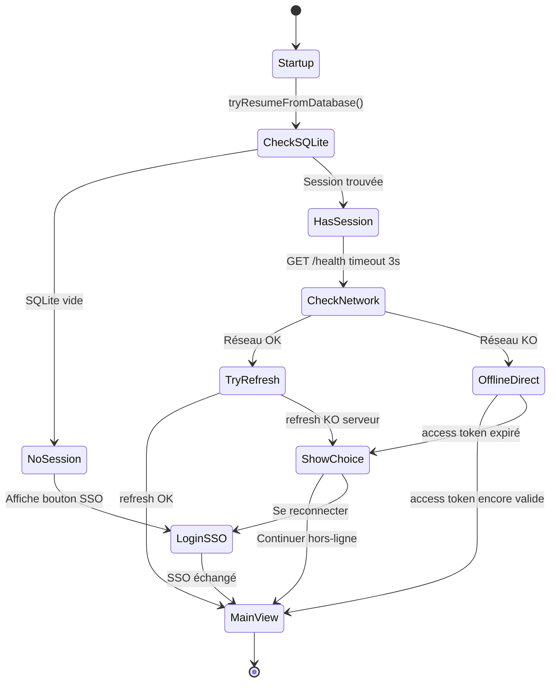

### 14.2 Extraction de l'email sans réseau

L'email est extrait du payload JWT (base64 décodeé) et mis en cache en SQLite. Il est disponible même quand le JWT est expiré, pour afficher "Connecté en tant que alice@demo.fr" en mode hors-ligne.

```java
private String extractEmailFromJwt(String token) {
    if (token == null) return null;
    try {
        String[] parts = token.split("\\.");
        String payload = new String(Base64.getUrlDecoder().decode(parts[1]));
        JsonNode node = MAPPER.readTree(payload);
        return node.has("email") ? node.get("email").asText() : null;
    } catch (Exception e) { return null; }
}
```

### 14.3 Synchronisation LWW (Last-Write-Wins)

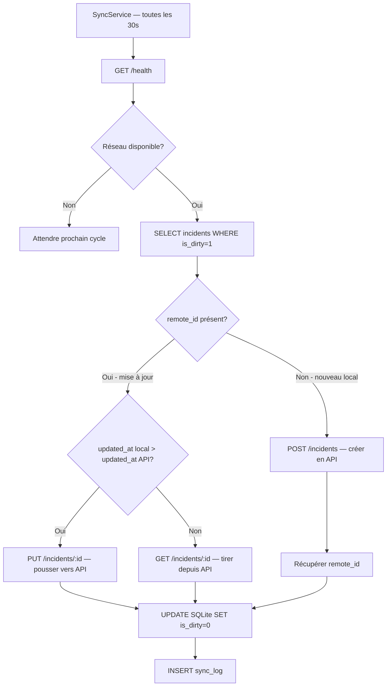

---

## 15. Infrastructure et déploiement

### 15.1 Variables d'environnement

```bash
# .env
POSTGRES_HOST=postgres
POSTGRES_PORT=5432
POSTGRES_DB=quartierconnect
POSTGRES_USER=qc_user
POSTGRES_PASSWORD=<secret>

MONGO_URI=mongodb://qc_user:<secret>@mongodb:27017/quartierconnect
NEO4J_URI=bolt://neo4j:7687
NEO4J_USER=neo4j
NEO4J_PASSWORD=<secret>

JWT_SECRET=<min-32-chars>
CORS_ORIGINS=http://localhost:3000,http://localhost:3001
```

### 15.2 CI/CD GitHub Actions

```yaml
# .github/workflows/ci.yml
jobs:
  api:
    steps:
      - pnpm install
      - pnpm run lint
      - pnpm run test:cov
      - pnpm run build
  desktop:
    steps:
      - ./mvnw test
      - ./mvnw package -q
  dsl:
    steps:
      - uv sync
      - uv run ruff check .
      - uv run pytest
```

### 15.3 Caddy — Reverse proxy

```caddyfile
{
    email admin@quartierconnect.fr
}

quartierconnect.fr {
    reverse_proxy /api/* api:5000
    reverse_proxy /admin/* admin:3001
    reverse_proxy /* client:3000
    encode gzip
}
```

Let's Encrypt est géré automatiquement par Caddy — pas de configuration SSL manuelle.

---

## 16. Qualité logicielle et tests

### 16.1 Tableau de bord tests

| Composant | Framework | Tests | Coverage |
|-----------|-----------|-------|---------|
| API NestJS unitaires | Jest | 236/236 ✓ | 95.7% stmts |
| API NestJS E2E | Supertest | 148/148 ✓ | — |
| Web shared hooks | Vitest | 73/73 ✓ | — |
| Java Desktop | JUnit 5 | 63/63 ✓ | — |
| DSL Python | pytest | 21/21 ✓ | — |
| Web Playwright | Playwright | 79/79 ✓ | — |
| **Total** | | **620/620 ✓** | |

### 16.2 Règles qualité non négociables

- Zéro `console.log` en code de production
- Zéro `TODO` en code commité
- Zéro commentaire inline expliquant du code évident
- Seuils coverage API : statements 80%, branches 75%, functions 80%
- `routeTree.gen.ts` jamais édité manuellement

### 16.3 Convention de commit

```
feat(auth): add SSO token generation endpoint
fix(points): prevent race condition in balance update
test(contracts): cover TOTP validation cases
docs: update architecture with Neo4j sync flow
chore(ci): add Playwright step to GitHub Actions
```

---

## 17. Bilan et perspectives

### 17.1 Fonctionnalités livrées

| Fonctionnalité | Statut |
|---------------|--------|
| Inscription + QR TOTP | ✅ |
| Connexion MFA (email + mdp + TOTP) | ✅ |
| SSO cross-surface (web → desktop) | ✅ |
| JWT access 15min + refresh 7j avec rotation | ✅ |
| CRUD quartiers avec détection chevauchements GeoJSON | ✅ |
| CRUD services avec filtres | ✅ |
| CRUD événements avec calendrier | ✅ |
| Machine d'états incidents (open→in_progress→resolved) | ✅ |
| Transfert de points ACID PostgreSQL | ✅ |
| Signature de contrats SHA-256 + TOTP | ✅ |
| Messagerie temps réel WebSocket (Socket.io) | ✅ |
| Votes (Strategy Pattern : up/down, like/dislike) | ✅ |
| Scrutins communautaires (4 types, quorum, pondéré) | ✅ |
| Recommandations Neo4j + sync temps réel | ✅ |
| DSL PLY + bridge pythonia | ✅ |
| Export RGPD JSON | ✅ |
| Application desktop JavaFX offline-first | ✅ |
| Sync bidirectionnelle desktop ↔ API (LWW) | ✅ |
| Système de plugins JavaFX | ✅ |
| CI/CD GitHub Actions | ✅ |
| Documentation Scalar interactive | ✅ |
| 620 tests automatisés | ✅ |

### 17.2 Dette technique identifiée

| Point | Description | Priorité |
|-------|------------|---------|
| Refresh token SQLite | Stocké en clair — utiliser OS keychain en prod | Haute |
| WebSocket rooms | Pas de persistance si le serveur redémarre | Moyenne |
| Neo4j sync | Fire-and-forget sans retry — peut manquer des mises à jour | Basse |

### 17.3 Perspectives

- Notifications push (Firebase / Web Push API)
- Application mobile React Native (partage du code back-end)
- Intégration paiement pour services payants (Stripe)
- Cartographie interactive (Mapbox / Leaflet)
- Chiffrement de bout en bout pour la messagerie (Signal Protocol)
