# Rapport technique — QuartierConnect

> ESGI 3AL2 · Plateforme communautaire de quartier · Rendu final 19 juillet 2026
> Version consolidée de la documentation développeur servie en ligne sous `/dev`
> (deux sites Fumadocs) et de la référence API interactive Scalar (`/api/docs`).

Ce document rassemble en un seul fichier, lisible directement sur GitHub, la
documentation technique de QuartierConnect : architecture, bases de données,
API REST, modèle de sécurité, langage de requête (DSL), application desktop,
messagerie temps réel, architecture front-end par *feature*, internationalisation,
tests et déploiement. Chaque affirmation renvoie à un emplacement réel du dépôt
(`api/`, `web-apps/`, `desktop-app/`, `dsl/`, `docker/`, `scripts/`).

---

## Table des matières

1. [Vue d'ensemble](#1-vue-densemble)
2. [Architecture](#2-architecture)
3. [Les bases de données](#3-les-bases-de-données)
4. [L'API REST](#4-lapi-rest)
5. [Modèle de sécurité](#5-modèle-de-sécurité)
6. [Le langage de requête (DSL)](#6-le-langage-de-requête-dsl)
7. [Application desktop JavaFX](#7-application-desktop-javafx)
8. [Messagerie temps réel](#8-messagerie-temps-réel)
9. [Architecture front-end par feature](#9-architecture-front-end-par-feature)
10. [Internationalisation](#10-internationalisation)
11. [Tests](#11-tests)
12. [Déploiement et exploitation](#12-déploiement-et-exploitation)

---

## 1. Vue d'ensemble

QuartierConnect connecte les résidents d'un quartier : signalement d'incidents,
offre et recherche de services d'entraide, organisation d'événements, votes,
échange de points et messagerie temps réel. La plateforme est **multi-composants** :
quatre applications actives et trois bases de données serveur, orchestrées par
Docker Compose, plus un cache SQLite embarqué dans le client bureautique. Une
seule intégration HTTP sortante existe (Nominatim / OpenStreetMap, pour le
géocodage des adresses).

Les quatre surfaces sont produites depuis un même monorepo :

| Surface | Stack | Rôle |
|---------|-------|------|
| **Client résident** | React 19 (Vite, `:3000`) | L'application du quotidien pour les habitants |
| **Back-office admin** | React 19 + éditeur DSL (`:3001`) | Modération, administration, console de requêtes |
| **API REST** | NestJS 11 (`:5000`) | 16 modules métier, JWT + TOTP, WebSocket, passerelle DSL |
| **Client desktop** | JavaFX 21 (fat JAR) | Compagnon hors-ligne (cache SQLite), système de plugins |

Deux sites de documentation Fumadocs complètent la stack : l'aide utilisateur
(`/aide`) et la documentation développeur (`/dev`). La référence complète et
interactive de l'API est générée par **Scalar** à partir des décorateurs NestJS
(`@nestjs/swagger`) et servie sous `/api/docs` — c'est la source de vérité pour
la signature exacte de chaque route.

---

## 2. Architecture

### 2.1 Topologie runtime

La stack tourne sur **9 conteneurs** Docker : `caddy` (reverse proxy HTTPS +
Let's Encrypt), `client` (SPA résident, `:3000`), `admin` (SPA back-office,
`:3001`), `docs-user` (aide Fumadocs, `:3002`), `docs-dev` (docs développeur
Fumadocs, `:3003`), `api` (NestJS `:5000`, embarquant la passerelle DSL Python
PLY), `mongo` (`:27017`), `postgres` (`:5432`) et `neo4j` (`:7474`/`:7687`).

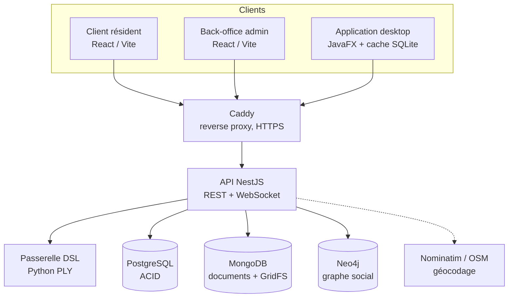
```mermaid
flowchart TB
  subgraph clients[Clients]
    web["Client résident<br/>React / Vite"]
    admin["Back-office admin<br/>React / Vite"]
    desk["Application desktop<br/>JavaFX + cache SQLite"]
  end
  caddy["Caddy<br/>reverse proxy, HTTPS"]
  api["API NestJS<br/>REST + WebSocket"]
  dsl["Passerelle DSL<br/>Python PLY"]
  pg[("PostgreSQL<br/>ACID")]
  mongo[("MongoDB<br/>documents + GridFS")]
  neo[("Neo4j<br/>graphe social")]
  nomi["Nominatim / OSM<br/>géocodage"]
  web --> caddy
  admin --> caddy
  desk --> caddy
  caddy --> api
  api --> dsl
  api --> pg
  api --> mongo
  api --> neo
  api -.-> nomi
```

### 2.2 Le monorepo

Le dépôt regroupe quatre briques applicatives, chacune avec sa stack propre.

- **API NestJS** (`api/`, Node 22) — cœur métier exposant une API REST et une
  passerelle WebSocket, organisée en **16 modules** : `AuthModule`, `UsersModule`,
  `IncidentsModule`, `ServicesModule`, `BookingsModule`, `EventsModule`,
  `PointsModule`, `ContractsModule`, `MessagingModule`, `VotesModule`,
  `CommunityVotesModule`, `DocumentsModule`, `NeighborhoodsModule`,
  `SocialModule` (driver Neo4j), `GeocodingModule` et `DslModule`. Le conteneur
  `api` embarque aussi la passerelle DSL Python PLY.
- **Web-apps (Turbo)** — deux SPA React servies par Vite (client `:3000`, admin
  `:3001`) plus deux sites Fumadocs (`docs-user` `:3002`, `docs-dev` `:3003`).
  Le monorepo partage des packages : `packages/shared` (client API, hooks React
  Query, i18n, helpers géo) et `packages/ui` (composants Shadcn/ui et le
  composant cartographique `<Map>` autour de `react-leaflet`).
- **Application desktop JavaFX** — distribuée en fat JAR, destinée aux
  administrateurs et modérateurs. Elle dialogue avec l'API en HTTP REST, dispose
  d'un mode hors ligne, d'un système de plugins et d'un cache SQLite local.
- **DSL** (`dsl/`) — micro-langage de requête compilé par un pipeline Python PLY
  (lexer → parser LALR(1) → compilateur avec liste blanche de collections) qui
  produit un AST validé. L'exécution n'a pas lieu côté Python : c'est le
  `DslService` de l'API qui interroge les bases.

Ces modules s'appuient sur un socle transverse déclaré une seule fois dans
`AppModule` : le `ThrottlerGuard` monté en `APP_GUARD` global (fenêtre de 15 min,
1000 requêtes), le `MongooseExceptionFilter` en `APP_FILTER` global, et
`main.ts` enregistre un `ValidationPipe` global en mode `whitelist` (tout champ
absent du DTO est supprimé de la requête). `ConfigModule` (global),
`EventEmitterModule` et `I18nModule` (langue de repli `fr`) complètent ce socle.
Les migrations Drizzle sont appliquées automatiquement au démarrage, avant
l'ouverture du port d'écoute.

`GeocodingModule` n'est pas monté directement dans `AppModule` : il est
ré-importé par `UsersModule`, `ServicesModule` et `EventsModule`, qui en ont
besoin pour valider les adresses.

### 2.3 Le reverse proxy Caddy

Caddy (`:80`/`:443`) est le seul point d'entrée HTTP/HTTPS. Il termine le TLS
(Let's Encrypt automatique en production) et route par **préfixe de chemin** :

```
/          → client:3000
/admin     → admin:3001
/aide      → docs-user:3002
/dev       → docs-dev:3003   (basic auth DOCS_AUTH_USER / DOCS_AUTH_HASH)
/api       → api:5000        (retire le préfixe /api)
/api/docs  → api:5000/docs   (Scalar, basic auth)
```

En production, seuls les ports **22, 80 et 443** sont exposés à Internet ; tous
les autres services sont liés à `127.0.0.1`, joignables uniquement via le réseau
Docker interne. Le WebSocket de la messagerie (Socket.io) passe par le même
`/api` avec bascule `wss://`.

### 2.4 Le cycle d'une requête

Chaque requête traverse la même chaîne de responsabilité avant d'atteindre la
logique métier : Caddy termine le TLS et retire le préfixe `/api` ; Helmet
applique le durcissement HTTP applicatif (CSP, HSTS, `X-Frame-Options`… sont
désactivés côté API car Caddy possède le bord et les pose) ; le `ThrottlerGuard`
global plafonne le débit ; le `JwtAuthGuard` vérifie la signature du token **et**
l'absence du `jti` dans `revoked_tokens` ; enfin le `ValidationPipe` nettoie le
corps (mode `whitelist`) avant de le remettre au contrôleur.

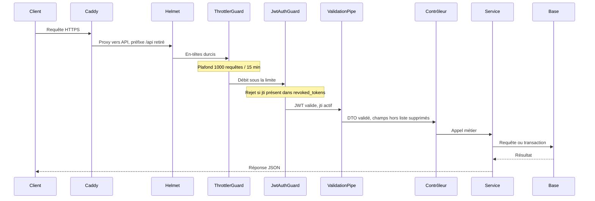
```mermaid
sequenceDiagram
  participant Cli as Client
  participant Cad as Caddy
  participant Hel as Helmet
  participant Thr as ThrottlerGuard
  participant Jwt as JwtAuthGuard
  participant Val as ValidationPipe
  participant Ctl as Contrôleur
  participant Svc as Service
  participant Db as Base
  Cli->>Cad: Requête HTTPS
  Cad->>Hel: Proxy vers API, préfixe /api retiré
  Hel->>Thr: En-têtes durcis
  Note over Thr: Plafond 1000 requêtes / 15 min
  Thr->>Jwt: Débit sous la limite
  Note over Jwt: Rejet si jti présent dans revoked_tokens
  Jwt->>Val: JWT valide, jti actif
  Val->>Ctl: DTO validé, champs hors liste supprimés
  Ctl->>Svc: Appel métier
  Svc->>Db: Requête ou transaction
  Db-->>Svc: Résultat
  Svc-->>Cli: Réponse JSON
```

---

## 3. Les bases de données

QuartierConnect répartit ses données sur **quatre** bases : PostgreSQL pour le
relationnel ACID, MongoDB pour les documents et binaires flexibles, Neo4j pour le
graphe social, et un cache SQLite embarqué dans le client bureautique. Chaque
donnée a **une** base propriétaire côté serveur ; le client bureautique n'en
détient qu'un cache local synchronisé.

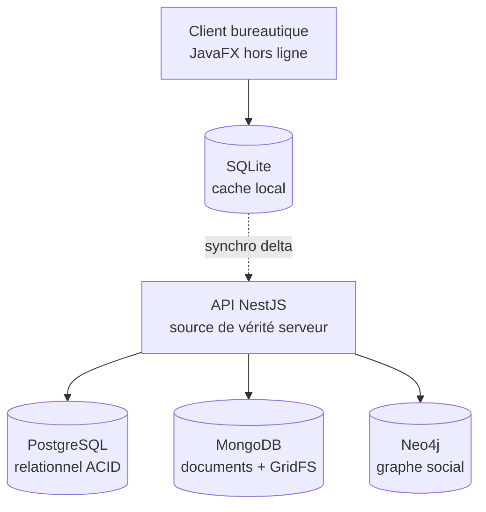
```mermaid
flowchart TB
  api["API NestJS<br/>source de vérité serveur"]
  desk["Client bureautique<br/>JavaFX hors ligne"]
  pg[("PostgreSQL<br/>relationnel ACID")]
  mongo[("MongoDB<br/>documents + GridFS")]
  neo[("Neo4j<br/>graphe social")]
  sqlite[("SQLite<br/>cache local")]
  api --> pg
  api --> mongo
  api --> neo
  desk --> sqlite
  sqlite -.->|"synchro delta"| api
```

### 3.1 PostgreSQL — relationnel ACID (Drizzle ORM)

ORM : **Drizzle ORM** (TypeScript), source de vérité `api/src/database/schema.ts`.
**5 tables** : `users`, `incidents`, `points_balances`, `points_transactions`,
`revoked_tokens`.

- **`users`** — identité et sécurité. `email` unique normalisé en minuscules,
  `password_hash` en **Argon2id** (jamais bcrypt), `totp_secret` base32
  (RFC 6238), `refresh_token_hash` (rotation stricte, `NULL` si déconnecté).
  `role` suit la machine à états `resident → moderator → admin`, `banned` étant
  terminal mais réversible ; à un bannissement, le rôle courant est copié dans
  `previous_role` puis restauré à la réactivation. `address_lat` / `address_lng`
  sont géocodés via Nominatim.
- **`incidents`** — `status` suit `open → in_progress → resolved` (transitions
  validées côté API). `category` (`neighborhood` par défaut, sinon `reporting`
  ou `bug`) et `neighborhood_id` gouvernent la **visibilité**. Suppression
  **logique** via `deleted_at` (tombstone) pour propager les suppressions vers le
  client bureautique hors ligne ; `updated_at` alimente la **synchro delta**
  (`GET /incidents?since=<ISO>`, filtre `updated_at > since`). Index sur `status`
  et `deleted_at`.
- **`points_balances`** — un solde unique par utilisateur (`user_id` UNIQUE),
  avec une contrainte `CHECK (balance >= -10)` garantie **au niveau de la base**.
- **`points_transactions`** — `type` (`service_payment` | `bonus` | `correction`)
  et `status` (`pending` | `completed` | `cancelled`) contrôlés par `CHECK`. Un
  `service_payment` référence un `contract_id` MongoDB.
- **`revoked_tokens`** — liste de révocation par `jti` du JWT. Le `JwtAuthGuard`
  rejette tout token d'accès dont le `jti` y figure ; `expires_at` permet la
  purge des entrées expirées.

**Transfert de points en ACID.** Le transfert s'exécute dans une transaction
PostgreSQL. Les deux lignes de solde (émetteur et destinataire) sont d'abord
créées si besoin (`onConflictDoNothing`), puis **verrouillées dans un ordre
déterministe** — tri par `user_id`, `... WHERE user_id IN (...) ORDER BY user_id
FOR UPDATE` — ce qui élimine l'interblocage croisé `A→B ‖ B→A`. Le service
vérifie ensuite le seuil `-10` avant d'appliquer les deltas. Les erreurs
PostgreSQL sont mappées en réponses `400` : `40P01` (deadlock détecté) →
`{ code: CONCURRENT_UPDATE }`, violation du `CHECK (balance >= -10)` (`23514`) →
`{ code: INSUFFICIENT_BALANCE }`. Le même chemin verrouillé sert au règlement
des paiements de service (`settleServicePayment`), rendu **idempotent** (un
statut déjà `completed` sort sans double débit).

### 3.2 MongoDB — documents flexibles (Mongoose)

ODM : **Mongoose** (`MongooseModule` NestJS). **17 collections** au total :
**11 collections de documents**, plus **3 buckets GridFS** matérialisés chacun
par une paire `.files` + `.chunks` (soit 6 collections physiques).

| Collection | Contenu |
|-----------|---------|
| `neighborhoods` | Polygones GeoJSON, index `2dsphere` |
| `services` / `serviceresponses` / `servicebookings` | Annonces, réponses, réservations payantes |
| `events` | Événements de quartier (`interestedUserIds` via `$addToSet`) |
| `contracts` | Contrats, `contentHash` SHA-256 et signatures |
| `conversations` / `messages` | Messagerie |
| `votes` | Votes de réaction (Strategy Pattern) |
| `communityvotes` | Scrutins multi-types (`binary`, `single_choice`, `multiple_choice`, `weighted`) |
| `documents` | Métadonnées GridFS + journal d'audit |

Buckets GridFS : `pdfs` (PDF de contrats), `avatars` (images d'avatar),
`messaging_files` (pièces jointes des messages).

Points clés :

- Les documents référencent les utilisateurs par leur **UUID PostgreSQL**
  (champs `createdBy`, `senderId`, etc.).
- `neighborhoods.geometry` porte un index **`2dsphere`** pour `$geoIntersects`
  (chevauchement de quartiers, appartenance d'une adresse).
- Index uniques métier : `{ serviceId, responderId }` sur `serviceresponses`,
  `{ userId, targetId, targetType }` sur `votes`.
- La collection éphémère **`ssotokens`** (modèle `SsoToken`) utilise un index
  **TTL de 300 s** pour l'échange SSO inter-surfaces.

### 3.3 Neo4j — graphe social

Écritures **exclusivement** via `SocialService` (`api/src/social/social.service.ts`),
en **fire-and-forget**. Labels : `User`, `Neighborhood`, `Service`, `Event`.
Relations : `LIVES_IN`, `LOCATED_IN`, `HELD_IN`, `INTERESTED_IN`, `ATTENDING`,
`NOT_INTERESTED_IN`, `HELPED` (porte `serviceId` et `points`).

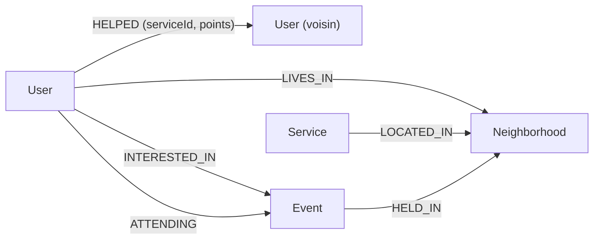
```mermaid
flowchart LR
  U["User"]
  V["User (voisin)"]
  N["Neighborhood"]
  S["Service"]
  E["Event"]
  U -->|LIVES_IN| N
  S -->|LOCATED_IN| N
  E -->|HELD_IN| N
  U -->|INTERESTED_IN| E
  U -->|ATTENDING| E
  U -->|"HELPED (serviceId, points)"| V
```

L'endpoint de recommandation combine par union quatre sources classées
(`RECOMMENDATIONS_QUERY`) : `serviceInNeighborhood` (score 3),
`upcomingEventNearby` (score 2), `sharedInterests` (`3 + peerCount`) et
`reliableNeighbor` (`4 + helpCount + sharedEvents`). Les résultats sont triés par
score décroissant, dédupliqués par `type + name` et limités à 10.

**Résilience.** Chaque écriture passe par `withRetry` (3 tentatives, backoff
100/200/400 ms). Une panne de Neo4j ne bloque jamais l'API ; les lectures
retombent alors sur une liste vide. À un changement de quartier, `LIVES_IN`,
`LOCATED_IN` et `HELD_IN` sont réécrites en **delete-then-merge**, ce qui
garantit une relation de localisation unique après un déménagement.

### 3.4 SQLite — cache du client bureautique

Embarqué dans le client JavaFX (`quartierconnect.db`), schéma dans
`desktop-app/.../database/SQLiteDatabase.java`. **3 tables** : `incidents`,
`sync_log`, `session`. La synchronisation applique un **Three-Way Merge** (voir
§7). SQLite n'est **jamais** source de vérité : l'API PostgreSQL fait autorité.
La table `session` ne stocke que l'e-mail ; les tokens ne sont jamais persistés
dans SQLite mais dans le trousseau de l'OS (`TokenVault`).

### 3.5 Règles d'usage

| Règle | Détail |
|------|--------|
| Points en ACID PostgreSQL | Jamais de transaction MongoDB — soldes + `CHECK >= -10` |
| Pas d'auth dans MongoDB | Utilisateurs, rôles et hashes de tokens uniquement dans PostgreSQL |
| Neo4j orienté lecture | Écritures via `SocialService`, fire-and-forget avec retry |
| SQLite = cache local | Jamais la source de vérité |
| GridFS = binaires | Les métadonnées vont dans la collection `documents` |
| Tokens jamais dans SQLite | Trousseau de l'OS via `TokenVault` |

---

## 4. L'API REST

L'API REST est construite avec NestJS et expose ses routes réparties en 16
modules fonctionnels (version OpenAPI `3.0`). Deux serveurs sont déclarés dans la
spécification : `http://localhost:5000` (accès direct) et `http://localhost/api`
(via Caddy).

### 4.1 Authentification

Toutes les routes protégées reposent sur un **JWT Bearer** signé en **HS256**,
d'une durée de vie de **15 minutes**, transmis dans l'en-tête
`Authorization: Bearer <accessToken>`.

Cycle : `POST /auth/register` renvoie le secret TOTP dans le champ `otpauthUrl` ;
`POST /auth/login` prend email + mot de passe + code TOTP à 6 chiffres. Le jeton
d'accès (15 min) est accompagné d'un **refresh token** de 7 jours, déposé dans un
cookie `qc_rt` **httpOnly** (`SameSite=strict`, `Secure` en production). Le
renouvellement se fait via `POST /auth/refresh` avec **rotation** (l'ancien est
invalidé à chaque échange). À la déconnexion (`POST /auth/logout`), le hash du
refresh token est effacé en base et le jeton d'accès courant est révoqué via son
`jti`.

`AuthService.login` enchaîne **trois vérifications** séquentielles avant d'émettre
la paire de jetons : existence du compte (et absence de bannissement), mot de
passe (haché en Argon2), puis code TOTP protégé contre le rejeu. Le refresh token
n'est jamais stocké en clair — seul son hash Argon2 est conservé
(`refreshTokenHash`).

### 4.2 Contrat de liste côté serveur et en-têtes `X-Total-Count`

Les endpoints de liste partagent un **contrat commun** implémenté dans
`api/src/common/pagination.ts` (`parsePagination`, `resolveSort`, `escapeLike` /
`escapeRegex`, `setPageHeaders`). **Recherche, tri et filtres sont appliqués
côté serveur** — ils portent donc sur l'ensemble des données correspondantes,
pas seulement sur la page déjà chargée.

| Paramètre | Rôle | Défaut |
|-----------|------|--------|
| `page` | Numéro de page (à partir de `1`) | `1` |
| `limit` | Taille de page — bornée à `1`–`100` par `parsePagination` | `20` |
| `search` | Sous-chaîne insensible à la casse | — |
| `sort` | Champ de tri (liste blanche par endpoint) | `createdAt` |
| `order` | Sens du tri : `asc` ou `desc` | `desc` |

Filtres additionnels par endpoint (extrait) :

| Endpoint | Filtres | `search` porte sur | `sort` autorisés |
|----------|---------|--------------------|-------------------|
| `GET /incidents` | `status`, `category` | titre + description | `createdAt`, `updatedAt`, `status` |
| `GET /services` | `category`, `type`, `direction` | titre + description | `createdAt`, `title` |
| `GET /events` | `category`, `date` | titre | `createdAt`, `date`, `title` |
| `GET /neighborhoods` | — | nom + ville | `createdAt`, `name` |
| `GET /community-votes` | `status` | titre | `createdAt`, `endsAt` |
| `GET /users` (admin) | `role` | email | `createdAt`, `email`, `role` |

**Corps de réponse et métadonnées.** Le corps de la réponse **reste un tableau
nu** d'entités — inchangé pour les consommateurs existants, notamment le pull
incrémental du client bureautique. Les métadonnées de pagination voyagent dans
deux **en-têtes de réponse** posés par `setPageHeaders` :

- `X-Total-Count` — nombre total d'éléments correspondant au filtre, toutes pages
  confondues.
- `X-Total-Pages` — nombre total de pages (`ceil(total / limit)`, minimum `1`).

Ces deux en-têtes sont **exposés via CORS** (`exposedHeaders` dans
`api/src/main.ts`) afin d'être lisibles depuis le navigateur. Côté web, le helper
`apiGetPage` (`web-apps/packages/shared/src/lib/api.ts`) les lit et renvoie
`{ data, total, totalPages }` ; en leur absence il retombe sur `data.length` et `1`.

```http
GET /incidents?page=2&limit=20&status=open HTTP/1.1
Authorization: Bearer <accessToken>
```

```http
HTTP/1.1 200 OK
Content-Type: application/json
X-Total-Count: 137
X-Total-Pages: 7

[ { "id": "…", "title": "Poutre fissurée hall B", "status": "open" } ]
```

**Robustesse des entrées.** `search` est toujours interprété littéralement : sur
les stores PostgreSQL, `escapeLike` échappe `%`, `_` et `\` avant le `ILIKE` ;
sur les stores MongoDB, `escapeRegex` échappe les métacaractères avant le
`$regex`. `sort` passe par une **liste blanche** (`resolveSort`) qui retombe sur
`createdAt` si la valeur est inconnue. Les filtres MongoDB n'acceptent que des
chaînes (`typeof … === "string"`), ce qui bloque l'injection d'opérateurs de type
`?category[$ne]=`.

**Synchronisation delta.** `GET /incidents?since=<ISO>` ne renvoie que les
incidents modifiés après l'horodatage fourni (comparaison sur `updatedAt`).
Utilisé par le pull incrémental du client bureautique ; une valeur non parsable
renvoie `400`, et le format de réponse reste un tableau nu.

### 4.3 Rôles et autorisations

La hiérarchie est `resident → moderator → admin`, plus l'état `banned`. Les
autorisations sont appliquées par `JwtAuthGuard` et `RolesGuard`, pilotées par le
décorateur `@Roles` sur chaque route.

- **resident** — accès authentifié standard, cloisonné au quartier. Un résident
  voit les incidents `neighborhood` de son quartier (même sans en être l'auteur)
  plus **ses propres** signalements `reporting`/`bug`. `GET /incidents/:id`
  renvoie **404** (et non 403) sur un signalement de modération étranger, afin de
  ne jamais en révéler l'existence.
- **moderator** — mêmes limites de quartier, mais **toutes catégories**, plus la
  modération : `PATCH /incidents/:id/status`, `DELETE /incidents/:id` et
  l'exécution `POST /dsl/query` (scopée à son quartier).
- **admin** — périmètre global et administration : `GET /users`,
  `PATCH /users/:id/role`, gestion des quartiers, `GET /stats`.
- **banned** — état bloquant ; mémorise `previousRole` pour la réactivation.

### 4.4 Conventions et référence Scalar

Identifiants : UUID côté PostgreSQL, `ObjectId` côté MongoDB. Réponses d'erreur :
codes HTTP standards, complétés le cas échéant par un code applicatif dans le
corps (`EMAIL_ALREADY_EXISTS`, `TOKEN_REVOKED`…). La spécification OpenAPI est
générée depuis les décorateurs des contrôleurs et exposée via une interface
**Scalar** sous `GET /docs`, dont le bundle est auto-hébergé
(`/scalar/standalone.js`, sans CDN externe).

---

## 5. Modèle de sécurité

L'API n'oppose pas une seule barrière mais empile des couches indépendantes.
Chaque requête traverse le proxy de bord, les middlewares HTTP, la chaîne de
guards NestJS (`ThrottlerGuard` global puis `JwtAuthGuard` et `RolesGuard`), la
validation des entrées, enfin la coercition des filtres.

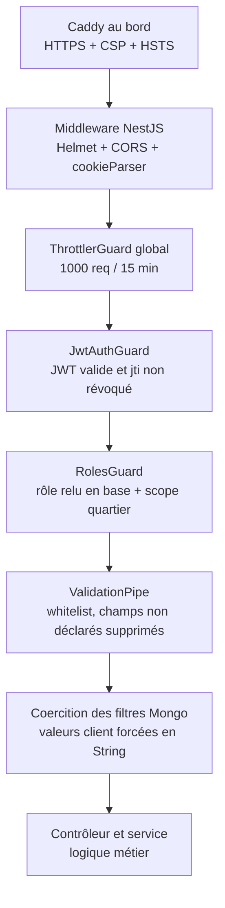
```mermaid
flowchart TB
  edge["Caddy au bord<br/>HTTPS + CSP + HSTS"]
  mw["Middleware NestJS<br/>Helmet + CORS + cookieParser"]
  thr["ThrottlerGuard global<br/>1000 req / 15 min"]
  jwt["JwtAuthGuard<br/>JWT valide et jti non révoqué"]
  roles["RolesGuard<br/>rôle relu en base + scope quartier"]
  pipe["ValidationPipe<br/>whitelist, champs non déclarés supprimés"]
  coerce["Coercition des filtres Mongo<br/>valeurs client forcées en String"]
  svc["Contrôleur et service<br/>logique métier"]
  edge --> mw --> thr --> jwt --> roles --> pipe --> coerce --> svc
```

### 5.1 Hachage des mots de passe — Argon2id

Les mots de passe sont hachés avec **Argon2id** (paramètres par défaut du paquet
`argon2` : `memoryCost: 65536` (64 Mo), `timeCost: 3`, `parallelism: 4`).
L'inscription appelle `argon2.hash(dto.password)` ; la connexion vérifie via
`argon2.verify(user.passwordHash, dto.password)`. Le **jeton refresh JWT est lui
aussi haché** en Argon2 avant stockage : un accès en lecture à la base ne suffit
donc pas à rejouer un refresh.

### 5.2 MFA TOTP — RFC 6238 avec anti-rejeu

L'application impose un second facteur TOTP conforme à la RFC 6238
(`code = HOTP(secret, floor(unix / 30))`). Le code est valide 30 s avec une
tolérance de ±1 période (`window: 1`). À l'inscription,
`speakeasy.generateSecret` produit un secret base32 stocké en PostgreSQL.

La vérification intègre un **anti-rejeu en mémoire** vivant dans `TotpService` :
chaque couple `secret:code` accepté est mémorisé pendant **90 secondes**, si bien
qu'un code intercepté ne peut être rejoué même s'il reste dans sa fenêtre de
validité de 30 s. Le même `TotpService` protège la connexion et les actions
sensibles.

Un code TOTP est exigé, en plus de la session, pour : `POST /auth/login`,
`POST /contracts/:id/sign`, `PATCH /users/me/password`, `PATCH /users/me/email`,
`PATCH /users/me/phone` et `DELETE /users/me`.

### 5.3 JWT — access, refresh et rotation stricte

| Jeton | Durée de vie | Stockage | Accès JS |
|-------|--------------|----------|----------|
| access | 15 minutes | `localStorage` | Oui — en-tête `Authorization: Bearer` |
| refresh | 7 jours | cookie httpOnly `qc_rt` (SameSite=strict) | Non |

Le payload contient `sub`, `email`, `role`, `jti`, `iat` et `exp`. Le refresh
inaccessible au JavaScript (httpOnly) élimine le principal vecteur XSS ; en
production le flag `secure` impose HTTPS. Le cookie `SameSite=strict` combiné à
l'usage de l'en-tête `Authorization` rend le CSRF impossible.

**Rotation stricte.** `TokenService.rotateRefreshToken` opère sous transaction
PostgreSQL avec un verrou de ligne `SELECT ... FOR UPDATE`. Ce verrou protège
contre une course **TOCTOU** : si deux requêtes `POST /auth/refresh` arrivent
avec le même token, une seule franchit la vérification. La première invalide le
hash (`refreshTokenHash = null`) dans la même transaction ; la seconde, débloquée
après le `COMMIT`, ne trouve plus de hash et échoue en `401 TOKEN_REVOKED`. Le
rôle est relu depuis PostgreSQL à chaque rotation : un bannissement coupe l'accès
dès le renouvellement suivant.

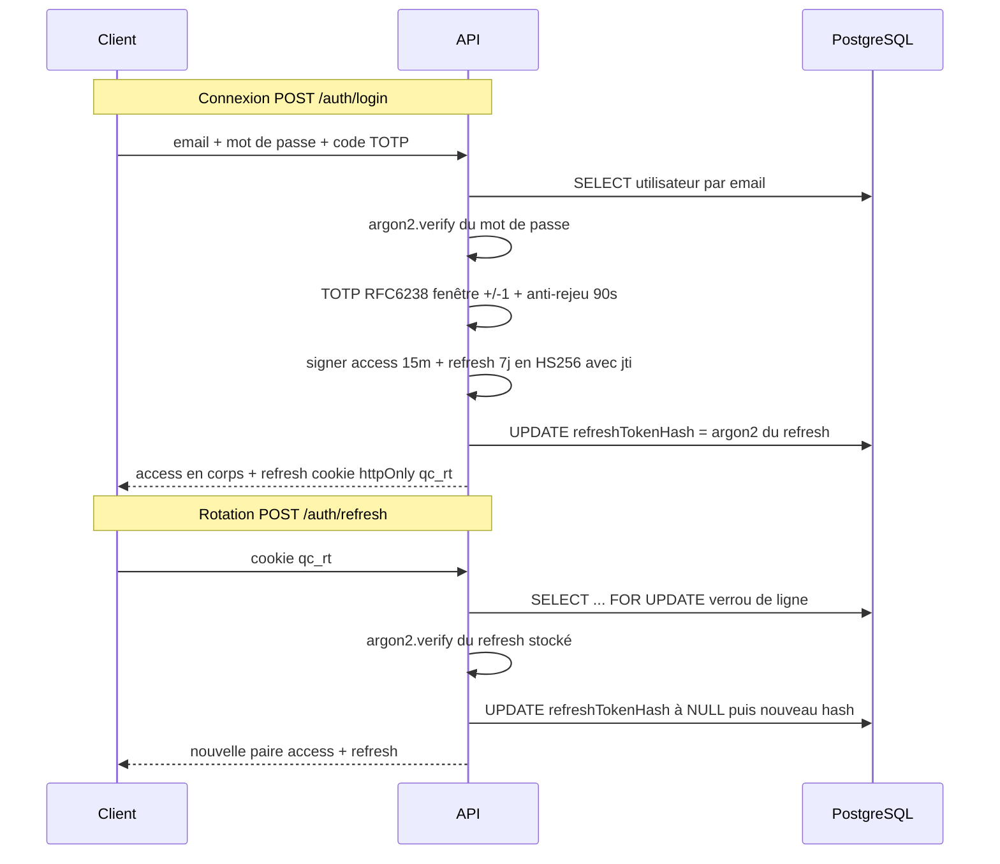
```mermaid
sequenceDiagram
  participant C as Client
  participant A as API
  participant DB as PostgreSQL
  Note over C,A: Connexion POST /auth/login
  C->>A: email + mot de passe + code TOTP
  A->>DB: SELECT utilisateur par email
  A->>A: argon2.verify du mot de passe
  A->>A: TOTP RFC6238 fenêtre +/-1 + anti-rejeu 90s
  A->>A: signer access 15m + refresh 7j en HS256 avec jti
  A->>DB: UPDATE refreshTokenHash = argon2 du refresh
  A-->>C: access en corps + refresh cookie httpOnly qc_rt
  Note over C,A: Rotation POST /auth/refresh
  C->>A: cookie qc_rt
  A->>DB: SELECT ... FOR UPDATE verrou de ligne
  A->>A: argon2.verify du refresh stocké
  A->>DB: UPDATE refreshTokenHash à NULL puis nouveau hash
  A-->>C: nouvelle paire access + refresh
```

**Révocation instantanée.** À la déconnexion (`POST /auth/logout`), le jeton
access courant est révoqué via son `jti` dans la table `revoked_tokens`, sans
attendre son expiration. Les entrées expirées sont purgées à chaque révocation,
sans Redis ni tâche cron.

**SSO inter-surfaces.** Un mode SSO à jeton unique (`POST /auth/sso/generate`
puis `POST /auth/sso/exchange`, TTL 5 min, stocké dans `ssotokens`) permet
d'ouvrir une session sur le client lourd JavaFX. Le paramètre optionnel `state`
(protection CSRF de type PKCE) est vérifié lors de l'échange.

### 5.4 Limitation de débit

Un `ThrottlerGuard` global limite chaque IP à **1000 requêtes / 15 minutes**
(`ThrottlerModule.forRoot([{ ttl: 900000, limit: 1000 }])`). Des routes
sensibles ont des limites spécifiques :

| Route | Limite | Fenêtre | Raison |
|-------|--------|---------|--------|
| `POST /auth/login` | 5 tentatives | 15 min | Anti-force brute (mot de passe + TOTP) |
| `POST /auth/refresh` | 10 requêtes | 60 s | Limiter la rotation abusive |

La limite de login est pilotée par `LOGIN_RATE_LIMIT` (défaut 5, élevée en dev).

### 5.5 En-têtes HTTP et service des fichiers

**Helmet.js** est appliqué à toutes les réponses. En production, Caddy possède
les en-têtes de bord (CSP, HSTS, `X-Frame-Options`) : la configuration Helmet de
l'API désactive ces mêmes en-têtes pour ne pas les dupliquer.

Les fichiers uploadés (pièces jointes de messagerie et avatars) sont stockés dans
GridFS puis servis par l'API. Le type MIME déclaré par le client étant **non
fiable**, seule une **liste blanche** est servie `inline` (images matricielles
`png`/`jpeg`/`webp`/`gif`, audios `webm`/`ogg`/`mpeg`/`mp4`) ; tout le reste —
**HTML, SVG**, texte… — est forcé en `Content-Disposition: attachment` et servi
en `application/octet-stream`. Cette mesure neutralise le XSS stocké via les
uploads.

### 5.6 Anonymat des votes et concurrence des soldes

Pour un vote marqué `isAnonymous`, l'API ne renvoie **jamais** les bulletins des
autres votants : chaque réponse ne conserve que le bulletin de l'appelant. Les
totaux agrégés restent disponibles, sans aucun identifiant. Le transfert de
points (§3.1) verrouille les deux soldes dans un ordre déterministe pour
éliminer les interblocages.

### 5.7 Cycle de vie d'un contrat — signature électronique

Signer un contrat exige un code TOTP valide (même anti-rejeu qu'à la connexion).
Chaque signature est scellée par un **hachage SHA-256** de
`contenu + userId + horodatage ISO`. Le statut suit quatre états — `draft`,
`partial`, `fully_signed`, `cancelled` (les deux derniers terminaux).

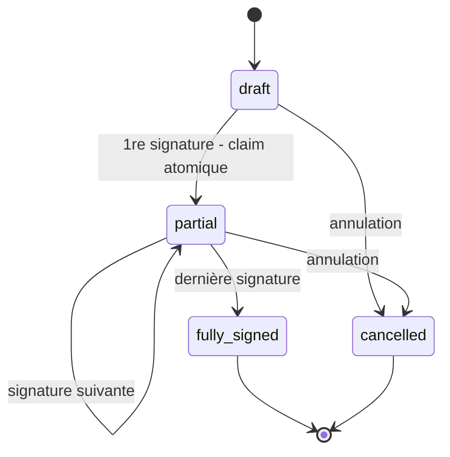
```mermaid
stateDiagram-v2
  [*] --> draft
  draft --> partial : 1re signature - claim atomique
  partial --> partial : signature suivante
  partial --> fully_signed : dernière signature
  draft --> cancelled : annulation
  partial --> cancelled : annulation
  fully_signed --> [*]
  cancelled --> [*]
```

**Revendication atomique du créneau.** La signature passe par un
`findOneAndUpdate` MongoDB dont le filtre revérifie atomiquement que le statut
vaut `draft` ou `partial`, que l'appelant figure dans les `signatories` et qu'il
n'a pas déjà signé (`"signatures.userId": { $ne: userId }`). Deux requêtes
concurrentes du même signataire ne peuvent donc pas insérer deux signatures.

**Règlement des points AVANT `fully_signed`.** Pour un contrat de service
(présence d'un `bookingId`), le paiement en points est réglé *avant* le
basculement en `fully_signed`. Si le règlement échoue, la signature qui venait
d'être poussée est retirée (`rollbackSignature`) : un contrat de service ne peut
jamais être `fully_signed` sans paiement effectif. Une annulation tardive sur un
contrat déjà `fully_signed` est refusée par un `400`.

### 5.8 RGPD

**Export** — `GET /me/export` renvoie une archive JSON complète (profil,
incidents, services, événements, contrats, points, conversations) qui n'inclut
**jamais** `passwordHash`, `totpSecret` ni `refreshTokenHash`. **Suppression de
compte** — soft delete des incidents (rétention pour modération), révocation du
refresh, puis suppression du nœud Neo4j via `deleteNode('User', id)`.

---

## 6. Le langage de requête (DSL)

Le DSL est un **micro-langage** qui permet aux modérateurs et administrateurs
d'interroger les collections sans écrire de code. Exposé via `POST /dsl/query` et
consommé depuis le panneau d'administration React. Un modérateur n'accède qu'aux
données de son propre quartier ; seul l'admin interroge l'ensemble. Le composant
`dsl/` est écrit en **Python** avec **PLY** (lexer + parser LALR(1)), invoqué
depuis NestJS via le pont **pythonia**.

### 6.1 Syntaxe

Deux verbes seulement : `FIND` (renvoie des documents) et `COUNT` (renvoie un
entier). Les mots réservés (`FIND`, `WHERE`, `AND`, `OR`, `LIMIT`, `COUNT`, `IN`,
`LIKE`) sont **insensibles à la casse**.

```
query : FIND IDENTIFIER [WHERE conditions] [LIMIT NUMBER]
      | COUNT IDENTIFIER [WHERE conditions]

condition : IDENTIFIER EQ  value   → {field: value}
          | IDENTIFIER NEQ value   → {field: {'$ne': value}}
          | IDENTIFIER GT  value   → {field: {'$gt': value}}
          | IDENTIFIER LIKE value  → {field: {'$regex': re.escape(v), '$options': 'i'}}
```

`LIKE` est une recherche de **sous-chaîne littérale** insensible à la casse : la
valeur est échappée par `re.escape` avant d'être passée en `$regex`, si bien que
les métacaractères sont traités littéralement (protection anti-ReDoS).

```
FIND incidents WHERE status = 'open'
  → db.incidents.find({status: 'open'})
FIND services WHERE type = 'free' OR type = 'exchange'
  → db.services.find({$or:[{type:'free'},{type:'exchange'}]})
FIND events WHERE maxAttendees >= 50 LIMIT 10
  → db.events.find({maxAttendees:{$gte:50}}).limit(10)
```

### 6.2 Pipeline d'exécution

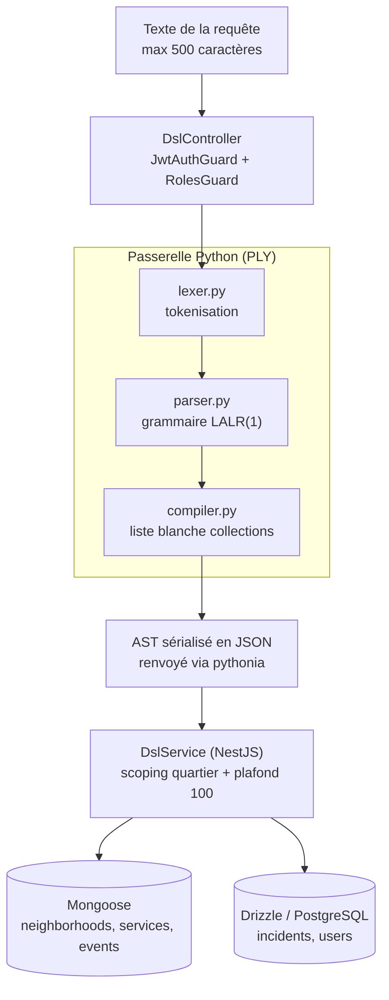
```mermaid
flowchart TB
  txt["Texte de la requête<br/>max 500 caractères"]
  guard["DslController<br/>JwtAuthGuard + RolesGuard"]
  subgraph py["Passerelle Python (PLY)"]
    lexer["lexer.py<br/>tokenisation"]
    parser["parser.py<br/>grammaire LALR(1)"]
    compiler["compiler.py<br/>liste blanche collections"]
  end
  ast["AST sérialisé en JSON<br/>renvoyé via pythonia"]
  service["DslService (NestJS)<br/>scoping quartier + plafond 100"]
  mongo[("Mongoose<br/>neighborhoods, services, events")]
  pg[("Drizzle / PostgreSQL<br/>incidents, users")]
  txt --> guard --> lexer --> parser --> compiler --> ast --> service
  service --> mongo
  service --> pg
```

Le contrôle d'accès et l'exécution vivent dans NestJS ; la passerelle Python se
limite à transformer le texte en AST validé (aucune base n'est touchée côté
Python — `main.py` renvoie `json.dumps(result)`). Le `DslController` est protégé
par `@Roles('moderator', 'admin')`, et le DTO `DslQueryDto` borne la longueur de
la requête à **500 caractères** (`@MaxLength(500)`). Le `DslService` désérialise
l'AST, choisit le moteur d'après la collection (**Mongoose** pour
`neighborhoods`/`services`/`events`, **Drizzle/PostgreSQL** pour
`incidents`/`users`), applique le **scoping par quartier** pour tout demandeur
non-admin, et **plafonne à 100 résultats** (`MAX_DSL_RESULTS`, via `clampLimit`).

### 6.3 Garde-fous

| Vecteur | Mitigation |
|---------|-----------|
| Collections arbitraires | Liste blanche : `incidents`, `neighborhoods`, `services`, `events`, `users` |
| Opérations destructives | `FIND` et `COUNT` uniquement — la lecture seule est une propriété de la grammaire |
| Injections Mongo / SQL | Valeurs passées au moteur paramétré ; pas de concaténation |
| ReDoS via `LIKE` | Valeur échappée par `re.escape` (sous-chaîne littérale) |
| Fuite inter-quartiers | Scoping `neighborhoodId` pour tout non-admin (sauf `neighborhoods`, public) |
| Ressources excessives | 100 résultats max par requête |

Les collections adossées à PostgreSQL (`incidents`, `users`) n'acceptent qu'une
**égalité simple** sur un champ contrôlé (`extractEqualityFilter`) — tout filtre
plus riche est rejeté, ce qui interdit d'injecter des opérateurs Mongo dans une
requête SQL.

---

## 7. Application desktop JavaFX

L'application `fr.quartierconnect.desktopapp` est un client **JavaFX 21** natif
destiné aux **administrateurs et modérateurs**. Elle donne accès à
l'administration des incidents du quartier même sans connexion : les données sont
mises en cache dans SQLite et un `SyncService` réconcilie avec l'API par une
fusion à trois voies inspirée de Git. Le module Maven cible Java 21 et s'appuie
sur JavaFX, le thème AtlantaFX, Ikonli/FontAwesome, `sqlite-jdbc`, Jackson et
`java-keyring`. La classe d'amorçage est `Launcher`, qui délègue à `MainApp`.

### 7.1 Connexion et mode hors ligne

Au démarrage, `MainApp.start()` initialise SQLite puis affiche `LoginView`. La
connexion se fait **via le navigateur** : le bouton principal lance un flux SSO
PKCE (`startSsoPkceFlow`) dont le retour est capté par un serveur de boucle
locale `SsoCallbackServer`, puis échangé contre une paire de jetons par
`AuthService.exchangeSsoToken` (`/auth/sso/exchange`). Une connexion directe
email / mot de passe / TOTP existe aussi (`/auth/login`).

Le mode hors ligne repose sur trois mécanismes : reprise de session sans réseau
(`tryResumeFromDatabase`), bascule explicite (`ApiService.setOfflineMode(true)`,
pilotée par `OfflineModePlugin`, avec sonde `/health` sous 3 s), et écritures
locales d'abord (`is_dirty = 1`). En ligne, tout appel qui reçoit un `401` tente
**un** rafraîchissement (`/auth/refresh`) puis rejoue la requête une seule fois.

### 7.2 Synchronisation — `SyncService`

`SyncService` s'exécute sur un `ScheduledExecutorService` mono-thread : `poll()`
est planifié toutes les **30 secondes**. Chaque cycle : jeton valide (refresh si
expiré), **push** des incidents `is_dirty = 1 AND is_conflict = 0` sur
`/incidents/sync`, **pull** paginé (`/incidents?limit=100&page=N[&since=ts]`),
puis journalisation et publication des événements du bus de plugins.

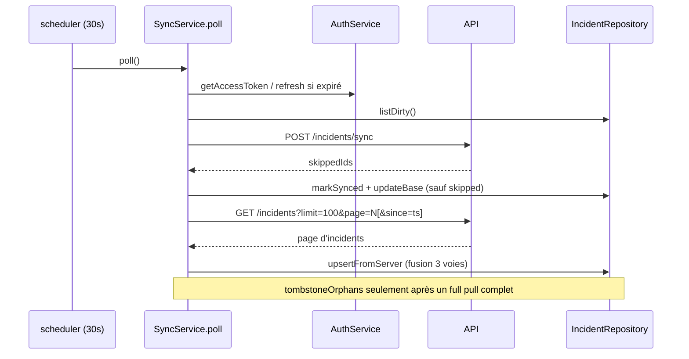
```mermaid
sequenceDiagram
  participant Sched as scheduler (30s)
  participant Sync as SyncService.poll
  participant Auth as AuthService
  participant Api as API
  participant Repo as IncidentRepository
  Sched->>Sync: poll()
  Sync->>Auth: getAccessToken / refresh si expiré
  Sync->>Repo: listDirty()
  Sync->>Api: POST /incidents/sync
  Api-->>Sync: skippedIds
  Sync->>Repo: markSynced + updateBase (sauf skipped)
  Sync->>Api: GET /incidents?limit=100&page=N[&since=ts]
  Api-->>Sync: page d'incidents
  Sync->>Repo: upsertFromServer (fusion 3 voies)
  Note over Sync,Repo: tombstoneOrphans seulement après un full pull complet
```

Le pull pagine par pages de **100** avec une borne `MAX_PULL_PAGES` (10000). Le
premier pull utilise `?limit=100&page=N` ; les suivants ajoutent `&since=<updatedAt>`
(le plus récent observé). Le `tombstoneOrphans` (suppression locale des incidents
que le serveur ne renvoie plus) n'est déclenché **qu'après un premier pull
complet** ; un abandon sur `MAX_PULL_PAGES` n'efface rien.

### 7.3 Fusion à trois voies

Chaque ligne conserve trois clichés : la version **locale**, la version **de
base** (`base_*`, l'ancêtre commun au dernier point de synchro) et, en cas de
conflit, la version **distante** (`remote_*`). `ThreeWayMerger.merge` compare
champ par champ (titre, description, statut).

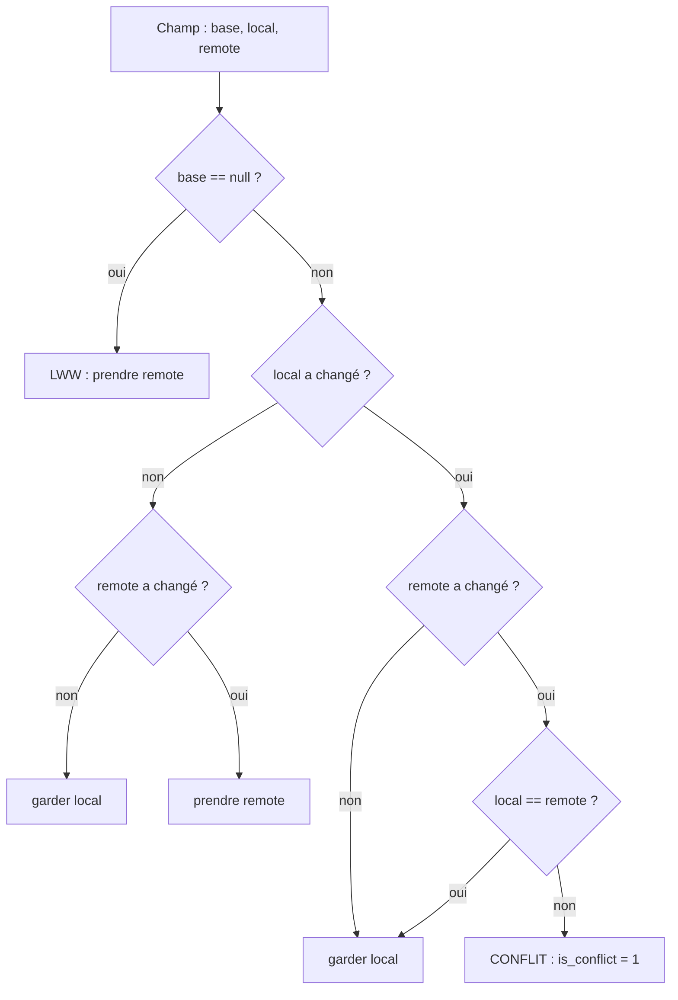
```mermaid
flowchart TD
  start["Champ : base, local, remote"]
  nobase{"base == null ?"}
  lww["LWW : prendre remote"]
  lc{"local a changé ?"}
  rc1{"remote a changé ?"}
  rc2{"remote a changé ?"}
  same{"local == remote ?"}
  keepNoChange["garder local"]
  takeRemote["prendre remote"]
  keepLocal["garder local"]
  conflict["CONFLIT : is_conflict = 1"]
  start --> nobase
  nobase -->|oui| lww
  nobase -->|non| lc
  lc -->|non| rc1
  rc1 -->|non| keepNoChange
  rc1 -->|oui| takeRemote
  lc -->|oui| rc2
  rc2 -->|non| keepLocal
  rc2 -->|oui| same
  same -->|oui| keepLocal
  same -->|non| conflict
```

Sans cliché de base, on retombe en **dernier-écrit-gagne** (`applyLww`). Une
fusion propre remet `is_dirty = 0` et rafraîchit le cliché de base. Un conflit
pose `is_conflict = 1`, stocke les valeurs distantes dans `remote_*` et attend une
résolution manuelle via `ConflictResolutionForm`. Un incident supprimé localement
est **tombé** (`deleted_at`) plutôt qu'effacé ; `upsertFromServer` refuse de le
ressusciter tant que le tombstone existe.

### 7.4 Stockage des jetons et cache SQLite

`TokenVault` conserve les jetons dans le **trousseau du système** via
`java-keyring` (SecretService/Linux, Keychain/macOS, Credential Manager/Windows).
Si aucun backend n'est disponible, `TokenVault` bascule sur un stockage **en
mémoire uniquement**. Les jetons ne sont **jamais** persistés en clair :
`SQLiteDatabase.initialize()` va jusqu'à supprimer d'éventuelles colonnes
`access_token` / `refresh_token` héritées. `SQLiteDatabase` ouvre
`quartierconnect.db` dans le répertoire de données par utilisateur de l'OS
(`%APPDATA%`, `~/Library/Application Support`, `$XDG_DATA_HOME`) ; la propriété
`-Dsqlite.url` permet de surcharger cette URL (utilisée par les tests).

### 7.5 Système de plugins

Un plugin est un JAR découvert au démarrage (`PluginRegistry.loadFromDirectory`)
ou enregistré en interne, qui dialogue avec l'application via l'interface
`AppContext` — **quatre getters exactement** : `getScene()`,
`getIncidentRepository()`, `getToastManager()`, `getEventBus()`. Tout plugin
implémente `QuartierConnectPlugin` (`getId`, `getName`, `getVersion`, `onLoad`,
`onUnload`) et se déclare via `ServiceLoader`
(`META-INF/services/...QuartierConnectPlugin`). Six plugins intégrés sont livrés,
dont `OfflineModePlugin` et `ThemePlugin`.

Les points d'extension de l'UI sont des listes observables : `incidentSlot`
(barre d'actions du tableau), `topBarSlot` (barre supérieure),
`ViewablePlugin.getPanel()` (modale de configuration) et les feuilles de style de
la `Scene`. Le `PluginEventBus` (pub/sub thread-safe via `CopyOnWriteArrayList`)
diffuse `INCIDENTS_CHANGED`, `SYNC_STARTED`, `SYNC_COMPLETED`, `SYNC_FAILED`,
`ONLINE_STATUS_CHANGED`.

### 7.6 Empaquetage et distribution

Le build produit deux formats depuis le même code : un **fat JAR**
(`maven-shade-plugin` → `target/quartierconnect-desktop.jar`, livrable
« Portable (Java) ») et des **installeurs natifs** via `jpackage`
(`packaging/jpackage-build.sh`) : `.deb`/`.rpm`/`.tar.gz` sur Linux, `.dmg` sur
macOS, `.msi` sur Windows. L'URL du serveur ciblé est **gravée dans le JAR** au
build (`write-server-properties.sh` écrit `server.properties`, lu par
`ServerConfig`). Les artefacts sont servis en production par Caddy sous
`/telechargements/*` et proposés au téléchargement par le back-office
(`DownloadDesktopDialog`).

---

## 8. Messagerie temps réel

La messagerie repose sur une passerelle **Socket.io** (`MessagingGateway`,
`api/src/messaging/messaging.gateway.ts`) montée sur le namespace `/messaging`,
protégée par le même `JWT_SECRET` que l'API REST. Elle passe par Caddy via le
même `/api`, avec bascule `wss://`.

### 8.1 Connexion et présence

À la connexion (`handleConnection`), le socket est authentifié : le token est lu
dans `handshake.auth.token` ou l'en-tête `Authorization`, puis
`isTokenStillValid` vérifie que le `jti` n'est pas révoqué et que le compte n'est
ni `banned` ni `deleted`. La passerelle **reconstruit les salons depuis MongoDB**
à chaque connexion : elle rejoint le socket dans une room `conversation:<id>` par
conversation, calcule les pairs, puis émet `presence:snapshot` (utilisateurs déjà
en ligne) et propage `presence:update` aux pairs. La présence est suivie en
mémoire (`socketsByUser`, multi-onglets gérés) et `handleDisconnect` diffuse le
passage hors-ligne au dernier socket fermé.

### 8.2 Événements

| Sens | Événement | Rôle |
|------|-----------|------|
| Client → serveur | `join_conversation` / `leave_conversation` | Entrer/quitter une room |
| Client → serveur | `send_message` | Envoyer un message (persisté via `MessagingService`) |
| Client → serveur | `typing:start` / `typing:stop` | Indicateur de saisie |
| Serveur → client | `new_message` | Message diffusé aux participants de la room |
| Serveur → client | `typing:update` | Relais de l'indicateur de saisie |
| Serveur → client | `presence:snapshot` / `presence:update` | État de présence des pairs |

Les payloads WebSocket contournant le `ValidationPipe` HTTP, la passerelle
**valide la forme à la main** (`validateSendMessage` : `conversationId` non vide,
`content` chaîne non vide, longueur ≤ **4000** caractères) et lève une
`WsException` sinon.

### 8.3 Notifications applicatives

Les événements métier de réservation et de contrat sont propagés en temps réel
via l'`EventEmitter` NestJS. `NotificationsListener` (`@OnEvent`) écoute
`booking.created`/`accepted`/`declined`/`cancelled`,
`contract.signed`/`fully_signed` et `points.settled`, puis appelle
`gateway.sendNotification(...)` pour pousser la notification aux seuls
destinataires concernés (contrepartie d'une réservation, autres signataires,
payeur et bénéficiaire d'un règlement).

---

## 9. Architecture front-end par feature

Les deux SPA (client `:3000`, admin `:3001`) sont bâties sur **React 19** avec
**Vite 7**, **TanStack Router** (routage typé, arbre généré `routeTree.gen.ts`),
**TanStack Query** (données) et **TanStack Form** (formulaires). L'UI utilise
**Shadcn/ui** et **Tailwind v4**. Le point d'entrée (`main.tsx`) monte
`ThemeProvider`, `UnheadProvider`, `QueryClientProvider` et `RouterProvider`, et
déclenche l'initialisation i18n par un import à effet de bord.

### 9.1 Découpage par feature

Chaque application est organisée **par domaine métier** sous `src/features/`.
Une feature encapsule ses `components/`, ses `pages/`, sa logique locale (`lib/`),
parfois ses `hooks/`, et expose ses pages via un **barrel `index.ts`** :

```
src/features/incidents/
  components/   incidents-list.tsx, create-incident-dialog.tsx, …
  pages/        incidents-page.tsx, incident-detail-page.tsx
  lib/          status-labels.ts, next-status.ts (+ tests colocalisés)
  index.ts      export { IncidentsPage, IncidentDetailPage }
```

Les fichiers de route sous `src/routes/` (routage par fichiers de TanStack
Router) restent minces : ils importent la page depuis le barrel de la feature.
Domaines découpés :

- **Client** : `account`, `bookings`, `contracts`, `dashboard`, `events`,
  `incidents`, `messages`, `onboarding`, `points`, `realtime`,
  `recommendations`, `services`, `votes`.
- **Admin** : `community-votes`, `dashboard`, `dsl`, `events`, `incidents`,
  `neighborhoods`, `services`, `uncovered-addresses`, `users`.

### 9.2 Le socle partagé

Deux packages du monorepo mutualisent le code entre client et admin :

- **`packages/shared`** — le client HTTP (`lib/api.ts` : `apiGet`, `apiGetPage`,
  `apiSend`, `apiGetBlob`…), les **hooks React Query** par domaine
  (`lib/hooks/` : `incidents.hooks.ts`, `services.hooks.ts`,
  `admin-lists.hooks.ts`, `useMessaging.ts`, `useContracts.ts`, `useMe.ts`…),
  l'instance i18n, les helpers purs (`geo.ts`, `phone.ts`, `pricing.ts`,
  `address.ts`) et les types partagés (`types.ts`).
- **`packages/ui`** — les composants Shadcn/ui (`components/ui`) et le composant
  cartographique `<Map>` (react-leaflet).

Le flux de données est unidirectionnel : une page de feature consomme un hook
React Query du package `shared`, qui appelle le client HTTP, qui lit les en-têtes
`X-Total-Count` / `X-Total-Pages` via `apiGetPage` (§4.2) pour la pagination
serveur. Les listes admin (`admin-lists.hooks.ts`) sont câblées sur ce contrat
serveur (recherche, tri, filtres et pagination poussés à l'API).

---

## 10. Internationalisation

Les deux SPA partagent une seule instance [i18next](https://www.i18next.com/),
déclarée une fois dans `packages/shared/src/lib/i18n/index.ts`. Le **français**
est la langue par défaut **et** la langue de repli ; l'**anglais** est la seule
autre locale. Tout le texte est regroupé dans un unique namespace `translation`,
et le choix de langue est mémorisé dans le `localStorage` sous la clé `qc_locale`.

- **Un seul namespace** — les composants appellent directement
  `t("pages.events.title")`, sans préciser de namespace.
- **FR par défaut et repli** — `fallbackLng: "fr"` garantit qu'une clé absente de
  l'anglais retombe sur le français plutôt que d'afficher la clé brute.
- **`escapeValue: false`** — React échappe déjà le HTML.
- **Garde d'initialisation** — le bloc `if (!i18n.isInitialized)` rend le module
  idempotent.

Les traductions sont deux modules TypeScript côte à côte (`fr.ts` et `en.ts`),
chacun un `export default { … } as const` d'un objet imbriqué, organisé en
groupes de premier niveau (`common`, `auth`, `nav`, `address`, `map`, `roles`,
`incidents`, `messaging`, `rgpd`, `pages`, `adminPages`…). Le hook `useLocale()`
enveloppe `useTranslation()` et expose `t`, `locale`, `setLocale`, `isFR`, `isEN`.

**Vérification de parité.** Comme FR et EN sont maintenus à la main, le script
`web-apps/scripts/check-i18n-parity.mjs` (`pnpm i18n:check`) aplatit les deux
arborescences en chemins de clés et signale toute clé présente d'un seul côté,
sortant en code d'erreur non nul en cas de divergence.

**Piège de production.** pnpm résout `i18next` deux fois : sans intervention, le
bundle prod embarque deux copies (le package partagé initialise l'une, le
`useTranslation()` de l'app lit l'autre, non initialisée) et affiche les clés
brutes. La correction est un `resolve.dedupe: ["i18next", "react-i18next"]` dans
les deux configs Vite (`apps/client/vite.config.ts`, `apps/admin/vite.config.ts`).

---

## 11. Tests

La stratégie suit la **pyramide de tests** : une large base de tests unitaires
rapides, une couche intermédiaire d'intégration/e2e API, et un sommet réduit de
tests pilotant les interfaces réelles.

| Suite | Outil | Tests | Cible make |
|-------|-------|-------|------------|
| API — unitaires | Jest | 678 | `make test-api` |
| API — end-to-end | Jest + Supertest | 199 | `make test-e2e` |
| Web — unitaires | Vitest | 127 | `make test-web` |
| Web — end-to-end | Playwright | 127 | `make test-e2e-web` |
| Desktop — unit./intégration | JUnit 5 + TestFX | 163 | `make test-desktop` |
| DSL — unitaires | pytest | 22 | `make test-dsl` |
| **Total** | | **1316** | `make test` |

Soit **827 tests unitaires** rapides (678 API + 127 Web + 22 DSL), **199 tests**
e2e API, et **290 tests** pilotant des interfaces réelles (127 Playwright + 163
TestFX). Chaque test respecte les principes **F.I.R.S.T.** ; les codes TOTP sont
recalculés à partir du secret (jamais figés), y compris côté Playwright via une
implémentation RFC 6238 sans dépendance (`web-apps/e2e/helpers/auth.ts`).

- **API unitaire** (Jest) — couvre les 16 modules avec doublures : authentification,
  contrats et règlement des points, saga des réservations, cloisonnement des
  incidents et votes par quartier, DSL, RGPD.
- **API e2e** (Supertest) — démarre l'app NestJS complète contre des bases réelles ;
  `auth.e2e-spec.ts` couvre inscription, consentement RGPD, limitation de débit
  (429 après 5 échecs), rotation et révocation, parcours SSO.
- **Web unitaire** (Vitest) — code mutualisé de `@workspace/shared` et
  `@workspace/ui` (fonctions pures, hooks React Query, composants `<Map>`).
- **Web e2e** (Playwright) — pilote client et admin dans un navigateur réel
  contre l'API ; le parcours connexion + TOTP est couvert dans `login.spec.ts`.
- **Desktop** (JUnit 5 / TestFX) — services hors ligne, dépôt SQLite, fusion
  three-way, `TokenVault`, plugins, pull paginé. `LoginViewSmokeTest` s'appuie sur
  TestFX et exige un display : `make test-desktop` encapsule l'exécution dans
  `xvfb-run` sur un runner sans écran.
- **DSL** (pytest) — lexer, parser et compilateur.

**Intégration continue.** Les tests **unitaires** (+ lint, typecheck, build) sont
exécutés par `ci.yml` sur `main`, `develop` et chaque PR ; ses cinq jobs (`api`,
`web`, `desktop` sous `xvfb-run`, `dsl`, `make-validate`) tournent en parallèle,
le job de synthèse `ci-success` servant de garde de branch protection. Les tests
**end-to-end** vivent dans `e2e.yml` : sur PR, seul un sous-ensemble de fumée de
3 specs (`client/login`, `client/points`, `admin/services`) est joué si la PR
touche `web-apps/`, `api/`, `scripts/`, `docker/` ; en nightly (cron 3 h), sur tag
`v*.*.*` et en `workflow_dispatch`, la suite Playwright complète puis les e2e API
Supertest sont exécutées, avec alerte Discord en cas d'échec.

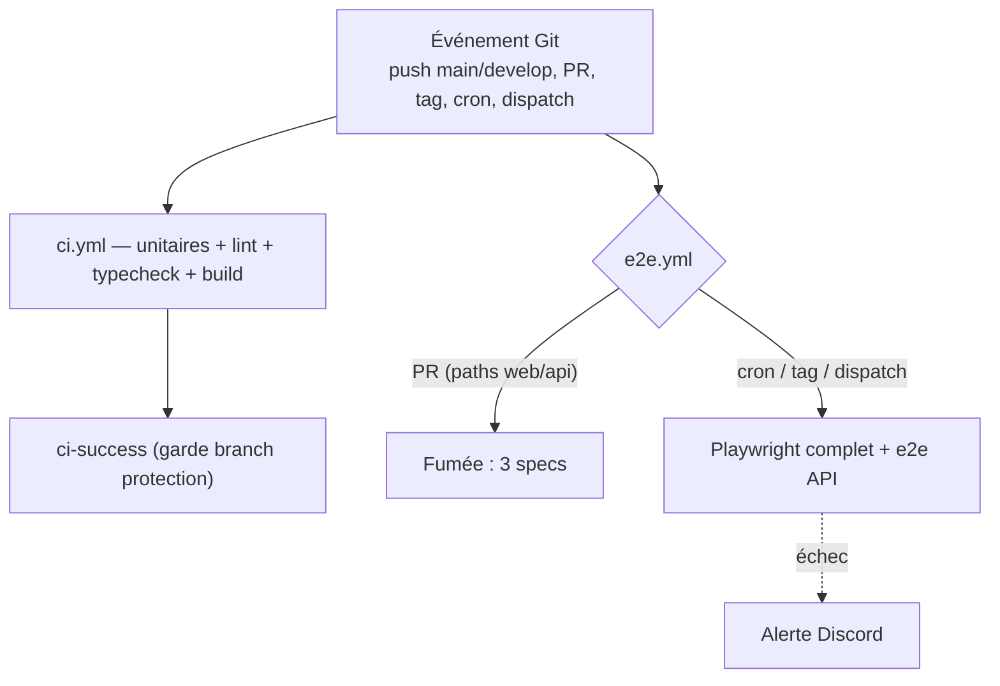
```mermaid
flowchart TB
  ev["Événement Git<br/>push main/develop, PR, tag, cron, dispatch"]
  ev --> ci["ci.yml — unitaires + lint + typecheck + build"]
  ci --> ok["ci-success (garde branch protection)"]
  ev --> trig{"e2e.yml"}
  trig -->|"PR (paths web/api)"| smoke["Fumée : 3 specs"]
  trig -->|"cron / tag / dispatch"| full["Playwright complet + e2e API"]
  full -.->|"échec"| discord["Alerte Discord"]
```

La cible `make validate` reproduit localement l'intégralité du pipeline (lint des
4 composants, typecheck, tests API + couverture, e2e API, e2e Web, desktop, DSL,
puis build de production).

---

## 12. Déploiement et exploitation

Le déploiement de référence est servi sur le domaine
**`quartierconnect.duckdns.org`**, avec un **routage par préfixe de chemin**
(`/`, `/admin`, `/aide`, `/dev`, `/api`) plutôt que par sous-domaine — d'où les
`basePath` `/dev` et `/aide` des sites Fumadocs.

### 12.1 Topologie de production

Neuf conteneurs tournent sur un VPS Linux (Ubuntu 22.04+ / Debian 12) : **Caddy**
en frontal, cinq applicatifs (`api`, `client`, `admin`, `docs-user`, `docs-dev`)
et trois bases (`mongo`, `postgres`, `neo4j`). **Seul Caddy** publie des ports
sur l'interface publique (`0.0.0.0:80` et `:443`) ; tous les autres services sont
publiés sur `127.0.0.1`. Couplé à UFW qui n'ouvre que **22 / 80 / 443**, cela
réduit la surface d'attaque à SSH et Caddy. Les quatre images web tournent en
**utilisateur non-root** (`USER appuser`).

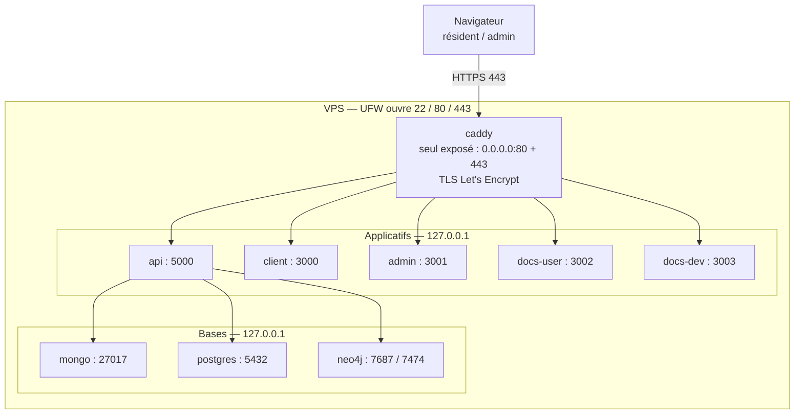
```mermaid
flowchart TB
  navigateur["Navigateur<br/>résident / admin"]
  subgraph vps["VPS — UFW ouvre 22 / 80 / 443"]
    caddy["caddy<br/>seul exposé : 0.0.0.0:80 + 443<br/>TLS Let's Encrypt"]
    subgraph loopback["Applicatifs — 127.0.0.1"]
      api["api : 5000"]
      client["client : 3000"]
      admin["admin : 3001"]
      docsuser["docs-user : 3002"]
      docsdev["docs-dev : 3003"]
    end
    subgraph bases["Bases — 127.0.0.1"]
      mongo["mongo : 27017"]
      postgres["postgres : 5432"]
      neo4j["neo4j : 7687 / 7474"]
    end
  end
  navigateur -->|"HTTPS 443"| caddy
  caddy --> api
  caddy --> client
  caddy --> admin
  caddy --> docsuser
  caddy --> docsdev
  api --> mongo
  api --> postgres
  api --> neo4j
```

### 12.2 Build et démarrage

La stack de production superpose deux fichiers Compose (base + patch prod) :

```bash
docker compose \
  -f docker/docker-compose.yml \
  -f docker/docker-compose.prod.yml \
  up -d --build
```

L'ordre de démarrage est garanti par `depends_on: condition: service_healthy` :
l'API ne démarre qu'une fois MongoDB, PostgreSQL et Neo4j sains. Le patch prod
dimensionne chaque conteneur pour un VPS de 4 à 8 Go (`api` 512 Mo, `mongo`
768 Mo, `neo4j` 1280 Mo dont heap JVM épinglé à 512 Mo…), avec `restart:
unless-stopped` et logs `json-file` bornés. Un smoke test valide l'installation :

```bash
./scripts/smoke-test.sh https://quartierconnect.duckdns.org
```

Il vérifie `/api/health` (état de chaque base), le client, `/admin`, `/docs`
(Scalar), le rejet des credentials invalides (401), la présence des en-têtes HSTS
et CSP, l'absence d'en-tête `Server`, la validité HTTPS et le WebSocket
`/api/messaging`.

### 12.3 Caddy et secrets

Caddy obtient et **renouvelle automatiquement** les certificats Let's Encrypt
(challenge HTTP-01 sur le port 80) et route par préfixe de chemin en appliquant à
chaque site une CSP dédiée. Les chemins `/docs*`, `/scalar*`, `/api/docs*` et le
site `/dev*` sont protégés par `basic_auth` (`DOCS_AUTH_USER` / `DOCS_AUTH_HASH`).
Le `DOCS_AUTH_HASH` bcrypt doit **doubler ses `$` en `$$`** dans `.env`, sinon le
hash est corrompu et `basic_auth` casse.

> **Piège du bind-mount.** Le `Caddyfile` étant monté depuis l'hôte, un
> déploiement qui le modifie n'est pas forcément pris en compte (`up -d --build`
> ne recrée pas le conteneur, et le fichier remplacé par un nouvel inode peut
> continuer à servir l'ancienne version). Forcer la recréation :
> `up -d --force-recreate caddy`.

Les secrets prod partent de `docker/.env.prod.example` (`chmod 600`), générés
avec `openssl rand -base64 32 | tr -d '/+='` : `JWT_SECRET` (≥ 48 caractères),
`MONGO_ROOT_PASSWORD`, `POSTGRES_PASSWORD`, `NEO4J_PASSWORD` (à reporter dans
`NEO4J_AUTH`). Un mot de passe DB modifié **après** le premier `up` n'est pas pris
en compte (appliqué à l'initialisation d'un volume vierge seulement).

### 12.4 Mises à jour, rollback et sauvegardes

Déploiement depuis le VPS : `./scripts/deploy-vps.sh main` capture le SHA courant,
`git pull`, rebuild, smoke test, puis **rollback automatique si le test échoue**.
En automatique, `deploy.yml` se déclenche sur un tag `v*.*.*` (reviewers requis)
ou en `workflow_dispatch`. Rollback ciblé : `./scripts/rollback.sh <git-sha>`.

Un cron lance `backup-all.sh` chaque nuit : `mongodump --gzip`, `pg_dumpall | gzip`,
`neo4j-admin database dump` (à froid) et, le lundi, les certificats Caddy.
Rétention locale 7 j (28 j pour les certifs), rétention S3 échelonnée. Une
notification Discord n'est envoyée qu'en cas d'échec.

> **Migrations PostgreSQL (Drizzle).** La base étant provisionnée par
> `drizzle-kit push`, insérer une ligne de baseline dans
> `drizzle.__drizzle_migrations` — sinon le migrator du bootstrap API rejoue
> `0000` et crashe.

---

*Document généré à partir du code source du dépôt. Pour la signature exacte de
chaque route, se référer à la référence interactive Scalar (`/api/docs`) ; pour
les guides utilisateurs, au site `/aide`.*
