# QuartierConnect — Submission dossier (31/05)

> *"The bond that brings your neighborhood closer"*
>
> Collaborative neighborhood platform — academic project **Connected Neighbours** (ESGI 3AL1 / 3AL2).
> Standalone submission document: it brings together all the requested deliverables (functional description,
> use cases, conceptual data model, class diagram, architecture rationale, complex algorithms,
> **synchronization**, external frameworks, Java demonstration, tests).

---

## Contents

1. [Functional description & scope](#1-functional-description--scope)
2. [Features](#2-features)
3. [Use cases](#3-use-cases)
4. [Data model (MCD / ERD)](#4-data-model-mcd--erd)
5. [Software architecture & rationale](#5-software-architecture--rationale)
6. [Class diagram — Java Desktop application](#6-class-diagram--java-desktop-application)
7. [Complex algorithms](#7-complex-algorithms)
8. [Synchronization (key point)](#8-synchronization-key-point)
9. [APIs / frameworks external to Java SE](#9-apis--frameworks-external-to-java-se)
10. [Java Desktop application — operation & extensibility](#10-java-desktop-application--operation--extensibility)
11. [Tests](#11-tests)
12. [Progress status](#12-progress-status)
13. [References to the detailed documentation](#13-references-to-the-detailed-documentation)

> **Team**: to be completed (see `CDC.md`). GitHub repository: `creibaud/QuartierConnect` — commits identified per developer.

---

## 1. Functional description & scope

### Context

Residential neighborhoods lack suitable digital tools to structure local mutual aid,
formalize exchanges and manage community affairs. General-purpose solutions do not meet
these needs in a secure and organized way. QuartierConnect offers a dedicated platform,
geolocated and secure, available **in the browser** and **on the desktop**.

### Objective

Build a secure, extensible and resilient (**offline-first**) collaborative platform
that lets the residents of a neighborhood:

- Exchange services valued through a **points** system.
- Sign **digital documents** securely (SHA-256 + TOTP MFA).
- Take part in community **events** with recommendations via Neo4j.
- Communicate through **real-time multimedia messaging** (WebSocket).
- Manage **incidents** and alerts via an **offline-first desktop application**.

### User profiles

| Profile | Surface | Permissions |
|---|---|---|
| **Resident** (`resident`) | React Client (web) | Services, events, messaging, votes, signing |
| **Moderator** (`moderator`) | React Client (web) | Resident rights + removal of inappropriate content |
| **Administrator** (`admin`) | React Client + React Admin + **Java Desktop** | Neighborhood and user management, back-office, desktop application |

Technical role hierarchy: `resident` → `moderator` → `admin` (+ `banned`).

### Scope

- **Java Desktop client**: reserved for **administrators**, strict **offline-first** mode (incident
  management, statistics, plugins, themes).
- **Mandatory constraints**: deployed + containerized application (Docker), **self-executable JAR**
  (Maven Shade), all documents gathered in a single file, code on GitHub with commits identified
  per developer.

---

## 2. Features

### 2.1 Web (React)

- **Geographic modeling**: drawing polygons on OpenStreetMap (Leaflet + Leaflet.draw),
  **GeoJSON** storage in MongoDB with a `2dsphere` index, overlap detection via `$geoIntersects`,
  one resident = a single neighborhood.
- **Neighbor services**: listings (offer/request), **points system** (1 h = +2 pts, quick action
  < 30 min = +1 pt, minimum balance −10 pts, PostgreSQL **ACID** transactions), automatic **PDF
  contracts** (statuses `draft` → `partial` → `fully_signed`).
- **Digital signature**: PDF, drag-and-drop placement of zones, **mandatory TOTP MFA**,
  canvas signature + **SHA-256 hash**, server timestamp, immutable GridFS metadata, audit log.
- **Events**: creation + swipe interface (Tinder style) feeding the Neo4j engine.
- **Multimedia messaging**: 1-to-1 and group chat via **WebSocket**, media (image/voice/video) in GridFS,
  "typing" / online-offline indicators.
- **Community votes**: 4 types (binary, single choice, multiple choice, weighted) via the **Strategy Pattern**.
- **Multilingual** FR/EN (i18next).

### 2.2 Java Desktop client (administrators)

- **Incident management**: JavaFX `TableView` (sort/filter), **offline** creation/editing
  (`is_dirty = 1`), automatic synchronization when the network returns.
- **Statistics**: `BarChart` / `LineChart` / `PieChart`.
- **Plugin system**: `QuartierConnectPlugin` interface, dynamic `URLClassLoader` loading
  from `~/.quartierconnect/plugins/`, enable/disable without restart, sandbox.
- **Themes**: Default / Dark / High Contrast, hot-swapped via `scene.getStylesheets()`.
- **Offline-first synchronization**: local SQLite + network probe every 30 s (see §8).

---

## 3. Use cases

### Overview diagram

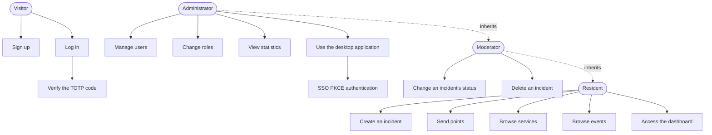
```mermaid
graph TD
    Visiteur([Visitor])
    Habitant([Resident])
    Moderateur([Moderator])
    Admin([Administrator])

    Visiteur --> UC_REG[Sign up]
    Visiteur --> UC_LOG[Log in]

    Habitant --> UC_INC[Create an incident]
    Habitant --> UC_PTS[Send points]
    Habitant --> UC_SVC[Browse services]
    Habitant --> UC_EVT[Browse events]
    Habitant --> UC_DASH[Access the dashboard]

    Moderateur --> UC_STATUS[Change an incident's status]
    Moderateur --> UC_DEL[Delete an incident]

    Admin --> UC_USERS[Manage users]
    Admin --> UC_ROLES[Change roles]
    Admin --> UC_STATS[View statistics]
    Admin --> UC_JAVA[Use the desktop application]

    UC_LOG --> UC_TOTP[Verify the TOTP code]
    UC_JAVA --> UC_SSO[SSO PKCE authentication]

    Moderateur -.->|inherits| Habitant
    Admin -.->|inherits| Moderateur
```

### UC-01 — Registration and TOTP activation

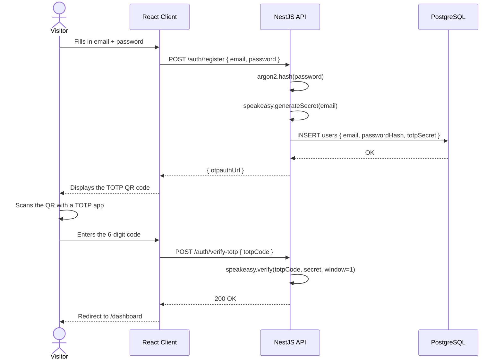
```mermaid
sequenceDiagram
    actor V as Visitor
    participant C as React Client
    participant A as NestJS API
    participant DB as PostgreSQL

    V->>C: Fills in email + password
    C->>A: POST /auth/register { email, password }
    A->>A: argon2.hash(password)
    A->>A: speakeasy.generateSecret(email)
    A->>DB: INSERT users { email, passwordHash, totpSecret }
    DB-->>A: OK
    A-->>C: { otpauthUrl }
    C-->>V: Displays the TOTP QR code

    V->>V: Scans the QR with a TOTP app
    V->>C: Enters the 6-digit code
    C->>A: POST /auth/verify-totp { totpCode }
    A->>A: speakeasy.verify(totpCode, secret, window=1)
    A-->>C: 200 OK
    C-->>V: Redirect to /dashboard
```

### UC-02 — Two-step login (password + TOTP)

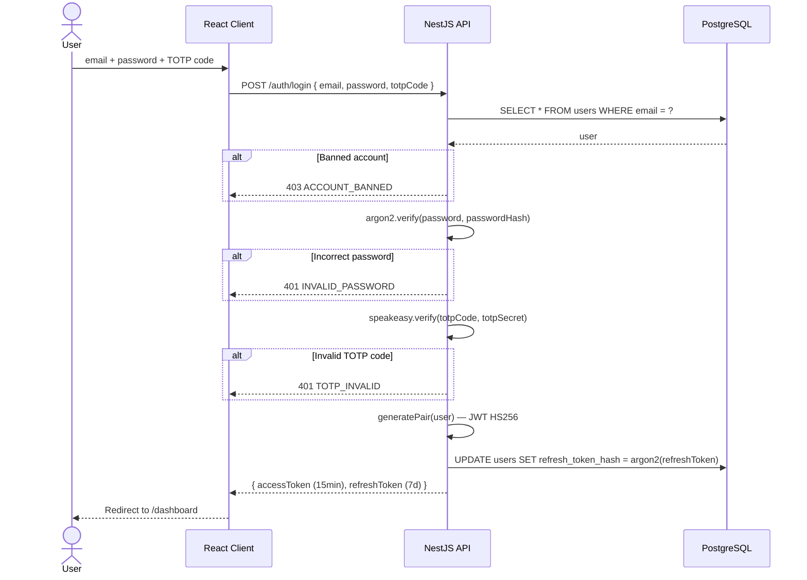
```mermaid
sequenceDiagram
    actor U as User
    participant C as React Client
    participant A as NestJS API
    participant DB as PostgreSQL

    U->>C: email + password + TOTP code
    C->>A: POST /auth/login { email, password, totpCode }

    A->>DB: SELECT * FROM users WHERE email = ?
    DB-->>A: user

    alt Banned account
        A-->>C: 403 ACCOUNT_BANNED
    end

    A->>A: argon2.verify(password, passwordHash)
    alt Incorrect password
        A-->>C: 401 INVALID_PASSWORD
    end

    A->>A: speakeasy.verify(totpCode, totpSecret)
    alt Invalid TOTP code
        A-->>C: 401 TOTP_INVALID
    end

    A->>A: generatePair(user) — JWT HS256
    A->>DB: UPDATE users SET refresh_token_hash = argon2(refreshToken)
    A-->>C: { accessToken (15min), refreshToken (7d) }
    C-->>U: Redirect to /dashboard
```

### UC-03 — SSO PKCE (Java Desktop → browser → API)

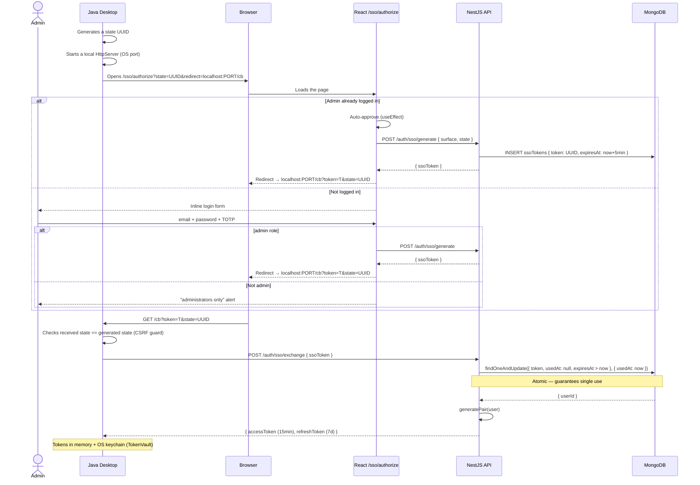
```mermaid
sequenceDiagram
    actor Admin
    participant D as Java Desktop
    participant B as Browser
    participant W as React /sso/authorize
    participant A as NestJS API
    participant DB as MongoDB

    D->>D: Generates a state UUID
    D->>D: Starts a local HttpServer (OS port)
    D->>B: Opens /sso/authorize?state=UUID&redirect=localhost:PORT/cb

    B->>W: Loads the page

    alt Admin already logged in
        W->>W: Auto-approve (useEffect)
        W->>A: POST /auth/sso/generate { surface, state }
        A->>DB: INSERT ssoTokens { token: UUID, expiresAt: now+5min }
        A-->>W: { ssoToken }
        W-->>B: Redirect → localhost:PORT/cb?token=T&state=UUID
    else Not logged in
        W-->>Admin: Inline login form
        Admin->>W: email + password + TOTP
        alt admin role
            W->>A: POST /auth/sso/generate
            A-->>W: { ssoToken }
            W-->>B: Redirect → localhost:PORT/cb?token=T&state=UUID
        else Not admin
            W-->>Admin: "administrators only" alert
        end
    end

    B->>D: GET /cb?token=T&state=UUID
    D->>D: Checks received state == generated state (CSRF guard)
    D->>A: POST /auth/sso/exchange { ssoToken }
    A->>DB: findOneAndUpdate({ token, usedAt: null, expiresAt > now }, { usedAt: now })
    Note over A,DB: Atomic — guarantees single use
    DB-->>A: { userId }
    A->>A: generatePair(user)
    A-->>D: { accessToken (15min), refreshToken (7d) }
    Note over D: Tokens in memory + OS keychain (TokenVault)
```

### UC-04 — Incident lifecycle

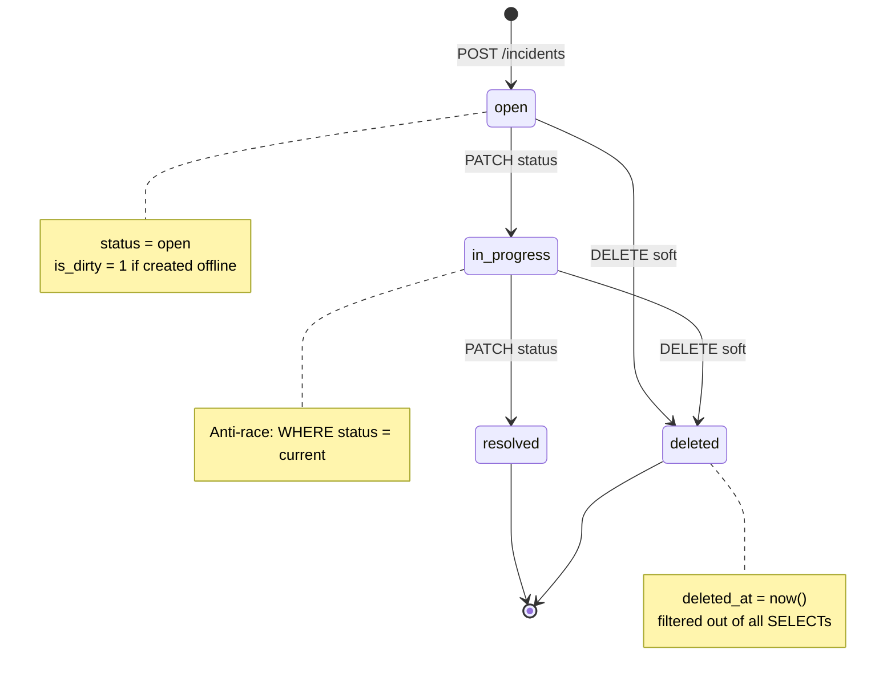
```mermaid
stateDiagram-v2
    [*] --> open : POST /incidents
    open --> in_progress : PATCH status
    in_progress --> resolved : PATCH status
    resolved --> [*]
    open --> deleted : DELETE soft
    in_progress --> deleted : DELETE soft
    deleted --> [*]

    note right of open
        status = open
        is_dirty = 1 if created offline
    end note
    note right of in_progress
        Anti-race: WHERE status = current
    end note
    note right of deleted
        deleted_at = now()
        filtered out of all SELECTs
    end note
```

### UC-05 — Offline synchronization (Java Desktop)

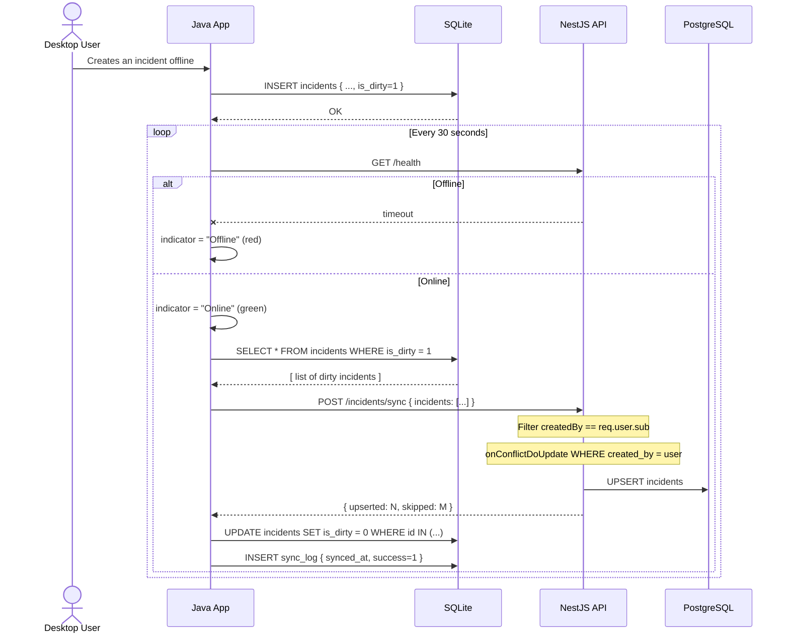
```mermaid
sequenceDiagram
    actor U as Desktop User
    participant J as Java App
    participant S as SQLite
    participant API as NestJS API
    participant PG as PostgreSQL

    U->>J: Creates an incident offline
    J->>S: INSERT incidents { ..., is_dirty=1 }
    S-->>J: OK

    loop Every 30 seconds
        J->>API: GET /health
        alt Offline
            API--xJ: timeout
            J->>J: indicator = "Offline" (red)
        else Online
            J->>J: indicator = "Online" (green)
            J->>S: SELECT * FROM incidents WHERE is_dirty = 1
            S-->>J: [ list of dirty incidents ]
            J->>API: POST /incidents/sync { incidents: [...] }
            Note over API: Filter createdBy == req.user.sub
            Note over API: onConflictDoUpdate WHERE created_by = user
            API->>PG: UPSERT incidents
            API-->>J: { upserted: N, skipped: M }
            J->>S: UPDATE incidents SET is_dirty = 0 WHERE id IN (...)
            J->>S: INSERT sync_log { synced_at, success=1 }
        end
    end
```

### UC-06 — Points transfer (ACID transaction)

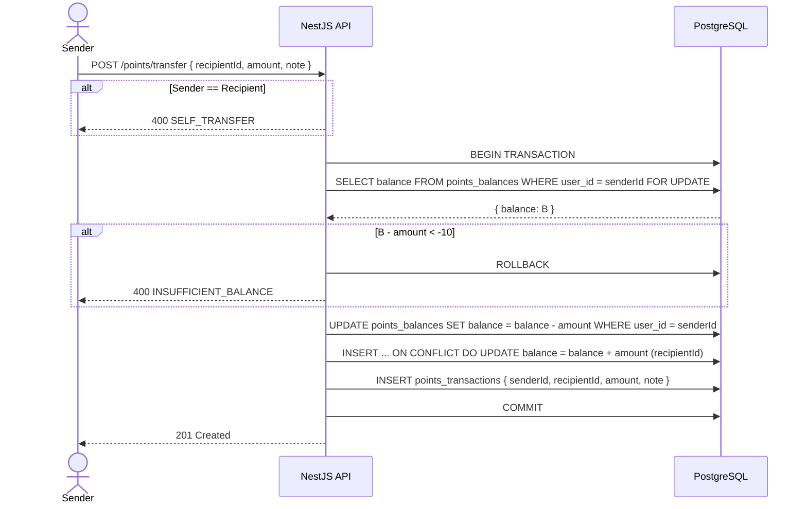
```mermaid
sequenceDiagram
    actor E as Sender
    participant A as NestJS API
    participant PG as PostgreSQL

    E->>A: POST /points/transfer { recipientId, amount, note }

    alt Sender == Recipient
        A-->>E: 400 SELF_TRANSFER
    end

    A->>PG: BEGIN TRANSACTION
    A->>PG: SELECT balance FROM points_balances WHERE user_id = senderId FOR UPDATE
    PG-->>A: { balance: B }

    alt B - amount < -10
        A->>PG: ROLLBACK
        A-->>E: 400 INSUFFICIENT_BALANCE
    end

    A->>PG: UPDATE points_balances SET balance = balance - amount WHERE user_id = senderId
    A->>PG: INSERT ... ON CONFLICT DO UPDATE balance = balance + amount (recipientId)
    A->>PG: INSERT points_transactions { senderId, recipientId, amount, note }
    A->>PG: COMMIT
    A-->>E: 201 Created
```

---

## 4. Data model (MCD / ERD)

The application uses **polyglot persistence**: PostgreSQL (relational/ACID), MongoDB
(documents + GeoJSON + GridFS), Neo4j (social graph), SQLite (local cache for the Java client).

### 4.1 PostgreSQL — relational & ACID

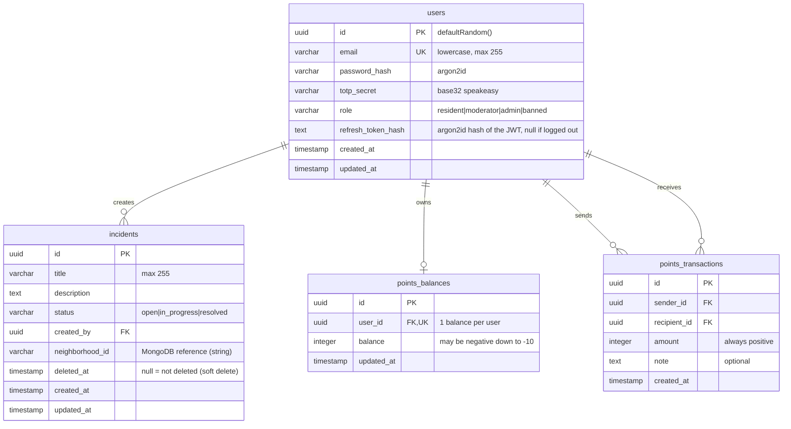
```mermaid
erDiagram
    users {
        uuid id PK "defaultRandom()"
        varchar email UK "lowercase, max 255"
        varchar password_hash "argon2id"
        varchar totp_secret "base32 speakeasy"
        varchar role "resident|moderator|admin|banned"
        text refresh_token_hash "argon2id hash of the JWT, null if logged out"
        timestamp created_at
        timestamp updated_at
    }

    incidents {
        uuid id PK
        varchar title "max 255"
        text description
        varchar status "open|in_progress|resolved"
        uuid created_by FK
        varchar neighborhood_id "MongoDB reference (string)"
        timestamp deleted_at "null = not deleted (soft delete)"
        timestamp created_at
        timestamp updated_at
    }

    points_balances {
        uuid id PK
        uuid user_id FK,UK "1 balance per user"
        integer balance "may be negative down to -10"
        timestamp updated_at
    }

    points_transactions {
        uuid id PK
        uuid sender_id FK
        uuid recipient_id FK
        integer amount "always positive"
        text note "optional"
        timestamp created_at
    }

    users ||--o{ incidents : "creates"
    users ||--o| points_balances : "owns"
    users ||--o{ points_transactions : "sends"
    users ||--o{ points_transactions : "receives"
```

### 4.2 MongoDB — documents, GeoJSON, GridFS (9 collections)


```mermaid
erDiagram
    neighborhoods {
        ObjectId _id PK
        String name
        String city
        String description
        Object geometry "GeoJSON Polygon - 2dsphere index"
        Date createdAt
        Date updatedAt
    }
    services {
        ObjectId _id PK
        String title
        String description
        String category
        String type "free - paid - exchange"
        String createdBy "PostgreSQL UUID"
        ObjectId neighborhoodId FK
        Date createdAt
        Date updatedAt
    }
    events {
        ObjectId _id PK
        String title
        String description
        String category
        Date date
        String createdBy "PostgreSQL UUID"
        ObjectId neighborhoodId FK
        Array interestedUserIds "addToSet idempotent"
        Date createdAt
        Date updatedAt
    }
    contracts {
        ObjectId _id PK
        String title
        String content
        String contentHash "SHA-256 of the content"
        String createdBy "PostgreSQL UUID"
        Array signatories "PostgreSQL UUIDs"
        String status "draft - pending_signature - signed"
        Array signatures "userId - signedAt - SHA-256 hash"
        Date createdAt
    }
    conversations {
        ObjectId _id PK
        Array participants "PostgreSQL UUIDs"
        Object lastMessage "content - sentAt"
        Date createdAt
    }
    messages {
        ObjectId _id PK
        ObjectId conversationId FK
        String senderId "PostgreSQL UUID"
        String content
        String type "text - image - file"
        String mediaUrl
        Array readBy
        Date createdAt
    }
    votes {
        ObjectId _id PK
        String userId "PostgreSQL UUID"
        ObjectId targetId
        String targetType "service - incident"
        String voteType "up - down - like - dislike"
        Date createdAt
    }
    communityVotes {
        ObjectId _id PK
        String title
        String voteType "binary - single_choice - multiple_choice - weighted"
        Array options "id - label"
        Date endsAt
        Int quorum
        Boolean isAnonymous
        String status "open - closed"
        String createdBy "PostgreSQL UUID"
        Array casts "userId - choices - weights - castAt"
        Date createdAt
    }
    documents {
        ObjectId _id PK
        String filename
        String mimeType
        Int size
        ObjectId gridfsId "GridFS binary"
        String uploadedBy "PostgreSQL UUID"
        String category
        Array auditLog "action - userId - timestamp"
        Date createdAt
    }
    ssoTokens {
        ObjectId _id PK
        String userId "PostgreSQL UUID"
        String token "UUID v4"
        String surface "desktop"
        String state "UUID v4 PKCE"
        Date expiresAt "TTL index 300s"
        Date usedAt "null = not consumed"
    }

    neighborhoods ||--o{ services : "neighborhoodId"
    neighborhoods ||--o{ events : "neighborhoodId"
    conversations ||--o{ messages : "conversationId"
```

### 4.3 Neo4j — social graph (recommendations)

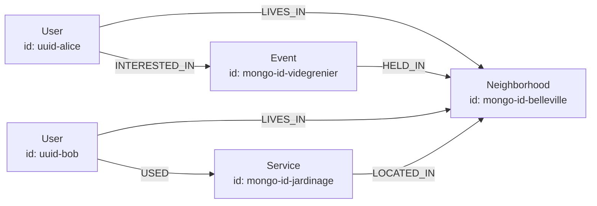
```mermaid
graph LR
    U1[User<br/>id: uuid-alice]
    U2[User<br/>id: uuid-bob]
    N1[Neighborhood<br/>id: mongo-id-belleville]
    S1[Service<br/>id: mongo-id-jardinage]
    E1[Event<br/>id: mongo-id-videgrenier]

    U1 -->|LIVES_IN| N1
    U2 -->|LIVES_IN| N1
    S1 -->|LOCATED_IN| N1
    E1 -->|HELD_IN| N1
    U1 -->|INTERESTED_IN| E1
    U2 -->|USED| S1
```

### 4.4 SQLite — local cache for the Java client (offline-first)

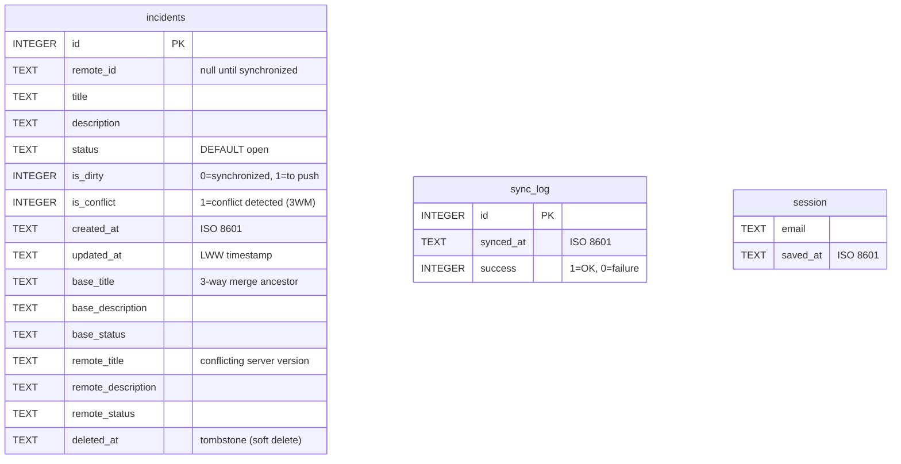
```mermaid
erDiagram
    incidents {
        INTEGER id          PK
        TEXT    remote_id   "null until synchronized"
        TEXT    title
        TEXT    description
        TEXT    status      "DEFAULT open"
        INTEGER is_dirty    "0=synchronized, 1=to push"
        INTEGER is_conflict "1=conflict detected (3WM)"
        TEXT    created_at  "ISO 8601"
        TEXT    updated_at  "LWW timestamp"
        TEXT    base_title       "3-way merge ancestor"
        TEXT    base_description
        TEXT    base_status
        TEXT    remote_title     "conflicting server version"
        TEXT    remote_description
        TEXT    remote_status
        TEXT    deleted_at  "tombstone (soft delete)"
    }
    sync_log {
        INTEGER id        PK
        TEXT    synced_at "ISO 8601"
        INTEGER success   "1=OK, 0=failure"
    }
    session {
        TEXT email
        TEXT saved_at "ISO 8601"
    }
```

---

## 5. Software architecture & rationale

### 5.1 Container view

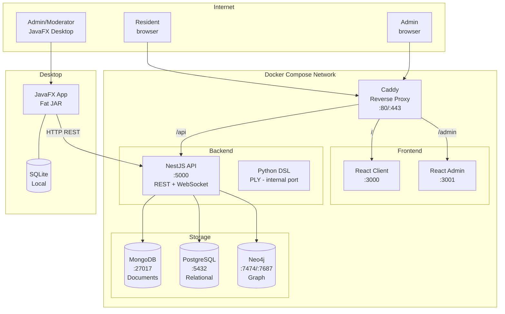
```mermaid
graph TB
    subgraph Internet
        U1[Resident<br/>browser]
        U2[Admin<br/>browser]
        U3[Admin/Moderator<br/>JavaFX Desktop]
    end

    subgraph Docker["Docker Compose Network"]
        CADDY[Caddy<br/>Reverse Proxy<br/>:80/:443]

        subgraph Frontend
            CLIENT[React Client<br/>:3000]
            ADMIN[React Admin<br/>:3001]
        end

        subgraph Backend
            API[NestJS API<br/>:5000<br/>REST + WebSocket]
            PYTHON[Python DSL<br/>PLY - internal port]
        end

        subgraph Storage
            MONGO[(MongoDB<br/>:27017<br/>Documents)]
            PG[(PostgreSQL<br/>:5432<br/>Relational)]
            NEO4J[(Neo4j<br/>:7474/:7687<br/>Graph)]
        end
    end

    subgraph Desktop
        JAVA[JavaFX App<br/>Fat JAR]
        SQLITE[(SQLite<br/>Local)]
    end

    U1 --> CADDY
    U2 --> CADDY
    U3 --> JAVA
    CADDY -->|"/"| CLIENT
    CADDY -->|"/admin"| ADMIN
    CADDY -->|"/api"| API
    API --> MONGO
    API --> PG
    API --> NEO4J
    JAVA -->|HTTP REST| API
    JAVA --- SQLITE
```

### 5.2 NestJS modules

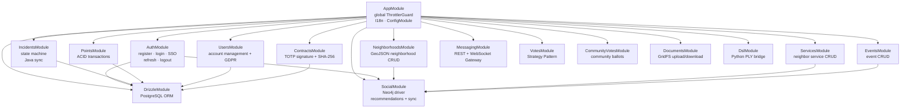
```mermaid
graph TB
    APP[AppModule<br/>global ThrottlerGuard<br/>I18n · ConfigModule]

    APP --> AUTH[AuthModule<br/>register · login · SSO<br/>refresh · logout]
    APP --> DB[DrizzleModule<br/>PostgreSQL ORM]
    APP --> NEO[SocialModule<br/>Neo4j driver<br/>recommendations + sync]

    APP --> NBH[NeighborhoodsModule<br/>GeoJSON neighborhood CRUD]
    APP --> SVC[ServicesModule<br/>neighbor service CRUD]
    APP --> EVT[EventsModule<br/>event CRUD]
    APP --> INC[IncidentsModule<br/>state machine<br/>Java sync]
    APP --> PTS[PointsModule<br/>ACID transactions]
    APP --> USR[UsersModule<br/>account management + GDPR]
    APP --> CTR[ContractsModule<br/>TOTP signature + SHA-256]
    APP --> MSG[MessagingModule<br/>REST + WebSocket Gateway]
    APP --> VOT[VotesModule<br/>Strategy Pattern]
    APP --> CVT[CommunityVotesModule<br/>community ballots]
    APP --> DOC[DocumentsModule<br/>GridFS upload/download]
    APP --> DSL[DslModule<br/>Python PLY bridge]

    AUTH --> DB
    AUTH --> NEO
    INC --> DB
    PTS --> DB
    USR --> DB
    CTR --> DB
    NBH --> NEO
    SVC --> NEO
    EVT --> NEO
```

### 5.3 Rationale for the choices

- **Polyglot persistence**: each database is used for what it does best.
  - **PostgreSQL** for operations that require **ACID** (point balances, transfers, accounts):
    transactions, `SELECT ... FOR UPDATE` locks, `CHECK` constraints.
  - **MongoDB** for semi-structured content, **GeoJSON** (`2dsphere` index, `$geoIntersects`),
    TTL indexes (SSO tokens) and binary data (**GridFS**).
  - **Neo4j** for **recommendations**: social relationships (`LIVES_IN`, `USED`, `INTERESTED_IN`)
    translate naturally into Cypher, where SQL joins would be expensive.
- **Offline-first on the Java side**: local **SQLite** + deferred synchronization → the admin works even
  without a network (see §8).
- **Modular NestJS**: dependency injection, guards, decorators, WebSocket Gateways — each
  domain is an isolated, testable module.
- **Caddy** as a reverse proxy: automatic HTTPS (Let's Encrypt), routing of `/`, `/admin`, `/api`, `/docs`,
  and enforcement of the **CSP** per surface.
- **Neo4j decoupling**: **fire-and-forget** synchronization — a graph outage never blocks the API.

---

## 6. Class diagram — Java Desktop application

> Reconstructed from the actual code (`desktop-app/src/main/java/fr/quartierconnect/desktopapp/`).

### 6.1 Core: services, authentication, persistence, synchronization

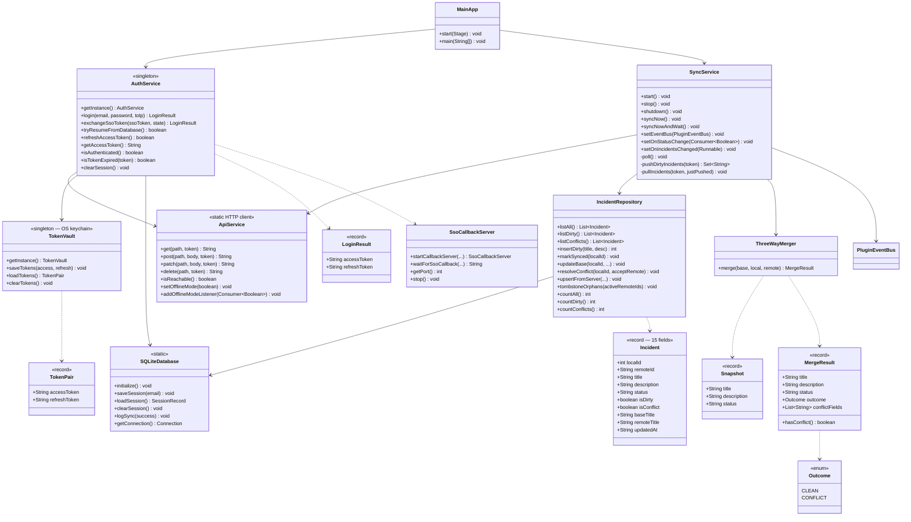
```mermaid
classDiagram
    class MainApp {
        +start(Stage) void
        +main(String[]) void
    }

    class ApiService {
        <<static HTTP client>>
        +get(path, token) String
        +post(path, body, token) String
        +patch(path, body, token) String
        +delete(path, token) String
        +isReachable() boolean
        +setOfflineMode(boolean) void
        +addOfflineModeListener(Consumer~Boolean~) void
    }

    class AuthService {
        <<singleton>>
        +getInstance() AuthService
        +login(email, password, totp) LoginResult
        +exchangeSsoToken(ssoToken, state) LoginResult
        +tryResumeFromDatabase() boolean
        +refreshAccessToken() boolean
        +getAccessToken() String
        +isAuthenticated() boolean
        +isTokenExpired(token) boolean
        +clearSession() void
    }
    class LoginResult {
        <<record>>
        +String accessToken
        +String refreshToken
    }

    class TokenVault {
        <<singleton — OS keychain>>
        +getInstance() TokenVault
        +saveTokens(access, refresh) void
        +loadTokens() TokenPair
        +clearTokens() void
    }
    class TokenPair {
        <<record>>
        +String accessToken
        +String refreshToken
    }

    class SsoCallbackServer {
        +startCallbackServer(...) SsoCallbackServer
        +waitForSsoCallback(...) String
        +getPort() int
        +stop() void
    }

    class SyncService {
        +start() void
        +stop() void
        +shutdown() void
        +syncNow() void
        +syncNowAndWait() void
        +setEventBus(PluginEventBus) void
        +setOnStatusChange(Consumer~Boolean~) void
        +setOnIncidentsChanged(Runnable) void
        -poll() void
        -pushDirtyIncidents(token) Set~String~
        -pullIncidents(token, justPushed) void
    }

    class ThreeWayMerger {
        +merge(base, local, remote) MergeResult
    }
    class Snapshot {
        <<record>>
        +String title
        +String description
        +String status
    }
    class MergeResult {
        <<record>>
        +String title
        +String description
        +String status
        +Outcome outcome
        +List~String~ conflictFields
        +hasConflict() boolean
    }
    class Outcome {
        <<enum>>
        CLEAN
        CONFLICT
    }

    class SQLiteDatabase {
        <<static>>
        +initialize() void
        +saveSession(email) void
        +loadSession() SessionRecord
        +clearSession() void
        +logSync(success) void
        +getConnection() Connection
    }

    class IncidentRepository {
        +listAll() List~Incident~
        +listDirty() List~Incident~
        +listConflicts() List~Incident~
        +insertDirty(title, desc) int
        +markSynced(localId) void
        +updateBase(localId, ...) void
        +resolveConflict(localId, acceptRemote) void
        +upsertFromServer(...) void
        +tombstoneOrphans(activeRemoteIds) void
        +countAll() int
        +countDirty() int
        +countConflicts() int
    }
    class Incident {
        <<record — 15 fields>>
        +int localId
        +String remoteId
        +String title
        +String description
        +String status
        +boolean isDirty
        +boolean isConflict
        +String baseTitle
        +String remoteTitle
        +String updatedAt
    }

    MainApp --> AuthService
    MainApp --> SyncService
    AuthService --> ApiService
    AuthService --> TokenVault
    AuthService --> SQLiteDatabase
    AuthService ..> LoginResult
    AuthService ..> SsoCallbackServer
    TokenVault ..> TokenPair
    SyncService --> ApiService
    SyncService --> IncidentRepository
    SyncService --> ThreeWayMerger
    SyncService --> PluginEventBus
    ThreeWayMerger ..> Snapshot
    ThreeWayMerger ..> MergeResult
    MergeResult ..> Outcome
    IncidentRepository --> SQLiteDatabase
    IncidentRepository ..> Incident
```

### 6.2 Extensible architecture: plugin system

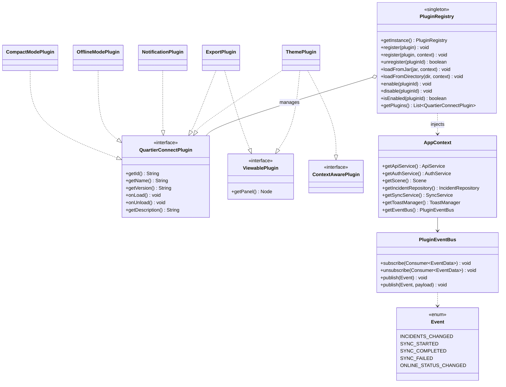
```mermaid
classDiagram
    class QuartierConnectPlugin {
        <<interface>>
        +getId() String
        +getName() String
        +getVersion() String
        +onLoad() void
        +onUnload() void
        +getDescription() String
    }
    class ViewablePlugin {
        <<interface>>
        +getPanel() Node
    }
    class ContextAwarePlugin {
        <<interface>>
    }

    class PluginRegistry {
        <<singleton>>
        +getInstance() PluginRegistry
        +register(plugin) void
        +register(plugin, context) void
        +unregister(pluginId) boolean
        +loadFromJar(jar, context) void
        +loadFromDirectory(dir, context) void
        +enable(pluginId) void
        +disable(pluginId) void
        +isEnabled(pluginId) boolean
        +getPlugins() List~QuartierConnectPlugin~
    }

    class AppContext {
        +getApiService() ApiService
        +getAuthService() AuthService
        +getScene() Scene
        +getIncidentRepository() IncidentRepository
        +getSyncService() SyncService
        +getToastManager() ToastManager
        +getEventBus() PluginEventBus
    }

    class PluginEventBus {
        +subscribe(Consumer~EventData~) void
        +unsubscribe(Consumer~EventData~) void
        +publish(Event) void
        +publish(Event, payload) void
    }
    class Event {
        <<enum>>
        INCIDENTS_CHANGED
        SYNC_STARTED
        SYNC_COMPLETED
        SYNC_FAILED
        ONLINE_STATUS_CHANGED
    }

    class ThemePlugin
    class ExportPlugin
    class NotificationPlugin
    class OfflineModePlugin
    class CompactModePlugin

    PluginRegistry o-- QuartierConnectPlugin : manages
    PluginRegistry ..> AppContext : injects
    PluginEventBus ..> Event
    AppContext --> PluginEventBus

    ThemePlugin ..|> QuartierConnectPlugin
    ThemePlugin ..|> ContextAwarePlugin
    ThemePlugin ..|> ViewablePlugin
    ExportPlugin ..|> QuartierConnectPlugin
    ExportPlugin ..|> ViewablePlugin
    NotificationPlugin ..|> QuartierConnectPlugin
    OfflineModePlugin ..|> QuartierConnectPlugin
    CompactModePlugin ..|> QuartierConnectPlugin
```

---

## 7. Complex algorithms

- **Argon2id (password hashing)** — winner of the *Password Hashing Competition* 2015; combines
  Argon2d (GPU resistance through memory cost) and Argon2i (side-channel resistance). Parameters:
  `memoryCost = 65536 (64 MB)`, `timeCost = 3`, `parallelism = 4`. Each iteration depends on 64 MB,
  which blocks GPU parallelization. Used for passwords **and** refresh token hashes
  (never bcrypt).

- **TOTP RFC 6238 (MFA)** — `Code = HOTP(secret, T)` with `T = floor(unix / 30)` and
  `HOTP(K,C) = truncate(HMAC-SHA1(K, C))`. `speakeasy` library, `window = 1` (±30 s).
  **Anti-replay**: the key `${secret}:${token}` is remembered for 90 s; a code replayed within that window
  is rejected. The secret is never retransmitted after registration.

- **JWT HS256 + strict rotation** — payload `{sub, email, role, jti, iat, exp}`, `jti` = UUID v4
  (audit/revocation). Access = **15 min**, refresh = **7 days** (Argon2-hashed in the database). On refresh:
  `SELECT ... FOR UPDATE` lock (anti-TOCTOU), the old hash becomes NULL and is then replaced. An old
  refresh token replayed → `401 TOKEN_REVOKED` (theft detection).

- **SSO PKCE (desktop)** — UUID v4 token (122 bits), TTL **5 min** (MongoDB TTL index), **single use**.
  The `state` (PKCE) protects against CSRF (checked on the Java side). Atomic consumption:
  `findOneAndUpdate({token, usedAt:null, expiresAt:{$gt:now}}, {usedAt:now})` → replay impossible.

- **DSL PLY (secure queries)** — **LALR(1)** lexer/parser (Python Lex-Yacc). Pipeline:
  text → tokens (FIND/COUNT/WHERE/AND/OR/LIMIT…) → AST → compiler (validation against a **whitelist of
  5 collections**) → MongoDB query (async Motor) → JSON. Security: `FIND passwords` → `ValueError`,
  no concatenation, isolated Python process (`pythonia` bridge), **read-only** (FIND/COUNT).

- **Three-Way Merge (synchronization)** — see §8.

---

## 8. Synchronization (key point)

Synchronization is at the heart of the Java client's **offline-first** resilience. It is
**bidirectional** (push of local changes, pull of server changes) with **Three-Way Merge conflict
resolution** and a **Last-Write-Wins** (LWW) fallback when no ancestor exists.

### 8.1 Full flow (30 s cycle)

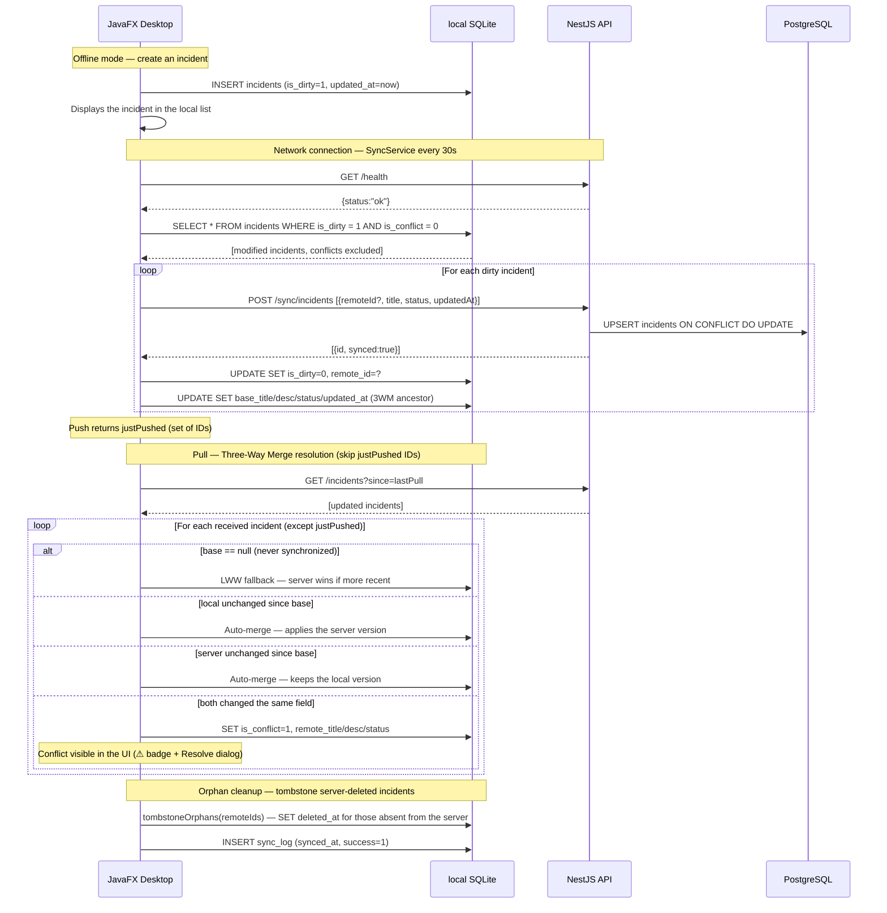
```mermaid
sequenceDiagram
    participant Java as JavaFX Desktop
    participant SQLite as local SQLite
    participant API as NestJS API
    participant PG as PostgreSQL

    Note over Java: Offline mode — create an incident
    Java->>SQLite: INSERT incidents (is_dirty=1, updated_at=now)
    Java->>Java: Displays the incident in the local list

    Note over Java,API: Network connection — SyncService every 30s
    Java->>API: GET /health
    API-->>Java: {status:"ok"}

    Java->>SQLite: SELECT * FROM incidents WHERE is_dirty = 1 AND is_conflict = 0
    SQLite-->>Java: [modified incidents, conflicts excluded]

    loop For each dirty incident
        Java->>API: POST /sync/incidents [{remoteId?, title, status, updatedAt}]
        API->>PG: UPSERT incidents ON CONFLICT DO UPDATE
        API-->>Java: [{id, synced:true}]
        Java->>SQLite: UPDATE SET is_dirty=0, remote_id=?
        Java->>SQLite: UPDATE SET base_title/desc/status/updated_at (3WM ancestor)
    end

    Note over Java: Push returns justPushed (set of IDs)
    Note over Java,SQLite: Pull — Three-Way Merge resolution (skip justPushed IDs)
    Java->>API: GET /incidents?since=lastPull
    API-->>Java: [updated incidents]
    loop For each received incident (except justPushed)
        alt base == null (never synchronized)
            Java->>SQLite: LWW fallback — server wins if more recent
        else local unchanged since base
            Java->>SQLite: Auto-merge — applies the server version
        else server unchanged since base
            Java->>SQLite: Auto-merge — keeps the local version
        else both changed the same field
            Java->>SQLite: SET is_conflict=1, remote_title/desc/status
            Note over Java: Conflict visible in the UI (⚠ badge + Resolve dialog)
        end
    end

    Note over Java,SQLite: Orphan cleanup — tombstone server-deleted incidents
    Java->>SQLite: tombstoneOrphans(remoteIds) — SET deleted_at for those absent from the server
    Java->>SQLite: INSERT sync_log (synced_at, success=1)
```

### 8.2 Three-Way Merge — resolution table

The `ThreeWayMerger` compares three versions of each field (title, description, status):

| Case | Base | Local | Remote | Result |
|-----|------|-------|--------|----------|
| No base (1st sync) | null | L | R | **LWW** — remote wins if more recent |
| Local unchanged | B | B | R | Auto-merge — applies remote |
| Remote unchanged | B | L | B | Auto-merge — keeps local |
| Same change | B | X | X | Auto-merge — convergence |
| **True conflict** | B | L | R | `is_conflict=1` — manual resolution required |

### 8.3 Conflict resolution in the UI

- **Banner**: an alert at the top of the incidents view when conflicts exist.
- **Filter**: a "Conflicts" button to show only the affected incidents.
- **Merge modal**: a 4-column `GridPane` (field / base / local / remote) with diff highlighting.
- **Resolution**: the user picks each field; resolution updates the ancestor and clears
  the `is_conflict` flag.

### 8.4 Distributed deletion (tombstone)

Server-side deletions are propagated locally via the `deleted_at` column (soft delete).
`tombstoneOrphans()` marks the incidents absent from the server response during a full pull; they are
excluded from the views but kept for audit.

### 8.5 Neo4j synchronization (asynchronous, fire-and-forget)

On every CRUD operation on social entities, a **fire-and-forget** call synchronizes Neo4j. A
Neo4j outage **never** blocks the API. On a recoverable error (`ServiceUnavailable`,
`SessionExpired`, `TransientError`), `withRetry` retries 3 times (backoff 100 → 200 → 400 ms). Non-recoverable
errors (e.g. Cypher syntax) fail immediately.

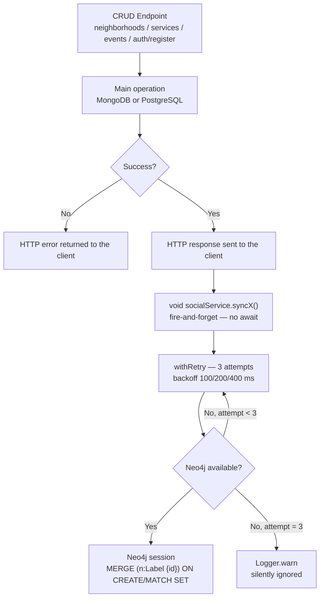
```mermaid
flowchart TD
    A["CRUD Endpoint<br/>neighborhoods / services / events / auth/register"] --> B["Main operation<br/>MongoDB or PostgreSQL"]
    B --> C{Success?}
    C -->|No| D[HTTP error returned to the client]
    C -->|Yes| E[HTTP response sent to the client]
    E --> F["void socialService.syncX()<br/>fire-and-forget — no await"]
    F --> R["withRetry — 3 attempts<br/>backoff 100/200/400 ms"]
    R --> G{Neo4j available?}
    G -->|Yes| H["Neo4j session<br/>MERGE (n:Label {id}) ON CREATE/MATCH SET"]
    G -->|No, attempt < 3| R
    G -->|No, attempt = 3| I["Logger.warn<br/>silently ignored"]
```

### 8.6 Startup state machine (offline resilience)

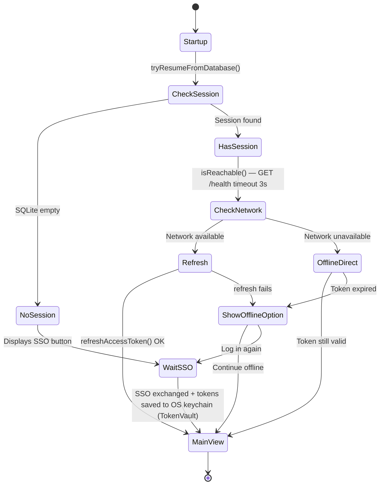
```mermaid
stateDiagram-v2
    [*] --> Startup

    Startup --> CheckSession : tryResumeFromDatabase()

    CheckSession --> NoSession : SQLite empty
    CheckSession --> HasSession : Session found

    NoSession --> WaitSSO : Displays SSO button

    HasSession --> CheckNetwork : isReachable() — GET /health timeout 3s

    CheckNetwork --> Refresh : Network available
    CheckNetwork --> OfflineDirect : Network unavailable

    Refresh --> MainView : refreshAccessToken() OK
    Refresh --> ShowOfflineOption : refresh fails

    OfflineDirect --> MainView : Token still valid
    OfflineDirect --> ShowOfflineOption : Token expired

    ShowOfflineOption --> MainView : Continue offline
    ShowOfflineOption --> WaitSSO : Log in again

    WaitSSO --> MainView : SSO exchanged + tokens saved to OS keychain (TokenVault)
    MainView --> [*]
```

---

## 9. APIs / frameworks external to Java SE

### 9.1 Java Desktop client (`desktop-app/pom.xml` — source of truth)

| Dependency | Version | Role |
|---|---|---|
| `org.openjfx:javafx-controls` / `javafx-fxml` | 21.0.6 | Rich UI (controls, FXML, CSS, charts) |
| `org.xerial:sqlite-jdbc` | 3.47.1.0 | Local SQLite database (offline cache, JDBC) |
| `io.jsonwebtoken:jjwt-api` (+ `impl`, `jackson`) | 0.12.6 | Client-side JWT decoding (read-only) |
| `com.github.javakeyring:java-keyring` | 1.0.4 | OS keychain (SecretService / Keychain / Credential Manager) — `TokenVault` |
| `com.fasterxml.jackson.core:jackson-databind` | 2.18.2 | JSON serialization/deserialization |
| `io.github.mkpaz:atlantafx-base` | 2.0.1 | Modern JavaFX theme (PrimerLight ≈ shadcn palette) |
| `org.kordamp.ikonli:ikonli-javafx` + `fontawesome5-pack` | 12.3.1 | JavaFX icons (FontAwesome 5) |
| `org.junit.jupiter:junit-jupiter` | 5.12.1 | Tests (test scope) |
| `org.mockito:mockito-core` | 5.14.2 | Test mocks (test scope) |

**Build plugins**: `maven-compiler-plugin` (Java 21), `javafx-maven-plugin` 0.0.8,
**`maven-shade-plugin` 3.6.0** (self-executable Fat JAR, mainClass `…desktopapp.Launcher`,
finalName `quartierconnect-desktop`), `maven-surefire-plugin` 3.5.2.

**Built-in JSE/JavaFX APIs** (outside the pom): `java.net.http.HttpClient` (HTTPS to the API),
`java.util.concurrent.ScheduledExecutorService` (30 s sync cycle), `java.sql`/JDBC,
`com.sun.net.httpserver.HttpServer` (local SSO PKCE callback).

### 9.2 NestJS / Web backend (excerpt)

| Library | Version | Role |
|---|---|---|
| NestJS | 11 | Backend framework (DI, guards, WebSocket Gateways) |
| Drizzle ORM | 0.40 | Type-safe PostgreSQL ORM, `onConflictDoUpdate` |
| Mongoose | 8 | MongoDB ODM (TTL index, GeoJSON, GridFS) |
| neo4j-driver | 5 | Neo4j / Cypher driver |
| @nestjs/jwt + Passport-JWT | 11 / 4 | JWT HS256, validation strategy |
| argon2 | 0.40 | Argon2id hashing |
| speakeasy | 2.0 | TOTP RFC 6238 |
| @nestjs/throttler | 6 | Rate limiting |
| Socket.io | — | Real-time WebSocket |
| PLY + pythonia | — | LALR(1) DSL + Python↔Node bridge |
| React / Vite | 19 / 6 | UI + build |
| TanStack Router / Query / Form / Table | 1 / 5 / 1 / 8 | Routing, cache, forms, datagrids |
| Shadcn/ui + Tailwind | — / v4 | Accessible components + styles |
| react-leaflet (+ leaflet-draw) | 5 | GeoJSON mapping |
| pdf-lib + react-signature-canvas | — | PDF generation/signing |
| Scalar | — | Interactive API documentation (`/docs`) |
| Caddy | 2 | HTTPS reverse proxy |

---

## 10. Java Desktop application — operation & extensibility

The desktop application (`desktop-app/`) consists of **74 Java files** (Java 21, JavaFX 21). It follows a
clean separation of **views / services / persistence / plugins**: the JavaFX views (`views/`) consume
business services (`services/`) that talk to the REST API (`ApiService`) and the local SQLite database
(`database/`). The central services are **singletons** (`AuthService`, `TokenVault`,
`PluginRegistry`) or **static** utilities (`ApiService`, `SQLiteDatabase`), which guarantees a single
shared state (session, synchronization queue, plugin registry).

### 10.1 Plugin system — principle

Extensibility relies on an **interface contract** and **dynamic loading**, without recompiling
the application:

- **Contract**: a plugin implements `QuartierConnectPlugin` (identity `getId/getName/getVersion`, life
  cycle `onLoad`/`onUnload`). If it wants to display an interface, it also implements `ViewablePlugin`
  (`getPanel() : Node`); if it needs to access the application, it implements `ContextAwarePlugin` and
  receives an `AppContext`.
- **Sandbox**: `AppContext` is **the only entry point** offered to the plugin (API, session, scene,
  incident repository, sync service, event bus, toasts). A plugin **never** accesses
  the database directly — isolation is ensured by this facade.
- **Dynamic loading**: `PluginRegistry` reads the `.jar` files dropped into `~/.quartierconnect/plugins/`
  via a `URLClassLoader`, spots the classes that implement the contract, registers them and calls
  `onLoad()`. **Enabling/disabling happens on the fly**, without a restart.
- **Event-based decoupling**: components publish events on the `PluginEventBus`
  (`INCIDENTS_CHANGED`, `SYNC_STARTED`, `SYNC_COMPLETED`, `SYNC_FAILED`, `ONLINE_STATUS_CHANGED`); the
  plugins subscribe to them without knowing the emitter. This lets a plugin react to synchronization
  without coupling its code to the `SyncService`.
- **Bundled plugins**: `ThemePlugin`, `ExportPlugin`, `NotificationPlugin`, `OfflineModePlugin`,
  `CompactModePlugin`.

#### Plugin lifecycle

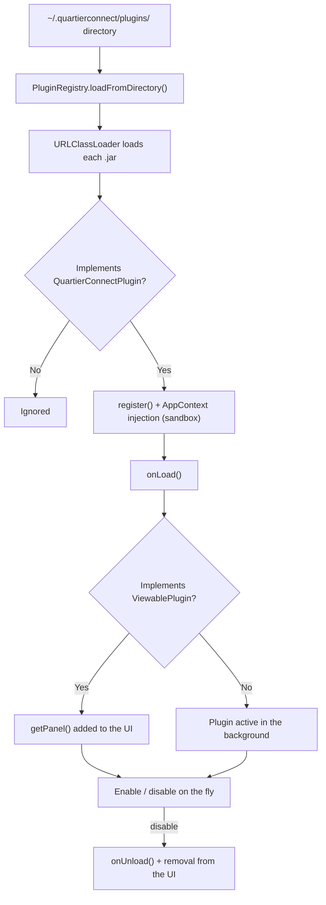
```mermaid
flowchart TD
    A["~/.quartierconnect/plugins/ directory"] --> B["PluginRegistry.loadFromDirectory()"]
    B --> C["URLClassLoader loads each .jar"]
    C --> D{"Implements QuartierConnectPlugin?"}
    D -->|No| E["Ignored"]
    D -->|Yes| F["register() + AppContext injection (sandbox)"]
    F --> G["onLoad()"]
    G --> H{"Implements ViewablePlugin?"}
    H -->|Yes| I["getPanel() added to the UI"]
    H -->|No| J["Plugin active in the background"]
    I --> K["Enable / disable on the fly"]
    J --> K
    K -->|disable| L["onUnload() + removal from the UI"]
```

#### Decoupled communication via the event bus

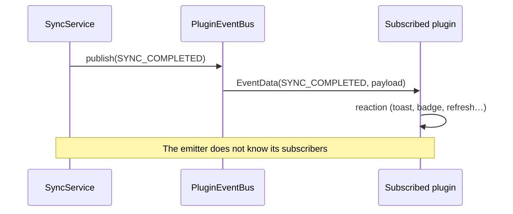
```mermaid
sequenceDiagram
    participant Sync as SyncService
    participant Bus as PluginEventBus
    participant P as Subscribed plugin

    Sync->>Bus: publish(SYNC_COMPLETED)
    Bus->>P: EventData(SYNC_COMPLETED, payload)
    P->>P: reaction (toast, badge, refresh…)
    Note over Sync,P: The emitter does not know its subscribers
```

### 10.2 Merge algorithm (Three-Way Merge) — logic

At synchronization, each field of an incident (title, description, status) is compared across **three
versions**: the **ancestor** (`base`, last synchronized version), the **local** version and the **server**
version (`remote`). The decision is made field by field; a single conflicting field is enough to mark
the incident `is_conflict = 1`. If no ancestor exists yet (first sync), it falls back to
**Last-Write-Wins** (the most recent version wins).

```mermaid
flowchart TD
    A["Field F: base, local, remote"] --> B{"base == null?"}
    B -->|Yes| C["LWW — take remote if more recent"]
    B -->|No| D{"local == base?"}
    D -->|Yes| E{"remote == base?"}
    E -->|Yes| F["Unchanged — keep local"]
    E -->|No| G["Auto-merge — apply remote"]
    D -->|No| H{"remote == base?"}
    H -->|Yes| I["Auto-merge — keep local"]
    H -->|No| J{"local == remote?"}
    J -->|Yes| K["Convergence — keep local"]
    J -->|No| L["CONFLICT — is_conflict=1, manual resolution"]
```

> The case mapping table and the resolution in the UI are detailed in §8.2 and §8.3.

### 10.3 Package structure

```
desktop-app/src/main/java/fr/quartierconnect/desktopapp/
├── MainApp.java, Launcher.java, module-info.java
├── services/      ApiService, AuthService, SyncService, ThreeWayMerger,
│                  TokenVault, SsoCallbackServer, ThemeManager, Statistics…,
│                  Neighborhoods/Users/Events/Services/Votes/Contracts Service
├── database/      SQLiteDatabase, IncidentRepository
├── plugin/        QuartierConnectPlugin, ViewablePlugin, PluginRegistry,
│                  AppContext, PluginEventBus, + 5 plugins (Theme, Export,
│                  Notification, OfflineMode, CompactMode)
├── views/         MainView, IncidentsView, DashboardView, ProfileView,
│                  ContractsView, EventsView, UsersView, NeighborhoodsView,
│                  ServicesView, PluginsView, LoginView
├── ui/            components/ (AppButton, AppCard, AppModal, ToastManager…)
│                  layout/ (AppSidebar, AppTopBar, PageLayout, StatusBar)
└── util/          UiHelper, TimeFormatter
```

### 10.4 Build & run

```bash
cd desktop-app
mvn clean package            # produces target/quartierconnect-desktop.jar (Fat JAR)
java -jar target/quartierconnect-desktop.jar
```

---

## 11. Tests

### 11.1 Strategy

A **4-level** pyramid, from the fastest to the most integrated:

- **Unit** (Jest API, Vitest web): injected mocks, total isolation, **no real DB**.
- **Components** (JUnit 5 Java, pytest DSL): file isolation. On the Java side, SQLite is isolated via a
  shared temporary file (`Files.createTempFile` + `deleteOnExit`) — `:memory:` would create one database per
  connection.
- **API E2E** (Supertest): dedicated real DBs (MongoDB + PostgreSQL), seed via the API at `beforeAll`,
  **zero mocks**, automatic cleanup.
- **UI E2E** (Playwright): headless Chromium on `:3000` / `:3001` / `:5000`.

### 11.2 Coverage

| Component | Framework | Tests |
|---|---|---|
| NestJS API — unit | Jest | 260 |
| Web (hooks + UI) | Vitest | 87 |
| NestJS API — E2E | Supertest | 148 |
| Java Desktop | JUnit 5 + Surefire | 139 |
| Python DSL | pytest | 21 |
| Web E2E | Playwright | 81 |
| **Total** | | **~736 (green)** |

Measured API coverage: statements **95.7%**, branches **86.1%**, functions **94.3%**, lines **95.2%**
(required thresholds: 80/75/80/80).

```mermaid
flowchart BT
    classDef e2eui fill:#ef4444,color:#fff,stroke:none
    classDef e2eapi fill:#f97316,color:#fff,stroke:none
    classDef unit fill:#3b82f6,color:#fff,stroke:none
    classDef comp fill:#22c55e,color:#fff,stroke:none

    E2EUI["E2E UI — Playwright<br/>81 tests · Headless Chromium"]
    E2EAPI["E2E API — Supertest<br/>148 tests · Real databases"]
    UNIT["Unit — Jest + Vitest<br/>347 tests · Injected mocks"]
    COMP["Components — JUnit 5 + pytest<br/>160 tests · File isolation"]

    COMP --> UNIT --> E2EAPI --> E2EUI

    class E2EUI e2eui
    class E2EAPI e2eapi
    class UNIT unit
    class COMP comp
```

### 11.3 Examples

TOTP anti-replay (API, Jest):

```typescript
it('rejects replayed TOTP code within 90s window', () => {
  jest.spyOn(speakeasy.totp, 'verify').mockReturnValue(true);
  expect(service.verify('SECRET', '123456')).toBe(true);   // 1st use OK
  expect(service.verify('SECRET', '123456')).toBe(false);  // Replay blocked
});
```

Offline session resume (Java, JUnit):

```java
@Test
void tryResume_withExpiredAccessToken_butValidRefresh_returnsTrue() {
    SQLiteDatabase.saveSession("alice@demo.fr", expiredJwt, validRefreshJwt);
    // No network — offline mode
    assertTrue(authService.tryResumeFromDatabase()); // true because refreshToken present
}
```

DSL (Python, pytest):

```python
def test_find_where_limit():
    result = compile_query("FIND incidents WHERE status = 'open' LIMIT 10")
    assert result == {'type': 'find', 'collection': 'incidents',
                      'filter': {'status': 'open'}, 'limit': 10}
```

---

## 12. Progress status

The project goes well beyond the **30%** threshold: the four surfaces are functional and tested.

- **NestJS backend**: 16 modules, REST + WebSocket, 3 databases, ~408 tests (260 unit + 148 E2E).
- **Web (React)**: client + admin, mapping, real-time messaging, votes, signatures, i18n.
- **Java Desktop client**: JavaFX, offline-first, SSO PKCE, 3-way merge synchronization, plugins,
  themes, 139 JUnit tests, **self-executable Fat JAR**.
- **Python DSL**: LALR(1) lexer/parser, 21 tests.
- **Infra**: Docker Compose (7 services), Caddy (HTTPS + CSP), GitHub Actions CI, Scalar API docs (`/docs`).

The **heavy Java part** is not only started but completed (sync, security, extensibility).

---

## 13. References to the detailed documentation

| Topic | Document |
|---|---|
| Full requirements specification | `CDC.md` |
| Architecture (flows, modules, sync §8-9) | `docs/ARCHITECTURE.md` |
| Data model (detailed schemas, indexes) | `docs/DATABASE.md` |
| Technical report (algorithms, security) | `docs/RAPPORT-TECHNIQUE.md` |
| Use cases & stage report | `docs/RAPPORT-ETAPE2.md`, `docs/RAPPORT-ETAPE3.md` |
| Test strategy & examples | `docs/TEST.md` |
| DSL | `docs/DSL.md` |
| Security | `docs/SECURITY.md` |
| Plugin system | `docs/PLUGINS.md` |
| Design system | `docs/DESIGN.md` |
| Deployment | `docs/DEPLOYMENT.md` |
| Defense guide (demo scenarios) | `docs/GUIDE-SOUTENANCE.md` |
