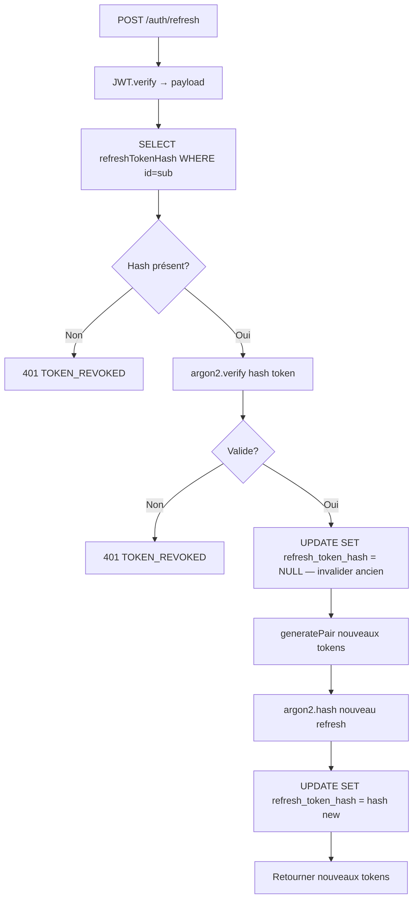

# Sécurité — QuartierConnect

> **Version** 0.1.3 · **Date** 7 avril 2026

---

## Table des matières

1. [Modèle de menace](#1-modèle-de-menace)
2. [Hachage des mots de passe — Argon2id](#2-hachage-des-mots-de-passe--argon2id)
3. [Authentification multi-facteur — TOTP RFC 6238](#3-authentification-multi-facteur--totp-rfc-6238)
4. [JWT — Accès et rafraîchissement](#4-jwt--accès-et-rafraîchissement)
5. [SSO — Single Sign-On cross-surface](#5-sso--single-sign-on-cross-surface)
6. [Intégrité des contrats — SHA-256](#6-intégrité-des-contrats--sha-256)
7. [Rate limiting](#7-rate-limiting)
8. [Headers HTTP de sécurité](#8-headers-http-de-sécurité)
9. [Autorisation basée sur les rôles](#9-autorisation-basée-sur-les-rôles)
10. [RGPD — Protection des données](#10-rgpd--protection-des-données)

---

## 1. Modèle de menace

```mermaid
flowchart TD
    subgraph Attaques["Vecteurs d'attaque"]
        A1["Brute-force mot de passe"]
        A2["Replay code TOTP"]
        A3["Vol de session - XSS"]
        A4["CSRF"]
        A5["Injection SQL"]
        A6["Injection NoSQL"]
        A7["Replay SSO token"]
        A8["Elevation de privilege"]
        A9["Acces non autorise"]
        A10["Interception reseau"]
        A11["Attaque DDoS - flood"]
    end

    subgraph Mitigations["Mitigations implementees"]
        M1["Argon2id - 64MB RAM - timeCost 3 + ThrottlerGuard 100req/15min"]
        M2["TanStack Store in-memory TTL 90s - anti-replay par code+secret"]
        M3["JWT 15min + refresh hash argon2id - Authorization header uniquement"]
        M4["Header-only tokens - pas de cookie - SameSite inapplicable"]
        M5["Drizzle ORM parametrise - zero SQL concatene"]
        M6["Mongoose schema strict + ValidationPipe whitelist:true"]
        M7["findOneAndUpdate atomique - usedAt non-null apres echange"]
        M8["RolesGuard relit le role depuis BDD - pas de confiance JWT seul"]
        M9["Ownership check createdBy === req.user.sub dans chaque controller"]
        M10["HTTPS TLS 1.3 Caddy - HSTS - CSP stricte"]
        M11["ThrottlerGuard global 100req/15min/IP + login 5 tentatives/15min"]
    end

    A1 --> M1
    A2 --> M2
    A3 --> M3
    A4 --> M4
    A5 --> M5
    A6 --> M6
    A7 --> M7
    A8 --> M8
    A9 --> M9
    A10 --> M10
    A11 --> M11
```



| Menace | Mitigation |
|--------|-----------|
| Brute-force mot de passe | Argon2id coût CPU/mémoire + rate limiting 100req/15min |
| Replay d'un code TOTP | Anti-replay in-memory TanStack Store TTL 90s |
| Vol de session XSS | Refresh token hashé ; access token 15min ; pas de cookies |
| CSRF | Tokens dans Authorization header uniquement |
| Injection SQL | Drizzle ORM paramétrisé — jamais de SQL concaté |
| Injection NoSQL | Mongoose schéma strict ; ValidationPipe whitelist:true |
| Replay de SSO token | findOneAndUpdate atomique ; usedAt non-null après usage |
| Élévation de privilège | RolesGuard vérifie le rôle re-lu depuis la BDD |
| Accès non autorisé | Ownership check dans chaque controller (createdBy === req.user.sub) |

---

## 2. Hachage des mots de passe — Argon2id

Argon2id (vainqueur du Password Hashing Competition 2015) combine résistance GPU (coût mémoire) et résistance aux attaques par canal latéral. bcrypt est limité à 72 octets et n'a pas de paramètre mémoire.

```typescript
// auth.service.ts — inscription
const passwordHash = await argon2.hash(dto.password);
// Paramètres par défaut argon2 npm :
//   type: argon2id
//   memoryCost: 65536 (64 MB)
//   timeCost: 3
//   parallelism: 4

// auth.service.ts — connexion
const valid = await argon2.verify(user.passwordHash, dto.password);
```

Le **refresh token JWT est aussi hashé** avant stockage :

```typescript
// token.service.ts
const refreshTokenHash = await argon2.hash(refreshToken);
await db.update(users).set({ refreshTokenHash });

// Vérification lors du refresh
const isValid = await argon2.verify(user.refreshTokenHash, refreshToken);
```

Un accès lecture en base de données ne suffit pas à rejouer le refresh token.

---

## 3. Authentification multi-facteur — TOTP RFC 6238

### Algorithme

```
code = HOTP(secret, floor(Unix_timestamp / 30))
HOTP(K, C) = truncate(HMAC-SHA1(K, C_bytes))
```

Le code est valide 30 secondes, avec une tolérance de ±1 période (`window: 1`).

### Génération du secret (inscription)

```typescript
// totp.service.ts
const generated = speakeasy.generateSecret({
  name: `QuartierConnect:${email}`,
  issuer: 'QuartierConnect',
});
// secret.base32 → stocké en PostgreSQL
// otpauth_url → retourné au client → QR code avec qrcode npm
```

### Vérification avec anti-replay

```typescript
verify(secret: string, token: string): boolean {
  this.purgeExpiredCodes();           // nettoyer codes > 90s

  const key = `${secret}:${token}`;
  if (this.usedCodes.state[key] !== undefined) return false;  // REPLAY BLOQUÉ

  const valid = speakeasy.totp.verify({
    secret, encoding: 'base32', token,
    window: 1,          // ±30s tolérance horloge
  });

  if (valid) {
    this.usedCodes.setState(prev => ({
      ...prev,
      [key]: Date.now() + 90_000,   // mémoriser 90s
    }));
  }
  return valid;
}
```

Même si un attaquant intercepte un code valide, la seconde utilisation dans les 30s est refusée.

---

## 4. JWT — Accès et rafraîchissement

### Structure du payload

```json
{
  "sub": "550e8400-e29b-41d4-a716-446655440000",
  "email": "alice@demo.fr",
  "role": "resident",
  "jti": "unique-uuid-v4",
  "iat": 1712345678,
  "exp": 1712346578
}
```

- **access token** : HS256, durée 15 minutes
- **refresh token** : HS256, durée 7 jours, hashé Argon2 en base

### Rotation stricte



Si un attaquant vole un refresh token et l'utilise, l'utilisateur légitime voit son prochain refresh échouer (révocation mutuelle).

---

## 5. SSO — Single Sign-On cross-surface

| Propriété | Mécanisme |
|-----------|----------|
| Usage unique | findOneAndUpdate atomique — usedAt non-null après échange |
| Expiration | expiresAt = now+300s ; index TTL MongoDB supprime automatiquement |
| PKCE state | UUID v4 côté web, vérifié côté Java — empêche CSRF |
| Entropie | Token UUID v4 (122 bits) — non devinable par force brute |
| Transport | HTTPS obligatoire en production ; deep link app:// en dev |

---

## 6. Intégrité des contrats — SHA-256

### Hash du contenu

```typescript
const hash = crypto.createHash('sha256').update(dto.content).digest('hex');
// Stocké comme contentHash à la création
```

### Hash de signature individuelle

```typescript
const hash = crypto
  .createHash('sha256')
  .update(contract.content + userId + new Date().toISOString())
  .digest('hex');
// Inclut : contenu + identité + timestamp — preuve non répudiable
```

La signature TOTP obligatoire prouve la présence physique au moment de la signature (authentification forte).

---

## 7. Rate limiting

```typescript
// app.module.ts
ThrottlerModule.forRoot([{ ttl: 900000, limit: 100 }])
// 100 requêtes par IP sur 15 minutes — appliqué globalement
providers: [{ provide: APP_GUARD, useClass: ThrottlerGuard }]
```

---

## 8. Headers HTTP de sécurité

Helmet.js appliqué sur toutes les réponses :

| Header | Protection |
|--------|-----------|
| `Content-Security-Policy` | Restreint scripts/styles/images — mitigation XSS |
| `X-Content-Type-Options: nosniff` | MIME sniffing |
| `X-Frame-Options: DENY` | Clickjacking |
| `Strict-Transport-Security` | Downgrade HTTPS → HTTP |
| `X-XSS-Protection: 1; mode=block` | XSS legacy browsers |

---

## 9. Autorisation basée sur les rôles

```
resident → moderator → admin
                              banned (terminal — login refusé)
```

| Rôle | Permissions clés |
|------|-----------------|
| `resident` | Créer incidents/services/events, points, votes, messagerie |
| `moderator` | + Changer statut incidents, modérer contenu |
| `admin` | + Gérer utilisateurs, quartiers, stats, DSL |
| `banned` | Aucune — 401 au login |

Le rôle est re-vérifié en base à chaque refresh — un ban est effectif immédiatement.

---

## 10. RGPD — Protection des données

### Export des données personnelles

```
GET /me/export → archive JSON complète
```

Inclut : profil, incidents, services, événements, contrats, points, conversations.
N'inclut jamais : passwordHash, totpSecret, refreshTokenHash.

### Suppression du compte

1. Soft delete incidents (conservation modération)
2. Révocation refresh token (déconnexion immédiate)
3. Suppression nœud Neo4j `deleteNode('User', id)`
