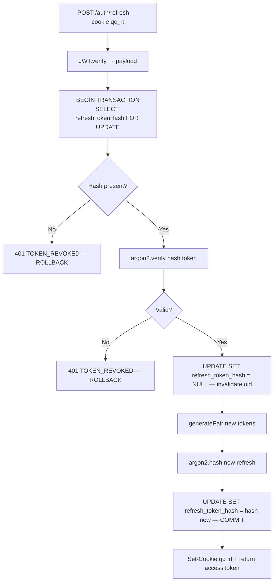

# Security — QuartierConnect

> **Version** 0.2.0 · **Date** 16 April 2026

---

## Table of contents

1. [Threat model](#1-threat-model)
2. [Password hashing — Argon2id](#2-password-hashing--argon2id)
3. [Multi-factor authentication — TOTP RFC 6238](#3-multi-factor-authentication--totp-rfc-6238)
4. [JWT — Access and refresh](#4-jwt--access-and-refresh)
5. [SSO — Cross-surface Single Sign-On](#5-sso--cross-surface-single-sign-on)
6. [Contract integrity — SHA-256](#6-contract-integrity--sha-256)
7. [Rate limiting](#7-rate-limiting)
8. [HTTP security headers](#8-http-security-headers)
9. [Role-based authorization](#9-role-based-authorization)
10. [GDPR — Data protection](#10-gdpr--data-protection)
11. [Token storage — Java desktop application](#11-token-storage--java-desktop-application)
12. [Data integrity — Three-Way Merge](#12-data-integrity--three-way-merge)
13. [Input validation — Desktop application](#13-input-validation--desktop-application)
14. [API error sanitization](#14-api-error-sanitization)
15. [Proactive token auto-refresh](#15-proactive-token-auto-refresh)

---

## 1. Threat model

```mermaid
flowchart TD
    subgraph Attaques["Attack vectors"]
        A1["Password brute-force"]
        A2["TOTP code replay"]
        A3["Session theft - XSS"]
        A4["CSRF"]
        A5["SQL injection"]
        A6["NoSQL injection"]
        A7["SSO token replay"]
        A8["Privilege escalation"]
        A9["Unauthorized access"]
        A10["Network interception"]
        A11["DDoS attack - flood"]
    end

    subgraph Mitigations["Implemented mitigations"]
        M1["Argon2id - 64MB RAM - timeCost 3 + ThrottlerGuard 100req/15min"]
        M2["TanStack Store in-memory TTL 90s - anti-replay by code+secret"]
        M3["JWT access 15min + refresh httpOnly cookie SameSite=strict - JTI revocation table PG"]
        M4["Refresh cookie httpOnly SameSite=strict + credentials:include - CSRF impossible"]
        M5["Drizzle ORM parameterized - zero concatenated SQL"]
        M6["Mongoose schema strict + ValidationPipe whitelist:true"]
        M7["findOneAndUpdate atomic - usedAt non-null after exchange"]
        M8["RolesGuard re-reads the role from the DB - no trust in JWT alone"]
        M9["Ownership check createdBy === req.user.sub in every controller"]
        M10["HTTPS TLS 1.3 Caddy - HSTS - strict CSP"]
        M11["ThrottlerGuard global 100req/15min/IP + login 5 attempts/15min"]
    end

    A1 --> M1
    A2 --> M2
    A3 --> M3
    A4 --> M4
    A5 --> M5
    A6 --> M6
    A7 --> M7
    A8 --> M8
    A9 --> M9
    A10 --> M10
    A11 --> M11
```



| Threat | Mitigation |
|--------|-----------|
| Password brute-force | Argon2id CPU/memory cost + rate limiting 100req/15min |
| Replay of a TOTP code | In-memory anti-replay TanStack Store TTL 90s |
| XSS session theft | Refresh token in httpOnly cookie (inaccessible to JS); access token 15min; revocable JTI |
| CSRF | Refresh cookie httpOnly SameSite=strict; access token in the Authorization header |
| SQL injection | Parameterized Drizzle ORM — never concatenated SQL |
| NoSQL injection | Strict Mongoose schema; ValidationPipe whitelist:true |
| SSO token replay | Atomic findOneAndUpdate; usedAt non-null after use |
| Privilege escalation | RolesGuard checks the role re-read from the DB |
| Unauthorized access | Ownership check in every controller (createdBy === req.user.sub) |

---

## 2. Password hashing — Argon2id

Argon2id (winner of the 2015 Password Hashing Competition) combines GPU resistance (memory cost) with resistance to side-channel attacks. bcrypt is limited to 72 bytes and has no memory parameter.

```typescript
// auth.service.ts — registration
const passwordHash = await argon2.hash(dto.password);
// Default argon2 npm parameters:
//   type: argon2id
//   memoryCost: 65536 (64 MB)
//   timeCost: 3
//   parallelism: 4

// auth.service.ts — login
const valid = await argon2.verify(user.passwordHash, dto.password);
```

The **JWT refresh token is also hashed** before storage:

```typescript
// token.service.ts
const refreshTokenHash = await argon2.hash(refreshToken);
await db.update(users).set({ refreshTokenHash });

// Verification during refresh
const isValid = await argon2.verify(user.refreshTokenHash, refreshToken);
```

Read access to the database is not enough to replay the refresh token.

---

## 3. Multi-factor authentication — TOTP RFC 6238

### Algorithm

```
code = HOTP(secret, floor(Unix_timestamp / 30))
HOTP(K, C) = truncate(HMAC-SHA1(K, C_bytes))
```

The code is valid for 30 seconds, with a tolerance of ±1 period (`window: 1`).

### Secret generation (registration)

```typescript
// totp.service.ts
const generated = speakeasy.generateSecret({
  name: `QuartierConnect:${email}`,
  issuer: 'QuartierConnect',
});
// secret.base32 → stored in PostgreSQL
// otpauth_url → returned to the client → QR code with qrcode npm
```

### Verification with anti-replay

```typescript
verify(secret: string, token: string): boolean {
  this.purgeExpiredCodes();           // clean up codes > 90s

  const key = `${secret}:${token}`;
  if (this.usedCodes.state[key] !== undefined) return false;  // REPLAY BLOCKED

  const valid = speakeasy.totp.verify({
    secret, encoding: 'base32', token,
    window: 1,          // ±30s clock tolerance
  });

  if (valid) {
    this.usedCodes.setState(prev => ({
      ...prev,
      [key]: Date.now() + 90_000,   // remember for 90s
    }));
  }
  return valid;
}
```

Even if an attacker intercepts a valid code, a second use within 30s is refused.

---

## 4. JWT — Access and refresh

### Payload structure

```json
{
  "sub": "550e8400-e29b-41d4-a716-446655440000",
  "email": "alice@demo.fr",
  "role": "resident",
  "jti": "unique-uuid-v4",
  "iat": 1712345678,
  "exp": 1712346578
}
```

- **access token**: HS256, 15-minute lifetime — sent in the `Authorization: Bearer` header
- **refresh token**: HS256, 7-day lifetime, Argon2-hashed in the database — stored in an **httpOnly cookie** (`qc_rt`, SameSite=strict)

The refresh token is inaccessible to JavaScript (httpOnly), which removes the main XSS vector. In production, the `secure` flag is enabled (HTTPS only).

### Client-side storage

| Token | Storage | JS access |
|-------|---------|----------|
| access token (15min) | `localStorage` | Yes — read for the `Authorization` header |
| refresh token (7d) | httpOnly cookie `qc_rt` | No — transparent to JS |

### Strict rotation with transactional locking

Rotation is protected against race conditions (TOCTOU) by a `SELECT FOR UPDATE` within a PostgreSQL transaction. Two simultaneous refresh requests cannot use the same token.



If an attacker steals a refresh token and uses it, the legitimate user's next refresh fails (mutual revocation). The transactional lock prevents two simultaneous exchanges of the same token.

### Instant revocation — `revoked_tokens` table

On logout (`POST /auth/logout`), the current access token is revoked immediately via its JTI, without waiting for its natural expiration.

```sql
-- api/drizzle/0001_revoked_tokens.sql
CREATE TABLE "revoked_tokens" (
  "jti" text PRIMARY KEY NOT NULL,
  "expires_at" timestamp NOT NULL
);
CREATE INDEX "revoked_tokens_expires_at_idx" ON "revoked_tokens" USING btree ("expires_at");
```

```typescript
// jwt.strategy.ts — validate()
if (payload.jti) {
  const revoked = await this.tokenService.isAccessTokenRevoked(payload.jti);
  if (revoked) throw new UnauthorizedException({ code: "TOKEN_REVOKED" });
}
```

Expired entries are purged automatically on every `revokeAccessToken()` call, preventing unbounded growth of the table (no need for Redis or a cron job).

If an attacker steals a valid access token, the victim's logout revokes the token before its expiration (15 min max exposure instead of 15 min guaranteed).

---

## 5. SSO — Cross-surface Single Sign-On

| Property | Mechanism |
|-----------|----------|
| Single use | Atomic findOneAndUpdate — usedAt non-null after exchange |
| Expiration | expiresAt = now+300s; MongoDB TTL index removes it automatically |
| PKCE state | UUID v4 on the web side, verified on the Java side — prevents CSRF |
| Entropy | UUID v4 token (122 bits) — not brute-force guessable |
| Transport | HTTPS mandatory in production; app:// deep link in dev |

---

## 6. Contract integrity — SHA-256

### Content hash

```typescript
const hash = crypto.createHash('sha256').update(dto.content).digest('hex');
// Stored as contentHash at creation time
```

### Individual signature hash

```typescript
const hash = crypto
  .createHash('sha256')
  .update(contract.content + userId + new Date().toISOString())
  .digest('hex');
// Includes: content + identity + timestamp — non-repudiable proof
```

The mandatory TOTP signature proves physical presence at the moment of signing (strong authentication).

---

## 7. Rate limiting

```typescript
// app.module.ts
ThrottlerModule.forRoot([{ ttl: 900000, limit: 100 }])
// 100 requests per IP over 15 minutes — applied globally
providers: [{ provide: APP_GUARD, useClass: ThrottlerGuard }]
```

Routes with specific throttling:

| Route | Limit | Window | Reason |
|-------|--------|---------|--------|
| `POST /auth/login` | 5 attempts | 15 min | Anti-brute-force (TOTP + password) |
| `POST /auth/refresh` | 10 requests | 60 s | Limit abusive rotation |

---

## 8. HTTP security headers

Helmet.js applied to all responses, with per-route CSP (Caddy + NestJS):

| Header | Protection |
|--------|-----------|
| `Content-Security-Policy` | Restricts scripts/styles/images — XSS mitigation |
| `X-Content-Type-Options: nosniff` | MIME sniffing |
| `X-Frame-Options: DENY` | Clickjacking |
| `Strict-Transport-Security` | HTTPS → HTTP downgrade |
| `X-XSS-Protection: 1; mode=block` | XSS legacy browsers |

**Per-route CSP** — `'unsafe-inline'` removed from the client, admin, and API routes. Only the `/docs` and `/scalar` routes (Scalar UI) keep `'unsafe-inline'` in `script-src`, because this third-party UI requires it. The React apps use implicit nonces via Vite.

---

## 9. Role-based authorization

```
resident → moderator → admin
                              banned (terminal — login refused)
```

| Role | Key permissions |
|------|-----------------|
| `resident` | Create incidents/services/events, points, votes, messaging |
| `moderator` | + Change incident status, moderate content |
| `admin` | + Manage users, neighborhoods, stats, DSL |
| `banned` | None — 401 at login |

The role is re-checked in the database on every refresh — a ban takes effect immediately.

---

## 10. GDPR — Data protection

### Personal data export

```
GET /me/export → full JSON archive
```

Includes: profile, incidents, services, events, contracts, points, conversations.
Never includes: passwordHash, totpSecret, refreshTokenHash.

### Account deletion

1. Soft delete incidents (moderation retention)
2. Refresh token revocation (immediate logout)
3. Neo4j node deletion `deleteNode('User', id)`

---

## 11. Token storage — Java desktop application

### Problem addressed

Before v0.1.6, access and refresh tokens were stored in clear text in `quartierconnect.db` (SQLite) with `644` file permissions (readable by all users of the system). A local attacker could read the refresh token in a single command and hijack the session for 7 days without knowing the password or the TOTP code.

### Solution — TokenVault (OS keychain)

The `TokenVault` service uses `java-keyring` to delegate token storage to the system keychain:

| OS | Backend | Mechanism |
|----|---------|-----------|
| Linux | SecretService (gnome-keyring / KWallet) | D-Bus `org.freedesktop.Secret` |
| macOS | macOS Keychain | Security.framework |
| Windows | Credential Manager | DPAPI |

Tokens are encrypted by the OS, accessible only to the current user, and never pass through the disk in clear text.

```java
// Save after login/refresh
TokenVault.getInstance().saveTokens(accessToken, refreshToken);

// Load at startup (resumes the session without network)
TokenVault.TokenPair pair = TokenVault.getInstance().loadTokens();

// Removal on logout
TokenVault.getInstance().clearTokens();
```

### Remaining data in SQLite

The `session` table now keeps only the **email** (to display the identity in offline mode). No secret is stored on disk.

| Column | Content | Sensitivity |
|---------|---------|-------------|
| `email` | Email address | Low |
| `saved_at` | Timestamp of the last login | None |

### Off-keychain fallback

If no OS keychain is available (headless server, CI, test), `TokenVault` keeps the tokens **in memory only**. They do not survive a restart. The user will have to log in again, but no token is ever written in clear text.

### Migration of existing databases

`SQLiteDatabase.initialize()` automatically drops the `access_token` and `refresh_token` columns from pre-v0.1.6 databases via `ALTER TABLE session DROP COLUMN`. The migration is idempotent.

---

## 12. Data integrity — Three-Way Merge

### Problem addressed

Bidirectional synchronization between SQLite (desktop) and PostgreSQL (API) exposed a risk of silent data loss. With the Last-Writer-Wins (LWW) mechanism, a local change could be overwritten by a server change without warning.

### Solution — Three-Way Merge with conflict detection

The `ThreeWayMerger` compares three versions of each field (title, description, status):

- **Base** (common ancestor): last synchronized version, stored locally after each successful push/pull
- **Local**: current version in SQLite
- **Remote**: version received from the server

When both sides have modified the same field differently (relative to the base), an **explicit conflict** is declared (`is_conflict=1`). The incident is excluded from `listDirty()` to avoid pushing inconsistent data. The user must resolve it manually via the merge modal (4-column GridPane with diff highlighting).

LWW remains used as a fallback only when no ancestor is available (first sync of an incident).

### Tombstone delete

Server-side deletions are propagated via `tombstoneOrphans()`, which marks incidents absent from the server with `deleted_at`. This approach prevents deleted incidents from being resurrected on the next push.

---

## 13. Input validation — Desktop application

The input fields in the desktop application are validated client-side before being sent to the API:

| Field | Limit | Reason |
|-------|--------|--------|
| Incident title | 200 characters max | Prevention of long injection / DoS payload |
| Incident description | 2000 characters max | Consistency with the API limits |

Validation prevents the submission of malformed data that would be rejected by the API, improving the user experience and reducing unnecessary network traffic.

---

## 14. API error sanitization

### Problem addressed

Before this version, the HTTP error messages in `ApiService` included the body of the server response. A poorly filtered error message could expose internal details (stack traces, table names, file paths) in the logs or in the UI.

### Solution

The `execute()` method of `ApiService` no longer surfaces the response body in exceptions. Only the HTTP code and a generic description are included in the error message. The response body is available only as the method's return value on success.

The SSO logs are also sanitized: tokens and identifiers are no longer displayed in clear text in the log messages.

---

## 15. Proactive token auto-refresh

### Problem addressed

The access token renewal was triggered only after a 401 failure. During the gap between expiration and the retry, in-flight requests failed, causing transient errors in the UI.

### Solution

`AuthService.parseJwtPayload()` extracts the `exp` field from the JWT token (Base64 decoding of the payload, without signature verification on the client side). When the token expires in less than 60 seconds, a proactive refresh is triggered before the next API request. This threshold is enough to cover network latency and server processing time.
