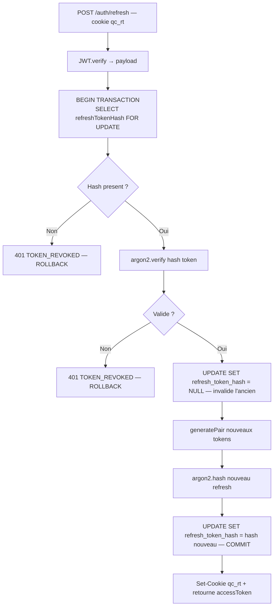

# Sécurité — QuartierConnect

> **Version** 0.2.0 · **Date** 16 avril 2026

---

## Table des matières

1. [Modèle de menaces](#1-modèle-de-menaces)
2. [Hachage des mots de passe — Argon2id](#2-hachage-des-mots-de-passe--argon2id)
3. [Authentification multifacteur — TOTP RFC 6238](#3-authentification-multifacteur--totp-rfc-6238)
4. [JWT — Access et refresh](#4-jwt--access-et-refresh)
5. [SSO — Authentification unique inter-surfaces](#5-sso--authentification-unique-inter-surfaces)
6. [Intégrité des contrats — SHA-256](#6-intégrité-des-contrats--sha-256)
7. [Limitation de débit](#7-limitation-de-débit)
8. [En-têtes de sécurité HTTP](#8-en-têtes-de-sécurité-http)
9. [Autorisation basée sur les rôles](#9-autorisation-basée-sur-les-rôles)
10. [RGPD — Protection des données](#10-rgpd--protection-des-données)
11. [Stockage des jetons — Application de bureau Java](#11-stockage-des-jetons--application-de-bureau-java)
12. [Intégrité des données — Three-Way Merge](#12-intégrité-des-données--three-way-merge)
13. [Validation des entrées — Application de bureau](#13-validation-des-entrées--application-de-bureau)
14. [Assainissement des erreurs de l'API](#14-assainissement-des-erreurs-de-lapi)
15. [Renouvellement proactif automatique des jetons](#15-renouvellement-proactif-automatique-des-jetons)

---

## 1. Modèle de menaces


```mermaid
flowchart TD
    subgraph Attaques["Vecteurs d'attaque"]
        A1["Force brute sur mot de passe"]
        A2["Rejeu de code TOTP"]
        A3["Vol de session - XSS"]
        A4["CSRF"]
        A5["Injection SQL"]
        A6["Injection NoSQL"]
        A7["Rejeu de jeton SSO"]
        A8["Elevation de privileges"]
        A9["Acces non autorise"]
        A10["Interception reseau"]
        A11["Attaque DDoS - flood"]
    end

    subgraph Mitigations["Mitigations implementees"]
        M1["Argon2id - 64Mo RAM - timeCost 3 + ThrottlerGuard 100req/15min"]
        M2["TanStack Store en memoire TTL 90s - anti-rejeu par code+secret"]
        M3["JWT access 15min + refresh cookie httpOnly SameSite=strict - table de revocation JTI PG"]
        M4["Cookie refresh httpOnly SameSite=strict + credentials:include - CSRF impossible"]
        M5["Drizzle ORM parametre - zero SQL concatene"]
        M6["Schema Mongoose strict + ValidationPipe whitelist:true"]
        M7["findOneAndUpdate atomique - usedAt non-null apres echange"]
        M8["RolesGuard relit le role depuis la BDD - aucune confiance dans le JWT seul"]
        M9["Verification de propriete createdBy === req.user.sub dans chaque controleur"]
        M10["HTTPS TLS 1.3 Caddy - HSTS - CSP stricte"]
        M11["ThrottlerGuard global 100req/15min/IP + login 5 tentatives/15min"]
    end

    A1 --> M1
    A2 --> M2
    A3 --> M3
    A4 --> M4
    A5 --> M5
    A6 --> M6
    A7 --> M7
    A8 --> M8
    A9 --> M9
    A10 --> M10
    A11 --> M11
```

| Menace | Mitigation |
|--------|-----------|
| Force brute sur mot de passe | Coût CPU/mémoire Argon2id + limitation de débit 100req/15min |
| Rejeu d'un code TOTP | Anti-rejeu en mémoire TanStack Store TTL 90s |
| Vol de session XSS | Jeton refresh dans un cookie httpOnly (inaccessible au JS) ; jeton access 15min ; JTI révocable |
| CSRF | Cookie refresh httpOnly SameSite=strict ; jeton access dans l'en-tête Authorization |
| Injection SQL | Drizzle ORM paramétré — jamais de SQL concaténé |
| Injection NoSQL | Schéma Mongoose strict ; ValidationPipe whitelist:true |
| Rejeu de jeton SSO | findOneAndUpdate atomique ; usedAt non-null après usage |
| Élévation de privilèges | RolesGuard vérifie le rôle relu depuis la BDD |
| Accès non autorisé | Vérification de propriété dans chaque contrôleur (createdBy === req.user.sub) |

---

## 2. Hachage des mots de passe — Argon2id

Argon2id (vainqueur de la Password Hashing Competition 2015) combine une résistance aux GPU (coût mémoire) et une résistance aux attaques par canaux auxiliaires. bcrypt est limité à 72 octets et ne dispose d'aucun paramètre de mémoire.

```typescript
// auth.service.ts — registration
const passwordHash = await argon2.hash(dto.password);
// Default argon2 npm parameters:
//   type: argon2id
//   memoryCost: 65536 (64 MB)
//   timeCost: 3
//   parallelism: 4

// auth.service.ts — login
const valid = await argon2.verify(user.passwordHash, dto.password);
```

Le **jeton refresh JWT est lui aussi haché** avant stockage :

```typescript
// token.service.ts
const refreshTokenHash = await argon2.hash(refreshToken);
await db.update(users).set({ refreshTokenHash });

// Verification during refresh
const isValid = await argon2.verify(user.refreshTokenHash, refreshToken);
```

Un accès en lecture à la base de données ne suffit pas à rejouer le jeton refresh.

---

## 3. Authentification multifacteur — TOTP RFC 6238

### Algorithme

```
code = HOTP(secret, floor(Unix_timestamp / 30))
HOTP(K, C) = truncate(HMAC-SHA1(K, C_bytes))
```

Le code est valide pendant 30 secondes, avec une tolérance de ±1 période (`window: 1`).

### Génération du secret (inscription)

```typescript
// totp.service.ts
const generated = speakeasy.generateSecret({
  name: `QuartierConnect:${email}`,
  issuer: 'QuartierConnect',
});
// secret.base32 → stored in PostgreSQL
// otpauth_url → returned to the client → QR code with qrcode npm
```

### Vérification avec anti-rejeu

```typescript
verify(secret: string, token: string): boolean {
  this.purgeExpiredCodes();           // clean up codes > 90s

  const key = `${secret}:${token}`;
  if (this.usedCodes.state[key] !== undefined) return false;  // REPLAY BLOCKED

  const valid = speakeasy.totp.verify({
    secret, encoding: 'base32', token,
    window: 1,          // ±30s clock tolerance
  });

  if (valid) {
    this.usedCodes.setState(prev => ({
      ...prev,
      [key]: Date.now() + 90_000,   // remember for 90s
    }));
  }
  return valid;
}
```

Même si un attaquant intercepte un code valide, une seconde utilisation dans les 30s est refusée.

---

## 4. JWT — Access et refresh

### Structure du payload

```json
{
  "sub": "550e8400-e29b-41d4-a716-446655440000",
  "email": "alice@demo.fr",
  "role": "resident",
  "jti": "unique-uuid-v4",
  "iat": 1712345678,
  "exp": 1712346578
}
```

- **jeton access** : HS256, durée de vie 15 minutes — envoyé dans l'en-tête `Authorization: Bearer`
- **jeton refresh** : HS256, durée de vie 7 jours, haché Argon2 en base de données — stocké dans un **cookie httpOnly** (`qc_rt`, SameSite=strict)

Le jeton refresh est inaccessible au JavaScript (httpOnly), ce qui élimine le principal vecteur XSS. En production, le flag `secure` est activé (HTTPS uniquement).

### Stockage côté client

| Jeton | Stockage | Accès JS |
|-------|---------|----------|
| jeton access (15min) | `localStorage` | Oui — lu pour l'en-tête `Authorization` |
| jeton refresh (7j) | cookie httpOnly `qc_rt` | Non — transparent pour le JS |

### Rotation stricte avec verrouillage transactionnel

La rotation est protégée contre les conditions de course (TOCTOU) par un `SELECT FOR UPDATE` au sein d'une transaction PostgreSQL. Deux requêtes refresh simultanées ne peuvent pas utiliser le même jeton.


```mermaid
flowchart TD
    A[POST /auth/refresh — cookie qc_rt] --> B[JWT.verify → payload]
    B --> C["BEGIN TRANSACTION<br/>SELECT refreshTokenHash FOR UPDATE"]
    C --> D{Hash present ?}
    D -->|Non| E[401 TOKEN_REVOKED — ROLLBACK]
    D -->|Oui| F[argon2.verify hash token]
    F --> G{Valide ?}
    G -->|Non| H[401 TOKEN_REVOKED — ROLLBACK]
    G -->|Oui| I[UPDATE SET refresh_token_hash = NULL — invalide l'ancien]
    I --> J[generatePair nouveaux tokens]
    J --> K[argon2.hash nouveau refresh]
    K --> L[UPDATE SET refresh_token_hash = hash nouveau — COMMIT]
    L --> M[Set-Cookie qc_rt + retourne accessToken]
```

Si un attaquant vole un jeton refresh et l'utilise, le prochain refresh de l'utilisateur légitime échoue (révocation mutuelle). Le verrou transactionnel empêche deux échanges simultanés du même jeton.

### Révocation instantanée — table `revoked_tokens`

Lors de la déconnexion (`POST /auth/logout`), le jeton access courant est révoqué immédiatement via son JTI, sans attendre son expiration naturelle.

```sql
-- api/drizzle/0001_revoked_tokens.sql
CREATE TABLE "revoked_tokens" (
  "jti" text PRIMARY KEY NOT NULL,
  "expires_at" timestamp NOT NULL
);
CREATE INDEX "revoked_tokens_expires_at_idx" ON "revoked_tokens" USING btree ("expires_at");
```

```typescript
// jwt.strategy.ts — validate()
if (payload.jti) {
  const revoked = await this.tokenService.isAccessTokenRevoked(payload.jti);
  if (revoked) throw new UnauthorizedException({ code: "TOKEN_REVOKED" });
}
```

Les entrées expirées sont purgées automatiquement à chaque appel de `revokeAccessToken()`, ce qui empêche la croissance illimitée de la table (aucun besoin de Redis ni de tâche cron).

Si un attaquant vole un jeton access valide, la déconnexion de la victime révoque le jeton avant son expiration (exposition de 15 min max au lieu de 15 min garanties).

---

## 5. SSO — Authentification unique inter-surfaces

| Propriété | Mécanisme |
|-----------|----------|
| Usage unique | findOneAndUpdate atomique — usedAt non-null après échange |
| Expiration | expiresAt = now+300s ; l'index TTL de MongoDB le supprime automatiquement |
| État PKCE | UUID v4 côté web, vérifié côté Java — empêche le CSRF |
| Entropie | Jeton UUID v4 (122 bits) — non devinable par force brute |
| Transport | HTTPS obligatoire en production ; deep link app:// en dev |

---

## 6. Intégrité des contrats — SHA-256

### Hash du contenu

```typescript
const hash = crypto.createHash('sha256').update(dto.content).digest('hex');
// Stored as contentHash at creation time
```

### Hash de signature individuel

```typescript
const hash = crypto
  .createHash('sha256')
  .update(contract.content + userId + new Date().toISOString())
  .digest('hex');
// Includes: content + identity + timestamp — non-repudiable proof
```

La signature TOTP obligatoire prouve la présence physique au moment de la signature (authentification forte).

---

## 7. Limitation de débit

```typescript
// app.module.ts
ThrottlerModule.forRoot([{ ttl: 900000, limit: 100 }])
// 100 requests per IP over 15 minutes — applied globally
providers: [{ provide: APP_GUARD, useClass: ThrottlerGuard }]
```

Routes avec limitation spécifique :

| Route | Limite | Fenêtre | Raison |
|-------|--------|---------|--------|
| `POST /auth/login` | 5 tentatives | 15 min | Anti-force brute (TOTP + mot de passe) |
| `POST /auth/refresh` | 10 requêtes | 60 s | Limiter la rotation abusive |

---

## 8. En-têtes de sécurité HTTP

Helmet.js appliqué à toutes les réponses, avec une CSP par route (Caddy + NestJS) :

| En-tête | Protection |
|--------|-----------|
| `Content-Security-Policy` | Restreint scripts/styles/images — mitigation XSS |
| `X-Content-Type-Options: nosniff` | Sniffing MIME |
| `X-Frame-Options: DENY` | Clickjacking |
| `Strict-Transport-Security` | Rétrogradation HTTPS → HTTP |
| `X-XSS-Protection: 1; mode=block` | XSS navigateurs legacy |

**CSP par route** — `'unsafe-inline'` retiré des routes client, admin et API. Seules les routes `/docs` et `/scalar` (Scalar UI) conservent `'unsafe-inline'` dans `script-src`, car cette UI tierce l'exige. Les applications React utilisent des nonces implicites via Vite.

---

## 9. Autorisation basée sur les rôles

```
resident → moderator → admin
                              banned (terminal — login refuse)
```

| Rôle | Permissions clés |
|------|-----------------|
| `resident` | Créer des incidents/services/événements, points, votes, messagerie |
| `moderator` | + Changer le statut des incidents, modérer le contenu |
| `admin` | + Gérer les utilisateurs, quartiers, statistiques, DSL |
| `banned` | Aucune — 401 à la connexion |

Le rôle est revérifié en base de données à chaque refresh — un bannissement prend effet immédiatement.

---

## 10. RGPD — Protection des données

### Export des données personnelles

```
GET /me/export → full JSON archive
```

Inclut : profil, incidents, services, événements, contrats, points, conversations.
N'inclut jamais : passwordHash, totpSecret, refreshTokenHash.

### Suppression de compte

1. Soft delete des incidents (rétention pour modération)
2. Révocation du jeton refresh (déconnexion immédiate)
3. Suppression du nœud Neo4j `deleteNode('User', id)`

---

## 11. Stockage des jetons — Application de bureau Java

### Problème traité

Avant la v0.1.6, les jetons access et refresh étaient stockés en clair dans `quartierconnect.db` (SQLite) avec des permissions de fichier `644` (lisibles par tous les utilisateurs du système). Un attaquant local pouvait lire le jeton refresh en une seule commande et détourner la session pendant 7 jours sans connaître le mot de passe ni le code TOTP.

### Solution — TokenVault (trousseau de l'OS)

Le service `TokenVault` utilise `java-keyring` pour déléguer le stockage des jetons au trousseau du système :

| OS | Backend | Mécanisme |
|----|---------|-----------|
| Linux | SecretService (gnome-keyring / KWallet) | D-Bus `org.freedesktop.Secret` |
| macOS | macOS Keychain | Security.framework |
| Windows | Credential Manager | DPAPI |

Les jetons sont chiffrés par l'OS, accessibles uniquement à l'utilisateur courant, et ne transitent jamais en clair sur le disque.

```java
// Save after login/refresh
TokenVault.getInstance().saveTokens(accessToken, refreshToken);

// Load at startup (resumes the session without network)
TokenVault.TokenPair pair = TokenVault.getInstance().loadTokens();

// Removal on logout
TokenVault.getInstance().clearTokens();
```

### Données restantes dans SQLite

La table `session` ne conserve désormais que l'**email** (pour afficher l'identité en mode hors ligne). Aucun secret n'est stocké sur le disque.

| Colonne | Contenu | Sensibilité |
|---------|---------|-------------|
| `email` | Adresse email | Faible |
| `saved_at` | Horodatage de la dernière connexion | Aucune |

### Repli hors trousseau

Si aucun trousseau OS n'est disponible (serveur headless, CI, test), `TokenVault` conserve les jetons **en mémoire uniquement**. Ils ne survivent pas à un redémarrage. L'utilisateur devra se reconnecter, mais aucun jeton n'est jamais écrit en clair.

### Migration des bases existantes

`SQLiteDatabase.initialize()` supprime automatiquement les colonnes `access_token` et `refresh_token` des bases antérieures à la v0.1.6 via `ALTER TABLE session DROP COLUMN`. La migration est idempotente.

---

## 12. Intégrité des données — Three-Way Merge

### Problème traité

La synchronisation bidirectionnelle entre SQLite (bureau) et PostgreSQL (API) exposait un risque de perte de données silencieuse. Avec le mécanisme Last-Writer-Wins (LWW), une modification locale pouvait être écrasée par une modification serveur sans avertissement.

### Solution — Three-Way Merge avec détection de conflits

Le `ThreeWayMerger` compare trois versions de chaque champ (title, description, status) :

- **Base** (ancêtre commun) : dernière version synchronisée, stockée localement après chaque push/pull réussi
- **Local** : version courante dans SQLite
- **Remote** : version reçue du serveur

Lorsque les deux côtés ont modifié le même champ différemment (par rapport à la base), un **conflit explicite** est déclaré (`is_conflict=1`). L'incident est exclu de `listDirty()` pour éviter de pousser des données incohérentes. L'utilisateur doit le résoudre manuellement via la modale de fusion (GridPane à 4 colonnes avec mise en évidence des différences).

Le LWW reste utilisé en repli uniquement lorsqu'aucun ancêtre n'est disponible (première synchronisation d'un incident).

### Suppression par tombstone

Les suppressions côté serveur sont propagées via `tombstoneOrphans()`, qui marque les incidents absents du serveur avec `deleted_at`. Cette approche empêche la résurrection des incidents supprimés au prochain push.

---

## 13. Validation des entrées — Application de bureau

Les champs de saisie de l'application de bureau sont validés côté client avant d'être envoyés à l'API :

| Champ | Limite | Raison |
|-------|--------|--------|
| Titre d'incident | 200 caractères max | Prévention des injections longues / payload DoS |
| Description d'incident | 2000 caractères max | Cohérence avec les limites de l'API |

La validation empêche la soumission de données malformées qui seraient rejetées par l'API, améliorant l'expérience utilisateur et réduisant le trafic réseau inutile.

---

## 14. Assainissement des erreurs de l'API

### Problème traité

Avant cette version, les messages d'erreur HTTP de `ApiService` incluaient le corps de la réponse du serveur. Un message d'erreur mal filtré pouvait exposer des détails internes (traces de pile, noms de tables, chemins de fichiers) dans les logs ou dans l'UI.

### Solution

La méthode `execute()` de `ApiService` ne fait plus remonter le corps de la réponse dans les exceptions. Seuls le code HTTP et une description générique sont inclus dans le message d'erreur. Le corps de la réponse n'est disponible que comme valeur de retour de la méthode en cas de succès.

Les logs SSO sont également assainis : les jetons et identifiants ne sont plus affichés en clair dans les messages de log.

---

## 15. Renouvellement proactif automatique des jetons

### Problème traité

Le renouvellement du jeton access n'était déclenché qu'après un échec 401. Pendant l'intervalle entre l'expiration et la nouvelle tentative, les requêtes en cours échouaient, provoquant des erreurs transitoires dans l'UI.

### Solution

`AuthService.parseJwtPayload()` extrait le champ `exp` du jeton JWT (décodage Base64 du payload, sans vérification de signature côté client). Lorsque le jeton expire dans moins de 60 secondes, un renouvellement proactif est déclenché avant la prochaine requête API. Ce seuil suffit à couvrir la latence réseau et le temps de traitement serveur.
