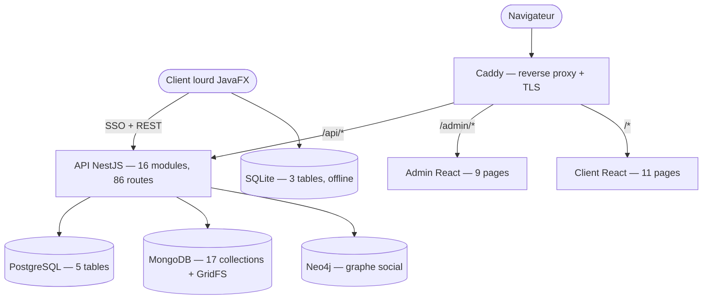

# Document de synthèse — QuartierConnect

## *Voisins, services et bonne humeur*

|                 |                                                          |
| --------------- | -------------------------------------------------------- |
| **Projet**      | QuartierConnect — plateforme collaborative de quartier   |
| **Groupe**      | 1 — 3AL2                                                  |
| **Encadrant**   | Frédéric SANANES                                          |
| **Établissement** | ESGI — année 2025-2026                                  |

---

## Table des matières

1. [Contexte et objectifs](#1-contexte-et-objectifs)
2. [Démarche de réalisation](#2-démarche-de-réalisation)
3. [Architecture logicielle et justification des choix](#3-architecture-logicielle-et-justification-des-choix)
4. [Répartition du travail par membre](#4-répartition-du-travail-par-membre)
5. [Analyse critique et objective](#5-analyse-critique-et-objective)

---

## 1. Contexte et objectifs

QuartierConnect est une plateforme collaborative destinée aux habitants d'un
quartier résidentiel, développée autour du thème *« Voisins, services et bonne
humeur »*. Elle vise à recréer numériquement l'entraide de voisinage : rendre
des services entre voisins, signaler des incidents, participer à la vie locale
(événements, votes) et échanger des points qui matérialisent un crédit de
service.

Le produit se décline sur **trois surfaces** complémentaires :

| Surface           | Public cible      | Rôle principal                                                        |
| ----------------- | ----------------- | -------------------------------------------------------------------- |
| Client React (:3000) | Habitants       | Services, événements, votes, incidents, messagerie, points, contrats |
| Admin React (:3001)  | Administrateurs | Gestion des utilisateurs, quartiers, modération, DSL, statistiques   |
| Client lourd JavaFX  | Administrateurs | Gestion des incidents **hors-ligne** (offline-first) via SQLite      |

Ces surfaces s'appuient sur une **API NestJS** unique exposant **86 routes**
réparties en **16 modules** fonctionnels, et sur une persistance **polyglotte**
(PostgreSQL, MongoDB, Neo4j côté serveur ; SQLite embarquée côté client lourd).

Les objectifs fonctionnels couverts par le rendu final sont :

- authentification forte à double facteur (TOTP) et SSO inter-surfaces ;
- gestion complète des services, réservations et contrats signés
  cryptographiquement ;
- cycle de vie des incidents avec synchronisation hors-ligne bidirectionnelle ;
- vie de quartier : événements, votes simples et scrutins communautaires ;
- messagerie temps réel et recommandations sociales sur graphe ;
- modélisation géographique des quartiers (polygones GeoJSON) ;
- conformité RGPD (consentement, export, suppression) ;
- langage de requête maison (DSL) pour l'administration.

---

## 2. Démarche de réalisation

### 2.1 Méthodologie de versionnement

Le projet a été mené sous **Git** avec **414 commits** au moment du rendu. Le
flux de travail repose sur deux branches longues (`main` pour les jalons stables,
`develop` pour l'intégration continue) et des branches de fonctionnalité
fusionnées par *pull request*. Les messages de commit suivent la convention
*Conventional Commits* (`feat`, `fix`, `test`, `chore`, `docs`), ce qui rend
l'historique lisible et exploitable pour retracer le déroulé du projet.

Extrait représentatif de l'historique récent :

```
feat(build): installeur one-shot make setup + archive de rendu make dist
feat(livrables): jeux d'essai texte (démo + vide) pour les 3 bases + import idempotent
feat(admin): refonte visuelle et correctifs QA
feat(api): TOTP-gated password/email/phone changes, register consent, extended GDPR export
feat(client): PDF import dialog with drag-and-drop signature/initials zone placement
```

### 2.2 Étapes du syllabus

Le développement a suivi les jalons du syllabus, chaque étape apportant un
incrément fonctionnel livrable et testé :

| Étape    | Cible   | Contenu livré                                                                                  |
| -------- | ------- | --------------------------------------------------------------------------------------------- |
| Étape 2  | 30 %    | Authentification (register, login 2FA, refresh, logout), SSO PKCE web → desktop, CRUD backend, infrastructure Docker |
| Étape 3  | 60 %    | Tous les modules métier exposés et documentés (Scalar), pages React branchées sur données réelles, synchronisation bidirectionnelle du client lourd, modélisation géographique |
| Rendu final | 95 % | Back-office admin complet, système de plugins et thèmes du client lourd, DSL PLY, MFA sur opérations sensibles, RGPD complet, jeux d'essai et installeur |

Ce déroulé est documenté en détail dans les rapports d'étape
`docs/RAPPORT-ETAPE2.md` et `docs/RAPPORT-ETAPE3.md`, qui consignent l'état
d'avancement, les cas d'usage et les diagrammes à chaque jalon.

### 2.3 Tests en continu

La stratégie de test est transverse et exécutée en continu. Le rendu final
totalise **1120 tests** répartis sur toutes les technologies du projet :

| Suite                        | Nombre | Outillage                          |
| ---------------------------- | ------ | ---------------------------------- |
| Unitaires API                | 527    | Jest (46 fichiers `.spec.ts`)      |
| E2E API                      | 173    | Supertest (13 fichiers `.e2e-spec.ts`, bases réelles) |
| Web (composants / hooks)     | 147    | Vitest                             |
| E2E Web                      | 94     | Playwright (21 fichiers)           |
| Client lourd                 | 158    | JUnit (21 classes)                 |
| DSL                          | 21     | pytest                             |
| **Total**                    | **1120** | —                                |

Le principe directeur des tests E2E API est l'absence de *mock* sur les bases :
les scénarios s'exécutent sur de vraies instances MongoDB et PostgreSQL,
alimentées via l'API. Une cible `make validate` enchaîne lint, typage, tests et
build pour valider une livraison de bout en bout.

### 2.4 Conteneurisation et reproductibilité

L'ensemble de l'infrastructure serveur est **conteneurisée** (Docker Compose) :
reverse-proxy Caddy, API NestJS, PostgreSQL, MongoDB, Neo4j et les deux fronts
React. Un installeur *one-shot* `make setup` reconstruit l'environnement
complet à partir de zéro en environ **49 secondes**. Deux jeux d'essai
reproductibles sont fournis — `jeu-demo` (données de démonstration) et
`jeu-vide` (bases initialisées mais vides) — importés de façon **idempotente**
par le script `import-dataset.sh`, garantissant une évaluation dans des
conditions maîtrisées.

---

## 3. Architecture logicielle et justification des choix

### 3.1 API NestJS modulaire

L'API est structurée en **16 modules** NestJS à responsabilité unique (auth,
users, services, bookings, contracts, incidents, points, events, votes,
community-votes, messaging, neighborhoods, geocoding, dsl, social/recommendations,
santé/statistiques). Ce découpage tire parti de l'injection de dépendances, des
*guards* (JWT, rôles, *throttler*) et des décorateurs de NestJS pour isoler la
logique métier et sécuriser chaque route de façon déclarative. La documentation
d'API est exposée en direct via Scalar (`GET /docs`).

### 3.2 Persistance polyglotte : trois bases spécialisées + SQLite

Chaque base est choisie pour ses forces propres plutôt que par uniformité :

| Base           | Périmètre                                        | Justification                                                                 |
| -------------- | ------------------------------------------------ | ---------------------------------------------------------------------------- |
| **PostgreSQL** (5 tables) | users, incidents, points_balances, points_transactions, revoked_tokens | ACID natif : les transferts de points exigent une transaction avec verrou de ligne (`SELECT ... FOR UPDATE`) et une contrainte `CHECK` sur le solde, garanties au niveau moteur |
| **MongoDB** (17 collections) | services, contracts, conversations, messages, events, votes, neighborhoods, documents… + GridFS | Documents flexibles et géospatiaux (polygones GeoJSON, index `2dsphere`), index TTL pour les jetons SSO, stockage binaire (PDF, avatars, pièces jointes) via GridFS |
| **Neo4j**      | graphe social (labels User, Neighborhood, Service, Event ; relations LIVES_IN, LOCATED_IN, HELD_IN, INTERESTED_IN, HELPED) | Les recommandations sociales sont des parcours de graphe : une seule requête Cypher remplace plusieurs jointures récursives SQL |
| **SQLite** (3 tables : incidents, sync_log, session) | cache offline du client lourd | Embarquée, sans dépendance réseau : miroir local des incidents avec drapeau de synchronisation pour le mode hors-ligne |

### 3.3 Client lourd offline-first et extensible

Le client JavaFX fonctionne **hors-ligne** : les incidents sont créés
localement dans SQLite puis synchronisés vers l'API selon une stratégie
*Last-Write-Wins* fondée sur `updated_at`. Un `SyncService` sonde
périodiquement la disponibilité de l'API et bascule un indicateur en ligne /
hors-ligne. L'application est **extensible par plugins** : un registre
(`PluginRegistry`) et un bus d'événements chargent des plugins autonomes —
export, thème, mode compact, mode hors-ligne, notifications et packs de langue —
sans modifier le cœur applicatif, illustrant le principe ouvert/fermé.

### 3.4 SSO inter-surfaces et sécurité MFA / RGPD

L'authentification unifiée repose sur un **SSO PKCE** permettant au client lourd
de récupérer une session en déléguant l'authentification au navigateur, avec
jeton à usage unique atomique (index TTL MongoDB, `findOneAndUpdate`). La
sécurité s'appuie sur un double facteur **TOTP** (RFC 6238) requis à la connexion
et sur les opérations sensibles (changement de mot de passe, d'e-mail, de
téléphone, signature de contrat), un hachage argon2id des mots de passe et
jetons de rafraîchissement, une rotation complète des *refresh tokens* et une
liste de jetons révoqués. Le volet **RGPD** couvre le consentement à
l'inscription, l'export des données personnelles et le flux de suppression de
compte.

### 3.5 DSL maison (lex/yacc)

Un **langage de requête dédié** est implémenté en Python avec PLY (Python
Lex-Yacc) : un lexer et un parser analysent la syntaxe d'un langage
d'interrogation maison, dont le compilateur est invoqué depuis NestJS via un
pont Python↔Node (`POST /dsl/query`). Un éditeur DSL est intégré au back-office
admin.

### 3.6 Vue d'ensemble



---

## 4. Répartition du travail par membre

> Le tableau ci-dessous fixe la structure de la répartition. Les noms et le
> détail des contributions sont à renseigner par l'équipe : cette information
> n'est pas déductible du code seul et n'est donc pas préremplie ici.

| Membre    | Modules / responsabilités principales | Contributions transverses (tests, doc, CI) |
| --------- | ------------------------------------- | ------------------------------------------- |
| Membre 1  | [À COMPLÉTER PAR L'ÉQUIPE]             | [À COMPLÉTER PAR L'ÉQUIPE]                   |
| Membre 2  | [À COMPLÉTER PAR L'ÉQUIPE]             | [À COMPLÉTER PAR L'ÉQUIPE]                   |
| Membre 3  | [À COMPLÉTER PAR L'ÉQUIPE]             | [À COMPLÉTER PAR L'ÉQUIPE]                   |

> Repères pour le remplissage (grands ensembles techniques identifiables dans le
> dépôt, à attribuer par l'équipe) : API NestJS et bases de données ; fronts
> React (client / admin) et composants partagés ; client lourd JavaFX
> (synchronisation, plugins, thèmes) ; DSL Python ; sécurité (MFA, SSO, RGPD) ;
> infrastructure Docker, installeur et jeux d'essai ; stratégie de tests.

---

## 5. Analyse critique et objective

### 5.1 Points forts

- **Couverture de tests élevée et transverse.** Les 1120 tests couvrent les six
  technologies du projet, avec des tests E2E API exécutés sur de vraies bases
  (sans *mock*), ce qui offre une confiance d'intégration réelle et non
  seulement unitaire.
- **Offline-first assumé de bout en bout.** Le client lourd reste pleinement
  utilisable sans réseau et réconcilie ses données via une stratégie
  *Last-Write-Wins* explicite, ce qui répond concrètement à une contrainte
  souvent traitée superficiellement.
- **Sécurité soignée.** TOTP à la connexion et sur les opérations sensibles,
  argon2id, rotation des *refresh tokens*, jetons SSO à usage unique atomiques,
  et prise en compte du RGPD (consentement, export, suppression) forment un
  ensemble cohérent plutôt qu'une addition de mesures isolées.
- **DSL maison réellement fonctionnel.** L'implémentation lex/yacc (PLY) avec
  pont vers NestJS et éditeur intégré dépasse le simple prototype et démontre la
  maîtrise de l'analyse lexicale et syntaxique.
- **Extensibilité par plugins.** Le système de plugins du client lourd
  (registre + bus d'événements) permet d'ajouter des comportements sans toucher
  au cœur, une architecture propre et démontrable.
- **Reproductibilité de l'évaluation.** Installeur `make setup` en ~49 s et jeux
  d'essai idempotents (`jeu-demo`, `jeu-vide`) garantissent une mise en route
  fiable pour le jury.

### 5.2 Limites et dette technique assumées

- **Filtrage admin côté client sur données paginées.** Certaines vues
  d'administration (par exemple la liste des incidents, chargée par pagination
  incrémentale) appliquent une partie du filtrage côté client sur les pages déjà
  récupérées. Le résultat n'est donc pas garanti exhaustif sur l'ensemble du jeu
  de données tant que toutes les pages ne sont pas chargées ; une délégation
  complète du filtre et de la recherche au serveur serait préférable.
- **Découpage de gros composants.** Des composants comme la vue des incidents
  admin concentrent beaucoup de responsabilités dans un même fichier (de l'ordre
  de plusieurs centaines de lignes mêlant liste, carte, dialogues et mutations).
  Un découpage en sous-composants améliorerait la lisibilité et la testabilité.
- **Accessibilité perfectible.** Plusieurs boîtes de dialogue ne fournissent pas
  systématiquement de description accessible, ce qui laisse une marge de
  progression sur la conformité aux bonnes pratiques d'accessibilité.
- **Internationalisation à consolider.** L'i18n (FR/EN) est en place mais reste
  perfectible à certains endroits, avec des libellés susceptibles d'être encore
  homogénéisés.

### 5.3 Pistes d'amélioration

- Déporter recherche, tri et filtrage des vues d'administration entièrement
  côté API, avec pagination serveur cohérente.
- Extraire les gros composants de vue en sous-composants dédiés (liste, carte,
  dialogues, actions) pour réduire leur surface et faciliter les tests.
- Compléter les attributs d'accessibilité manquants (descriptions de dialogues,
  libellés) et mener un audit a11y ciblé.
- Poursuivre l'homogénéisation des clés d'internationalisation et vérifier la
  couverture FR/EN de bout en bout.

### 5.4 Bilan

Le projet livre un socle fonctionnel large et cohérent, appuyé sur une
architecture polyglotte justifiée, une sécurité travaillée et une couverture de
tests conséquente. Les limites identifiées relèvent principalement de la
finition (organisation de certains composants, accessibilité, filtrage
serveur) plutôt que de défauts structurels, et constituent des axes
d'amélioration clairs et réalistes.
