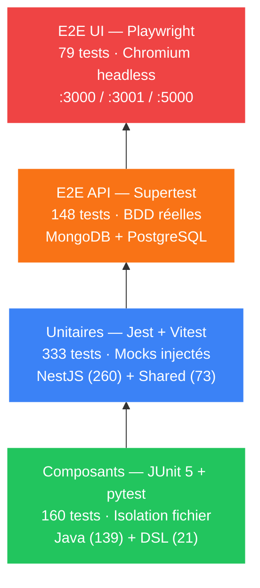

# Rapport QA — QuartierConnect Étape 4

> **Date** 16 avril 2026 · **Version** 0.2.0 · **Total** 720 tests automatisés · **Résultat** 720/720 ✓

---

## Table des matières

- [Rapport QA — QuartierConnect Étape 4](#rapport-qa--quartierconnect-étape-4)
  - [Table des matières](#table-des-matières)
  - [1. Vue d'ensemble](#1-vue-densemble)
  - [2. Tests unitaires API — NestJS/Jest](#2-tests-unitaires-api--nestjsjest)
    - [Couverture par module](#couverture-par-module)
    - [Exemples de cas de test clés](#exemples-de-cas-de-test-clés)
  - [3. Tests unitaires Web — Vitest shared hooks](#3-tests-unitaires-web--vitest-shared-hooks)
    - [Exemple de cas de test](#exemple-de-cas-de-test)
  - [4. Tests E2E API — Supertest](#4-tests-e2e-api--supertest)
    - [Fichiers](#fichiers)
    - [Stratégie E2E](#stratégie-e2e)
    - [Cas E2E clés (auth)](#cas-e2e-clés-auth)
  - [5. Tests unitaires Java — JUnit 5](#5-tests-unitaires-java--junit-5)
    - [Cas offline clés](#cas-offline-clés)
  - [6. Tests DSL — pytest](#6-tests-dsl--pytest)
    - [Cas de test DSL](#cas-de-test-dsl)
  - [7. Tests E2E Web — Playwright](#7-tests-e2e-web--playwright)
  - [8. Coverage API](#8-coverage-api)
  - [9. Architecture des tests](#9-architecture-des-tests)
    - [Isolation SQLite en tests Java](#isolation-sqlite-en-tests-java)
  - [10. Stratégie de test par composant](#10-stratégie-de-test-par-composant)
    - [API — ce qui est toujours testé dans chaque controller](#api--ce-qui-est-toujours-testé-dans-chaque-controller)
    - [Points — cas aux limites testés](#points--cas-aux-limites-testés)
    - [Contrats — flow complet testé](#contrats--flow-complet-testé)
    - [CommunityVotes — types de scrutin testés](#communityvotes--types-de-scrutin-testés)
    - [Commandes](#commandes)

---

## 1. Vue d'ensemble

| Composant              | Framework                | Tests   | Résultat      |
| ---------------------- | ------------------------ | ------- | ------------- |
| API NestJS — unitaires | Jest                     | 260     | 260/260 ✓     |
| Web shared hooks       | Vitest                   | 73      | 73/73 ✓       |
| API NestJS — E2E       | Jest + Supertest         | 148     | 148/148 ✓     |
| Java Desktop           | JUnit 5 + Maven Surefire | 139     | 139/139 ✓     |
| DSL Python             | pytest                   | 21      | 21/21 ✓       |
| Web Playwright         | Playwright               | 79      | 79/79 ✓       |
| **TOTAL**              |                          | **720** | **720/720 ✓** |

> Note : les 148 tests E2E nécessitent MongoDB + PostgreSQL (make docker-up). Les 79 tests Playwright nécessitent les apps sur :3000/:3001/:5000.



---

## 2. Tests unitaires API — NestJS/Jest

**260 tests · 30 suites · 0 échec**

### Couverture par module

| Suite                              | Tests | Ce qui est testé                                                                                                                                 |
| ---------------------------------- | ----- | ------------------------------------------------------------------------------------------------------------------------------------------------ |
| `auth.service.spec.ts`             | 14    | register, login, SSO generate/exchange, argon2, TOTP                                                                                             |
| `auth.controller.spec.ts`          | 12    | Routes HTTP, codes d'erreur, DTOs, cookie qc_rt set/clear, refresh cookie+body                                                                   |
| `token.service.spec.ts`            | 12    | generatePair, rotateRefreshToken (transaction FOR UPDATE), revokeAccessToken, isAccessTokenRevoked                                               |
| `totp.service.spec.ts`             | 6     | verify, anti-replay, purgeExpiredCodes, generateSecret                                                                                           |
| `jwt.strategy.spec.ts`             | 8     | validate payload valide/invalide/rôle, TOKEN_REVOKED (JTI), skip JTI check absent, null payload                                                  |
| `roles.guard.spec.ts`              | 5     | admin/resident/moderator/banned/sans rôle                                                                                                        |
| `neighborhoods.controller.spec.ts` | 8     | CRUD + GeoJSON + SocialService mock                                                                                                              |
| `neighborhoods.service.spec.ts`    | 6     | assertNoOverlap, geoIntersects, conflicts                                                                                                        |
| `services.controller.spec.ts`      | 11    | CRUD, ownership, filters, SocialService                                                                                                          |
| `events.controller.spec.ts`        | 7     | CRUD, markInterest, SocialService                                                                                                                |
| `incidents.controller.spec.ts`     | 12    | CRUD, machine d'états, soft delete, sync                                                                                                         |
| `points.service.spec.ts`           | 11    | transfer ACID, balance, history, MIN_BALANCE=-10                                                                                                 |
| `points.controller.spec.ts`        | 5     | GET balance, GET history, POST transfer                                                                                                          |
| `users.controller.spec.ts`         | 6     | list, ban, role update, stats                                                                                                                    |
| `me.controller.spec.ts`            | 8     | export RGPD, profil, delete account                                                                                                              |
| `contracts.service.spec.ts`        | 10    | create, sign, TOTP validation, SHA-256, workflow                                                                                                 |
| `contracts.controller.spec.ts`     | 7     | routes, accès, création                                                                                                                          |
| `messaging.service.spec.ts`        | 8     | conversations, messages, participants                                                                                                            |
| `messaging.controller.spec.ts`     | 5     | routes REST, pagination                                                                                                                          |
| `messaging.gateway.spec.ts`        | 10    | WebSocket connect (auto-join), join, send, disconnect                                                                                            |
| `votes.service.spec.ts`            | 9     | cast, toggle, getScore, strategies                                                                                                               |
| `votes.controller.spec.ts`         | 5     | allowedTypes, score, strategy factory                                                                                                            |
| `community-votes.service.spec.ts`  | 12    | create, cast, results, quorum, close, types                                                                                                      |
| `documents.service.spec.ts`        | 5     | upload, download, audit log                                                                                                                      |
| `documents.controller.spec.ts`     | 4     | routes, accès                                                                                                                                    |
| `social.service.spec.ts`           | 26    | sync* + retry backoff + exhaustion, isRetriable (ServiceUnavailable/SessionExpired), deleteNode union type, recordEventInterest, recommendations |
| `social.controller.spec.ts`        | 4     | GET /recommendations                                                                                                                             |
| `dsl.service.spec.ts`              | 8     | bridge Python, collections, erreurs                                                                                                              |
| `dsl.controller.spec.ts`           | 5     | POST /dsl/query, erreurs syntaxe                                                                                                                 |
| `app.controller.spec.ts`           | 5     | GET /health, version, uptime                                                                                                                     |

### Exemples de cas de test clés

```typescript
// Rotation de token avec révocation mutuelle
it('throws TOKEN_REVOKED when hash is null (already used)', async () => {
  mockDb.where.mockResolvedValue([{ ...mockUser, refreshTokenHash: null }]);
  await expect(service.rotateRefreshToken('rt')).rejects.toThrow(UnauthorizedException);
});

// Anti-replay TOTP
it('rejects replayed TOTP code within 90s window', () => {
  jest.spyOn(speakeasy.totp, 'verify').mockReturnValue(true);
  expect(service.verify('SECRET', '123456')).toBe(true);   // 1ère utilisation OK
  expect(service.verify('SECRET', '123456')).toBe(false);  // Replay bloqué
});

// Transaction ACID avec balance minimum
it('throws BadRequestException when balance would go below -10', async () => {
  mockDb.execute.mockResolvedValue([{ balance: -8 }]);
  await expect(service.transfer('sender', { recipientId: 'r', amount: 5 }))
    .rejects.toThrow(BadRequestException);
});

// Vote toggle
it('removes vote when same type cast again', async () => {
  voteModel.findOne.mockResolvedValue({ voteType: 'up', deleteOne: jest.fn() });
  const result = await service.cast({ targetType: 'incident', voteType: 'up' }, 'user');
  expect(result.action).toBe('removed');
});
```

---

## 3. Tests unitaires Web — Vitest shared hooks

**73 tests · 14 hooks · 0 échec**

Ces tests couvrent le package `packages/shared` du monorepo web. Ils valident les hooks TanStack Query, les utilitaires API, la gestion des tokens et le refresh silencieux.

| Hook / Utilitaire     | Tests | Ce qui est testé                                              |
| --------------------- | ----- | ------------------------------------------------------------- |
| `useAuth`             | 6     | login, logout, register, état connexion, rôle, token persisté |
| `useIncidents`        | 5     | list, create, patch, delete, invalidation cache               |
| `useServices`         | 5     | list, create, patch, delete, filtre quartier                  |
| `useEvents`           | 5     | list, create, patch, delete, markInterest                     |
| `useNeighborhoods`    | 4     | list, create, patch, delete                                   |
| `useContracts`        | 5     | list, create, sign, status, 403 non-signataire                |
| `useVotes`            | 4     | cast up/down, toggle, score                                   |
| `useCommunityVotes`   | 5     | create, cast, results, close, types                           |
| `usePoints`           | 4     | balance, transfer, history, error MIN                         |
| `useMessages`         | 5     | conversations, messages, send, read, paginate                 |
| `useDocuments`        | 3     | upload, download, list                                        |
| `useMe`               | 4     | profil, export RGPD, delete, update                           |
| `apiPost / apiGet`    | 4     | Bearer header, retry 401, refresh silencieux                  |
| `ensureAuthenticated` | 4     | redirect si non-auth, pass si auth, rôle admin                |

### Exemple de cas de test

```typescript
// packages/shared/src/lib/__tests__/useAuth.test.ts
it('refreshes token silently when 401 is received', async () => {
  server.use(
    http.get('/api/me', ({ request }) => {
      const auth = request.headers.get('Authorization');
      return auth?.includes('expired') ? new HttpResponse(null, { status: 401 }) : HttpResponse.json(mockUser);
    }),
  );
  const { result } = renderHook(() => useAuth(), { wrapper });
  await waitFor(() => expect(result.current.user).toEqual(mockUser));
});
```

---

## 4. Tests E2E API — Supertest

**148 tests · 10 fichiers · Bases de données réelles**

### Fichiers

| Fichier                     | Tests | Modules couverts                                                                 |
| --------------------------- | ----- | -------------------------------------------------------------------------------- |
| `auth.e2e-spec.ts`          | 15    | register, login (valid/invalid/banned), rate-limit, refresh, logout, SSO         |
| `api.e2e-spec.ts`           | 44    | neighborhoods, services, events, incidents, points, users, contracts, votes, DSL |
| `contracts.e2e-spec.ts`     | 15    | create, sign, TOTP validation, list                                              |
| `messaging-ws.e2e-spec.ts`  | 21    | WebSocket connect, join, send, broadcast, disconnect                             |
| `modules.e2e-spec.ts`       | 40    | community-votes, documents, social, DSL, me                                      |
| `neighborhoods.e2e-spec.ts` | 15    | CRUD, GeoJSON, overlap detection                                                 |
| `points.e2e-spec.ts`        | 12    | transfer ACID, balance, history                                                  |
| `rgpd.e2e-spec.ts`          | 8     | export RGPD, account deletion                                                    |
| `social.e2e-spec.ts`        | 4     | recommendations, Neo4j nodes                                                     |
| `app.e2e-spec.ts`           | 2     | GET /health, version                                                             |

### Stratégie E2E

- `beforeAll` : seed via API uniquement (pas de mock BDD)
- Base MongoDB dédiée : `quartierconnect-test`
- Base PostgreSQL dédiée : `quartierconnect_test`
- Nettoyage automatique après chaque suite

### Cas E2E clés (auth)

```typescript
it('POST /auth/login rejects wrong TOTP', async () => {
  const res = await request(app.getHttpServer())
    .post('/auth/login')
    .send({ email: 'alice@demo.fr', password: 'Demo1234!', totpCode: '000000' });
  expect(res.status).toBe(401);
  expect(res.body.code).toBe('INVALID_TOTP');
});

it('POST /auth/login is rate-limited after 5 attempts', async () => {
  for (let i = 0; i < 5; i++) {
    await request(app.getHttpServer()).post('/auth/login').send(badCreds);
  }
  const res = await request(app.getHttpServer()).post('/auth/login').send(badCreds);
  expect(res.status).toBe(429);
});
```

---

## 5. Tests unitaires Java — JUnit 5

**139 tests · 19 classes · 0 échec**

| Classe                     | Tests | Ce qui est testé                                                                                                                                                          |
| -------------------------- | ----- | ------------------------------------------------------------------------------------------------------------------------------------------------------------------------- |
| `SQLiteSessionTest`        | 5     | saveSession, loadSession, overwrite, clearSession, idempotent init                                                                                                        |
| `IncidentRepositoryTest`   | 11    | queryList/countWhere (DRY), tombstone delete (deleted_at), tombstoneOrphans, updateBase, merge remote-only, conflit flagué, résolution conflit, listDirty exclut conflits |
| `AuthServiceOfflineTest`   | 13    | tryResume, refresh, isTokenExpired, getCurrentUserEmail offline                                                                                                           |
| `ApiServiceOfflineTest`    | 2     | isReachable() sur connexion refusée / hostname inconnu                                                                                                                    |
| `AuthServiceTest`          | 6     | login, exchangeSsoToken, clearSession, applyTokens, parseJwtPayload                                                                                                       |
| `SsoCallbackServerTest`    | 7     | démarrage, écoute callback, état valide/invalide, timeout                                                                                                                 |
| `SyncServiceTest`          | 8     | start/stop lifecycle, idempotence, post-shutdown stop, listener enregistré, statut offline, justPushed race condition fix, orphan cleanup                                 |
| `ThreeWayMergerTest`       | 29    | null base → LWW remote, pas de changement → local, local-only, remote-only, même changement, conflit vrai, cas limites multiples                                          |
| `ContractsServiceTest`     | 4     | list, create, sign, findOne                                                                                                                                               |
| `EventsServiceTest`        | 4     | list, findOne, create, interest                                                                                                                                           |
| `NeighborhoodsServiceTest` | 3     | list, findOne, create                                                                                                                                                     |
| `ServicesServiceTest`      | 4     | list, findOne, create, filter                                                                                                                                             |
| `StatisticsServiceTest`    | 5     | fetchStats, parseResponse, offline fallback                                                                                                                               |
| `UpdateServiceTest`        | 5     | checkUpdate, versionParsing, skip, apply                                                                                                                                  |
| `VotesServiceTest`         | 4     | cast, toggle, getScore, strategies                                                                                                                                        |
| `PluginRegistryTest`       | 7     | register, unregister, lifecycle, fail gracefully, EventBus integration, ContextAwarePlugin                                                                                |
| `TokenVaultTest`           | 10    | round-trip save/load, overwrite, null access/refresh token, les deux null, clear idempotent, multiples saves, save-clear-save                                             |
| `ApiIntegrationTest`       | 8     | execute() single method, error sanitization, retry on 401                                                                                                                 |
| `ToastManagerTest`         | 4     | show, dismiss, auto-dismiss, queue                                                                                                                                        |

### Cas offline clés

```java
@Test
void tryResume_withValidAccessToken_returnsTrue() {
    SQLiteDatabase.saveSession("alice@demo.fr", validJwt, refreshJwt);
    assertTrue(authService.tryResumeFromDatabase());
    assertEquals("alice@demo.fr", authService.getCurrentUserEmail());
}

@Test
void tryResume_withExpiredAccessToken_butValidRefresh_returnsTrue() {
    SQLiteDatabase.saveSession("alice@demo.fr", expiredJwt, validRefreshJwt);
    // Pas de réseau — offline mode
    assertTrue(authService.tryResumeFromDatabase()); // true car refreshToken présent
}

@Test
void isReachable_returnsFalse_whenConnectionRefused() {
    assertFalse(ApiService.isReachable("http://localhost:19999/health"));
}
```

---

## 6. Tests DSL — pytest

**21 tests · 2 fichiers · 0 échec**

| Fichier            | Tests | Ce qui est testé                                                                                               |
| ------------------ | ----- | -------------------------------------------------------------------------------------------------------------- |
| `test_lexer.py`    | 8     | tokens FIND/COUNT/WHERE/LIMIT, STRING, NUMBER, opérateurs, caractère illégal                                   |
| `test_compiler.py` | 13    | FIND simple, WHERE, LIMIT, combiné, COUNT, comparateurs, LIKE, OR, collections non autorisées, erreurs syntaxe |

### Cas de test DSL

```python
def test_find_where_limit():
    result = compile_query("FIND incidents WHERE status = 'open' LIMIT 10")
    assert result == {
        'type': 'find',
        'collection': 'incidents',
        'filter': {'status': 'open'},
        'limit': 10,
    }

def test_unknown_collection_raises():
    with pytest.raises(ValueError, match="Unknown collection"):
        compile_query("FIND passwords")

def test_find_where_or():
    result = compile_query("FIND incidents WHERE status = 'open' OR status = 'in_progress'")
    assert result['filter'] == {'$or': [{'status': 'open'}, {'status': 'in_progress'}]}
```

---

## 7. Tests E2E Web — Playwright

**79 tests · 16 fichiers · Navigateur Chromium**

| Fichier                           | Tests | Ce qui est testé                                              |
| --------------------------------- | ----- | ------------------------------------------------------------- |
| `admin/dashboard.spec.ts`         | 3     | Heading, stats live, navigation                               |
| `admin/dsl.spec.ts`               | 7     | Éditeur DSL, exécution, Ctrl+Enter, erreurs syntaxe           |
| `admin/events.spec.ts`            | 6     | CRUD événements complet (création, modification, suppression) |
| `admin/incidents.spec.ts`         | 5     | Modération, filtres statut, accès non-admin                   |
| `admin/login.spec.ts`             | 3     | Login admin, refus résident, redirect dashboard               |
| `admin/neighborhoods.spec.ts`     | 5     | CRUD quartiers                                                |
| `admin/services.spec.ts`          | 6     | CRUD services                                                 |
| `admin/users.spec.ts`             | 5     | Liste, rôles, bannissement, redirect non-admin                |
| `client/contracts.spec.ts`        | 4     | Page contrats, dialog création                                |
| `client/dashboard.spec.ts`        | 3     | Email affiché, token SSO, logout                              |
| `client/events.spec.ts`           | 5     | Calendrier, liste, création événement                         |
| `client/incidents.spec.ts`        | 5     | Liste, création, navigation vers détail                       |
| `client/incidents-detail.spec.ts` | 5     | Titre, statut, votes, lien retour, 404                        |
| `client/login.spec.ts`            | 3     | TOTP step, erreur mdp, redirect dashboard                     |
| `client/register.spec.ts`         | 4     | QR code, erreur mdp, doublon email, flow complet              |
| `client/services.spec.ts`         | 4     | Heading, filtre quartier, option "tous", sans erreur          |

---

## 8. Coverage API

Seuils définis dans `api/package.json` :

```json
"coverageThreshold": {
  "global": {
    "statements": 80,
    "branches": 75,
    "functions": 80,
    "lines": 80
  }
}
```

**Résultat mesuré :**

| Métrique   | Seuil | Valeur | Statut |
| ---------- | ----- | ------ | ------ |
| Statements | 80%   | 95.7%  | ✓      |
| Branches   | 75%   | 86.1%  | ✓      |
| Functions  | 80%   | 94.3%  | ✓      |
| Lines      | 80%   | 95.2%  | ✓      |

---

## 9. Architecture des tests

```mermaid
graph TB
    subgraph UnitAPI["Tests unitaires API (Jest)"]
        MOCK[Mocks injectés<br/>Model Mongoose, DrizzleDB,<br/>SocialService, JwtService]
        ISOLATED[Isolation totale<br/>aucune BDD réelle]
        MOCK --> ISOLATED
    end

    subgraph E2EAPI["Tests E2E API (Supertest)"]
        REAL[BDD réelles dédiées<br/>MongoDB + PostgreSQL test]
        SEED[Seed via API au beforeAll<br/>zéro mock BDD]
        REAL --> SEED
    end

    subgraph JAVA["Tests Java (JUnit 5)"]
        TMPFILE[SQLite fichier temp<br/>Files.createTempFile deleteOnExit]
        HTTPMOCK[Serveur HTTP mock WireMock]
        TMPFILE --> HTTPMOCK
    end

    subgraph DSL["Tests DSL (pytest)"]
        PURE[Tests unitaires purs<br/>compile_query string → dict]
    end

    subgraph PW["Tests E2E Playwright"]
        BROWSER[Navigateur Chromium headless<br/>UI réelle :3000/:3001/:5000]
    end
```



### Isolation SQLite en tests Java

Problème résolu : `jdbc:sqlite::memory:` crée une BDD différente par connexion. Solution : fichier temporaire partagé.

```java
@BeforeEach
void setUp() throws Exception {
    Path tmpDb = Files.createTempFile("qc-test-", ".db");
    tmpDb.toFile().deleteOnExit();
    System.setProperty("sqlite.url", "jdbc:sqlite:" + tmpDb.toAbsolutePath());
    SQLiteDatabase.initialize();
}
```

---

## 10. Stratégie de test par composant

### API — ce qui est toujours testé dans chaque controller

1. Route GET liste : pagination, filtres
2. Route GET :id : 200 OK + 404 Not Found
3. Route POST : création, ownership depuis JWT
4. Route PATCH : autorisation owner/admin + 403 + 404
5. Route DELETE : admin only + 404
6. Intégration SocialService mock (syncX appelé ou non)

### Points — cas aux limites testés

- Transfert à soi-même → `BadRequestException`
- Balance négative < -10 → `BadRequestException`
- `FOR UPDATE` PostgreSQL → isolation transaction
- Récipient inexistant → comportement prévisible

### Contrats — flow complet testé

- Création → hash SHA-256 du contenu
- Signature → validation TOTP obligatoire
- Déjà signé → `BadRequestException`
- Pas signataire → `ForbiddenException`
- Tous signent → status `signed`

### CommunityVotes — types de scrutin testés

- `binary` avec 2 choices → `BadRequestException`
- `weighted` sans weights → `BadRequestException`
- Vote après expiration `endsAt` → `BadRequestException`
- Vote en double → `ConflictException`
- Fermeture par non-créateur non-admin → `ForbiddenException`

### Commandes

```bash
make test          # unitaires seulement (rapide)
make test-cov      # avec coverage
make test-e2e      # E2E API (make docker-up requis)
make test-e2e-web  # Playwright (apps lancées requis)
make validate      # tout en séquence
```
