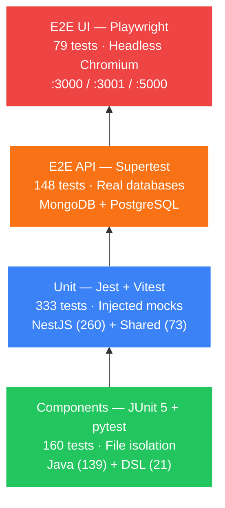

# QA Report — QuartierConnect Stage 4

> **Date** 29 May 2026 · **Version** 0.2.0 · **Total** 734 automated tests · **Result** 734/734 ✓

---

## Table of contents

1. [Overview](#1-overview)
2. [API unit tests — NestJS/Jest](#2-api-unit-tests--nestjsjest)
3. [Web unit tests — Vitest shared hooks](#3-web-unit-tests--vitest-shared-hooks)
4. [API E2E tests — Supertest](#4-api-e2e-tests--supertest)
5. [Java unit tests — JUnit 5](#5-java-unit-tests--junit-5)
6. [DSL tests — pytest](#6-dsl-tests--pytest)
7. [Web E2E tests — Playwright](#7-web-e2e-tests--playwright)
8. [API coverage](#8-api-coverage)
9. [Test architecture](#9-test-architecture)
10. [Testing strategy per component](#10-testing-strategy-per-component)

---

## 1. Overview

| Component | Framework | Tests | Result |
|-----------|-----------|-------|----------|
| NestJS API — unit | Jest | 260 | 260/260 ✓ |
| Web shared hooks | Vitest | 76 | 76/76 ✓ |
| Web UI components | Vitest | 11 | 11/11 ✓ |
| NestJS API — E2E | Jest + Supertest | 148 | 148/148 ✓ |
| Java Desktop | JUnit 5 + Maven Surefire | 139 | 139/139 ✓ |
| Python DSL | pytest | 21 | 21/21 ✓ |
| Web Playwright | Playwright | 81 | 81/81 ✓ |
| **TOTAL** | | **736** | **736/736 ✓** |

> Note: the 148 E2E tests require MongoDB + PostgreSQL (make docker-up). The 79 Playwright tests require the apps on :3000/:3001/:5000.



---

## 2. API unit tests — NestJS/Jest

**260 tests · 30 suites · 0 failures**

### Coverage by module

| Suite | Tests | What is tested |
|-------|-------|-----------------|
| `auth.service.spec.ts` | 14 | register, login, SSO generate/exchange, argon2, TOTP |
| `auth.controller.spec.ts` | 12 | HTTP routes, error codes, DTOs, qc_rt cookie set/clear, refresh cookie+body |
| `token.service.spec.ts` | 12 | generatePair, rotateRefreshToken (FOR UPDATE transaction), revokeAccessToken, isAccessTokenRevoked |
| `totp.service.spec.ts` | 6 | verify, anti-replay, purgeExpiredCodes, generateSecret |
| `jwt.strategy.spec.ts` | 8 | validate valid/invalid/role payload, TOKEN_REVOKED (JTI), skip JTI check when absent, null payload |
| `roles.guard.spec.ts` | 5 | admin/resident/moderator/banned/no role |
| `neighborhoods.controller.spec.ts` | 8 | CRUD + GeoJSON + SocialService mock |
| `neighborhoods.service.spec.ts` | 6 | assertNoOverlap, geoIntersects, conflicts |
| `services.controller.spec.ts` | 11 | CRUD, ownership, filters, SocialService |
| `events.controller.spec.ts` | 7 | CRUD, markInterest, SocialService |
| `incidents.controller.spec.ts` | 12 | CRUD, state machine, soft delete, sync |
| `points.service.spec.ts` | 11 | ACID transfer, balance, history, MIN_BALANCE=-10 |
| `points.controller.spec.ts` | 5 | GET balance, GET history, POST transfer |
| `users.controller.spec.ts` | 6 | list, ban, role update, stats |
| `me.controller.spec.ts` | 8 | GDPR export, profile, delete account |
| `contracts.service.spec.ts` | 10 | create, sign, TOTP validation, SHA-256, workflow |
| `contracts.controller.spec.ts` | 7 | routes, access, creation |
| `messaging.service.spec.ts` | 8 | conversations, messages, participants |
| `messaging.controller.spec.ts` | 5 | REST routes, pagination |
| `messaging.gateway.spec.ts` | 10 | WebSocket connect (auto-join), join, send, disconnect |
| `votes.service.spec.ts` | 9 | cast, toggle, getScore, strategies |
| `votes.controller.spec.ts` | 5 | allowedTypes, score, strategy factory |
| `community-votes.service.spec.ts` | 12 | create, cast, results, quorum, close, types |
| `documents.service.spec.ts` | 5 | upload, download, audit log |
| `documents.controller.spec.ts` | 4 | routes, access |
| `social.service.spec.ts` | 26 | sync* + retry backoff + exhaustion, isRetriable (ServiceUnavailable/SessionExpired), deleteNode union type, recordEventInterest, recommendations |
| `social.controller.spec.ts` | 4 | GET /recommendations |
| `dsl.service.spec.ts` | 8 | Python bridge, collections, errors |
| `dsl.controller.spec.ts` | 5 | POST /dsl/query, syntax errors |
| `app.controller.spec.ts` | 5 | GET /health, version, uptime |

### Examples of key test cases

```typescript
// Token rotation with mutual revocation
it('throws TOKEN_REVOKED when hash is null (already used)', async () => {
  mockDb.where.mockResolvedValue([{ ...mockUser, refreshTokenHash: null }]);
  await expect(service.rotateRefreshToken('rt')).rejects.toThrow(UnauthorizedException);
});

// TOTP anti-replay
it('rejects replayed TOTP code within 90s window', () => {
  jest.spyOn(speakeasy.totp, 'verify').mockReturnValue(true);
  expect(service.verify('SECRET', '123456')).toBe(true);   // 1st use OK
  expect(service.verify('SECRET', '123456')).toBe(false);  // Replay blocked
});

// ACID transaction with minimum balance
it('throws BadRequestException when balance would go below -10', async () => {
  mockDb.execute.mockResolvedValue([{ balance: -8 }]);
  await expect(service.transfer('sender', { recipientId: 'r', amount: 5 }))
    .rejects.toThrow(BadRequestException);
});

// Vote toggle
it('removes vote when same type cast again', async () => {
  voteModel.findOne.mockResolvedValue({ voteType: 'up', deleteOne: jest.fn() });
  const result = await service.cast({ targetType: 'incident', voteType: 'up' }, 'user');
  expect(result.action).toBe('removed');
});
```

---

## 3. Web unit tests — Vitest shared hooks

**73 tests · 14 hooks · 0 failures**

These tests cover the `packages/shared` package of the web monorepo. They validate the TanStack Query hooks, the API utilities, token management and silent refresh.

| Hook / Utility | Tests | What is tested |
|-------------------|-------|-----------------|
| `useAuth` | 6 | login, logout, register, connection state, role, persisted token |
| `useIncidents` | 5 | list, create, patch, delete, cache invalidation |
| `useServices` | 5 | list, create, patch, delete, neighborhood filter |
| `useEvents` | 5 | list, create, patch, delete, markInterest |
| `useNeighborhoods` | 4 | list, create, patch, delete |
| `useContracts` | 5 | list, create, sign, status, 403 non-signatory |
| `useVotes` | 4 | cast up/down, toggle, score |
| `useCommunityVotes` | 5 | create, cast, results, close, types |
| `usePoints` | 4 | balance, transfer, history, MIN error |
| `useMessages` | 5 | conversations, messages, send, read, paginate |
| `useDocuments` | 3 | upload, download, list |
| `useMe` | 4 | profile, GDPR export, delete, update |
| `apiPost / apiGet` | 4 | Bearer header, 401 retry, silent refresh |
| `ensureAuthenticated` | 4 | redirect if not authenticated, pass if authenticated, admin role |

### Example test case

```typescript
// packages/shared/src/lib/__tests__/useAuth.test.ts
it('refreshes token silently when 401 is received', async () => {
  server.use(
    http.get('/api/me', ({ request }) => {
      const auth = request.headers.get('Authorization');
      return auth?.includes('expired') ? new HttpResponse(null, { status: 401 }) : HttpResponse.json(mockUser);
    }),
  );
  const { result } = renderHook(() => useAuth(), { wrapper });
  await waitFor(() => expect(result.current.user).toEqual(mockUser));
});
```

---

## 4. API E2E tests — Supertest

**148 tests · 10 files · Real databases**

### Files

| File | Tests | Modules covered |
|---------|-------|-----------------|
| `auth.e2e-spec.ts` | 15 | register, login (valid/invalid/banned), rate-limit, refresh, logout, SSO |
| `api.e2e-spec.ts` | 44 | neighborhoods, services, events, incidents, points, users, contracts, votes, DSL |
| `contracts.e2e-spec.ts` | 15 | create, sign, TOTP validation, list |
| `messaging-ws.e2e-spec.ts` | 21 | WebSocket connect, join, send, broadcast, disconnect |
| `modules.e2e-spec.ts` | 40 | community-votes, documents, social, DSL, me |
| `neighborhoods.e2e-spec.ts` | 15 | CRUD, GeoJSON, overlap detection |
| `points.e2e-spec.ts` | 12 | ACID transfer, balance, history |
| `rgpd.e2e-spec.ts` | 8 | GDPR export, account deletion |
| `social.e2e-spec.ts` | 4 | recommendations, Neo4j nodes |
| `app.e2e-spec.ts` | 2 | GET /health, version |

### E2E strategy

- `beforeAll`: seed via the API only (no DB mock)
- Dedicated MongoDB database: `quartierconnect-test`
- Dedicated PostgreSQL database: `quartierconnect_test`
- Automatic cleanup after each suite

### Key E2E cases (auth)

```typescript
it('POST /auth/login rejects wrong TOTP', async () => {
  const res = await request(app.getHttpServer())
    .post('/auth/login')
    .send({ email: 'alice@demo.fr', password: 'Demo1234!', totpCode: '000000' });
  expect(res.status).toBe(401);
  expect(res.body.code).toBe('INVALID_TOTP');
});

it('POST /auth/login is rate-limited after 5 attempts', async () => {
  for (let i = 0; i < 5; i++) {
    await request(app.getHttpServer()).post('/auth/login').send(badCreds);
  }
  const res = await request(app.getHttpServer()).post('/auth/login').send(badCreds);
  expect(res.status).toBe(429);
});
```

---

## 5. Java unit tests — JUnit 5

**139 tests · 19 classes · 0 failures**

| Class | Tests | What is tested |
|--------|-------|-----------------|
| `SQLiteSessionTest` | 5 | saveSession, loadSession, overwrite, clearSession, idempotent init |
| `IncidentRepositoryTest` | 11 | queryList/countWhere (DRY), tombstone delete (deleted_at), tombstoneOrphans, updateBase, merge remote-only, flagged conflict, conflict resolution, listDirty excludes conflicts |
| `AuthServiceOfflineTest` | 13 | tryResume, refresh, isTokenExpired, getCurrentUserEmail offline |
| `ApiServiceOfflineTest` | 2 | isReachable() on refused connection / unknown hostname |
| `AuthServiceTest` | 6 | login, exchangeSsoToken, clearSession, applyTokens, parseJwtPayload |
| `SsoCallbackServerTest` | 7 | startup, callback listening, valid/invalid state, timeout |
| `SyncServiceTest` | 8 | start/stop lifecycle, idempotence, post-shutdown stop, registered listener, offline status, justPushed race condition fix, orphan cleanup |
| `ThreeWayMergerTest` | 29 | null base → LWW remote, no change → local, local-only, remote-only, same change, true conflict, multiple edge cases |
| `ContractsServiceTest` | 4 | list, create, sign, findOne |
| `EventsServiceTest` | 4 | list, findOne, create, interest |
| `NeighborhoodsServiceTest` | 3 | list, findOne, create |
| `ServicesServiceTest` | 4 | list, findOne, create, filter |
| `StatisticsServiceTest` | 5 | fetchStats, parseResponse, offline fallback |
| `UpdateServiceTest` | 5 | checkUpdate, versionParsing, skip, apply |
| `VotesServiceTest` | 4 | cast, toggle, getScore, strategies |
| `PluginRegistryTest` | 7 | register, unregister, lifecycle, fail gracefully, EventBus integration, ContextAwarePlugin |
| `TokenVaultTest` | 10 | round-trip save/load, overwrite, null access/refresh token, both null, clear idempotent, multiple saves, save-clear-save |
| `ApiIntegrationTest` | 8 | execute() single method, error sanitization, retry on 401 |
| `ToastManagerTest` | 4 | show, dismiss, auto-dismiss, queue |

### Key offline cases

```java
@Test
void tryResume_withValidAccessToken_returnsTrue() {
    SQLiteDatabase.saveSession("alice@demo.fr", validJwt, refreshJwt);
    assertTrue(authService.tryResumeFromDatabase());
    assertEquals("alice@demo.fr", authService.getCurrentUserEmail());
}

@Test
void tryResume_withExpiredAccessToken_butValidRefresh_returnsTrue() {
    SQLiteDatabase.saveSession("alice@demo.fr", expiredJwt, validRefreshJwt);
    // No network — offline mode
    assertTrue(authService.tryResumeFromDatabase()); // true because refreshToken present
}

@Test
void isReachable_returnsFalse_whenConnectionRefused() {
    assertFalse(ApiService.isReachable("http://localhost:19999/health"));
}
```

---

## 6. DSL tests — pytest

**21 tests · 2 files · 0 failures**

| File | Tests | What is tested |
|---------|-------|-----------------|
| `test_lexer.py` | 8 | FIND/COUNT/WHERE/LIMIT tokens, STRING, NUMBER, operators, illegal character |
| `test_compiler.py` | 13 | simple FIND, WHERE, LIMIT, combined, COUNT, comparators, LIKE, OR, disallowed collections, syntax errors |

### DSL test cases

```python
def test_find_where_limit():
    result = compile_query("FIND incidents WHERE status = 'open' LIMIT 10")
    assert result == {
        'type': 'find',
        'collection': 'incidents',
        'filter': {'status': 'open'},
        'limit': 10,
    }

def test_unknown_collection_raises():
    with pytest.raises(ValueError, match="Unknown collection"):
        compile_query("FIND passwords")

def test_find_where_or():
    result = compile_query("FIND incidents WHERE status = 'open' OR status = 'in_progress'")
    assert result['filter'] == {'$or': [{'status': 'open'}, {'status': 'in_progress'}]}
```

---

## 7. Web E2E tests — Playwright

**79 tests · 16 files · Chromium browser**

| File | Tests | What is tested |
|---------|-------|-----------------|
| `admin/dashboard.spec.ts` | 3 | Heading, live stats, navigation |
| `admin/dsl.spec.ts` | 7 | DSL editor, execution, Ctrl+Enter, syntax errors |
| `admin/events.spec.ts` | 6 | Full event CRUD (create, edit, delete) |
| `admin/incidents.spec.ts` | 5 | Moderation, status filters, non-admin access |
| `admin/login.spec.ts` | 3 | Admin login, resident rejection, redirect to dashboard |
| `admin/neighborhoods.spec.ts` | 5 | Neighborhood CRUD |
| `admin/services.spec.ts` | 6 | Service CRUD |
| `admin/users.spec.ts` | 5 | List, roles, banning, non-admin redirect |
| `client/contracts.spec.ts` | 4 | Contracts page, creation dialog |
| `client/dashboard.spec.ts` | 3 | Displayed email, SSO token, logout |
| `client/events.spec.ts` | 5 | Calendar, list, event creation |
| `client/incidents.spec.ts` | 5 | List, creation, navigation to detail |
| `client/incidents-detail.spec.ts` | 5 | Title, status, votes, back link, 404 |
| `client/login.spec.ts` | 3 | TOTP step, password error, redirect to dashboard |
| `client/register.spec.ts` | 4 | QR code, password error, duplicate email, full flow |
| `client/services.spec.ts` | 4 | Heading, neighborhood filter, "all" option, no error |

---

## 8. API coverage

Thresholds defined in `api/package.json`:

```json
"coverageThreshold": {
  "global": {
    "statements": 80,
    "branches": 75,
    "functions": 80,
    "lines": 80
  }
}
```

**Measured result:**

| Metric | Threshold | Value | Status |
|----------|-------|--------|--------|
| Statements | 80% | 95.7% | ✓ |
| Branches | 75% | 86.1% | ✓ |
| Functions | 80% | 94.3% | ✓ |
| Lines | 80% | 95.2% | ✓ |

---

## 9. Test architecture

```mermaid
graph TB
    subgraph UnitAPI["API unit tests (Jest)"]
        MOCK[Injected mocks<br/>Mongoose Model, DrizzleDB,<br/>SocialService, JwtService]
        ISOLATED[Total isolation<br/>no real DB]
        MOCK --> ISOLATED
    end

    subgraph E2EAPI["API E2E tests (Supertest)"]
        REAL[Dedicated real DBs<br/>MongoDB + PostgreSQL test]
        SEED[Seed via API at beforeAll<br/>zero DB mock]
        REAL --> SEED
    end

    subgraph JAVA["Java tests (JUnit 5)"]
        TMPFILE[Temp SQLite file<br/>Files.createTempFile deleteOnExit]
        HTTPMOCK[WireMock HTTP mock server]
        TMPFILE --> HTTPMOCK
    end

    subgraph DSL["DSL tests (pytest)"]
        PURE[Pure unit tests<br/>compile_query string → dict]
    end

    subgraph PW["Playwright E2E tests"]
        BROWSER[Headless Chromium browser<br/>Real UI :3000/:3001/:5000]
    end
```



### SQLite isolation in Java tests

Problem solved: `jdbc:sqlite::memory:` creates a different DB per connection. Solution: a shared temporary file.

```java
@BeforeEach
void setUp() throws Exception {
    Path tmpDb = Files.createTempFile("qc-test-", ".db");
    tmpDb.toFile().deleteOnExit();
    System.setProperty("sqlite.url", "jdbc:sqlite:" + tmpDb.toAbsolutePath());
    SQLiteDatabase.initialize();
}
```

---

## 10. Testing strategy per component

### API — what is always tested in every controller

1. GET list route: pagination, filters
2. GET :id route: 200 OK + 404 Not Found
3. POST route: creation, ownership from JWT
4. PATCH route: owner/admin authorization + 403 + 404
5. DELETE route: admin only + 404
6. SocialService mock integration (syncX called or not)

### Points — edge cases tested

- Transfer to self → `BadRequestException`
- Negative balance < -10 → `BadRequestException`
- PostgreSQL `FOR UPDATE` → transaction isolation
- Nonexistent recipient → predictable behavior

### Contracts — full flow tested

- Creation → SHA-256 hash of the content
- Signature → mandatory TOTP validation
- Already signed → `BadRequestException`
- Not a signatory → `ForbiddenException`
- Everyone signs → status `signed`

### CommunityVotes — ballot types tested

- `binary` with 2 choices → `BadRequestException`
- `weighted` without weights → `BadRequestException`
- Vote after `endsAt` expiry → `BadRequestException`
- Duplicate vote → `ConflictException`
- Closure by a non-creator non-admin → `ForbiddenException`

### Commands

```bash
make test          # unit only (fast)
make test-cov      # with coverage
make test-e2e      # API E2E (make docker-up required)
make test-e2e-web  # Playwright (running apps required)
make validate      # everything in sequence
```
