# Dossier d'utilisation — QuartierConnect

Ce document décrit l'utilisation de la plateforme QuartierConnect du point de vue de
chacun de ses utilisateurs. Il est organisé par rôle et suit les parcours réels tels
qu'ils sont implémentés dans les applications.

La plateforme se compose de trois applications destinées aux utilisateurs finaux :

| Application | Public | Technologie | Accès local |
|-------------|--------|-------------|-------------|
| Client web | Habitants | React | `http://localhost:3000` |
| Console d'administration web | Modérateurs et administrateurs | React | `http://localhost:3001` |
| Client lourd | Agents terrain / modérateurs | JavaFX (application de bureau) | binaire installé sur le poste |

Les trois applications s'appuient sur une même API (NestJS, `http://localhost:5000`),
dont la documentation interactive est disponible sur `http://localhost:5000/docs`.

## Comptes de démonstration

Les jeux d'essai fournis (`jeu-demo`) créent trois comptes prêts à l'emploi. Tous
utilisent le même mot de passe et le même secret d'authentification à deux facteurs
(TOTP), afin de faciliter la démonstration.

| Identifiant | Rôle | Mot de passe | Secret TOTP |
|-------------|------|--------------|-------------|
| `alice@demo.fr` | Modérateur | `Demo1234!` | `JBSWY3DPEHPK3PXP` |
| `bob@demo.fr` | Modérateur | `Demo1234!` | `JBSWY3DPEHPK3PXP` |
| `admin@demo.fr` | Administrateur | `Demo1234!` | `JBSWY3DPEHPK3PXP` |

Le secret TOTP se saisit dans une application d'authentification (Google Authenticator,
Aegis, FreeOTP, etc.). Celle-ci génère alors le code à six chiffres demandé à chaque
connexion. Pour créer un compte habitant, utilisez le parcours d'inscription décrit
plus bas.

---

# 1. Rôle Habitant (application client)

L'application client est l'espace des habitants d'un quartier. Elle donne accès à
l'entraide entre voisins, à la vie locale (événements, votes), au signalement
d'incidents, à la messagerie et à la gestion du compte.

## 1.1 Inscription et activation de la double authentification

L'inscription se fait en deux temps sur la page d'inscription.

1. Renseignement du profil : prénom, nom, adresse e-mail, mot de passe (avec
   confirmation) et numéro de téléphone. Le formulaire vérifie le format de l'e-mail,
   la longueur minimale du mot de passe et la concordance des deux saisies.
2. Consentement RGPD : une case à cocher de consentement doit être validée avant de
   pouvoir continuer. Sans elle, la création de compte est bloquée.
3. Activation de la double authentification : après validation, l'application affiche
   un QR code (lien `otpauth://`) ainsi que le secret en clair, que l'on peut copier.
   L'utilisateur scanne le QR code dans son application d'authentification, puis saisit
   le premier code à six chiffres pour confirmer l'appairage et finaliser le compte.


## 1.2 Connexion

La connexion se déroule en deux étapes :

1. Saisie de l'adresse e-mail et du mot de passe.
2. Saisie du code TOTP à six chiffres généré par l'application d'authentification.

En cas d'identifiants erronés ou de code invalide, un message d'erreur explicite est
affiché.

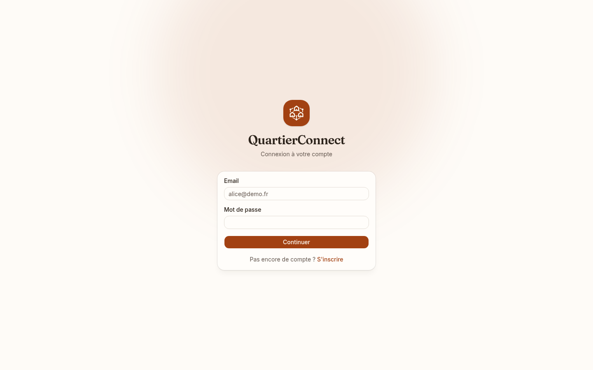

## 1.3 Rattachement à un quartier (adresse)

Un habitant doit être rattaché à un quartier pour accéder au contenu local. Après la
première connexion, si aucune adresse n'est encore associée au compte, l'application
présente un écran de saisie d'adresse avec autocomplétion.

- Si l'adresse saisie tombe dans le périmètre d'un quartier existant, le compte y est
  automatiquement rattaché et l'habitant accède à son tableau de bord.
- Si l'adresse est reconnue mais hors de tout quartier couvert, l'habitant est dirigé
  vers un écran « couverture en attente » : l'adresse est enregistrée pour que l'équipe
  d'administration puisse étendre la couverture. L'habitant peut à tout moment corriger
  son adresse.


## 1.4 Tableau de bord et carte du quartier

Le tableau de bord est la page d'accueil de l'habitant. Il regroupe, sous forme de
cartes :

- une carte interactive du quartier (fond OpenStreetMap) ;
- un résumé du solde de points et des dernières transactions ;
- les votes communautaires ouverts ;
- les événements à venir ;
- un aperçu des services ;
- des recommandations personnalisées.

Les comptes disposant d'un rôle de modération voient en plus un bloc de synthèse de
modération.

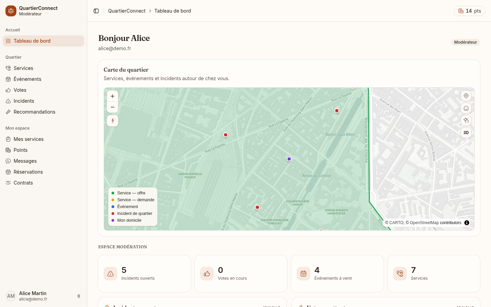

## 1.5 Services entre voisins

La page Services liste les offres et demandes de services du quartier, avec une carte
localisant ceux qui ont une position. Un filtre permet d'afficher toutes les annonces,
uniquement les offres, ou uniquement les demandes.

Chaque service possède :

- un **sens** : offre ou demande ;
- une **catégorie** : jardinage, bricolage, transport, courses, garde d'enfants,
  assistance informatique, ou autre ;
- un **type** : gratuit, payant (en points), ou échange.

### Parcours type : offrir un service et le concrétiser

1. Un habitant publie une offre de service (« Proposer ») en renseignant titre,
   description, catégorie, type et adresse.
2. Un voisin intéressé **répond** au service depuis la fiche. Le porteur de l'annonce
   voit alors la liste des répondants. Un répondant peut retirer sa réponse.
3. Pour un service **payant**, le voisin peut demander une **réservation**. Le nombre de
   points est calculé à partir du barème du service. Le propriétaire du service retrouve
   la demande dans l'onglet « Reçues » de la page Réservations, et le demandeur dans
   l'onglet « Envoyées ».
4. Le propriétaire **accepte** la réservation : un **contrat** est alors généré
   automatiquement. Il peut aussi la refuser ou l'annuler tant qu'elle est en attente.
5. Le contrat est signé par les deux parties (voir §1.6). À l'issue de la prestation, le
   transfert de points scelle l'échange.

Les habitants peuvent aussi noter l'utilité d'un service (pouce vers le haut / vers le
bas), ce qui alimente un score communautaire.

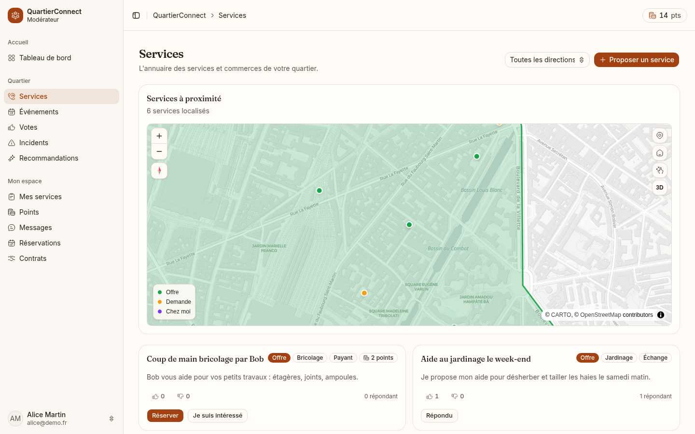

La page « Mes services » regroupe les annonces publiées par l'habitant et celles
auxquelles il a répondu.

## 1.6 Contrats et signature électronique

La page Contrats liste les contrats que l'habitant a créés ou qu'il doit signer. Un
contrat peut être :

- généré automatiquement à l'acceptation d'une réservation payante ;
- créé manuellement, en désignant un ou plusieurs signataires parmi ses voisins ;
- importé sous forme de document PDF existant.

Chaque contrat possède un statut : brouillon, partiellement signé, entièrement signé,
ou annulé. Le document PDF est consultable, et un **journal d'audit immuable** trace
chaque événement (empreinte SHA-256 du document, signatures).

### Parcours de signature

La signature s'effectue dans une boîte de dialogue en trois étapes :

1. **Lecture** : rappel des termes du contrat et du nombre de points concernés.
2. **Tracé** : l'habitant dessine sa signature manuscrite dans une zone dédiée.
3. **Validation forte** : il confirme en saisissant son code TOTP à six chiffres.

Une fois toutes les parties signataires ayant apposé leur signature, le contrat passe
au statut « entièrement signé ».


## 1.7 Événements de quartier

La page Événements présente les événements locaux, en vue liste ou en vue calendrier.
Chaque événement porte un lieu, une date et une catégorie (culture, sport, autre).

Les habitants peuvent parcourir les événements par **balayage** (swipe) et manifester
leur **intérêt** pour un événement. Cet intérêt est pris en compte pour les
recommandations et pour la vie du quartier. Les habitants peuvent aussi proposer un
nouvel événement.

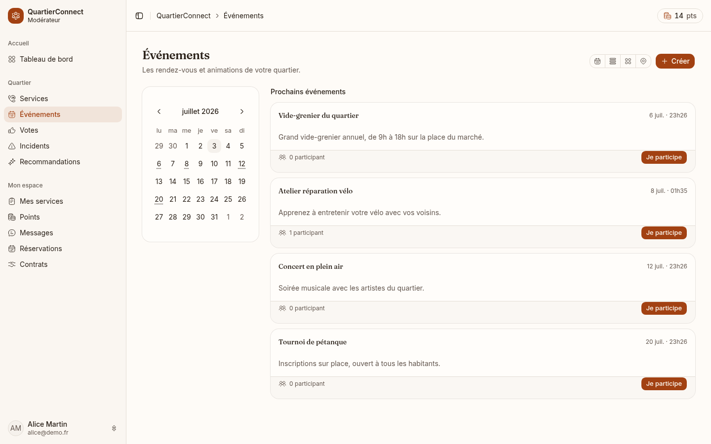

## 1.8 Votes communautaires

La page Votes présente les consultations ouvertes dans le quartier. Pour chaque vote,
l'habitant voit la question, la date de clôture et le nombre de participants.

- Il sélectionne son choix et l'enregistre ; l'application confirme la prise en compte.
- Les résultats s'affichent en direct pour les votes ouverts, et de façon définitive
  pour les votes clôturés.
- Un onglet « historique » regroupe les votes auxquels il a déjà répondu.

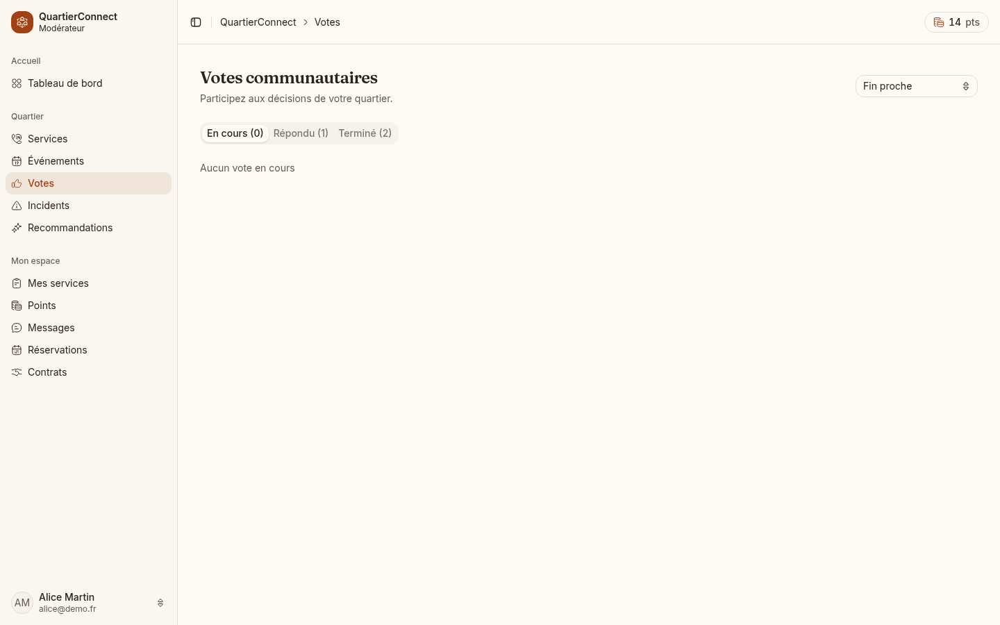

## 1.9 Signalement d'incidents

La page Incidents permet de signaler un problème dans le quartier (dépôt sauvage,
éclairage défaillant, etc.). Le signalement comporte un titre, une description, une
catégorie et une localisation choisie sur une carte.

Si le point sélectionné se situe hors du quartier de l'habitant, un avertissement non
bloquant est affiché. Chaque incident a un statut : ouvert, en cours, ou résolu. Une
fiche détaillée présente l'incident et sa position.

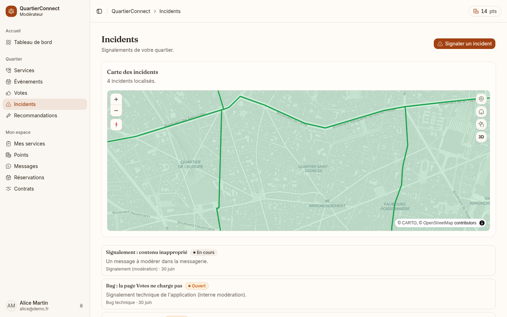

## 1.10 Messagerie

La page Messages est une messagerie temps réel entre voisins. L'habitant peut :

- démarrer une conversation avec un voisin (recherche par e-mail) ;
- envoyer des **messages texte** ;
- joindre des **photos et fichiers** ;
- enregistrer et envoyer des **messages vocaux** (l'application demande l'autorisation
  d'accès au microphone).

Les indicateurs de saisie en cours et de messages non lus sont gérés. Les fichiers
joints sont téléchargeables depuis la conversation.

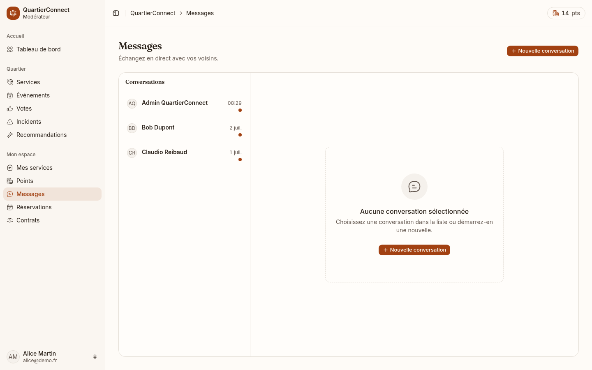

## 1.11 Points

La page Points affiche le solde de points de l'habitant et l'historique de ses
transactions (points reçus, points envoyés, paiements de services).

L'habitant peut effectuer un **transfert de points** vers un voisin : il recherche le
destinataire, saisit un montant et une note facultative, puis valide. Le solde et
l'historique sont mis à jour immédiatement.

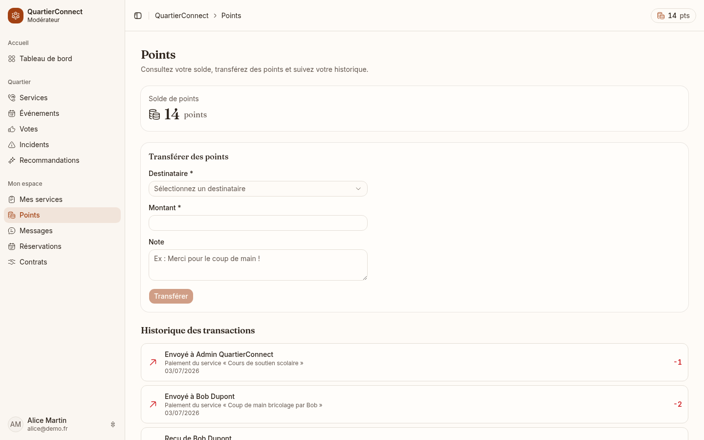

## 1.12 Recommandations

La page Recommandations propose des suggestions personnalisées (voisins ou contenus)
calculées à partir du graphe de relations du quartier (base Neo4j). L'habitant peut
prendre contact directement depuis une recommandation.

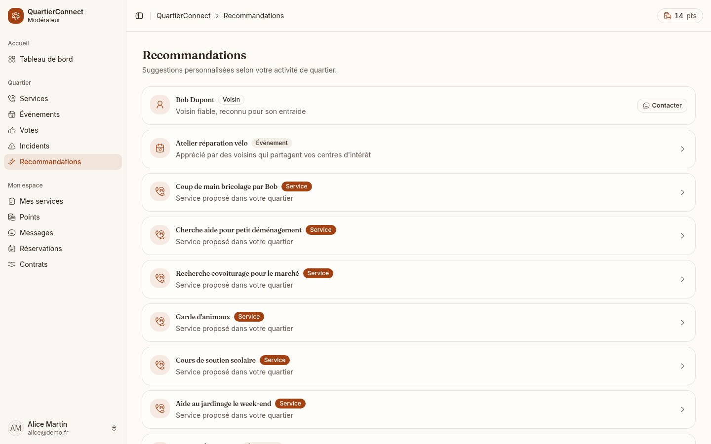

## 1.13 Profil et données personnelles (RGPD)

La page Profil regroupe la gestion du compte, organisée en plusieurs cartes :

- **Profil** : prénom, nom, avatar.
- **Mon quartier** : quartier de rattachement et carte associée.
- **Sécurité** : gestion du mot de passe et de la double authentification.
- **E-mail** et **Téléphone** : modification des coordonnées.
- **Confidentialité (RGPD)** :
  - **Export des données** : téléchargement de l'ensemble des données personnelles au
    format structuré (droit à la portabilité, article 20 du RGPD) ;
  - **Suppression du compte** : suppression définitive, confirmée par la saisie du code
    TOTP.

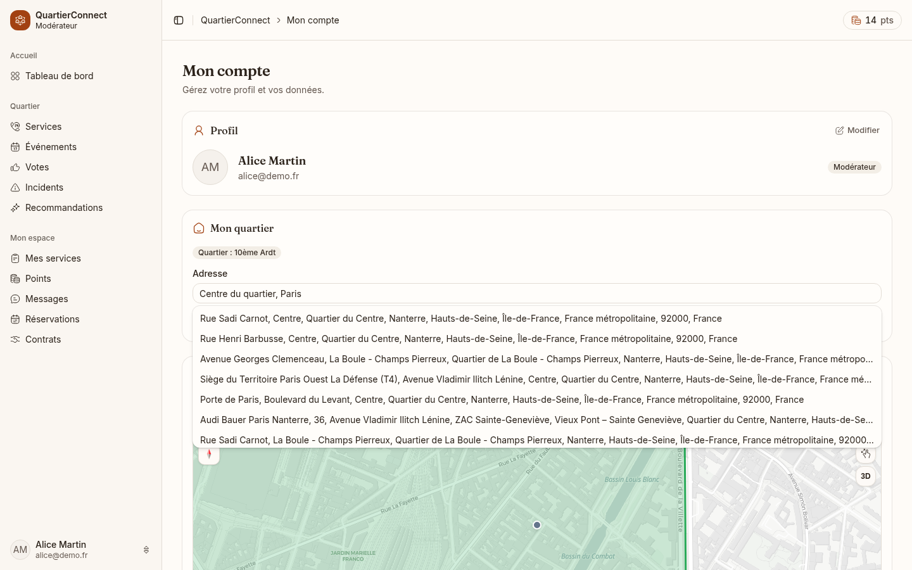

---

# 2. Rôles Modérateur et Administrateur (console d'administration)

La console d'administration (`http://localhost:3001`) est réservée aux comptes disposant
d'un rôle de modération ou d'administration. La connexion suit le même schéma que
l'application client : e-mail, mot de passe, puis code TOTP.

Les modérateurs assurent le suivi opérationnel (incidents, événements, services, votes)
tandis que l'administrateur dispose en plus de la gestion des utilisateurs, des
quartiers, des adresses en attente et de l'éditeur de requêtes.

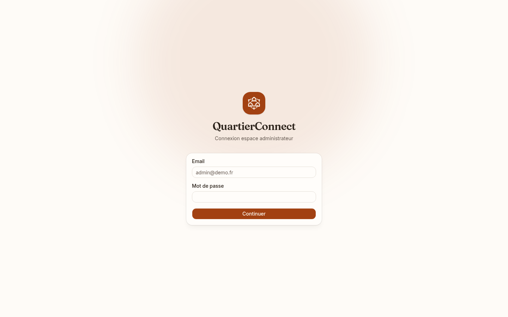

## 2.1 Tableau de bord

Le tableau de bord synthétise l'activité de la plateforme :

- des indicateurs clés : nombre d'utilisateurs, nombre de quartiers, incidents actifs ;
- la liste des incidents récents ;
- un aperçu de la couverture (adresses en attente).

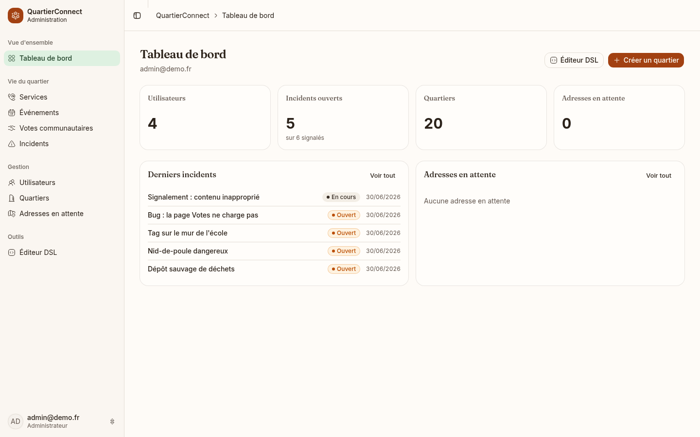

## 2.2 Gestion des utilisateurs

La page Utilisateurs liste l'ensemble des comptes. Elle permet de filtrer par rôle et de
consulter la date d'inscription de chaque utilisateur.

L'administrateur peut :

- **modifier le rôle** d'un utilisateur (habitant, modérateur, administrateur) ;
- **bannir** un utilisateur, puis le **réactiver**.

Chaque action donne lieu à une confirmation à l'écran (rôle mis à jour, utilisateur
banni, utilisateur réactivé).

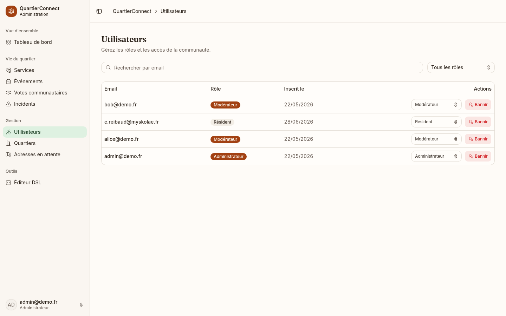

## 2.3 Incidents (modération)

La page Incidents présente les signalements en vue liste ou en vue carte. Elle permet de
filtrer par statut (tous, ouverts, résolus).

Un modérateur peut faire évoluer le **statut** d'un incident (ouvert, en cours, résolu)
et supprimer un signalement. La vue carte localise les incidents sur le territoire des
quartiers.

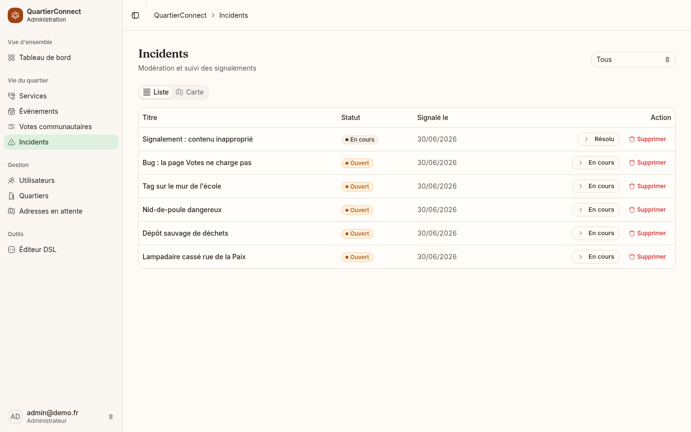

## 2.4 Événements

La page Événements permet de créer, modifier et supprimer les événements du quartier
(titre, date, lieu, catégorie), avec recherche et pagination. Les événements ainsi
publiés apparaissent côté habitants.

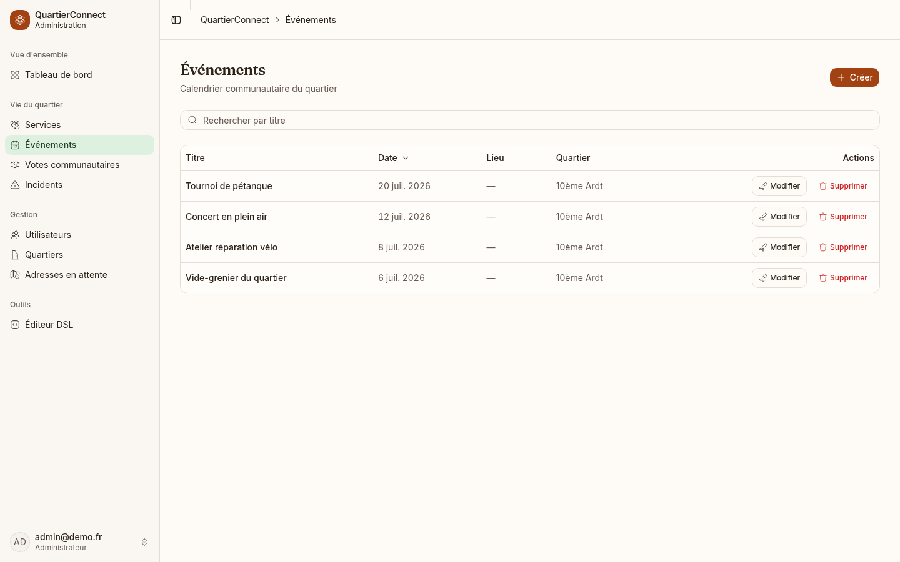

## 2.5 Services

La page Services permet de gérer les annonces de services en vue liste ou carte
(nom, description, catégorie, sens, type, adresse, position). Un multiplicateur de points
peut être associé à un service, ce qui influe sur le barème appliqué.

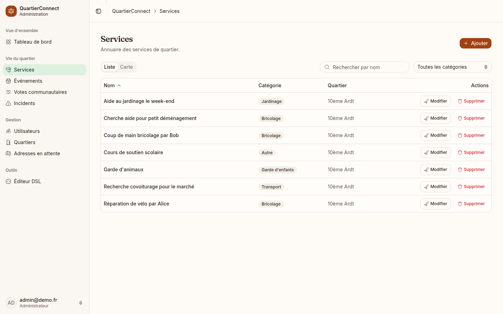

## 2.6 Votes communautaires

La page Votes communautaires permet de créer une consultation (question, options, date
de clôture), de suivre les résultats agrégés et le nombre total de votes, puis de
**clôturer** un vote. Les votes de type oui/non et à options multiples sont pris en
charge.

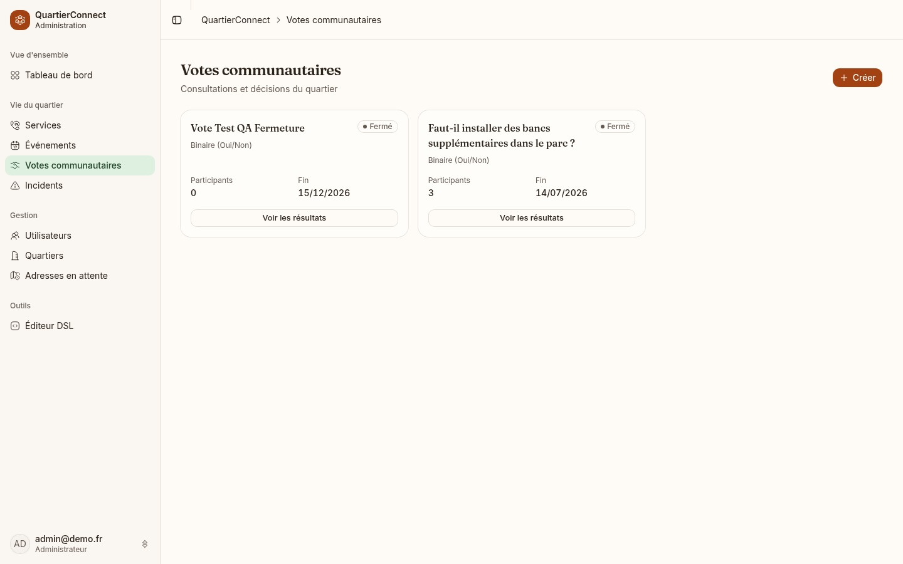

## 2.7 Quartiers (tracé de périmètre)

La page Quartiers permet de définir le découpage territorial. Pour créer ou modifier un
quartier, l'administrateur :

1. renseigne le nom et la ville ;
2. **dessine le polygone du quartier directement sur la carte**, point par point ;
3. enregistre. Le nombre de points du polygone est affiché.

Un contrôle empêche le chevauchement de deux quartiers. Ce périmètre sert ensuite à
rattacher automatiquement les habitants selon leur adresse et à cadrer les cartes.

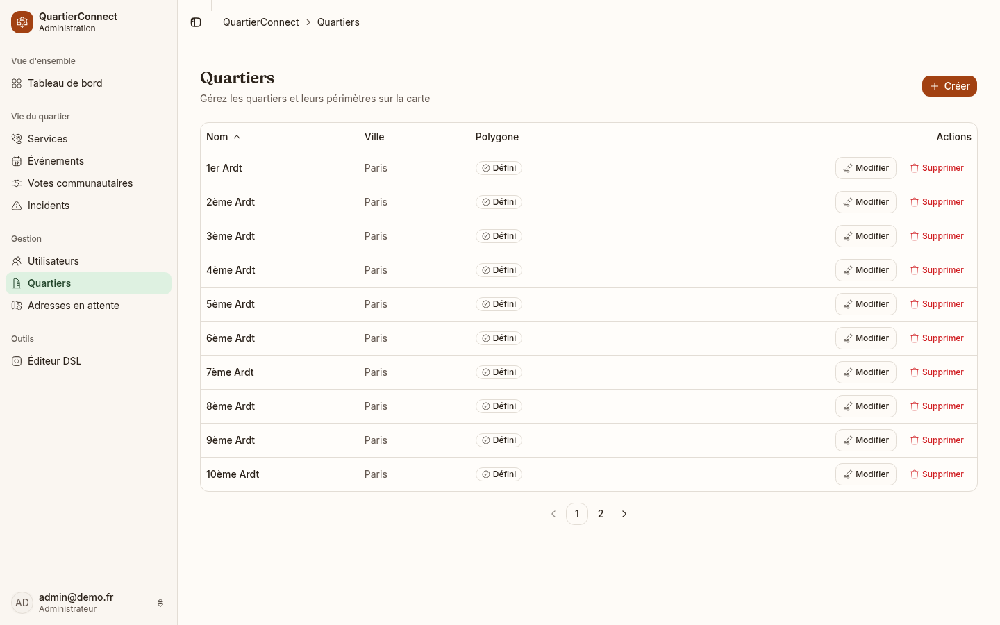

## 2.8 Adresses en attente de couverture

La page Adresses non couvertes recense les adresses saisies par des habitants qui ne
tombent dans aucun quartier existant. Elle s'affiche en vue liste ou carte et guide la
création d'un nouveau quartier pour étendre la couverture aux zones concernées.

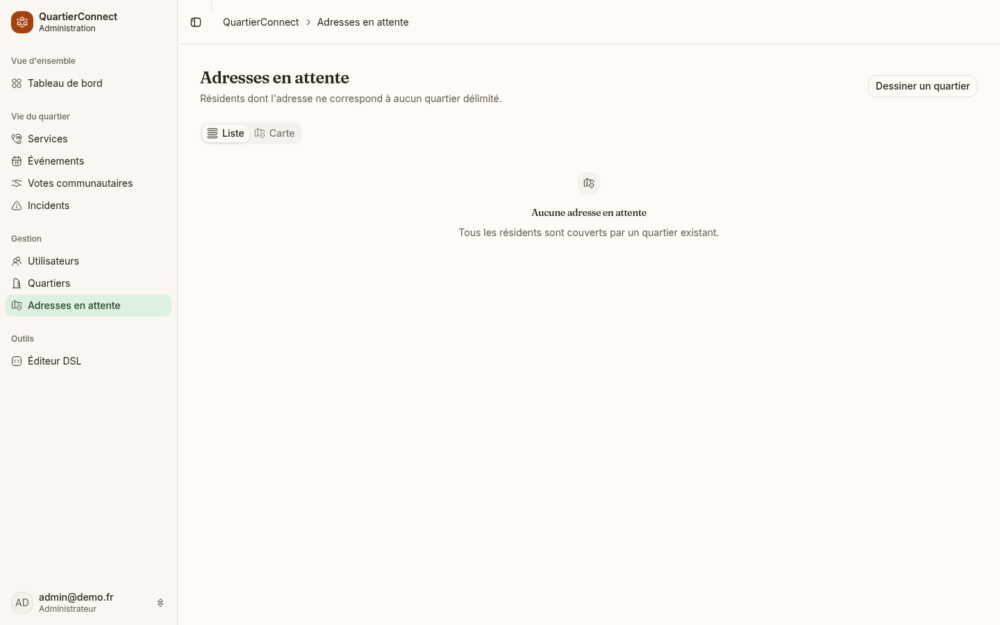

## 2.9 Éditeur de requêtes (DSL)

La page DSL met à disposition un éditeur permettant d'interroger les données au moyen
d'un langage dédié simple. La grammaire prise en charge repose sur deux instructions :

```
FIND <collection> WHERE <champ> = "<valeur>" LIMIT <n>
COUNT <collection> WHERE <champ> = "<valeur>"
```

Exemples :

```
FIND incidents WHERE status = "open" LIMIT 10
FIND services WHERE category = "culture" LIMIT 5
COUNT incidents WHERE status = "resolved"
```

Les résultats sont présentés en tableau ou en JSON, avec le nombre de lignes retournées.
Les requêtes invalides remontent un message d'erreur.

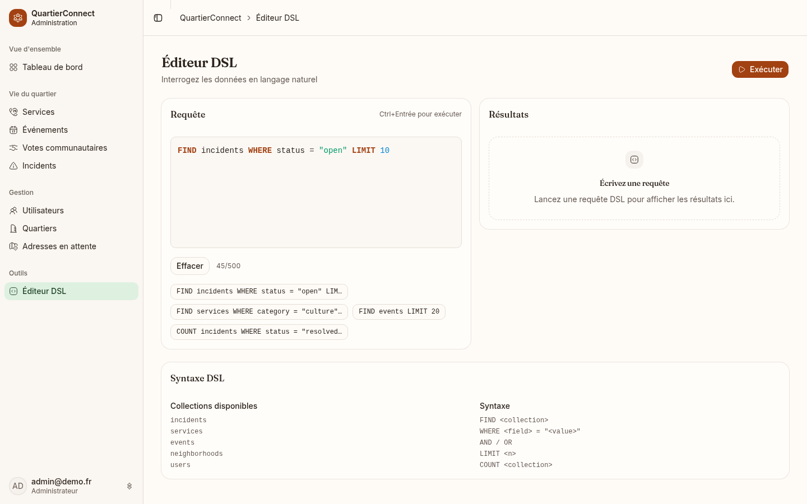

---

# 3. Client lourd (application de bureau JavaFX)

L'application de bureau cible le travail de terrain sur les incidents, avec un
fonctionnement **hors ligne d'abord** : les données sont stockées localement (base
SQLite embarquée) et synchronisées avec le serveur lorsque la connexion est disponible.

## 3.1 Connexion par authentification unique (SSO)

L'écran de connexion propose une authentification unique (SSO) :

1. L'utilisateur clique sur le bouton de connexion SSO.
2. L'application ouvre le navigateur du système pour l'authentification (flux PKCE) et
   met en écoute un serveur local de rappel (callback).
3. Une fois authentifié, le jeton est renvoyé à l'application, qui le conserve de façon
   sécurisée.

Un mode hors ligne permet également de travailler sans authentification serveur
immédiate.


## 3.2 Gestion hors ligne des incidents

La vue Incidents permet de consulter, créer, détailler et modifier des incidents, même
sans connexion. Les incidents sont enregistrés dans la base SQLite locale et marqués
comme « à synchroniser » tant qu'ils n'ont pas été transmis au serveur.


## 3.3 Synchronisation et résolution de conflits

La synchronisation peut être déclenchée manuellement (bouton de synchronisation) ou
s'exécuter en arrière-plan. Elle procède en deux temps :

1. **Envoi** des incidents modifiés localement vers le serveur ;
2. **Réception** des incidents mis à jour côté serveur.

Lorsqu'un même incident a été modifié à la fois localement et sur le serveur, un
mécanisme de **fusion à trois voies** compare la version de base, la version locale et la
version distante. En cas de conflit non résoluble automatiquement, un formulaire de
résolution de conflit invite l'utilisateur à trancher. Un journal de synchronisation
conserve la trace des opérations et la date de dernière synchronisation.


## 3.4 Statistiques

La vue Tableau de bord agrège des statistiques locales et distantes :

- total des incidents locaux, incidents ouverts, en cours, et en conflit ;
- indicateurs distants : nombre d'utilisateurs, nombre de quartiers, incidents distants,
  incidents actifs ;
- une visualisation de la répartition ouverts / résolus ;
- la date de dernière synchronisation et le nombre d'éléments non synchronisés.


## 3.5 Extensions (plugins)

L'application propose un système d'extensions activables depuis la vue Plugins :

| Extension | Rôle |
|-----------|------|
| Mode compact | Densifie l'affichage de l'interface |
| Export | Exporte les données locales |
| Notifications | Surveille l'activité et notifie l'utilisateur |
| Mode hors ligne | Contrôle le fonctionnement déconnecté |
| Thème | Bascule l'apparence de l'application |
| Pack de langue | Ajoute une langue supplémentaire (par exemple l'espagnol) |


## 3.6 Thèmes

L'application propose deux thèmes visuels, mémorisés d'une session à l'autre :

- **Voisinage** : thème clair, aligné sur l'identité visuelle de l'application client ;
- **Sombre** (Primer Dark) : thème à dominante foncée.


---

# Annexe — Récapitulatif des parcours transverses

| Parcours | Application | Résumé |
|----------|-------------|--------|
| Entraide de service | Client | Offre publiée → réponse d'un voisin → réservation → acceptation → contrat → signature → transfert de points |
| Signalement suivi | Client + Admin + Desktop | Incident signalé par l'habitant → modéré côté admin → traité et synchronisé côté client lourd |
| Extension de couverture | Client + Admin | Adresse hors quartier → mise en attente → tracé d'un nouveau quartier → rattachement automatique |
| Consultation locale | Client + Admin | Vote créé côté admin → participation des habitants → clôture et résultats définitifs |
